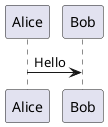
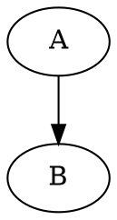

# blogs

<p align="center">
  
  
  
  
  
  
</p>

迁移自旧博客的 VitePress 静态博客项目，部署目标为 GitHub Pages，技术栈为 VitePress + TypeScript + GitHub Actions。

## 当前内容状态

- 文章主体以旧博客迁移内容为主
- 首页自动显示“最近文章”
- 最近文章按 frontmatter 中的 `date` 降序排序
- 旧博客中可恢复的 `last_modified_date` 已批量迁移为 `date`

## 文章写法

推荐在每篇文章的 frontmatter 中显式写入标题和撰写日期：

```md
---
title: JUC AQS
date: 2025-07-13
---

# JUC AQS
```

说明：

- `title` 用于侧边栏标题、页面标题和首页最近文章标题
- `date` 用于首页最近文章排序
- `date` 推荐使用 `YYYY-MM-DD`
- 如果没有 `date`，首页会暂时回退到文件修改时间排序

## 首页最近文章

首页会自动扫描 `docs/posts/**.md`：

- 排除 `index.md`
- 排除 `aa_temp.md` 这类草稿
- 读取 `title`
- 读取 `date`
- 按日期降序展示最近文章

## 本地运行

```bash
npm install
npm run docs:dev
npm run docs:build
npm run docs:preview
```

## GitHub Pages 部署

1. 推送代码到 GitHub 仓库的 `main` 分支
2. 打开仓库 `Repository Settings`
3. 进入 `Pages`
4. 在 `Build and deployment` 中将 `Source` 设为 `GitHub Actions`
5. 后续每次 push 到 `main` 都会自动触发部署

## 目录结构

```text
.
├─ .github/
│  └─ workflows/
│     └─ deploy.yml
├─ docs/
│  ├─ .vitepress/
│  │  ├─ config.ts
│  │  ├─ content.ts
│  │  ├─ sidebar.ts
│  │  └─ theme/
│  ├─ public/
│  │  ├─ diagrams/
│  │  ├─ drawio/
│  │  ├─ favicon.ico
│  │  └─ robots.txt
│  ├─ index.md
│  └─ posts/
│     ├─ AI/
│     ├─ Command/
│     ├─ Database/
│     ├─ Front-end/
│     ├─ Java/
│     ├─ LLM/
│     ├─ Mobile/
│     ├─ Net/
│     ├─ Paper/
│     ├─ Python/
│     ├─ Reading/
│     ├─ Sandbox/
│     ├─ Solution/
│     ├─ Spring/
│     ├─ Test/
│     └─ Web3/
├─ .gitignore
├─ package-lock.json
├─ package.json
└─ README.md
```

## 图形支持现状

### Mermaid

已支持。

- 旧博客中已有多篇文章直接使用 Mermaid
- 当前 VitePress 会在浏览器端按需渲染 Mermaid，避免 Kroki 生成 SVG 超时导致图片变成占位图或 504 页面

写法示例：

````md

````

### PlantUML

已支持。

- 通过 `vitepress-plugin-diagrams` 接入
- 构建时调用 `https://kroki.io`
- 生成后的 SVG 会缓存到 `docs/public/diagrams/`

写法示例：

````md

````

### GraphViz

已支持。

写法示例：

````md

````

### draw.io / diagrams.net

当前也支持，但方式不是“渲染 `.drawio` 源文件”，而是：

1. 在 draw.io / diagrams.net 中画图
2. 导出为 `.drawio.svg`、`.svg` 或 `.png`
3. 放到 `docs/public/drawio/`
4. 在 Markdown 中当普通图片引用

写法示例：

```md

```

这意味着：

- PlantUML：当前是“插件渲染”
- Mermaid：当前是“浏览器端渲染”
- draw.io：当前是“静态图片引用”

## 数学公式支持

已支持 MathJax3。

- 行内公式：`$...$`
- 块级公式：`$$...$$`

示例：

```md
行内公式：$E = mc^2$

$$
x = {-b \pm \sqrt{b^2 - 4ac} \over 2a}
$$
```

## 当前结论

- PlantUML：已支持，并且构建产物中能看到生成后的 SVG
- Mermaid：已支持，采用浏览器端渲染，不再依赖 kroki.io 生成 Mermaid 图片
- draw.io：已支持静态图片引用方式
- 旧博客迁移文章：已作为当前站点主体内容保留
