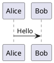
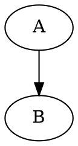

# blogs

<p align="center">
  
  
  
  
  
  
</p>

VitePress 静态技术博客，部署到 GitHub Pages：

```text
https://xuelinhu.github.io/blogs/
```

站点用于记录 AI、大语言模型、Java、数据库、分布式系统、测试工程、命令工具和阅读笔记等内容。

## 功能概览

- 使用 VitePress 构建静态博客。
- 使用 GitHub Actions 自动部署到 GitHub Pages。
- 首页展示自定义动画路线图和最近文章。
- 最近文章自动扫描 `docs/posts/**.md` 并按更新时间排序。
- 侧边栏根据 `docs/posts` 目录自动生成。
- 支持 Mermaid、PlantUML、GraphViz、draw.io 静态图和 MathJax3 数学公式。
- 自定义主题组件用于首页、侧边栏、文章元信息和 Mermaid 浏览器端渲染。

## 首页设计

首页入口：

```text
docs/index.md
```

当前首页由两个自定义组件组成：

| 组件 | 文件 | 作用 |
| --- | --- | --- |
| `HeroTrail` | `docs/.vitepress/theme/components/HeroTrail.vue` | 首页顶部动画路线图，包含分类里程碑、小车行进、尾气和闪光灯。 |
| `RecentPosts` | `docs/.vitepress/theme/components/RecentPosts.vue` | 首页“最新文章”列表，左侧为分类纯色文字图，hover 时文本区变为淡色背景。 |

分类路线和文章卡片使用一致的分类配色。常见分类包括：

```text
AI
LLM
Java
Database
Middleware
Spring
Solution
Test
Command
Front-end
Python
Reading
Paper
Mobile
Net
Sandbox
Web3
```

## 文章目录

文章统一放在：

```text
docs/posts/
```

当前主要分类：

```text
AI/          人工智能工具、模型部署、多模态与本地实践
Command/     常用命令、环境配置、开发工具和排障记录
Database/    数据库、缓存、检索、事务和存储系统
Front-end/   HTML、CSS、JavaScript、Vite、Vue 和 npm
Java/        Java 基础、并发、JVM、集合和运行时诊断
LLM/         大模型微调、评测、推理、数据集和工程实验
Middleware/  Kafka、RocketMQ、Zookeeper、SkyWalking 等中间件
Mobile/      Android、ADB 和移动端测试调试
Net/         网络协议、请求链路和抓包分析
Paper/       课程论文、系统分析和写作素材
Python/      Python 脚本、自动化、测试和实验工具链
Reading/     阅读笔记、认知方法和职业复盘
Sandbox/     Java Sandbox、字节码插桩和流量回放
Solution/    工程问题处理过程和方案复盘
Spring/      Spring、事务、上下文和自动配置
Test/        测试理论、性能测试、压测和质量保障
Web3/        区块链、以太坊和 Web3 学习资料
```

## 文章写法

推荐每篇文章都写完整 frontmatter：

```md
---
title: PM2 使用命令
date: 2026-06-03
created: 2026-06-03
updated: 2026-06-03
---

# PM2 使用命令
```

字段说明：

- `title`：用于页面标题、侧边栏标题和首页文章标题。
- `date`：文章发布时间。
- `created`：创建日期。
- `updated`：最近更新日期。

首页最近文章排序优先级：

```text
updated > date > 文件修改时间
```

自动扫描规则：

- 扫描 `docs/posts/**.md`
- 排除 `index.md`
- 排除 `aa_temp` 开头的草稿
- 读取 frontmatter 标题和日期
- 生成首页最近文章列表

## 本地开发

安装依赖：

```bash
npm install
```

启动开发服务：

```bash
npm run docs:dev
```

构建静态站点：

```bash
npm run docs:build
```

本地预览构建产物：

```bash
npm run docs:preview
```

## GitHub Pages 部署

部署工作流：

```text
.github/workflows/deploy.yml
```

触发方式：

- push 到 `master`
- 手动执行 `workflow_dispatch`

部署流程：

1. Checkout 仓库。
2. 使用 Node 24。
3. 执行 `npm ci`。
4. 执行 `npm run docs:build`。
5. 上传 `docs/.vitepress/dist`。
6. 发布到 GitHub Pages。

仓库 Pages 设置中，`Source` 应选择 `GitHub Actions`。

## 目录结构

```text
.
├─ .github/
│  └─ workflows/
│     └─ deploy.yml
├─ docs/
│  ├─ .vitepress/
│  │  ├─ config.ts
│  │  ├─ content.ts
│  │  ├─ sidebar.ts
│  │  └─ theme/
│  │     ├─ Layout.vue
│  │     ├─ index.ts
│  │     └─ components/
│  │        ├─ HeroTrail.vue
│  │        ├─ RecentPosts.vue
│  │        ├─ PageMeta.vue
│  │        ├─ SidebarIcons.vue
│  │        └─ ...
│  ├─ public/
│  │  ├─ diagrams/
│  │  ├─ drawio/
│  │  ├─ favicon.ico
│  │  └─ robots.txt
│  ├─ index.md
│  └─ posts/
├─ .gitignore
├─ package-lock.json
├─ package.json
└─ README.md
```

## 图形与公式

### Mermaid

Mermaid 使用浏览器端渲染，不依赖 Kroki 生成 Mermaid 图片。

````md

````

### PlantUML

PlantUML 通过 `vitepress-plugin-diagrams` 接入，构建时调用 Kroki 生成 SVG。

````md

````

### GraphViz

````md

````

### draw.io / diagrams.net

draw.io 图建议导出成 `.drawio.svg`、`.svg` 或 `.png` 后放到：

```text
docs/public/drawio/
```

Markdown 中按普通图片引用：

```md

```

### 数学公式

项目已启用 MathJax3：

```md
行内公式：$E = mc^2$

$$
x = {-b \pm \sqrt{b^2 - 4ac} \over 2a}
$$
```

## 维护要点

- 新文章优先放入现有分类目录。
- 新分类需要在 `docs/posts/<Category>/index.md` 中写分类说明。
- 首页最近文章不需要手动维护，改 frontmatter 即可。
- 修改首页视觉时主要看 `HeroTrail.vue` 和 `RecentPosts.vue`。
- 修改侧边栏分类图标时看 `docs/.vitepress/sidebar.ts`。
- 修改最近文章扫描规则时看 `docs/.vitepress/content.ts`。

## 常用命令

```bash
npm run docs:dev
npm run docs:build
npm run docs:preview
git status --short
git add <files>
git commit -m "docs: update blog notes"
git push origin master
```

## 开源协议

本项目使用 GNU General Public License v2.0（GPL-2.0）开源，详见 `LICENSE`。
