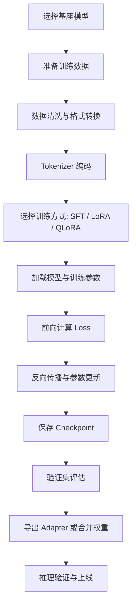

# 1. 大模型微调

这篇主要整理基于 `LLaMA-Factory` 和 `Unsloth` 的大模型微调思路，包括常见训练 API、工作原理、训练流程，以及一个便于理解的流程图。

## 2. 技术栈

- 视频参考：`bilibili.com/video/BV1djgRzxEts`
- 微调框架：`LLaMA-Factory`
- 加速工具：`Unsloth`
- 底层生态：`PyTorch`、`Transformers`、`Datasets`、`PEFT`、`TRL`

`LLaMA-Factory` 是一个社区维护的开源 LLM 微调框架，底层主要基于 Hugging Face 生态，常用于快速微调 `LLaMA`、`Qwen`、`Baichuan`、`ChatGLM` 等模型。  
`Unsloth` 更偏向高性能训练工具，目标是在更低显存占用下加速 `LoRA / QLoRA` 微调。

## 3. 安装与启动

```bash
conda create -n llama-fac python=3.10
conda activate llama-fac
cd LLaMA-Factory
pip install -e ".[torch,metrics]" --no-build-isolation
llamafactory-cli webui
```

后台启动可以使用：

```bash
nohup llamafactory-cli webui > llamafactory.log 2>&1 &
```

如果要结合 `Unsloth`，通常是在训练配置里选择支持的模型、量化方式和 LoRA 训练参数，而不是完全替换掉整个训练框架。

## 4. 为什么要微调

大模型预训练后具备通用语言能力，但通常还不够贴近具体业务。微调的主要目标包括：

- 让模型学习特定领域术语和表达风格。
- 强化某类任务能力，例如问答、分类、抽取、SQL 生成。
- 让模型更符合业务输出格式，例如 JSON、固定模板或工具调用结构。
- 在较低成本下对基座模型进行定制，而不是从头训练。

## 5. 工作原理

### 5.1. 核心思路

大模型微调本质上是在已有预训练参数基础上，继续使用特定数据做梯度更新，让模型在新任务上输出更符合目标分布。

对于自回归语言模型，训练目标通常仍然是：

- 给定前文 token
- 预测下一个 token
- 通过交叉熵损失衡量预测误差
- 反向传播更新参数

### 5.2. 全量微调与参数高效微调

- 全量微调：直接更新模型全部参数，效果强但显存、算力和存储开销大。
- LoRA：只在部分线性层旁边增加低秩适配矩阵，训练时只更新新增参数。
- QLoRA：在量化模型基础上再做 LoRA，进一步降低显存占用。

现在大多数工程实践里，`LoRA / QLoRA` 是主流方案，因为它们更适合单机多卡或消费级显卡环境。

### 5.3. 数据是如何参与训练的

训练样本通常会被整理成如下结构：

- `instruction`
- `input`
- `output`

或聊天格式：

- `system`
- `user`
- `assistant`

这些字段最终会经过模板拼接、tokenizer 编码，转换成模型输入的 `input_ids`、`attention_mask` 和训练标签 `labels`。

## 6. 训练流程

### 6.1. 训练步骤

一个完整的微调流程通常如下：

1. 选择基础模型，例如 `Qwen`、`LLaMA`。
2. 准备训练集、验证集，并统一成框架支持的数据格式。
3. 选择训练方式，例如 `SFT`、`LoRA`、`QLoRA`。
4. 配置 tokenizer、模板、最大长度、batch size、学习率等参数。
5. 加载模型并注入 LoRA 适配层。
6. 启动训练，周期性评估并保存 checkpoint。
7. 合并权重或保留 adapter，最后进入推理验证。

### 6.2. 流程图



## 7. 常见 API 与组件

### 7.1. Transformers

最常见的底层 API 基本都来自 Hugging Face：

```python
from transformers import AutoTokenizer, AutoModelForCausalLM

tokenizer = AutoTokenizer.from_pretrained("Qwen/Qwen2.5-7B-Instruct")
model = AutoModelForCausalLM.from_pretrained("Qwen/Qwen2.5-7B-Instruct")
```

常见作用：

- `AutoTokenizer.from_pretrained`：加载分词器。
- `AutoModelForCausalLM.from_pretrained`：加载自回归语言模型。
- `model.generate(...)`：推理生成。
- `tokenizer(...)`：把文本编码成 token。

### 7.2. Datasets

数据集加载与预处理通常使用：

```python
from datasets import load_dataset

dataset = load_dataset("json", data_files="train.json")
```

常见用法：

- `load_dataset`：加载本地或远程数据集。
- `dataset.map(...)`：对样本做格式转换、模板拼接、tokenize。
- `train_test_split(...)`：切分训练集和验证集。

### 7.3. PEFT

LoRA 训练经常会用到：

```python
from peft import LoraConfig, get_peft_model

lora_config = LoraConfig(
    r=8,
    lora_alpha=16,
    lora_dropout=0.05,
    target_modules=["q_proj", "v_proj"]
)
model = get_peft_model(model, lora_config)
```

常见作用：

- `LoraConfig`：配置 LoRA 超参数。
- `get_peft_model`：给基础模型注入 LoRA 层。
- `model.print_trainable_parameters()`：查看实际可训练参数比例。

### 7.4. Trainer / SFTTrainer

训练通常通过 Trainer 抽象来完成：

```python
from transformers import TrainingArguments, Trainer

training_args = TrainingArguments(
    output_dir="./output",
    per_device_train_batch_size=2,
    gradient_accumulation_steps=8,
    learning_rate=2e-4,
    num_train_epochs=3,
    logging_steps=10,
    save_steps=100
)
```

常见作用：

- `TrainingArguments`：统一定义训练超参数。
- `Trainer`：通用训练入口。
- `SFTTrainer`：更适合监督微调场景，常见于 `TRL` 生态。

### 7.5. 推理相关 API

训练后常见验证方式：

```python
inputs = tokenizer("请介绍一下 LoRA 微调。", return_tensors="pt")
outputs = model.generate(**inputs, max_new_tokens=256)
print(tokenizer.decode(outputs[0], skip_special_tokens=True))
```

这一组 API 用于做快速 smoke test，判断微调结果有没有学到目标任务。

## 8. LLaMA-Factory 与 Unsloth 的关系

### 8.1. LLaMA-Factory

它更像一个“训练控制台”：

- 提供 WebUI 和 CLI。
- 封装数据集配置、模板配置、训练方式配置。
- 能统一管理 SFT、DPO、奖励模型、推理和导出。

适合：

- 想快速把训练跑起来。
- 不想手写太多底层训练代码。
- 需要管理多组实验参数。

### 8.2. Unsloth

它更像一个“训练加速器”：

- 重点解决显存和速度问题。
- 对 LoRA / QLoRA 场景更友好。
- 适合在较弱硬件上跑更大的模型。

适合：

- 显存预算有限。
- 希望更快迭代实验。
- 训练模型以 `LoRA / QLoRA` 为主。

## 9. 常见问题

### 9.1. 为什么训练 loss 降了，效果还是不好

常见原因：

- 数据质量差，答案本身不稳定。
- 训练样本太少，泛化不够。
- 模板不一致，训练和推理格式不统一。
- 只看 loss，没有做实际推理抽样验证。

### 9.2. 为什么显存总是不够

可以从这些方向排查：

- 降低 `max_seq_length`
- 降低 `batch size`
- 使用 `gradient_accumulation`
- 使用 `LoRA / QLoRA`
- 开启更低位量化

### 9.3. 训练后的模型怎么部署

常见有两种方式：

- 只保存 `adapter`，推理时和基座模型一起加载。
- 把 `LoRA` 权重合并回基础模型，再统一导出部署。

如果后续要频繁切换多个任务版本，保留 adapter 往往更灵活。

## 10. easy dataset

- 项目地址：https://github.com/ConardLi/easy-dataset

这类数据集整理工具适合在微调前做数据清洗、标注整理和格式转换。真正影响微调效果的，通常不是训练命令本身，而是数据格式是否稳定、指令是否一致、答案是否足够干净。
