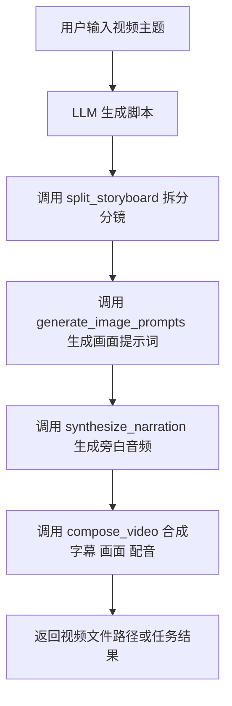
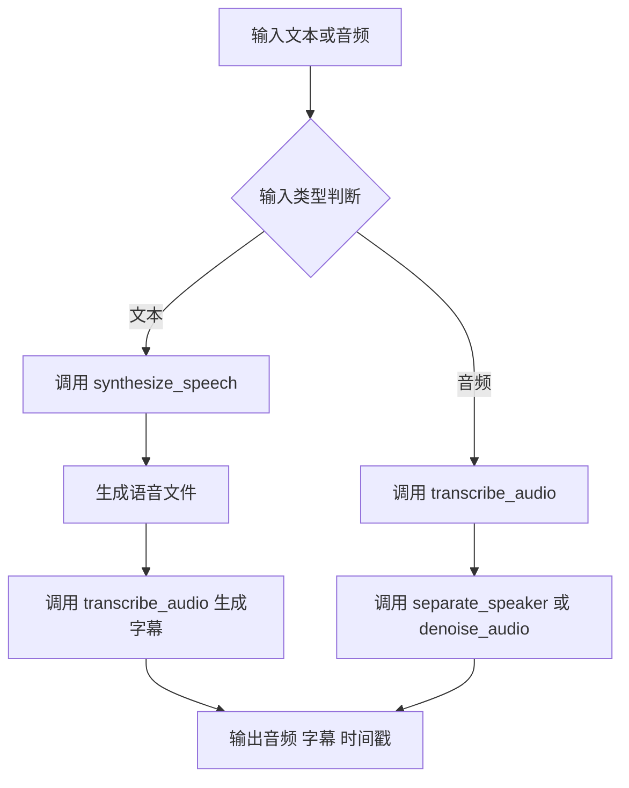
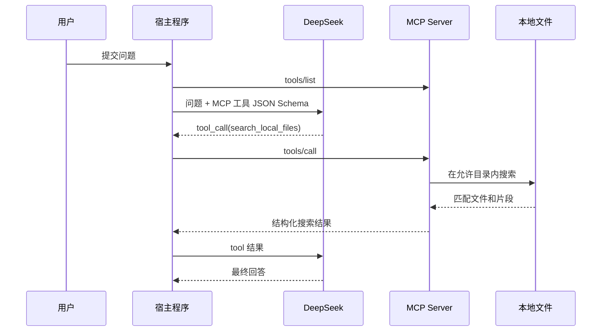

# 1. MCP 的理论

MCP 全称是 `Model Context Protocol`，可以理解为一套让大模型安全、标准化调用外部能力的协议。

::: danger 注意：协议标准化不代表调用天然安全
MCP 工具参数、资源内容和模型选择都可能被恶意输入影响。服务端必须实行最小权限、路径与租户边界校验、超时/限流、危险动作确认和审计；不要向客户端暴露生产密钥，也不要允许模型仅凭提示词执行任意文件、SQL 或终端命令。
:::

- 官方网站：https://modelcontextprotocol.io/introduction
- 示例：https://modelcontextprotocol.io/examples
- GitHub：https://github.com/modelcontextprotocol

如果把大模型看成“大脑”，那么 MCP 更像“大脑和工具之间的统一插口”。它不是某一个具体模型，也不是某一个 Agent 框架，而是一层协议标准。

## 1.1. MCP 与 AI Agent 的区别

`AI Agent` 更关注“怎么自主完成任务”，例如：

- 规划任务步骤
- 决定下一步调用哪个工具
- 根据结果继续迭代

`MCP` 更关注“模型和工具如何通信”，例如：

- 工具如何声明自己有哪些能力
- 参数格式如何描述
- 返回结果如何组织
- 模型如何拿到上下文资源

可以简单理解为：

- `Agent` 是工作流控制层
- `MCP` 是工具接入协议层

## 1.2. MCP 解决了 AI Agent 的什么问题

如果没有统一协议，接一个外部工具通常会遇到这些问题：

- 每个工具的参数格式都不同
- 模型不知道有哪些工具可用
- 工具返回内容不统一，模型难以稳定使用
- 权限边界不清晰，容易乱调用

MCP 主要解决的是：

- 工具能力标准化描述
- 工具参数标准化输入
- 资源和上下文统一暴露
- 模型与工具之间的调用边界清晰化

所以它特别适合做“模型 + 外部系统 + 多工具协同”这一类集成。

## 1.3. MCP 如何和 LLM 协同工作

一个典型过程如下：

1. MCP Server 向客户端声明自己有哪些 `tools`、`resources`、`prompts`。
2. 客户端把这些能力暴露给 LLM。
3. LLM 在推理过程中判断要不要调用某个工具。
4. 客户端按协议把调用请求发给 MCP Server。
5. MCP Server 执行逻辑并返回结构化结果。
6. LLM 再基于结果继续生成后续内容。

也就是说，LLM 本身不直接访问数据库、文件系统、视频服务或音频服务，而是通过 MCP 间接获取这些能力。

## 1.4. 双方是如何通信的

MCP 的通信核心是 JSON-RPC 风格的消息交换。常见内容包括：

- 初始化
- 列举工具
- 调用工具
- 读取资源

逻辑上类似这样：

```json
{
  "jsonrpc": "2.0",
  "id": 1,
  "method": "tools/call",
  "params": {
    "name": "generate_video_script",
    "arguments": {
      "topic": "介绍 LoRA 微调",
      "duration": 60
    }
  }
}
```

返回结果可能类似：

```json
{
  "jsonrpc": "2.0",
  "id": 1,
  "result": {
    "content": [
      {
        "type": "text",
        "text": "已生成 60 秒视频脚本。"
      }
    ]
  }
}
```

## 1.5. 一个简化理解

如果不用 MCP，模型调用工具往往是“临时拼 JSON + 自定义约定”。  
用了 MCP 后，模型调用工具会变成“统一协议 + 标准能力描述 + 统一返回格式”。


# 2. MCP 的使用

## 2.1. MCP 中的几个核心概念

### 2.1.1. tools

`tools` 表示模型可以主动调用的能力，例如：

- 生成视频脚本
- 调用 TTS 合成音频
- 读取某个项目目录中的素材列表
- 启动一次推理任务

### 2.1.2. resources

`resources` 更像“可读取的上下文资源”，例如：

- 本地文件
- 数据库 schema
- 素材清单
- 某个配置文件

### 2.1.3. prompts

`prompts` 是预定义提示模板，可以让客户端或模型在特定场景下直接复用。

## 2.2. MCP 的典型接入步骤

1. 选择一个 MCP SDK。
2. 定义需要暴露的工具。
3. 给每个工具写清楚参数 schema。
4. 在工具内部接入真实业务逻辑。
5. 通过 MCP Client 让 LLM 感知这些能力。
6. 在实际任务中测试工具调用链路。


# 3. MCP 的实现

## 3.1. 一个最小实现思路

以 Python 为例，一个 MCP Server 的核心工作通常是：

- 启动服务
- 注册工具
- 定义参数
- 实现处理函数

伪代码结构可以理解成这样：

```python
from mcp.server.fastmcp import FastMCP

mcp = FastMCP("media-assistant")

@mcp.tool()
def generate_video_script(topic: str, duration: int) -> str:
    return f"为主题 {topic} 生成 {duration} 秒视频脚本"

@mcp.tool()
def synthesize_voice(text: str, speaker: str) -> str:
    return f"已提交语音合成任务，speaker={speaker}"

if __name__ == "__main__":
    mcp.run()
```

这只是一个简化骨架，真实工程里每个工具内部还会继续调用：

- 模型推理服务
- FFmpeg
- TTS 引擎
- ASR 引擎
- 文件系统
- 对象存储

## 3.2. 实现时要关注什么

- 参数要尽量结构化，不要全靠自然语言猜测。
- 返回值要足够清晰，最好包含状态、文件路径、错误信息。
- 工具粒度不要太粗，也不要太碎。
- 对长任务要考虑异步执行和任务状态查询。
- 对文件路径、外部命令、API key 要做好权限边界。


# 4. 例子一：AI 视频相关的 MCP 实现

## 4.1. 场景

需求是：用户输入一个主题，例如“介绍 LoRA 微调”，系统自动完成：

- 生成短视频脚本
- 拆分分镜
- 生成旁白文案
- 合成音频
- 组合图片、字幕、配音
- 导出视频

这类工作流非常适合 MCP，因为它不是一次模型回答，而是多个工具协作。

## 4.2. 可以拆成哪些工具

可以暴露如下 MCP tools：

- `generate_video_script`
- `split_storyboard`
- `generate_image_prompts`
- `synthesize_narration`
- `compose_video`
- `query_video_task`

## 4.3. 一个可能的流程



## 4.4. 一个具体工具示例

下面这个工具负责生成视频脚本：

```python
from mcp.server.fastmcp import FastMCP

mcp = FastMCP("video-workflow")

@mcp.tool()
def generate_video_script(topic: str, duration: int, style: str = "科普") -> str:
    prompt = f"请生成一个{duration}秒的{style}短视频脚本，主题是：{topic}"
    # 这里可以继续调用你自己的 LLM 服务
    result = call_llm(prompt)
    return result
```

再比如视频合成工具：

```python
@mcp.tool()
def compose_video(
    image_dir: str,
    audio_file: str,
    subtitle_file: str,
    output_file: str
) -> str:
    # 这里可以调用 ffmpeg、moviepy 或 remotion 工作流
    run_ffmpeg(image_dir, audio_file, subtitle_file, output_file)
    return output_file
```

## 4.5. 这个例子的价值

它的价值不只是“能生成视频”，而是模型可以通过 MCP 把复杂视频生产链路拆成多个稳定步骤：

- 文案生成交给 LLM
- 配音交给 TTS
- 拼接交给 FFmpeg 或视频引擎
- 最终由 Agent 串起来


# 5. 例子二：AI 音频相关的 MCP 实现

## 5.1. 场景

需求是：输入一段文案或一段音频，系统完成：

- 文案转语音
- 语音转字幕
- 说话人切分
- 音频降噪
- 最终输出播客片段或字幕稿

这类任务的典型特点是：

- 工具链长
- 文件中间态多
- 适合标准化调用

## 5.2. 可以拆成哪些工具

可以设计这些 MCP tools：

- `synthesize_speech`
- `transcribe_audio`
- `separate_speaker`
- `denoise_audio`
- `generate_podcast_outline`
- `merge_audio_segments`

## 5.3. 一个可能的流程



## 5.4. 一个具体工具示例

下面这个工具做文本转语音：

```python
from mcp.server.fastmcp import FastMCP

mcp = FastMCP("audio-workflow")

@mcp.tool()
def synthesize_speech(
    text: str,
    speaker: str,
    sample_rate: int = 24000
) -> str:
    # 这里可以调用 TTS 服务，例如 CosyVoice、EdgeTTS、MegaTTS 等
    audio_path = call_tts_engine(text=text, speaker=speaker, sample_rate=sample_rate)
    return audio_path
```

语音识别工具可以类似这样：

```python
@mcp.tool()
def transcribe_audio(audio_path: str) -> str:
    # 这里可以调用 Whisper、FunASR 或自建 ASR 服务
    transcript = call_asr(audio_path)
    return transcript
```

## 5.5. 这个例子的价值

在音频场景里，MCP 很适合把“文案生成、语音合成、字幕提取、后处理”拆开。  
这样做的好处是：

- 替换单个引擎更方便
- 某个工具失败时更容易重试
- Agent 更容易理解每一步该做什么


# 6. MCP 和传统 API 集成的区别

如果只写普通 API，也能做视频和音频工作流，但 MCP 的优势在于它对“模型可理解性”更友好。

传统 API 集成通常是：

- 人工写死调用顺序
- 每个接口单独对接
- 模型只拿最终结果

MCP 方式则更偏向：

- 工具能力先声明
- 模型按需调用
- Agent 可以动态组合工具
- 不同客户端可以复用同一套能力


# 7. 落地建议

如果要在实际项目里用 MCP，我更建议这样分层：

1. LLM 负责理解任务和决策。
2. MCP Server 负责对外暴露工具。
3. 每个工具内部再去调用真正的业务实现。
4. 长任务统一走任务队列和状态查询，不要阻塞式等待。

对于视频和音频这两类场景，比较典型的工具内部实现通常会接：

- `FFmpeg`
- `MoviePy`
- `Remotion`
- `Whisper / FunASR`
- `CosyVoice / MegaTTS / EdgeTTS`
- 图像生成或视频生成模型服务


# 8. 小结

MCP 本质上不是替代 Agent，而是给 Agent 和 LLM 提供统一的工具调用方式。  
如果你的目标是做 AI 视频、AI 音频、素材流水线或多工具协同系统，MCP 会比“零散函数调用”更适合长期维护。


# 9. DeepSeek + MCP + 本地文件搜索

下面给出一个可以落地的最小应用：用户向 DeepSeek 提问，DeepSeek 判断是否需要搜索本地文档；宿主程序通过 MCP 调用文件搜索工具，再把搜索结果交还给 DeepSeek 生成最终答案。

这里的 `DS` 指 DeepSeek。DeepSeek 的 Chat Completions 接口兼容 OpenAI SDK 的 `tools`（函数工具）格式，但普通 Chat Completions 请求并不会直接执行 MCP。中间的宿主程序负责完成这次协议转换：



## 9.1. MCP 文件搜索服务

先安装依赖并固定在本文示例使用的 MCP Python SDK 兼容范围：

```bash
python -m venv .venv
source .venv/bin/activate       # Windows: .venv\\Scripts\\activate
pip install "mcp[cli]>=1.28,<2" openai
```

创建 `local_search_server.py`。搜索根目录通过环境变量指定，默认是当前目录下的 `knowledge`，并且使用 `resolve()` 检查路径，防止 `../` 路径越权。

```python
from pathlib import Path
import os

from mcp.server.fastmcp import FastMCP

ROOT = Path(os.getenv("LOCAL_SEARCH_ROOT", "./knowledge")).expanduser().resolve()
ALLOWED_SUFFIXES = {".md", ".txt", ".rst", ".json", ".yaml", ".yml"}
mcp = FastMCP("local-file-search")


@mcp.tool()
def search_local_files(query: str, limit: int = 8) -> list[dict[str, str]]:
    """在允许的本地文档目录中按关键词搜索，并返回文件名和上下文片段。"""
    query = query.strip()
    if not query:
        return []
    limit = max(1, min(limit, 20))
    terms = [term.lower() for term in query.split()]
    matches: list[dict[str, str]] = []

    if not ROOT.exists():
        return [{"error": f"search root does not exist: {ROOT}"}]

    for path in ROOT.rglob("*"):
        if len(matches) >= limit or not path.is_file() or path.suffix.lower() not in ALLOWED_SUFFIXES:
            continue
        try:
            text = path.read_text(encoding="utf-8", errors="ignore")
        except OSError:
            continue
        lower = text.lower()
        if not all(term in lower for term in terms):
            continue
        position = min(lower.find(term) for term in terms)
        start = max(0, position - 180)
        excerpt = " ".join(text[start : start + 420].split())
        matches.append({"file": str(path.relative_to(ROOT)), "excerpt": excerpt})
    return matches


if __name__ == "__main__":
    # stdio 适合由宿主程序启动；不要把调试日志写到 stdout。
    mcp.run(transport="stdio")
```

## 9.2. DeepSeek 宿主程序

创建 `deepseek_mcp_search.py`。它先读取 MCP 工具定义，再把定义转换为 DeepSeek 的函数工具；收到 `tool_calls` 后严格校验 JSON 参数，并通过 MCP 客户端执行。API Key 只从环境变量读取，不要写进博客或代码仓库。

```python
import asyncio
import json
import os
from contextlib import AsyncExitStack

from mcp import ClientSession, StdioServerParameters
from mcp.client.stdio import stdio_client
from openai import OpenAI


def as_deepseek_tools(mcp_tools) -> list[dict]:
    return [
        {
            "type": "function",
            "function": {
                "name": tool.name,
                "description": tool.description or "",
                "parameters": tool.inputSchema,
            },
        }
        for tool in mcp_tools
    ]


async def ask(question: str) -> str:
    server = StdioServerParameters(
        command="python",
        args=[os.path.abspath("local_search_server.py")],
        env={**os.environ, "LOCAL_SEARCH_ROOT": os.getenv("LOCAL_SEARCH_ROOT", "./knowledge")},
    )
    llm = OpenAI(
        api_key=os.environ["DEEPSEEK_API_KEY"],
        base_url=os.getenv("DEEPSEEK_BASE_URL", "https://api.deepseek.com"),
    )

    async with AsyncExitStack() as stack:
        read, write = await stack.enter_async_context(stdio_client(server))
        mcp = await stack.enter_async_context(ClientSession(read, write))
        await mcp.initialize()
        listed = await mcp.list_tools()
        tools = as_deepseek_tools(listed.tools)
        messages = [
            {"role": "system", "content": "你是知识库助手。需要事实时先调用本地搜索工具，并引用返回的文件名。"},
            {"role": "user", "content": question},
        ]

        first = llm.chat.completions.create(
            model=os.getenv("DEEPSEEK_MODEL", "deepseek-chat"),
            messages=messages,
            tools=tools,
            tool_choice="auto",
        )
        assistant = first.choices[0].message
        messages.append(assistant.model_dump(exclude_none=True))

        for call in assistant.tool_calls or []:
            try:
                arguments = json.loads(call.function.arguments or "{}")
                if not isinstance(arguments, dict):
                    raise ValueError("tool arguments must be a JSON object")
                result = await mcp.call_tool(call.function.name, arguments)
                content = "\n".join(
                    block.text for block in result.content if hasattr(block, "text")
                ) or json.dumps(result.structuredContent or {}, ensure_ascii=False)
            except (json.JSONDecodeError, ValueError, TypeError) as exc:
                content = json.dumps({"error": str(exc)}, ensure_ascii=False)
            messages.append({
                "role": "tool",
                "tool_call_id": call.id,
                "name": call.function.name,
                "content": content,
            })

        final = llm.chat.completions.create(
            model=os.getenv("DEEPSEEK_MODEL", "deepseek-chat"),
            messages=messages,
            tools=tools,
            tool_choice="none",
        )
        return final.choices[0].message.content or "没有找到可回答的内容。"


if __name__ == "__main__":
    print(asyncio.run(ask(input("问题："))))
```

运行：

```bash
export DEEPSEEK_API_KEY="sk-..."
export LOCAL_SEARCH_ROOT="$PWD/knowledge"
python deepseek_mcp_search.py
```

例如在 `knowledge/mcp.md` 中包含“工具列表”和“JSON-RPC”，输入“本地文档中 MCP 的工具列表是什么？”时，DeepSeek 会先产生 `search_local_files` 调用，程序执行搜索后再生成答案。若需要启用 DeepSeek 思考模式，必须把返回消息中的 `reasoning_content` 原样保留到下一轮请求；否则会收到参数错误。

## 9.3. 生产环境注意事项

- 只把必要目录挂载给 MCP Server，限制扩展名、单文件大小和搜索耗时。
- 对工具名和参数做白名单校验；不能让模型拼接任意 shell 命令或路径。
- 工具结果应限制长度并保留文件名，避免把整个文件内容发送到模型。
- 为 MCP 调用增加超时、审计日志和错误重试；不要把密钥、隐私文件内容写入日志。
- DeepSeek 模型名可能随服务更新，部署时通过 `DEEPSEEK_MODEL` 配置，并以官方模型列表为准。

参考：

- DeepSeek API：https://api-docs.deepseek.com/
- DeepSeek Tool Calls：https://api-docs.deepseek.com/guides/tool_calls
- MCP Python SDK：https://py.sdk.modelcontextprotocol.io/
