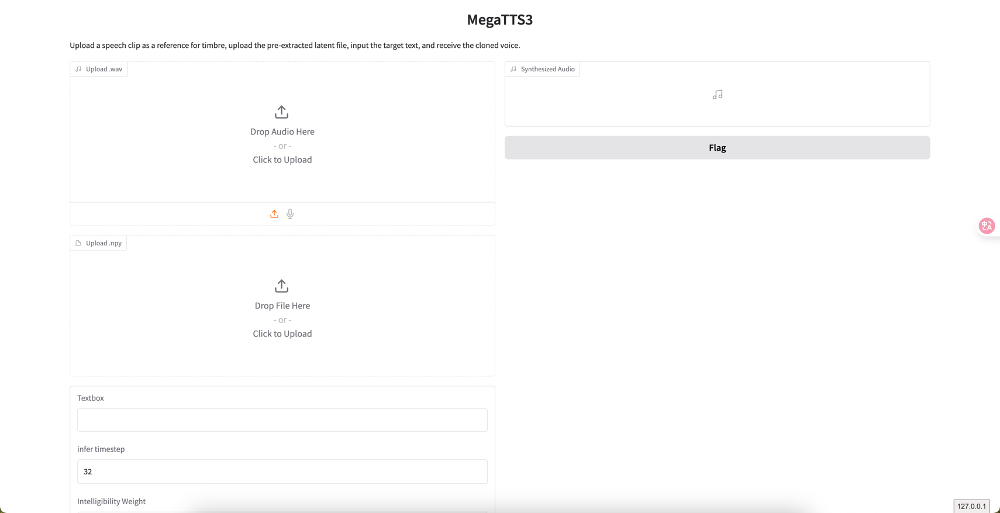

# 1. MegaTTS3

- 项目地址：https://github.com/bytedance/MegaTTS3

MegaTTS3 是字节开源的一个 TTS 模型，支持中文、英文、日文、韩文等多语言语音合成，也支持一定程度的音色保持、跨语言合成和口音控制。文章里提到的模型规模约为 4.5 亿参数，整体更适合做“给一小段参考音频，再生成目标文本语音”的场景。

> 实际使用时，上传的参考音频建议小于 24 秒，文件名里不要带空格。

::: danger 注意：克隆音色前必须取得本人明确授权
合成语音可能被误认为本人陈述，不能用于冒充、诈骗、绕过声纹或制作未标注内容。参考音频包含生物特征与隐私，应加密、限制访问并设删除期限；公开输出应显著标识 AI 合成，面向真实用户时增加滥用检测和投诉撤回流程。
:::

## 2. 适用场景

MegaTTS3 比较适合以下任务：

- 给定参考音频，生成同音色的新文本语音。
- 跨语言合成，例如参考音频是英文，说中文文本。
- 对口音保留程度和标准发音程度做一定权衡。
- 快速搭建一个本地 WebUI 进行语音试验。

如果你的目标是超长音频生成、复杂播客后期处理、说话人分离或大规模在线服务，通常还需要再配合：

- 文本切分
- 音频后处理
- 异步任务队列
- FFmpeg
- ASR 校验

## 3. 工作方式

MegaTTS3 的核心流程可以理解为：

1. 输入一段参考音频。
2. 提取说话人的音色特征和部分韵律特征。
3. 输入目标文本。
4. 模型综合文本内容、参考音频特征以及推理参数生成新语音。
5. 输出最终音频文件。

在工程上，这类 TTS 模型通常不只是“文本转语音”，而是“参考音频 + 目标文本 -> 目标语音”。所以参考音频质量会直接影响最终结果。

## 4. 安装

### 4.1. 克隆仓库

```bash
git clone https://github.com/bytedance/MegaTTS3
cd MegaTTS3
```

### 4.2. Conda 环境安装

```bash
conda create -n megatts3-env python=3.10
conda activate megatts3-env
pip install -r requirements.txt
```

设置项目根目录：

```bash
export PYTHONPATH="/path/to/MegaTTS3:$PYTHONPATH"
```

如果需要指定 GPU：

```bash
export CUDA_VISIBLE_DEVICES=0
```

### 4.3. 安装时的常见注意点

- 如果推理时报 `pydantic` 相关错误，要检查 `pydantic` 和 `gradio` 的版本是否匹配。
- 如果出现 `httpx` 相关错误，检查环境变量 `no_proxy` 中是否包含异常模式，例如 `::`。
- 建议优先在独立 Python 环境里安装，避免和其他模型项目的依赖冲突。

### 4.4. Docker 方式

```bash
docker build . -t megatts3:latest
```

GPU 推理：

```bash
docker run -it -p 7929:7929 --gpus all -e CUDA_VISIBLE_DEVICES=0 megatts3:latest
```

CPU 推理：

```bash
docker run -it -p 7929:7929 megatts3:latest
```

启动后可以访问：

```text
http://0.0.0.0:7929/
```

> Docker 方式通常还需要提前下载预训练模型，否则镜像启动后也无法直接推理。

## 5. 推理使用

### 5.1. 标准版推理

标准版更适合“给参考音频，再合成目标文本”的基本场景。

```bash
python tts/infer_cli.py \
  --input_wav 'assets/Chinese_prompt.wav' \
  --input_text "另一边的桌上,一位读书人嗤之以鼻道,'佛子三藏,神子燕小鱼是什么样的人物,李家的那个李子夜如何与他们相提并论？'" \
  --output_dir ./gen
```

英文示例：

```bash
python tts/infer_cli.py \
  --input_wav 'assets/English_prompt.wav' \
  --input_text 'As his long promised tariff threat turned into reality this week, top human advisers began fielding a wave of calls from business leaders, particularly in the automotive sector, along with lawmakers who were sounding the alarm.' \
  --output_dir ./gen \
  --p_w 2.0 \
  --t_w 3.0
```

### 5.2. 口音控制版推理

- 参考地址：https://drive.google.com/drive/folders/1gCWL1y_2xu9nIFhUX_OW5MbcFuB7J5Cl

这个模式适合测试“口音保留”和“标准发音增强”的效果。

```bash
python tts/infer_cli.py \
  --input_wav 'assets/English_prompt.wav' \
  --input_text '这是一条有口音的音频。' \
  --output_dir ./gen \
  --p_w 1.0 \
  --t_w 3.0
```

```bash
python tts/infer_cli.py \
  --input_wav 'assets/English_prompt.wav' \
  --input_text '这条音频的发音标准一些了吗？' \
  --output_dir ./gen \
  --p_w 2.5 \
  --t_w 2.5
```

## 6. 常用参数说明

### 6.1. `--input_wav`

参考音频路径。  
建议：

- 人声清晰
- 背景噪声少
- 时长不要太长
- 尽量只保留一个说话人

### 6.2. `--input_text`

目标文本内容。  
建议：

- 标点尽量完整
- 中英文混排时注意停顿
- 先用短句试效果，再逐步增加长度

### 6.3. `--output_dir`

输出目录，用于存放生成后的音频文件。

### 6.4. `--p_w`

通常可理解为清晰度、可懂度相关权重。  
一般规律是：

- 值较低时，更容易保留原始口音特征
- 值较高时，更偏向标准发音

### 6.5. `--t_w`

通常可理解为音色相似度、表达强度相关权重。  
经验上：

- 合理提高 `t_w`，有助于提升音色相似度和表现力
- 过高时也可能带来不稳定或失真

## 7. 一个实际使用流程

如果只是想快速验证 MegaTTS3 是否适合自己的业务，可以按这个顺序试：

1. 准备一段 10 到 20 秒的干净参考音频。
2. 先用一句短文本测试基础音色保持。
3. 再测试长句、跨语言或带情绪的文本。
4. 调整 `p_w` 和 `t_w` 看效果变化。
5. 最后再考虑接入 WebUI 或封装成服务。

这样做的好处是可以先验证模型能力，再决定是否值得做工程接入。

## 8. WebUI 方式

启动命令：

```bash
python tts/gradio_api.py
```

CPU 推理也可以使用，但速度会明显慢一些，例如 10 个推理步可能需要约 30 秒。

`Gradio` 本质上是一个快速把 Python 推理逻辑包装成网页交互界面的工具，非常适合做模型试验、参数调试和本地演示。

下面是一个简化版的界面示例：

```python
import gradio as gr


def greet(name):
    return "Hello " + name + "!"


demo = gr.Interface(
    fn=greet,
    inputs="text",
    outputs="text",
    title="Hello World Demo"
)

if __name__ == '__main__':
    api_interface = gr.Interface(
        fn=greet,
        inputs=[
            gr.Audio(type="filepath", label="Upload .wav"),
            gr.File(type="filepath", label="Upload .npy"),
            "text",
            gr.Number(label="infer timestep", value=32),
            gr.Number(label="Intelligibility Weight", value=1.4),
            gr.Number(label="Similarity Weight", value=3.0)
        ],
        outputs=[gr.Audio(label="Synthesized Audio")],
        title="MegaTTS3",
        description="Upload a speech clip as a reference for timbre, upload the pre-extracted latent file, input the target text, and receive the cloned voice.",
        concurrency_limit=1
    )
    api_interface.launch(server_name='0.0.0.0', server_port=7929, debug=True)
    demo.launch()
```

上述代码会创建类似这样的界面，`fn=greet` 表示界面的回调函数：



## 9. 常见问题

### 9.1. 生成效果不稳定

优先检查：

- 参考音频是否太短或太嘈杂
- 文本是否过长
- `p_w` 和 `t_w` 是否过高

### 9.2. 跨语言效果不理想

这类场景通常更依赖参考音频质量和模型对目标语言的覆盖情况。建议：

- 先做短句测试
- 先验证音色保持，再看发音自然度
- 不要一开始就用特别长的跨语言段落

### 9.3. 启动 WebUI 报依赖错误

优先检查：

- `gradio`
- `pydantic`
- `httpx`
- Python 版本

很多问题不是模型本身，而是推理界面层的依赖冲突。

## 10. 小结

MegaTTS3 更适合做“参考音频驱动的语音合成”实验。实际落地时，重点不是只会运行命令，而是控制好：

- 参考音频质量
- 推理参数
- 文本切分
- WebUI 或服务化接入方式

先跑通最小示例，再逐步接入批量生成、字幕联动、音频后处理，整体效率会更高。
