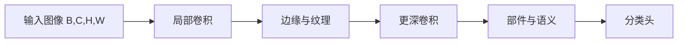

# CNN 卷积神经网络原理、代码与源码解读

卷积神经网络（Convolutional Neural Network，CNN）通过局部连接和权重共享，把“相邻像素通常相关”“同一种模式可能出现在任意位置”写进模型结构。它不是简单地给图片套一个 API，而是一套利用空间结构减少参数、逐层提取特征的方法。

## 1. 为什么图像不直接使用全连接层

一张 `224 × 224 × 3` 的彩色图像有 150,528 个输入值。如果第一个全连接层有 1,000 个神经元，仅权重就超过 1.5 亿个。它还有两个问题：

- 展平后丢失“哪些像素相邻”的显式结构。
- 一个边缘出现在左上角和右下角时，需要不同参数分别学习。

卷积层只观察局部窗口，并让同一个卷积核滑过整张图像。一个“竖直边缘检测器”因此可以在所有位置复用。



## 2. 二维卷积的计算

对单通道输入，卷积核 $K$ 在输入 $X$ 上滑动，输出位置 $(i,j)$ 为：

$$
Y_{i,j}=b+\sum_{u=0}^{K_h-1}\sum_{v=0}^{K_w-1}W_{u,v}X_{i+u,j+v}
$$

深度学习框架实际计算的通常是互相关（kernel 不翻转），但业界仍沿用“卷积”这个名称。多通道时，每个输出通道都要对所有输入通道累加：

$$
Y_{n,o,i,j}=b_o+\sum_{c=0}^{C_{in}-1}\sum_u\sum_v
W_{o,c,u,v}X_{n,c,i+u,j+v}
$$

权重形状为 `[C_out, C_in / groups, K_h, K_w]`，偏置形状为 `[C_out]`。

### 2.1 输出形状

输入高度 $H$，kernel 大小 $K$，padding $P$，stride $S$，dilation $D$ 时：

$$
H_{out}=\left\lfloor\frac{H+2P-D(K-1)-1}{S}+1\right\rfloor
$$

宽度同理。例如 `H=32, K=3, P=1, S=1, D=1`，输出仍为 32；将 stride 改成 2 后，输出为 16。

| 参数 | 作用 | 直观理解 |
| --- | --- | --- |
| `kernel_size` | 局部窗口大小 | 一次看多大范围 |
| `stride` | 每次移动距离 | 大于 1 时同时下采样 |
| `padding` | 输入边缘补值 | 控制边缘信息和输出尺寸 |
| `dilation` | kernel 采样间隔 | 不增加参数地扩大感受野 |
| `groups` | 通道分组 | `groups=C_in` 时是深度卷积 |

## 3. 用循环手写卷积

下面的实现很慢，但把每一个维度都摊开了，适合验证公式：

```python
import torch
import torch.nn.functional as F

def conv2d_naive(x, weight, bias=None, stride=1, padding=0):
    """只演示方形 kernel、相同水平/垂直 stride 的普通卷积。"""
    batch, in_channels, in_h, in_w = x.shape
    out_channels, weight_in_channels, kernel_h, kernel_w = weight.shape
    assert in_channels == weight_in_channels

    x = F.pad(x, (padding, padding, padding, padding))
    out_h = (in_h + 2 * padding - kernel_h) // stride + 1
    out_w = (in_w + 2 * padding - kernel_w) // stride + 1
    out = x.new_zeros(batch, out_channels, out_h, out_w)

    for n in range(batch):
        for oc in range(out_channels):
            for i in range(out_h):
                for j in range(out_w):
                    h0, w0 = i * stride, j * stride
                    patch = x[n, :, h0:h0 + kernel_h, w0:w0 + kernel_w]
                    out[n, oc, i, j] = (patch * weight[oc]).sum()
                    if bias is not None:
                        out[n, oc, i, j] += bias[oc]
    return out

torch.manual_seed(0)
x = torch.randn(2, 3, 8, 8)
weight = torch.randn(4, 3, 3, 3)
bias = torch.randn(4)

y_manual = conv2d_naive(x, weight, bias, stride=2, padding=1)
y_torch = F.conv2d(x, weight, bias, stride=2, padding=1)
print(y_manual.shape)                         # [2, 4, 4, 4]
print(torch.allclose(y_manual, y_torch, atol=1e-5))  # True
```

关键不是记住五层循环，而是看清：同一个 `weight[oc]` 被用于每个空间位置，这就是权重共享。

## 4. 参数量和计算量

普通卷积参数量为：

$$
C_{out}\times(C_{in}/groups)\times K_h\times K_w+C_{out}
$$

它与输入图像的高、宽无关。`3 → 64` 通道的 `3 × 3` 卷积只有 `64 × 3 × 3 × 3 + 64 = 1,792` 个参数。

但参数少不代表计算一定少。粗略乘加次数与 $H_{out}W_{out}C_{out}C_{in}K_hK_w/groups$ 成正比。高分辨率特征图仍然很贵，因此网络通常逐阶段降低空间分辨率、增加通道数。

## 5. 从卷积块到完整 CNN

常见卷积块可以写成：

```text
Conv2d → BatchNorm2d → ReLU → Pool/stride convolution
```

- 卷积负责提取局部模式。
- BatchNorm 对每个通道统计 batch 和空间维的均值、方差，使训练更稳定。
- ReLU 提供非线性。
- 池化或 stride 卷积降低分辨率、扩大后续神经元的有效感受野。

下面是一个适用于 CIFAR-10（`32 × 32` 彩色图像）的小模型：

```python
import torch
from torch import nn

class ConvBlock(nn.Module):
    def __init__(self, in_channels, out_channels, downsample=False):
        super().__init__()
        stride = 2 if downsample else 1
        self.block = nn.Sequential(
            nn.Conv2d(in_channels, out_channels, kernel_size=3,
                      stride=stride, padding=1, bias=False),
            nn.BatchNorm2d(out_channels),
            nn.ReLU(inplace=True),
            nn.Conv2d(out_channels, out_channels, kernel_size=3,
                      padding=1, bias=False),
            nn.BatchNorm2d(out_channels),
            nn.ReLU(inplace=True),
        )

    def forward(self, x):
        return self.block(x)

class SmallCNN(nn.Module):
    def __init__(self, num_classes=10):
        super().__init__()
        self.features = nn.Sequential(
            ConvBlock(3, 32),                  # [B, 3, 32, 32] -> [B, 32, 32, 32]
            ConvBlock(32, 64, downsample=True), # -> [B, 64, 16, 16]
            ConvBlock(64, 128, downsample=True),# -> [B, 128, 8, 8]
        )
        self.pool = nn.AdaptiveAvgPool2d(1)     # -> [B, 128, 1, 1]
        self.classifier = nn.Linear(128, num_classes)

    def forward(self, x):
        x = self.features(x)
        x = self.pool(x)
        x = torch.flatten(x, 1)                # 只展平通道后的维度，保留 batch
        return self.classifier(x)              # 返回 logits

model = SmallCNN()
dummy = torch.randn(4, 3, 32, 32)
print(model(dummy).shape)                      # torch.Size([4, 10])
```

### 5.1 为什么用自适应全局平均池化

`AdaptiveAvgPool2d(1)` 把每个通道压缩为一个平均值，分类头不再依赖固定的 `8 × 8` 尺寸。它还避免了巨大的全连接层。`torch.flatten(x, 1)` 从第 1 维开始展平，保留第 0 维 batch；直接调用无参数 `flatten()` 会把整批样本混在一起。

### 5.2 一份可运行的 CIFAR-10 训练代码

```python
import torch
from torch import nn
from torch.utils.data import DataLoader
from torchvision import datasets, transforms

device = torch.device("cuda" if torch.cuda.is_available() else "cpu")

train_transform = transforms.Compose([
    transforms.RandomCrop(32, padding=4),
    transforms.RandomHorizontalFlip(),
    transforms.ToTensor(),
    transforms.Normalize((0.4914, 0.4822, 0.4465),
                         (0.2470, 0.2435, 0.2616)),
])
test_transform = transforms.Compose([
    transforms.ToTensor(),
    transforms.Normalize((0.4914, 0.4822, 0.4465),
                         (0.2470, 0.2435, 0.2616)),
])

train_set = datasets.CIFAR10("./data", train=True, download=True,
                             transform=train_transform)
test_set = datasets.CIFAR10("./data", train=False, download=True,
                            transform=test_transform)
train_loader = DataLoader(train_set, batch_size=128, shuffle=True,
                          num_workers=2, pin_memory=torch.cuda.is_available())
test_loader = DataLoader(test_set, batch_size=256, shuffle=False,
                         num_workers=2)

model = SmallCNN(num_classes=10).to(device)
criterion = nn.CrossEntropyLoss()
optimizer = torch.optim.AdamW(model.parameters(), lr=3e-4, weight_decay=1e-4)

for epoch in range(10):
    model.train()
    for images, targets in train_loader:
        images, targets = images.to(device), targets.to(device)
        optimizer.zero_grad()
        loss = criterion(model(images), targets)
        loss.backward()
        optimizer.step()

    model.eval()
    correct = total = 0
    with torch.no_grad():
        for images, targets in test_loader:
            images, targets = images.to(device), targets.to(device)
            prediction = model(images).argmax(dim=1)
            correct += (prediction == targets).sum().item()
            total += targets.numel()
    print(f"epoch={epoch + 1:02d}, test_acc={correct / total:.3f}")
```

训练变换只能用于训练集。若验证集也使用随机裁剪，指标会随机波动且不能公平比较。

## 6. 感受野为何会逐层扩大

两个 stride 为 1 的 `3 × 3` 卷积堆叠后，第二层一个位置能看到原图 `5 × 5` 的区域；三个则看到 `7 × 7`。相比单个 `7 × 7` 卷积，三个 `3 × 3` 卷积参数更少，中间还加入了更多非线性。

理论感受野只说明可能影响该神经元的区域，实际有效感受野往往集中在中心。检测、分割任务还要关注下采样是否过早丢掉小目标细节。

## 7. 经典结构在改进什么

| 网络 | 关键思想 | 解决的问题 |
| --- | --- | --- |
| LeNet-5 | 卷积 + 池化 + 全连接 | 建立早期图像分类范式 |
| AlexNet | ReLU、Dropout、GPU 训练 | 让深度 CNN 在大规模图像上取得突破 |
| VGG | 重复堆叠 `3 × 3` 卷积 | 用统一简单结构增加深度 |
| ResNet | 残差连接 `y=F(x)+x` | 缓解深层网络优化困难 |
| MobileNet | 深度可分离卷积 | 降低移动端参数量和计算量 |

一个基础残差块如下：

```python
class ResidualBlock(nn.Module):
    def __init__(self, channels):
        super().__init__()
        self.residual = nn.Sequential(
            nn.Conv2d(channels, channels, 3, padding=1, bias=False),
            nn.BatchNorm2d(channels),
            nn.ReLU(inplace=True),
            nn.Conv2d(channels, channels, 3, padding=1, bias=False),
            nn.BatchNorm2d(channels),
        )
        self.activation = nn.ReLU(inplace=True)

    def forward(self, x):
        return self.activation(self.residual(x) + x)
```

加法要求两条分支形状相同；通道数或分辨率变化时，需要在捷径分支用 `1 × 1` 卷积投影。

## 8. PyTorch `Conv2d` 源码调用链

从 `nn.Conv2d` 开始阅读，会看到三层职责：

```text
nn.Conv2d.forward(input)
  └─ Conv2d._conv_forward(input, weight, bias)
      └─ torch.nn.functional.conv2d(...)
          └─ Dispatcher / ATen convolution
              └─ 根据设备、dtype、尺寸选择 CPU/CUDA 等内核
```

Python 模块保存并初始化 `weight`、`bias`、stride、padding、dilation、groups。`forward` 本身不会用 Python 循环滑动 kernel，而是将这些参数交给底层高性能实现。底层可能按条件选择 cuDNN、oneDNN 或其他算法；实现未必真的逐位置滑窗，也可能使用 im2col + 矩阵乘法或专用卷积算法，但数学结果一致。

可以用下面的自定义模块理解 `Conv2d` 的参数注册方式：

```python
import math
import torch
from torch import nn
import torch.nn.functional as F

class MyConv2d(nn.Module):
    def __init__(self, in_channels, out_channels, kernel_size,
                 stride=1, padding=0):
        super().__init__()
        self.stride = stride
        self.padding = padding
        self.weight = nn.Parameter(torch.empty(
            out_channels, in_channels, kernel_size, kernel_size
        ))
        self.bias = nn.Parameter(torch.empty(out_channels))

        bound = 1 / math.sqrt(in_channels * kernel_size * kernel_size)
        nn.init.uniform_(self.weight, -bound, bound)
        nn.init.uniform_(self.bias, -bound, bound)

    def forward(self, x):
        return F.conv2d(x, self.weight, self.bias,
                        stride=self.stride, padding=self.padding)

mine = MyConv2d(3, 8, 3, padding=1)
print(dict(mine.named_parameters()).keys())    # weight、bias 已注册
print(mine(torch.randn(2, 3, 16, 16)).shape)   # [2, 8, 16, 16]
```

这段代码与官方模块的核心分工相同，但官方实现还处理元组参数、不同 padding 模式、groups、device、dtype、字符串 padding 和更多校验。

## 9. BatchNorm 的训练与推理差异

训练时，BatchNorm 使用当前 batch 的统计量归一化，并更新 `running_mean`、`running_var`；推理时使用累计统计量。因此忘记 `model.eval()` 会导致同一张图片因同批次其他图片不同而输出变化。

```python
bn = nn.BatchNorm2d(32)
print(list(dict(bn.named_parameters())))  # weight、bias：参与梯度更新
print(list(dict(bn.named_buffers())))     # running_mean、running_var 等状态
```

buffer 会随 `state_dict` 保存并随模型移动设备，但不由优化器更新。这正是“参数”和“模型状态”的区别。

## 10. 常见错误与调试

- **通道顺序错误**：PyTorch 默认 `[B, C, H, W]`，OpenCV/NumPy 图片常为 `[H, W, C]`。
- **全连接维度写死**：使用自适应池化，或在初始化前准确推导空间尺寸。
- **输入未归一化**：预训练模型尤其要使用与训练时一致的 resize 和均值方差。
- **训练集很好、验证集很差**：检查数据泄漏、增强、模型容量、正则化和类别分布。
- **小 batch 下 BatchNorm 不稳**：可考虑 GroupNorm 或冻结预训练 BatchNorm。
- **误用 `squeeze()`**：batch size 为 1 时可能把 batch 维删掉，应指定要移除的维度。

调试形状可以注册 hook：

```python
def show_shape(name):
    def hook(module, inputs, output):
        print(name, tuple(inputs[0].shape), "->", tuple(output.shape))
    return hook

handles = []
for name, module in model.named_modules():
    if isinstance(module, (nn.Conv2d, nn.Linear)):
        handles.append(module.register_forward_hook(show_shape(name)))

_ = model(torch.randn(2, 3, 32, 32, device=device))
for handle in handles:
    handle.remove()
```

## 11. 完整案例：从像素矩阵识别工业表面条纹

假设相机截取了一块 `8 × 8` 灰度表面，需要区分竖向划痕和横向划痕。下面用像素矩阵模拟真实视觉输入：竖向亮带标签为 0，横向亮带标签为 1，并加入相机噪声和位置偏移。

模型只有一个卷积层，但会完整展示“随机卷积核 → 特征图 → logits → 交叉熵 → kernel 梯度 → 参数更新”的过程：

```python
import torch
from torch import nn
import torch.nn.functional as F

torch.manual_seed(7)

def make_stripe_images(sample_count=64, image_size=8):
    images, labels = [], []
    for index in range(sample_count):
        image = 0.05 * torch.randn(1, image_size, image_size)
        label = index % 2
        offset = 2 + (index // 2) % 3
        if label == 0:
            image[0, :, offset:offset + 2] += 1.0  # 竖向划痕
        else:
            image[0, offset:offset + 2, :] += 1.0  # 横向划痕
        images.append(image.clamp(0, 1))
        labels.append(label)
    return torch.stack(images), torch.tensor(labels)

class TinyStripeCNN(nn.Module):
    def __init__(self):
        super().__init__()
        self.conv = nn.Conv2d(1, 2, kernel_size=3, padding=1, bias=False)
        self.head = nn.Linear(2, 2)

    def forward(self, x, return_trace=False):
        feature_map = F.relu(self.conv(x))        # [B,2,8,8]
        pooled = F.adaptive_avg_pool2d(feature_map, 1).flatten(1)
        logits = self.head(pooled)                # [B,2]
        if return_trace:
            return logits, feature_map, pooled
        return logits

images, labels = make_stripe_images()
model = TinyStripeCNN()
optimizer = torch.optim.SGD(model.parameters(), lr=0.5)

# ----- 第一次前向：直接观察图像、随机 kernel 和中间矩阵 -----
kernel_before = model.conv.weight.detach().clone()
logits, feature_map, pooled = model(images[:1], return_trace=True)
probabilities = logits.softmax(dim=1)
loss = F.cross_entropy(logits, labels[:1])
manual_loss = -torch.log(probabilities[0, labels[0]])

print("第一张 8×8 图像:\n", images[0, 0].round(decimals=2))
print("第 0 个随机 3×3 kernel:\n", kernel_before[0, 0])
print("第 0 个输出特征图:\n", feature_map[0, 0].round(decimals=3))
print("全局池化后:", pooled[0])
print("logits:", logits[0])
print("probabilities:", probabilities[0])
print("CE 与手算是否一致:", torch.allclose(loss, manual_loss))

# ----- 第一次反向：梯度出现，但权重尚未改变 -----
optimizer.zero_grad()
loss.backward()
print("kernel 的梯度:\n", model.conv.weight.grad[0, 0])
print("backward 后 kernel 未变:",
      torch.equal(kernel_before, model.conv.weight.detach()))

# ----- 第一次更新：optimizer 才真正改变参数 -----
optimizer.step()
kernel_after_one_step = model.conv.weight.detach().clone()
print("更新后的 kernel:\n", kernel_after_one_step[0, 0])
print("kernel 变化量:\n",
      (kernel_after_one_step - kernel_before)[0, 0])

# ----- 在 64 张图上继续训练，记录多轮变化 -----
for epoch in range(1, 31):
    optimizer.zero_grad()
    batch_logits = model(images)
    batch_loss = F.cross_entropy(batch_logits, labels)
    batch_loss.backward()
    optimizer.step()

    if epoch in {1, 5, 10, 20, 30}:
        accuracy = (model(images).argmax(dim=1) == labels).float().mean()
        print(f"epoch={epoch:02d}, loss={batch_loss.item():.4f}, "
              f"acc={accuracy.item():.3f}")

print("训练后的两个 kernel:\n", model.conv.weight.detach())
print("kernel 总变化范数:",
      (model.conv.weight.detach() - kernel_before).norm().item())
```

第一次前向的矩阵关系为：

```text
[1,1,8,8] 像素矩阵
  → 两个随机 [1,3,3] kernel 在图上滑动
  → [1,2,8,8] 特征图
  → 全局平均得到 [1,2]
  → Linear 得到两个 logits
  → Softmax 得到“竖/横”概率
  → -log(真实类别概率) 得到交叉熵
```

反向传播会同时产生 `head.weight.grad` 和 `conv.weight.grad`。分类头的误差信号经池化、ReLU 一路传回卷积核。若某个特征图位置在 ReLU 前小于 0，该位置的局部梯度为 0；其余位置对同一个 kernel 的梯度会累加，这正对应卷积权重共享。

代码固定了随机种子，但不同 PyTorch 版本的具体初始数值可能略有差异。应关注稳定现象：`backward()` 后参数未变、`.grad` 非零；`step()` 后 kernel 改变；继续训练时交叉熵下降，模型逐渐形成对横向或竖向亮带有响应的 kernel。

## 12. 本文自检

读完后应能回答：为什么卷积参数量与图像高宽无关？`padding=1` 为什么不一定保证尺寸不变？卷积核权重是什么形状？训练和推理时 BatchNorm 有何区别？`nn.Conv2d` 为什么没有用 Python 四重循环？

下一篇可以学习 [LSTM](./LSTM长短期记忆网络原理与源码解读.md)，观察模型如何从二维空间结构转向时间依赖。

[[toc]]
