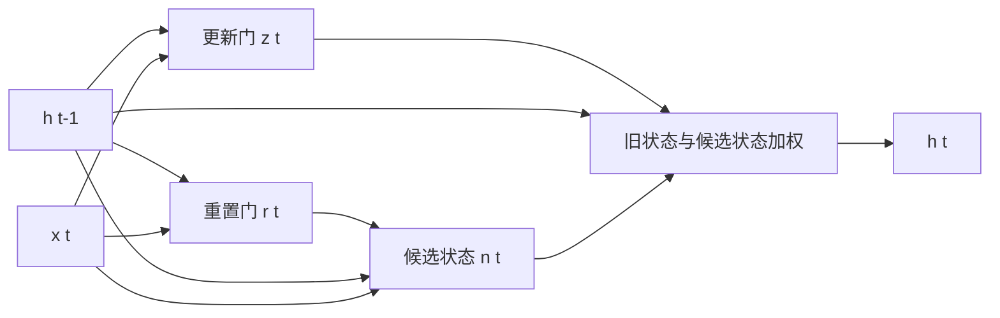

# GRU 门控循环单元原理、代码与源码解读

门控循环单元（Gated Recurrent Unit，GRU）把 LSTM 的输入门、遗忘门和细胞状态进一步简化，只保留更新门、重置门和一个隐藏状态。它不是“小号 LSTM”的固定替代品，而是在参数量、速度和表达能力之间做了另一种选择。

## 1. GRU 的核心计算

PyTorch 采用以下计算形式：

$$
r_t=\sigma(W_{ir}x_t+b_{ir}+W_{hr}h_{t-1}+b_{hr})
$$

$$
z_t=\sigma(W_{iz}x_t+b_{iz}+W_{hz}h_{t-1}+b_{hz})
$$

$$
n_t=\tanh(W_{in}x_t+b_{in}+r_t\odot(W_{hn}h_{t-1}+b_{hn}))
$$

$$
h_t=(1-z_t)\odot n_t+z_t\odot h_{t-1}
$$

| 符号 | 名称 | 直观作用 |
| --- | --- | --- |
| $r_t$ | 重置门 | 生成候选状态时参考多少旧状态 |
| $z_t$ | 更新门 | 最终状态中保留多少旧状态 |
| $n_t$ | 候选状态 | 当前输入与重置后的历史产生的新内容 |
| $h_t$ | 隐藏状态 | 在旧状态与候选状态之间逐元素插值 |

当 $z_t\approx1$ 时，$h_t\approx h_{t-1}$，记忆被保留；当 $z_t\approx0$ 时，模型主要采用候选状态 $n_t$。



## 2. GRU 与 LSTM 的对应关系

| 对比项 | LSTM | GRU |
| --- | --- | --- |
| 状态 | $h_t$ 和 $c_t$ | 只有 $h_t$ |
| 门/候选分支 | 4 组：$i,f,g,o$ | 3 组：$r,z,n$ |
| 单层权重规模 | 约 $4H(D+H)$ | 约 $3H(D+H)$ |
| 状态控制 | 写入、遗忘、输出分开 | 更新门同时协调保留与写入 |
| 常见特点 | 控制更细，参数更多 | 结构更简洁，通常训练/推理更快 |

没有理论保证哪一个必然更准确。数据量较小或延迟敏感时先试 GRU；需要更强状态控制、已有成熟 LSTM 基线时再比较 LSTM。最终要用同样的数据划分、隐藏维度预算和训练策略做验证。

## 3. PyTorch API 与形状

```python
import torch
from torch import nn

x = torch.randn(8, 20, 12)  # [B=8, T=20, D=12]
gru = nn.GRU(
    input_size=12,
    hidden_size=32,
    num_layers=2,
    batch_first=True,
    dropout=0.2,
    bidirectional=False,
)

output, h_n = gru(x)
print(output.shape)  # [8, 20, 32]
print(h_n.shape)     # [2, 8, 32]
```

与 LSTM 不同，GRU 没有 `c_n`。单层单向参数按 `r, z, n` 顺序拼接：

```text
weight_ih_l0: [3H, D]
weight_hh_l0: [3H, H]
bias_ih_l0:   [3H]
bias_hh_l0:   [3H]
```

## 4. 从零实现并对齐 `nn.GRUCell`

```python
import math
import torch
from torch import nn
import torch.nn.functional as F

class GRUCellFromScratch(nn.Module):
    def __init__(self, input_size, hidden_size):
        super().__init__()
        self.input_size = input_size
        self.hidden_size = hidden_size
        self.weight_ih = nn.Parameter(torch.empty(3 * hidden_size, input_size))
        self.weight_hh = nn.Parameter(torch.empty(3 * hidden_size, hidden_size))
        self.bias_ih = nn.Parameter(torch.empty(3 * hidden_size))
        self.bias_hh = nn.Parameter(torch.empty(3 * hidden_size))
        self.reset_parameters()

    def reset_parameters(self):
        bound = 1 / math.sqrt(self.hidden_size)
        for parameter in self.parameters():
            nn.init.uniform_(parameter, -bound, bound)

    def forward(self, x_t, h_prev):
        # 两次矩阵乘法分别得到输入项和循环状态项
        gates_x = F.linear(x_t, self.weight_ih, self.bias_ih)
        gates_h = F.linear(h_prev, self.weight_hh, self.bias_hh)

        # PyTorch 的固定顺序：reset、update、new
        x_r, x_z, x_n = gates_x.chunk(3, dim=1)
        h_r, h_z, h_n = gates_h.chunk(3, dim=1)

        reset_gate = torch.sigmoid(x_r + h_r)
        update_gate = torch.sigmoid(x_z + h_z)
        new_gate = torch.tanh(x_n + reset_gate * h_n)
        h_t = (1 - update_gate) * new_gate + update_gate * h_prev
        return h_t

torch.manual_seed(0)
mine = GRUCellFromScratch(5, 7)
official = nn.GRUCell(5, 7)

with torch.no_grad():
    official.weight_ih.copy_(mine.weight_ih)
    official.weight_hh.copy_(mine.weight_hh)
    official.bias_ih.copy_(mine.bias_ih)
    official.bias_hh.copy_(mine.bias_hh)

x_t = torch.randn(3, 5)
h_0 = torch.randn(3, 7)
print(torch.allclose(mine(x_t, h_0), official(x_t, h_0), atol=1e-6))  # True
```

### 4.1 为什么输入项和隐藏项没有立刻相加

重置门要作用在候选状态的 hidden affine 结果上：

```python
new_gate = tanh(x_n + reset_gate * h_n)
```

如果先执行 `gates_x + gates_h` 再统一切分，候选分支就失去了在正确位置应用 reset gate 的机会。实现门控网络时，公式中乘法发生在矩阵变换之前还是之后，会直接影响与框架是否一致。

### 4.2 与原始 GRU 论文公式的细微差异

一种常见原始写法是：

$$
n_t=\tanh(W_{in}x_t+b_{in}+W_{hn}(r_t\odot h_{t-1})+b_{hn})
$$

PyTorch 为了实现效率，将重置门放在 hidden affine 之后：

$$
n_t=\tanh(W_{in}x_t+b_{in}+r_t\odot(W_{hn}h_{t-1}+b_{hn}))
$$

矩阵乘法与逐元素乘法一般不可交换，所以两式并不严格等价。阅读论文、复现仓库和加载权重时必须确认采用哪一种变体。

## 5. 展开完整序列

```python
class GRUFromScratch(nn.Module):
    def __init__(self, input_size, hidden_size):
        super().__init__()
        self.hidden_size = hidden_size
        self.cell = GRUCellFromScratch(input_size, hidden_size)

    def forward(self, x, h=None):
        # x: [B, T, D]
        batch_size, seq_len, _ = x.shape
        if h is None:
            h = x.new_zeros(batch_size, self.hidden_size)

        outputs = []
        for t in range(seq_len):
            h = self.cell(x[:, t], h)
            outputs.append(h)
        return torch.stack(outputs, dim=1), h

model = GRUFromScratch(input_size=6, hidden_size=10)
output, h_n = model(torch.randn(4, 15, 6))
print(output.shape)  # [4, 15, 10]
print(h_n.shape)     # [4, 10]
```

这一实现用于学习和单元测试。正式训练应优先使用 `nn.GRU` 的融合后端。

## 6. 用 GRU 预测正弦序列的下一个值

这是一个最小回归案例：输入连续 30 个采样点，预测下一个点。

```python
import math
import torch
from torch import nn
from torch.utils.data import DataLoader, TensorDataset

torch.manual_seed(42)
points = torch.linspace(0, 80 * math.pi, 8000)
signal = torch.sin(points) + 0.05 * torch.randn_like(points)
window = 30

features = torch.stack([signal[i:i + window] for i in range(len(signal) - window)])
targets = signal[window:]
features = features.unsqueeze(-1)  # [N, T, 1]
targets = targets.unsqueeze(-1)    # [N, 1]

# 时间序列按时间切分，避免未来样本进入训练集
split = int(0.8 * len(features))
train_loader = DataLoader(
    TensorDataset(features[:split], targets[:split]),
    batch_size=128,
    shuffle=True,
)
test_x, test_y = features[split:], targets[split:]

class GRURegressor(nn.Module):
    def __init__(self, hidden_size=32):
        super().__init__()
        self.gru = nn.GRU(1, hidden_size, batch_first=True)
        self.head = nn.Linear(hidden_size, 1)

    def forward(self, x):
        _, h_n = self.gru(x)
        return self.head(h_n[-1])

device = torch.device("cuda" if torch.cuda.is_available() else "cpu")
model = GRURegressor().to(device)
optimizer = torch.optim.Adam(model.parameters(), lr=1e-3)
criterion = nn.MSELoss()

for epoch in range(10):
    model.train()
    for x_batch, y_batch in train_loader:
        x_batch, y_batch = x_batch.to(device), y_batch.to(device)
        optimizer.zero_grad()
        loss = criterion(model(x_batch), y_batch)
        loss.backward()
        nn.utils.clip_grad_norm_(model.parameters(), max_norm=1.0)
        optimizer.step()

model.eval()
with torch.no_grad():
    prediction = model(test_x.to(device)).cpu()
    print("test mse:", criterion(prediction, test_y).item())
```

这个任务用于验证数据流，不代表真实时间序列评估。真实项目还要避免滑窗重叠造成的泄漏，建立朴素基线（例如直接用最后一个值），并使用滚动验证。

## 7. 参数量公平比较

同样的 `input_size=D` 和 `hidden_size=H` 下，忽略 bias：

$$
\text{LSTM params}\approx4H(D+H)
$$

$$
\text{GRU params}\approx3H(D+H)
$$

但比较模型时只设相同 hidden size 不一定公平，因为两者参数预算不同。可以写函数实际统计：

```python
def count_trainable_parameters(model):
    return sum(p.numel() for p in model.parameters() if p.requires_grad)

print("LSTM:", count_trainable_parameters(nn.LSTM(32, 64, batch_first=True)))
print("GRU: ", count_trainable_parameters(nn.GRU(32, 64, batch_first=True)))
```

严谨实验可以同时报告同隐藏维度和近似同参数量两种结果。

## 8. PyTorch GRU 源码调用链

```text
nn.GRU.forward(input, hx)
  ├─ 判断普通 Tensor 或 PackedSequence
  ├─ 初始化/排列 hidden state
  ├─ 检查 input、hx 和 batch 大小
  └─ 调用底层序列 GRU 算子并传入 _flat_weights
      └─ CPU/CUDA 后端（满足条件时走融合实现）

nn.GRUCell.forward(input, hx)
  ├─ 支持无 batch 的一维输入并临时补维
  └─ 调用单时间步 GRU cell 算子
```

和 LSTM 一样，`nn.GRU` 并不是在 Python 里逐时间步调用 `GRUCell`。模块层负责参数和输入组织，底层完成高性能序列计算。

可以检查门的布局：

```python
gru = nn.GRU(input_size=5, hidden_size=7, batch_first=True)
for name, parameter in gru.named_parameters():
    print(name, tuple(parameter.shape))

# 将输入权重按 reset、update、new 切开
w_ir, w_iz, w_in = gru.weight_ih_l0.chunk(3, dim=0)
print(w_ir.shape, w_iz.shape, w_in.shape)  # 都是 [7, 5]
```

查看本机 Python 层源码：

```python
import inspect
print(inspect.getsource(nn.GRU.forward))
print(inspect.getsource(nn.GRUCell.forward))
```

## 9. 完整案例：根据温度与振动趋势判断设备风险

假设设备每分钟上报温度和振动两个已经标准化的特征。每条记录含连续 6 分钟：持续上升标记为风险 1，稳定波动标记为正常 0。这里既能看到输入时序矩阵，也能直接复算 GRU 第一个时间步的 reset/update gate。

```python
import torch
from torch import nn
import torch.nn.functional as F

torch.manual_seed(23)

def make_sensor_data():
    sequences, labels = [], []
    minute = torch.arange(6, dtype=torch.float32)
    for index in range(8):
        is_risk = index < 4
        if is_risk:
            # 温度与振动都持续上升
            temperature = -0.4 + 0.16 * minute + 0.02 * index
            vibration = -0.3 + 0.14 * minute + 0.01 * index
        else:
            # 正常设备只在稳定值附近小幅波动
            temperature = -0.2 + 0.01 * minute + 0.02 * (index - 4)
            vibration = -0.1 + torch.tensor([0, .02, -.01, .01, 0, -.02])
        sequences.append(torch.stack([temperature, vibration], dim=1))
        labels.append(int(is_risk))
    return torch.stack(sequences), torch.tensor(labels)

class SensorGRU(nn.Module):
    def __init__(self, hidden_size=5):
        super().__init__()
        self.gru = nn.GRU(input_size=2, hidden_size=hidden_size,
                          batch_first=True)
        self.head = nn.Linear(hidden_size, 2)

    def forward(self, x, return_trace=False):
        output, h_n = self.gru(x)        # output: [B,6,5]
        logits = self.head(h_n[-1])      # [B,2]
        return (logits, output, h_n) if return_trace else logits

sequences, labels = make_sensor_data()
model = SensorGRU()
optimizer = torch.optim.SGD(model.parameters(), lr=0.4)

# ----- 训练前的风险样本和随机权重 -----
logits, output, h_n = model(sequences[:1], return_trace=True)
probabilities = logits.softmax(dim=1)
loss = F.cross_entropy(logits, labels[:1])
weight_before = model.gru.weight_ih_l0.detach().clone()

print("风险样本 [6分钟, 温度/振动]:\n", sequences[0])
print("随机 weight_ih_l0 [3H,2]:\n", weight_before)
print("6 个时间步的隐藏状态:\n", output[0])
print("初始概率 [正常,风险]:", probabilities[0])
print("CE loss 与 -log(p风险):", loss.item(),
      -torch.log(probabilities[0, 1]).item())

# ----- 用官方权重手算第一个时间步 -----
hidden_size = model.gru.hidden_size
h_0 = torch.zeros(1, hidden_size)
gates_x = F.linear(
    sequences[:1, 0], model.gru.weight_ih_l0, model.gru.bias_ih_l0
)
gates_h = F.linear(
    h_0, model.gru.weight_hh_l0, model.gru.bias_hh_l0
)
x_r, x_z, x_n = gates_x.chunk(3, dim=1)
h_r, h_z, h_n_raw = gates_h.chunk(3, dim=1)
reset_gate = torch.sigmoid(x_r + h_r)
update_gate = torch.sigmoid(x_z + h_z)
new_gate = torch.tanh(x_n + reset_gate * h_n_raw)
h_1 = (1 - update_gate) * new_gate + update_gate * h_0

print("第 1 分钟 reset gate:", reset_gate)
print("第 1 分钟 update gate:", update_gate)
print("手算 h_1 与官方输出一致:",
      torch.allclose(h_1, output[:, 0], atol=1e-6))

# ----- 第一次反向传播：观察循环权重梯度和实际变化 -----
optimizer.zero_grad()
loss.backward()
print("weight_ih_l0.grad:\n", model.gru.weight_ih_l0.grad)
print("backward 后权重未变:", torch.equal(
    weight_before, model.gru.weight_ih_l0.detach()
))
gradient_first_step = model.gru.weight_ih_l0.grad.detach().clone()
optimizer.step()
weight_after_one_step = model.gru.weight_ih_l0.detach().clone()
print("权重变化等于 -lr×grad:", torch.allclose(
    weight_after_one_step - weight_before,
    -0.4 * gradient_first_step,
    atol=1e-6,
))
print("第一次更新的变化范数:",
      (weight_after_one_step - weight_before).norm().item())

# ----- 八条时序继续训练 80 轮 -----
for epoch in range(1, 81):
    optimizer.zero_grad()
    batch_logits = model(sequences)
    batch_loss = F.cross_entropy(batch_logits, labels)
    batch_loss.backward()
    nn.utils.clip_grad_norm_(model.parameters(), 1.0)
    optimizer.step()

    if epoch in {1, 5, 10, 20, 40, 80}:
        accuracy = (model(sequences).argmax(1) == labels).float().mean()
        print(f"epoch={epoch:02d}, loss={batch_loss.item():.4f}, "
              f"acc={accuracy.item():.3f}")

with torch.no_grad():
    print("最终 [正常,风险] 概率:\n", model(sequences).softmax(dim=1))
print("训练前后 weight_ih_l0 总变化:",
      (model.gru.weight_ih_l0.detach() - weight_before).norm().item())
```

风险标签的损失是 $-\log p(\text{风险})$。分类头产生的梯度回到 $h_6$，再沿更新门形成的加法路径传播到更早分钟。训练后，模型不只是为“高温”赋权，还能利用连续上升趋势；这正是时序模型相对单点阈值的意义。

这个小数据集用于把所有矩阵打印出来。真实预测必须使用独立设备和未来时间段验证，并与规则阈值、最后一点特征、滑动平均等简单基线比较，否则训练集达到 100% 没有实际说服力。

## 10. 何时选择 GRU、LSTM 或 Transformer

| 场景 | 可优先尝试 |
| --- | --- |
| 中小数据、流式输入、低延迟 | GRU |
| 已知需要更细粒度记忆控制 | LSTM |
| 大规模数据、并行训练、全局依赖 | Transformer |
| 极长连续序列且资源受限 | 先比较 GRU/LSTM、卷积或高效注意力基线 |

模型选择不能只看架构名称。输入窗口、特征工程、数据泄漏和评价指标往往比 LSTM/GRU 的差异更影响结果。

## 11. 常见错误

- 按 LSTM 的 `i,f,g,o` 顺序切 GRU 参数；GRU 应为 `r,z,n`。
- 把原论文和 PyTorch 的 reset gate 位置视为完全等价。
- 误以为 `output[:, -1]` 在 padding/双向场景总是最终有效状态。
- 做多步滚动预测时，训练只看真实历史，推理却不断输入自身误差，导致误差累积。
- 比较 GRU 和 LSTM 时没有控制参数量、随机种子和训练预算。

下一篇 [Transformer](./Transformer原理与源码解读.md) 会取消时间步递归，让所有 Token 通过注意力直接建立关系。

[[toc]]
