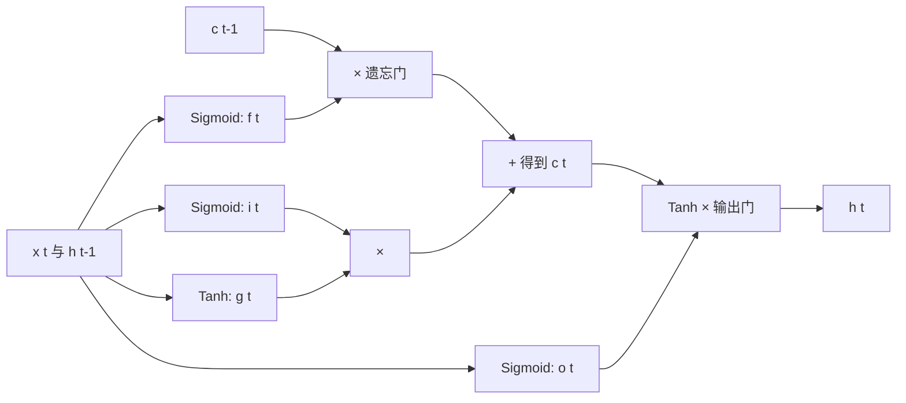

# LSTM 长短期记忆网络原理、代码与源码解读

长短期记忆网络（Long Short-Term Memory，LSTM）是带门控机制的循环神经网络。它通过独立的细胞状态 $c_t$ 建立一条更平稳的信息通道，让模型决定旧信息保留多少、新信息写入多少、当前输出暴露多少。

::: danger 注意：时间序列最容易发生“看见未来”的数据泄漏
不能随机拆散同一设备或同一用户的相邻时间窗，也不能用验证期数据计算归一化均值。Padding 长度、真实长度和 batch 顺序必须同步；否则模型会学习填充值或未来信息。用于故障、健康和安全告警时，LSTM 输出只能作为信号之一，不能替代硬件保护和人工确认。
:::

## 1. 普通 RNN 为什么难记住很久以前的信息

普通 RNN 在每个时间步重复：

$$
h_t=\tanh(W_{xh}x_t+W_{hh}h_{t-1}+b)
$$

训练时使用 Through Time 的反向传播（BPTT）。较早时间步的梯度需要反复乘以循环权重和 `tanh` 导数：

$$
\frac{\partial h_t}{\partial h_k}
=\prod_{i=k+1}^{t}\frac{\partial h_i}{\partial h_{i-1}}
$$

若连乘项的范数长期小于 1，梯度逐渐消失；长期大于 1，则可能爆炸。于是模型很难把序列开头的信号传到很远的结尾。梯度裁剪可以缓解爆炸，却不能从结构上解决消失。

## 2. LSTM 的两个状态和四条支路

LSTM 同时传递：

- 隐藏状态 $h_t$：当前时间步对外暴露的表示。
- 细胞状态 $c_t$：更像一条长期记忆通道。

对输入 $x_t$ 和上一步隐藏状态 $h_{t-1}$，标准 LSTM 计算：

$$
i_t=\sigma(W_{ii}x_t+b_{ii}+W_{hi}h_{t-1}+b_{hi})
$$

$$
f_t=\sigma(W_{if}x_t+b_{if}+W_{hf}h_{t-1}+b_{hf})
$$

$$
g_t=\tanh(W_{ig}x_t+b_{ig}+W_{hg}h_{t-1}+b_{hg})
$$

$$
o_t=\sigma(W_{io}x_t+b_{io}+W_{ho}h_{t-1}+b_{ho})
$$

$$
c_t=f_t\odot c_{t-1}+i_t\odot g_t
$$

$$
h_t=o_t\odot\tanh(c_t)
$$

| 符号 | 名称 | 作用 |
| --- | --- | --- |
| $i_t$ | 输入门 | 候选信息写入多少 |
| $f_t$ | 遗忘门 | 旧细胞状态保留多少 |
| $g_t$ | 候选记忆 | 当前输入产生什么新内容 |
| $o_t$ | 输出门 | 细胞状态对外暴露多少 |

Sigmoid 输出在 0 到 1，很适合做软开关；候选内容用 Tanh 限制在 -1 到 1。



LSTM 并不能保证永远记住信息，但 $c_t$ 的更新包含加法通路。若 $f_t$ 接近 1，梯度可以较少衰减地沿细胞状态传播。

## 3. 用 PyTorch 调用 LSTM

```python
import torch
from torch import nn

batch_size = 4
seq_len = 12
input_size = 8
hidden_size = 16

x = torch.randn(batch_size, seq_len, input_size)
lstm = nn.LSTM(
    input_size=input_size,
    hidden_size=hidden_size,
    num_layers=2,
    batch_first=True,
    dropout=0.1,       # 只作用在相邻 LSTM 层之间
    bidirectional=False,
)

output, (h_n, c_n) = lstm(x)
print(output.shape)  # [4, 12, 16]：最后一层每个时间步的 h_t
print(h_n.shape)     # [2, 4, 16]：每层最后一个 h
print(c_n.shape)     # [2, 4, 16]：每层最后一个 c
```

这里最容易混淆的是 `output[:, -1]` 和 `h_n[-1]`。单向、无 padding 时两者相同；双向或变长 padding 时，不能简单认为它们总是同一个语义位置。

### 3.1 参数形状

单层单向 LSTM 的主要参数为：

```text
weight_ih_l0: [4 * hidden_size, input_size]
weight_hh_l0: [4 * hidden_size, hidden_size]
bias_ih_l0:   [4 * hidden_size]
bias_hh_l0:   [4 * hidden_size]
```

四个门按照 `i, f, g, o` 拼接，一次矩阵乘法即可同时算出四组预激活值。这比为每个门分别发起矩阵乘法更高效。

## 4. 从零实现一个 LSTM Cell

下面的 `LSTMCellFromScratch` 与 PyTorch 使用相同的门顺序和参数布局：

```python
import math
import torch
from torch import nn
import torch.nn.functional as F

class LSTMCellFromScratch(nn.Module):
    def __init__(self, input_size, hidden_size):
        super().__init__()
        self.input_size = input_size
        self.hidden_size = hidden_size
        self.weight_ih = nn.Parameter(torch.empty(4 * hidden_size, input_size))
        self.weight_hh = nn.Parameter(torch.empty(4 * hidden_size, hidden_size))
        self.bias_ih = nn.Parameter(torch.empty(4 * hidden_size))
        self.bias_hh = nn.Parameter(torch.empty(4 * hidden_size))
        self.reset_parameters()

    def reset_parameters(self):
        bound = 1 / math.sqrt(self.hidden_size)
        for parameter in self.parameters():
            nn.init.uniform_(parameter, -bound, bound)

    def forward(self, x_t, state):
        h_prev, c_prev = state

        # 一次计算得到四个门的预激活值，形状 [B, 4H]
        gates = F.linear(x_t, self.weight_ih, self.bias_ih)
        gates = gates + F.linear(h_prev, self.weight_hh, self.bias_hh)

        # PyTorch 的固定切分顺序：input、forget、candidate、output
        i_raw, f_raw, g_raw, o_raw = gates.chunk(4, dim=1)
        i_t = torch.sigmoid(i_raw)
        f_t = torch.sigmoid(f_raw)
        g_t = torch.tanh(g_raw)
        o_t = torch.sigmoid(o_raw)

        c_t = f_t * c_prev + i_t * g_t
        h_t = o_t * torch.tanh(c_t)
        return h_t, c_t
```

### 4.1 与官方 `nn.LSTMCell` 对齐验证

```python
torch.manual_seed(0)
mine = LSTMCellFromScratch(input_size=5, hidden_size=7)
official = nn.LSTMCell(input_size=5, hidden_size=7)

with torch.no_grad():
    official.weight_ih.copy_(mine.weight_ih)
    official.weight_hh.copy_(mine.weight_hh)
    official.bias_ih.copy_(mine.bias_ih)
    official.bias_hh.copy_(mine.bias_hh)

x_t = torch.randn(3, 5)
h_0 = torch.randn(3, 7)
c_0 = torch.randn(3, 7)
h_mine, c_mine = mine(x_t, (h_0, c_0))
h_torch, c_torch = official(x_t, (h_0, c_0))

print(torch.allclose(h_mine, h_torch, atol=1e-6))  # True
print(torch.allclose(c_mine, c_torch, atol=1e-6))  # True
```

这个测试比“代码能运行”更有说服力：同一参数和输入下输出一致，说明公式、门顺序和偏置都对齐。

## 5. 从 Cell 展开成完整序列

`LSTMCell` 只处理一个时间步。完整单层 LSTM 要沿时间维循环，并收集输出：

```python
class LSTMFromScratch(nn.Module):
    def __init__(self, input_size, hidden_size):
        super().__init__()
        self.hidden_size = hidden_size
        self.cell = LSTMCellFromScratch(input_size, hidden_size)

    def forward(self, x, state=None):
        # x: [B, T, D]
        batch_size, seq_len, _ = x.shape
        if state is None:
            h_t = x.new_zeros(batch_size, self.hidden_size)
            c_t = x.new_zeros(batch_size, self.hidden_size)
        else:
            h_t, c_t = state

        outputs = []
        for t in range(seq_len):
            h_t, c_t = self.cell(x[:, t, :], (h_t, c_t))
            outputs.append(h_t)

        # [T 个 [B,H]] -> [B,T,H]
        return torch.stack(outputs, dim=1), (h_t, c_t)

model = LSTMFromScratch(5, 7)
output, (h_n, c_n) = model(torch.randn(3, 11, 5))
print(output.shape, h_n.shape, c_n.shape)
```

Python 循环清楚但慢。生产代码优先用 `nn.LSTM`，框架会尽可能走融合实现，减少 kernel 启动和中间结果开销。

## 6. 一个完整的序列分类器

下面生成一批序列：若前半段均值大于后半段均值则标签为 1。模型必须综合多个时间步，而不能只看单个点。

```python
import torch
from torch import nn
from torch.utils.data import DataLoader, TensorDataset

torch.manual_seed(42)
n, seq_len = 3000, 30
x = torch.randn(n, seq_len, 1)
y = (x[:, :15].mean(dim=1) > x[:, 15:].mean(dim=1)).long().squeeze(1)
loader = DataLoader(TensorDataset(x, y), batch_size=64, shuffle=True)

class LSTMClassifier(nn.Module):
    def __init__(self, input_size=1, hidden_size=32, num_classes=2):
        super().__init__()
        self.lstm = nn.LSTM(input_size, hidden_size, batch_first=True)
        self.classifier = nn.Linear(hidden_size, num_classes)

    def forward(self, x):
        _, (h_n, _) = self.lstm(x)
        last_layer_hidden = h_n[-1]       # [B, H]
        return self.classifier(last_layer_hidden)

device = torch.device("cuda" if torch.cuda.is_available() else "cpu")
model = LSTMClassifier().to(device)
optimizer = torch.optim.Adam(model.parameters(), lr=1e-3)
criterion = nn.CrossEntropyLoss()

for epoch in range(15):
    model.train()
    correct = total = 0
    for features, targets in loader:
        features, targets = features.to(device), targets.to(device)
        optimizer.zero_grad()
        logits = model(features)
        loss = criterion(logits, targets)
        loss.backward()
        nn.utils.clip_grad_norm_(model.parameters(), 1.0)
        optimizer.step()
        correct += (logits.argmax(1) == targets).sum().item()
        total += targets.numel()
    print(f"epoch={epoch + 1:02d}, acc={correct / total:.3f}")
```

`h_n[-1]` 取最后一层隐藏状态。若是双向 LSTM，`h_n` 第一维是 `num_layers * 2`，通常需要拼接同一层的正向和反向状态，不能只取 `[-1]`。

## 7. 变长序列和 Padding

把不同长度序列补齐后，若直接取 `output[:, -1]`，短序列取到的是 padding 位置。可以使用 `pack_padded_sequence` 跳过 padding：

```python
from torch.nn.utils.rnn import pack_padded_sequence

class VariableLengthClassifier(nn.Module):
    def __init__(self, input_size, hidden_size, num_classes):
        super().__init__()
        self.lstm = nn.LSTM(input_size, hidden_size, batch_first=True)
        self.fc = nn.Linear(hidden_size, num_classes)

    def forward(self, padded_x, lengths):
        packed = pack_padded_sequence(
            padded_x,
            lengths.cpu(),             # 部分版本要求 lengths 位于 CPU
            batch_first=True,
            enforce_sorted=False,
        )
        _, (h_n, _) = self.lstm(packed)
        return self.fc(h_n[-1])
```

若需要每个时间步的输出，可再用 `pad_packed_sequence` 还原。文本分类也可用 mask 做池化，核心是不能让 padding 被当成真实数据。

## 8. 双向、多层和 Dropout

- **双向 LSTM** 同时从左到右和从右到左读取序列，适合能够看到完整上下文的任务。
- **因果预测不能用双向**，否则模型偷看未来数据，线上评估会虚高。
- `num_layers > 1` 时，上一层每个时间步的输出成为下一层输入。
- `nn.LSTM(..., dropout=p)` 的 dropout 作用在层与层之间；只有一层时不会生效。

时间序列切分必须按时间先后，不能把未来窗口随机分到训练集、过去窗口分到测试集。

::: danger 注意：双向 LSTM 不能用于实时因果预测
双向结构的反向分支使用“未来”Token；离线文本分类可以这样做，但实时故障预测、交易或控制系统当下拿不到未来数据。评测必须模拟真实到达顺序，并明确每个特征在预测时刻是否已经产生。
:::

## 9. PyTorch LSTM 源码调用链

### 9.1 `nn.LSTM` 与 `nn.LSTMCell` 的差别

```text
nn.LSTM.forward(input, hx)
  ├─ 校验输入、hidden/cell 形状
  ├─ 处理 PackedSequence 与 batch_first
  ├─ 准备扁平化权重列表 _flat_weights
  └─ 调用底层序列 LSTM 算子
      └─ CPU/CUDA 后端（满足条件时使用融合内核）

nn.LSTMCell.forward(input, hx)
  ├─ 必要时补 batch 维
  └─ 调用单步 LSTM cell 算子
```

`nn.LSTM` 不会在 Python 层反复调用 `nn.LSTMCell.forward`。二者数学公式一致，但前者可以把整个序列交给优化后的底层实现。

### 9.2 `_flat_weights` 为什么存在

多层、双向 LSTM 有很多 `weight_ih_l{k}`、`weight_hh_l{k}` 和 bias。模块对外保留这些易理解的名字，同时组织一份扁平权重引用交给底层算子，以便后端高效访问。不要在训练循环里随意替换这些参数对象；若要加载权重，使用 `load_state_dict`。

### 9.3 怎样查看本机真实源码

```python
import inspect
import torch.nn as nn

print(inspect.getsource(nn.LSTM.forward))
print(inspect.getsource(nn.LSTMCell.forward))
```

Python 源码中看到的底层函数可能没有可读的 Python 实现，因为真正计算位于 PyTorch 的 C++/CUDA 代码。阅读时重点核对：输入形状校验、初始状态创建、PackedSequence 分支、权重列表，以及返回维度整理。

## 10. 常见错误

- 把输入写成 `[T, B, D]`，却设置了 `batch_first=True`。
- 混淆 `output`、`h_n`、`c_n`，尤其在多层双向场景。
- 对补齐序列直接取最后位置，得到 padding 的表示。
- 将训练和测试窗口随机打散，造成未来信息泄漏。
- 长序列训练不裁剪梯度，出现 loss/gradient NaN。
- 每个 batch 都把 hidden state 延续到下一批，却没有 `detach()`，导致计算图不断增长。

状态跨批次传递时应显式控制：

```python
h, c = h.detach(), c.detach()
```

但多数相互独立的样本 batch 应直接使用零初始状态，而不是跨 batch 传递。

## 11. 完整案例：用中文短句训练情感分类器

下面不是只调用一次 `nn.LSTM`，而是跟踪文本“电影 真 好”从 Token ID、随机词向量、门控状态到分类损失的完整路径。八条短句长度都为 3，方便把注意力放在矩阵变化上；真实项目应使用更大的语料、验证集和变长序列处理。

```python
import torch
from torch import nn
import torch.nn.functional as F

torch.manual_seed(11)

texts = [
    "电影 真 好", "服务 很 好", "体验 真 棒", "产品 很 满意",
    "电影 真 差", "服务 很 差", "体验 真 糟", "产品 很 失望",
]
labels = torch.tensor([1, 1, 1, 1, 0, 0, 0, 0])  # 1=正面，0=负面

vocab = {"<unk>": 0}
for text in texts:
    for word in text.split():
        if word not in vocab:
            vocab[word] = len(vocab)

token_ids = torch.tensor([
    [vocab[word] for word in text.split()]
    for text in texts
])

class SentimentLSTM(nn.Module):
    def __init__(self, vocab_size, embedding_dim=4, hidden_size=6):
        super().__init__()
        self.embedding = nn.Embedding(vocab_size, embedding_dim)
        self.lstm = nn.LSTM(embedding_dim, hidden_size, batch_first=True)
        self.head = nn.Linear(hidden_size, 2)

    def forward(self, tokens, return_trace=False):
        embedded = self.embedding(tokens)             # [B,3,4]
        output, (h_n, c_n) = self.lstm(embedded)      # output: [B,3,6]
        logits = self.head(h_n[-1])                   # [B,2]
        if return_trace:
            return logits, embedded, output, h_n, c_n
        return logits

model = SentimentLSTM(len(vocab))
optimizer = torch.optim.SGD(model.parameters(), lr=0.3)

# ----- 训练前：文本如何变为随机矩阵 -----
one_text = token_ids[:1]
one_label = labels[:1]
logits, embedded, output, h_n, c_n = model(one_text, return_trace=True)
probabilities = logits.softmax(dim=1)
loss = F.cross_entropy(logits, one_label)

print("词表:", vocab)
print("文本 Token ID:", one_text)                    # 例如 [电影, 真, 好]
print("训练前的 3×4 词向量矩阵:\n", embedded[0])
print("每个时间步的 h_t:\n", output[0])
print("最后的 c_t:", c_n[-1, 0])
print("logits / probabilities:", logits[0], probabilities[0])
print("loss:", loss.item())
print("手算 CE:", -torch.log(probabilities[0, one_label.item()]).item())

# 用官方参数复算第一个 Token 的四个门。
hidden_size = model.lstm.hidden_size
h_0 = torch.zeros(1, hidden_size)
c_0 = torch.zeros(1, hidden_size)
gate_raw = F.linear(
    embedded[:, 0], model.lstm.weight_ih_l0, model.lstm.bias_ih_l0
) + F.linear(
    h_0, model.lstm.weight_hh_l0, model.lstm.bias_hh_l0
)
i_raw, f_raw, g_raw, o_raw = gate_raw.chunk(4, dim=1)
i_1, f_1 = i_raw.sigmoid(), f_raw.sigmoid()
g_1, o_1 = g_raw.tanh(), o_raw.sigmoid()
c_1 = f_1 * c_0 + i_1 * g_1
h_1 = o_1 * c_1.tanh()
print("第一个 Token 的输入门:", i_1)
print("第一个 Token 的遗忘门:", f_1)
print("手算 h_1 与官方 output[:,0] 一致:",
      torch.allclose(h_1, output[:, 0], atol=1e-6))

# ----- 第一次反向传播和参数更新 -----
good_id = vocab["好"]
embedding_before = model.embedding.weight[good_id].detach().clone()
recurrent_before = model.lstm.weight_ih_l0.detach().clone()

optimizer.zero_grad()
loss.backward()
print("“好”的词向量梯度:", model.embedding.weight.grad[good_id])
print("输入门权重梯度的一小块:\n",
      model.lstm.weight_ih_l0.grad[:hidden_size, :])
print("backward 后参数仍未改变:", torch.equal(
    recurrent_before, model.lstm.weight_ih_l0.detach()
))

optimizer.step()
print("“好”的词向量更新前:", embedding_before)
print("“好”的词向量更新后:", model.embedding.weight[good_id].detach())
print("实际变化是否等于 -lr×grad:", torch.allclose(
    model.embedding.weight[good_id].detach() - embedding_before,
    -0.3 * model.embedding.weight.grad[good_id],
    atol=1e-6,
))

# ----- 八条文本继续训练 60 轮 -----
for epoch in range(1, 61):
    optimizer.zero_grad()
    batch_logits = model(token_ids)
    batch_loss = F.cross_entropy(batch_logits, labels)
    batch_loss.backward()
    nn.utils.clip_grad_norm_(model.parameters(), 1.0)
    optimizer.step()

    if epoch in {1, 5, 10, 20, 40, 60}:
        accuracy = (model(token_ids).argmax(1) == labels).float().mean()
        print(f"epoch={epoch:02d}, loss={batch_loss.item():.4f}, "
              f"acc={accuracy.item():.3f}")

model.eval()
with torch.no_grad():
    final_probabilities = model(token_ids).softmax(dim=1)
print("训练后每句话的 [负面, 正面] 概率:\n", final_probabilities)
print("循环输入权重总变化:",
      (model.lstm.weight_ih_l0 - recurrent_before).norm().item())
```

这个案例中，正面样本的交叉熵为 $-\log p(\text{正面})$。梯度先从分类头回到最后的 $h_3$，再沿 LSTM 的输出门、细胞状态和前三个时间步传播，最后到达“电影”“真”“好”的词向量。于是词向量不是固定字典，它也会被任务损失调整。

需要特别观察两个时间点：`loss.backward()` 之后只有 `.grad` 发生变化；`optimizer.step()` 之后 `embedding.weight`、`weight_ih_l0`、`weight_hh_l0` 和分类头才一起更新。多轮后“好/棒/满意”和“差/糟/失望”会被推向有利于区分类别的表示，但八条样本只能用于理解机制，不能代表真实泛化能力。

## 12. LSTM 何时仍值得使用

LSTM 的时间步依赖限制了并行训练，却具有状态紧凑、流式推理自然、标准注意力那样的二次复杂度不存在等特点。小型时间序列、边缘设备、实时流数据和数据量有限的任务中，它仍是重要基线。

下一篇 [GRU](./GRU门控循环单元原理与源码解读.md) 会用两个门完成相似目标，并解释它与 LSTM 的源码布局差异。

[[toc]]
