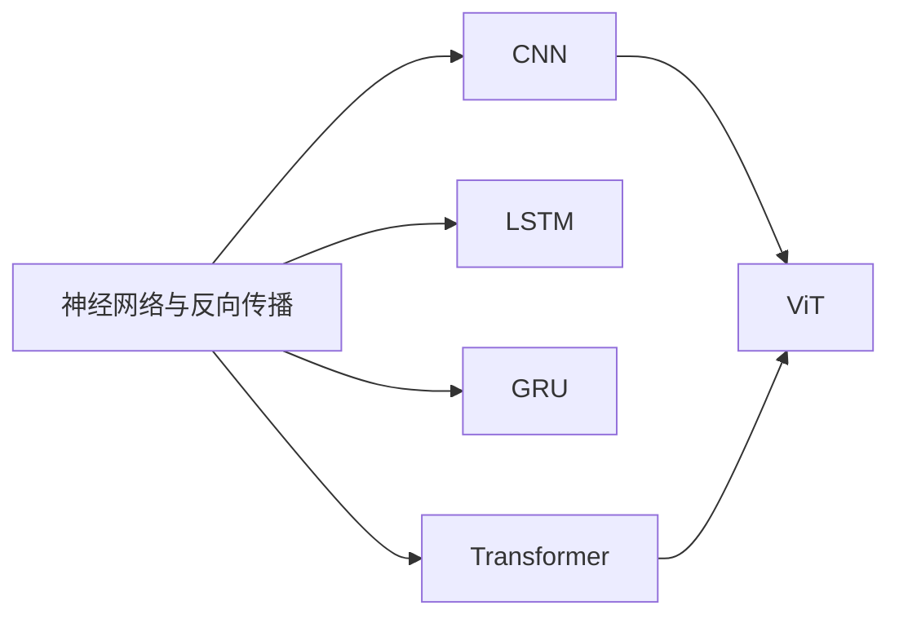

# AI 基础：从反向传播到视觉 Transformer

这个专题不只介绍“模型有什么层”，而是沿着 **输入张量 → 数学计算 → PyTorch 实现 → 梯度更新 → 源码调用链** 理解经典神经网络。每篇文章都给出张量形状、核心公式、可运行代码和常见错误，并包含一个会打印初始矩阵、损失、梯度、首次参数变化与多轮训练结果的完整案例。读完后应当能够自己实现一个简化版，而不是只会调用现成 API。

## 学习路线



建议按下面的顺序阅读：

1. [神经网络与反向传播：模型为什么能学习](./神经网络与反向传播.md)：先掌握张量、损失函数、链式法则、自动微分和训练循环。
2. [CNN：让神经网络理解局部空间结构](./CNN卷积神经网络原理与源码解读.md)：掌握卷积、感受野、池化、批归一化和图像分类代码。
3. [LSTM：用门控机制保留长期记忆](./LSTM长短期记忆网络原理与源码解读.md)：理解循环状态、遗忘门、输入门、输出门和时间反向传播。
4. [GRU：更精简的门控循环网络](./GRU门控循环单元原理与源码解读.md)：理解更新门、重置门，以及 GRU 与 LSTM 的取舍。
5. [Transformer：注意力如何替代循环](./Transformer原理与源码解读.md)：从缩放点积注意力开始，实现多头注意力和 Transformer Block。
6. [ViT：把图像变成 Token](./ViT视觉Transformer原理与源码解读.md)：理解图像分块、位置编码、分类 Token，并实现一个小型 ViT。

## 各模型解决什么问题

| 模型 | 核心归纳偏置 | 典型输入 | 适合任务 | 主要限制 |
| --- | --- | --- | --- | --- |
| MLP | 特征之间全连接 | 固定长度向量 | 表格数据、分类头 | 不主动利用空间和时序结构 |
| CNN | 局部连接、权重共享 | 图像、时频图 | 分类、检测、分割 | 建模远距离关系通常需要堆叠多层 |
| LSTM | 循环状态、门控记忆 | 序列 | 时间序列、文本、语音 | 时间步难以完全并行 |
| GRU | 简化的门控循环状态 | 序列 | 中小规模时序任务 | 表达能力与效率需要按任务验证 |
| Transformer | 全局注意力 | Token 序列 | 文本、多模态、长依赖建模 | 标准注意力的时间和显存复杂度为 $O(T^2)$ |
| ViT | 图像 Patch + Transformer | 图像 Patch 序列 | 图像分类、视觉表征 | 数据较少时通常不如带强空间先验的 CNN 稳定 |

“新模型”不等于“所有任务都更好”。数据规模不大、设备资源有限、需要低延迟时，CNN 或 GRU 往往仍然是很好的基线。

## 统一的代码环境

文章示例使用 Python 3.10+ 与 PyTorch 2.x。创建独立环境后安装依赖：

```bash
python -m venv .venv
source .venv/bin/activate
python -m pip install --upgrade pip
python -m pip install torch torchvision
```

如果机器没有 CUDA，代码会自动回退到 CPU。可先运行下面的检查：

```python
import torch

print("PyTorch:", torch.__version__)
print("CUDA available:", torch.cuda.is_available())
print("device:", torch.device("cuda" if torch.cuda.is_available() else "cpu"))
```

不同 PyTorch 版本的内部源码文件可能变化，文章中的“源码调用链”重点解释稳定的职责边界：`nn.Module` 负责参数组织，`torch.nn.functional` 暴露运算接口，ATen/Dispatcher 选择 CPU、CUDA 等实际算子实现。阅读当前环境源码时，应以本机安装版本为准。

## 阅读代码时先盯住形状

本专题统一使用以下符号：

| 符号 | 含义 |
| --- | --- |
| $B$ | batch size，一批样本数 |
| $T$ | sequence length，序列长度 |
| $D$ | embedding/model dimension，特征维度 |
| $H$ | number of heads 或 hidden size，具体见上下文 |
| $C$ | 图像通道数或类别数，具体见上下文 |
| $H_i, W_i$ | 输入图像高度和宽度 |

Transformer 文章默认序列张量为 `[B, T, D]`，CNN/ViT 默认图像张量为 `[B, C, H_i, W_i]`。遇到 `reshape`、`transpose`、`permute` 时，把变化前后的形状写在纸上，通常比反复单步调试更快。

## 如何验证自己真的理解了

每读完一种模型，至少完成四项检查：

- 用自己的话说出它引入了哪一种归纳偏置。
- 不看框架 API，写出一次前向传播的核心公式。
- 对一个随机小张量运行简化实现，确认输出形状和梯度都正确。
- 用 `model.named_parameters()` 解释每组参数服务于哪一步计算。

最后再尝试修改隐藏维度、层数或输入长度。如果一改形状就报错，通常说明还没有真正理清数据在模型中的流动路径。

[[toc]]
