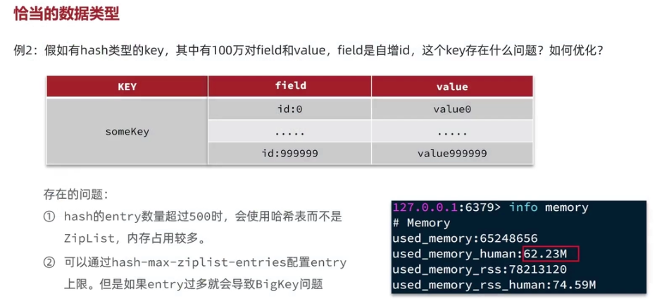
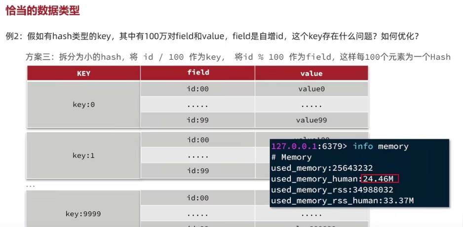
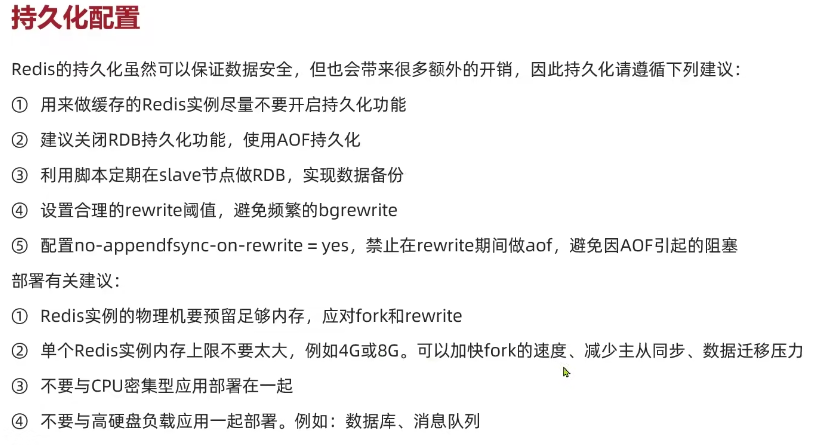
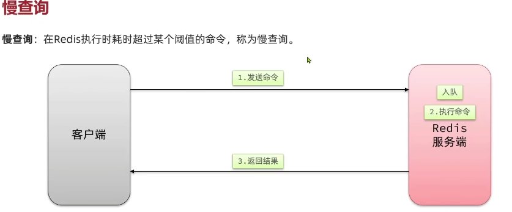

- 图片来源：https://www.bilibili.com/video/BV1cr4y1671t?p=160&vd_source=f52d9488d7d3c21ed33580e4dce1a022

# 1. KEY设计

- 业务名称：数据名：ID =》 login：user：10
- 长度不超过44字节，因为KEY是由STRING保存的，STRING底层编码有INT，
  EMBSTR，RAW三种，EMBSTR在小于44字节时使用，采用连续内存，内存使用小

# 2. 不使用BIG KEY

- 单个KEY的VALUE小于10KB
- 对于集合类型的KEY，建议元素数量小于1000

- [如何处理Redis集群数据倾斜](https://help.aliyun.com/zh/redis/user-guide/deal-with-data-skew-issues)

## 2.1. BIG KEY的问题

- 网络阻塞：BIG KEY 在少量的QPS也会占用大量网络带宽
- 数据倾斜：BIG KEY 使用内存比其他kEY要多很多，无法合理的均衡内存资源分配
- REDIS主线程阻塞：HASH、LIST、SET等运算会耗时
- 反序列化、序列化会使CPU使用率攀升

## 2.2. 合适的数据结构

- 一种应对方式：分片，可以把ID%100，就可以拆分

# 3. 持久化配置

# 4. 慢查询

## 4.1. 设计原则总结

- Key 要有业务语义，但不能过长。
- Value 不要过大，避免形成 BIG KEY。
- 数据结构选择要和访问模式匹配，而不是为了“看起来统一”。

## 4.2. 实践中的高频问题

- 大 key 导致网络阻塞和主线程卡顿。
- 热 key 导致单分片压力过高。
- 反序列化成本过高导致 CPU 飙升。
- 慢查询往往不只是 Redis 慢，还可能是业务侧使用方式有问题。

## 4.3. 落地建议

- 上线前做一次 key 设计评审。
- 对集合类 key 做元素数量限制。
- 对热点 key 做监控与拆分预案。
