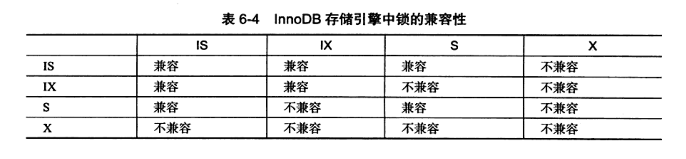

# 1. 锁

## 1.1. 锁的分类

- 行锁：锁定单行或少量记录，适合高并发写入场景。
- 表锁：锁定整张表，粒度大、冲突更明显。
- 意向锁：InnoDB 为了协调行锁和表锁引入的表级标记，用于提高加锁判断效率。

## 1.2. 锁的算法

- 行锁：单行记录上锁
- 间隙锁：锁定一个范围，但不包括本身
- Next-Key锁=行锁+间隙锁（为了应对幻读的问题）

## 1.3. 锁与隔离级别

- `Read Committed` 下，间隙锁使用相对更少，主要解决脏读问题。
- `Repeatable Read` 下，InnoDB 会通过 `Next-Key Lock` 处理幻读。
- `Serializable` 会进一步提高隔离性，但并发性能通常更差。

## 1.4. 事务的四个特性

- 原子性：事务中的操作要么全部成功，要么全部回滚。
- 一致性：事务前后数据要满足业务约束。
- 隔离性：并发事务之间尽量互不干扰。
- 持久性：事务提交后结果应可靠落盘。

## 1.5. 常见问题

- 更新慢：优先看是否存在范围更新、索引失效和锁等待。
- 死锁：不是 MySQL 出错，而是并发事务加锁顺序不一致。
- 长事务：会拖慢回滚段清理、增加锁持有时间，也更容易影响线上性能。
