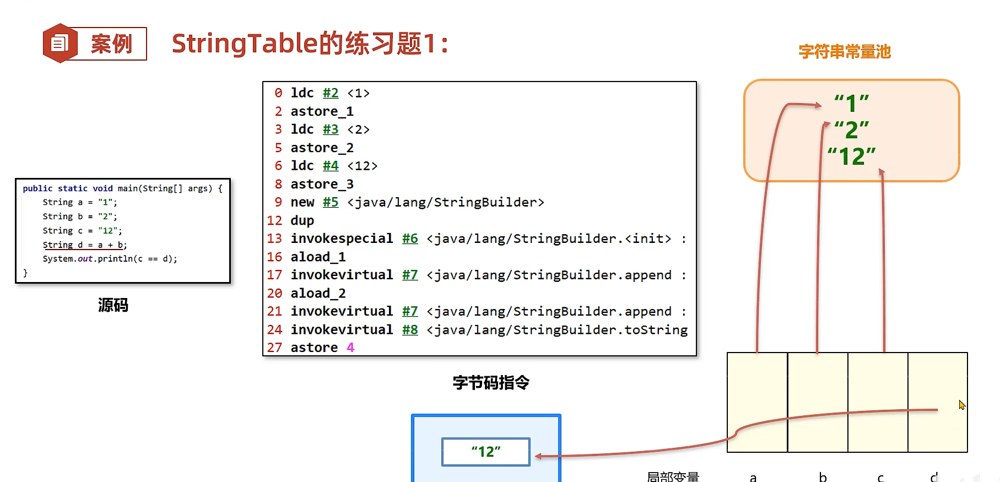
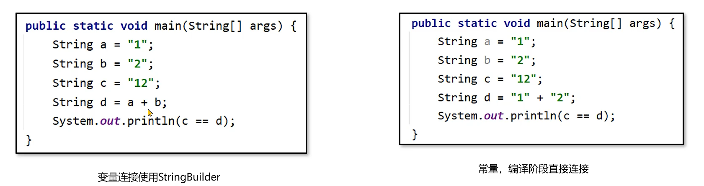

# 1. 方法区存在的数据
- 类的元信息（方法，虚方法表，字段，基本信息，常量），虚方法表是用于多态的实现
- 运行时常量池
- 字符串常量池（StringTable hotspot版本的jdk是在堆中）

--- 

jdk7 类的元信息在堆中永久代
jdk8 类的元信息，在内存中，叫元空间

# 2. 方法区的作用

方法区本质上是 JVM 用来保存类级别结构信息的区域。对象实例通常在堆里，但类定义、常量池、方法元数据不会跟着每个对象重复存储。

# 3. 常见问题

- 类过多：动态生成类、频繁加载类可能导致元空间膨胀。
- 常量池过大：大量常量、字符串驻留也会增加方法区相关压力。
- 类加载器泄漏：应用卸载不干净时，元空间无法释放。
