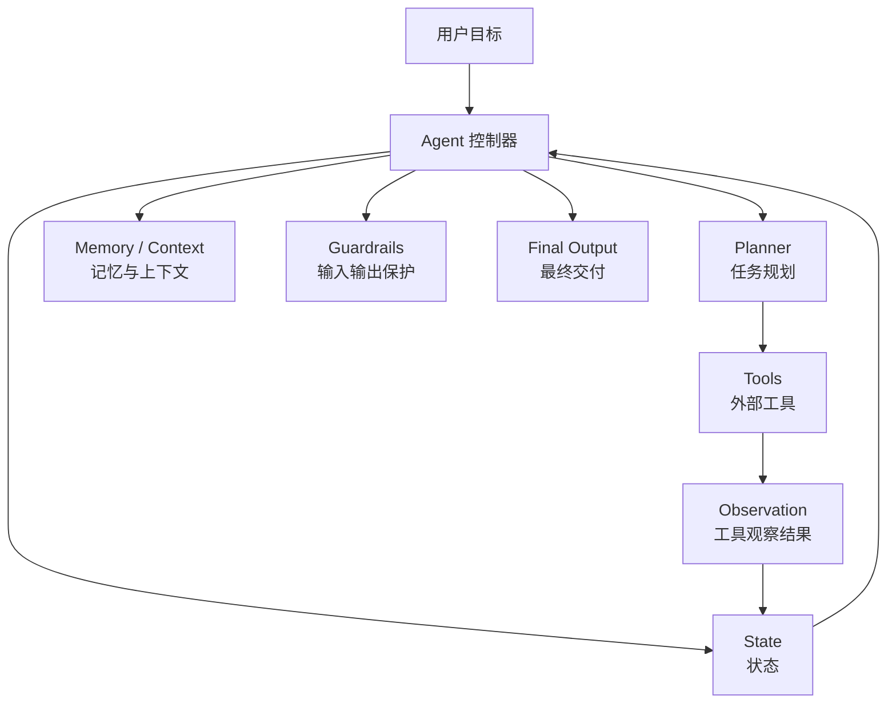
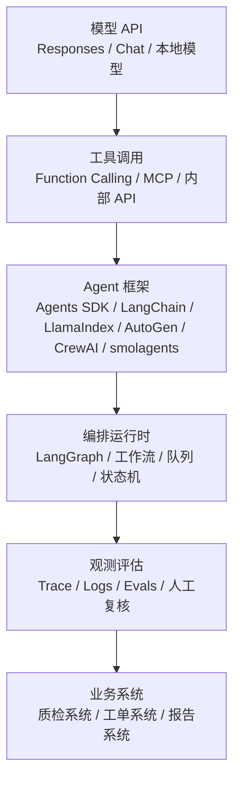
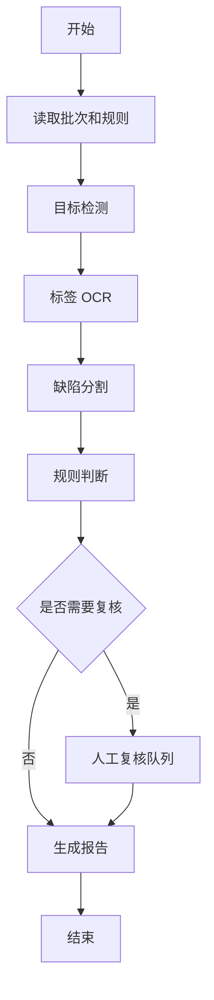
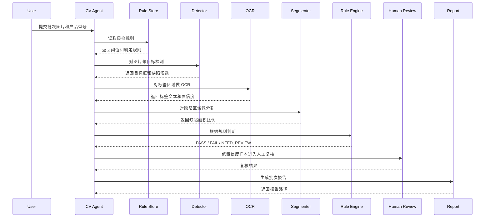
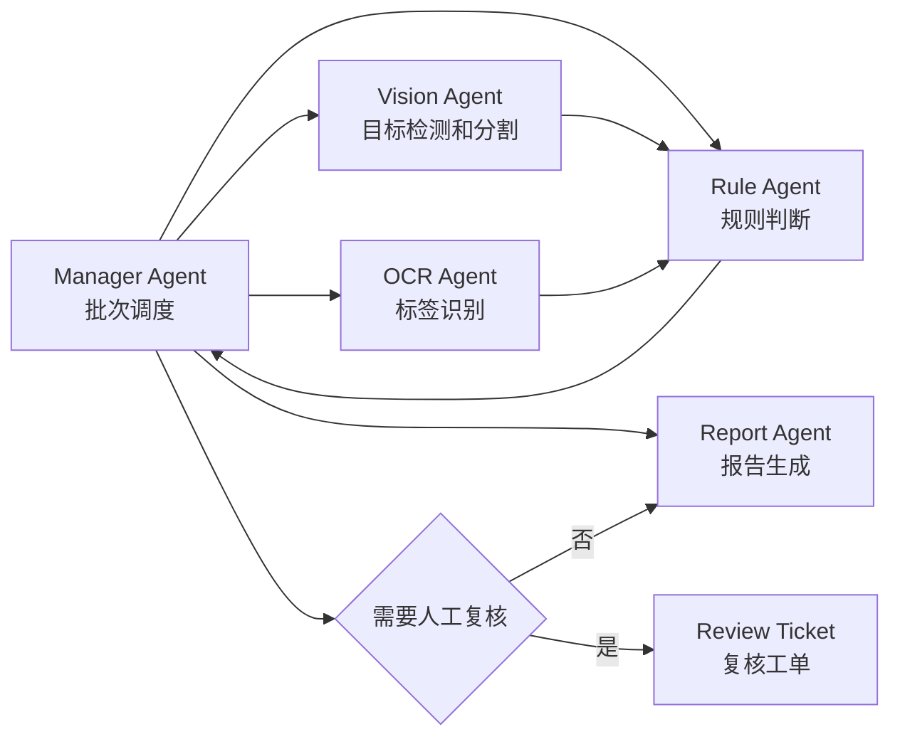

# Agent 开发实战与 CV 质检案例

这篇文章单独讲 `Agent`。目标是给初学者建立一个工程化理解：Agent 不是一个“会聊天的机器人”，也不是把提示词写长一点，而是一个能围绕目标反复决策、调用工具、观察结果、修正动作并交付结果的软件系统。

文章会按下面几件事展开：

- 什么是 Agent，什么不是 Agent。
- Agent 为什么需要工具、状态、记忆、规划、观察和保护规则。
- 现在常见的 Agent 开发工具链怎么分层选择。
- 用一个真正的 `CV 质检 Agent` 案例说明如何落地，而不是只做简单查询。

[[toc]]

## 1. 什么是 Agent

`Agent` 可以先理解为：

```text
Agent = 带目标的自动执行器
```

更工程一点的定义是：

```text
Agent = LLM + 指令 + 工具 + 状态 + 决策循环 + 约束规则 + 输出契约
```

如果只让大模型回答一句话，它是普通聊天。

如果让大模型在一个系统里反复做下面这些动作，它才开始接近 Agent：

1. 理解目标。
2. 拆分任务。
3. 判断下一步要做什么。
4. 调用外部工具。
5. 读取工具返回结果。
6. 根据结果修正计划。
7. 必要时继续调用工具。
8. 直到满足停止条件。
9. 输出结构化结果或执行动作。

一个典型 Agent 循环可以写成：

```text
用户目标 -> Agent 计划 -> 调用工具 -> 得到观察结果 -> 更新状态 -> 再计划 -> 最终输出
```

用一个简单公式表示：

$$
a_t = \pi_{\theta}(g, s_t, T)
$$

其中：

- $g$ 表示目标，例如“检查这批工件图片是否合格”。
- $s_t$ 表示当前状态，例如已经检测了几张图、哪些图有缺陷、哪些结果不确定。
- $T$ 表示可用工具集合，例如目标检测、OCR、分割、规则引擎、报告生成。
- $a_t$ 表示第 $t$ 步动作，例如调用 OCR、重新检测、请求人工复核。
- $\pi_{\theta}$ 表示由大模型和系统策略组成的决策函数。

执行动作后，工具会返回观察结果：

$$
s_{t+1} = update(s_t, a_t, o_t)
$$

其中 $o_t$ 是工具观察结果，例如“scratch 置信度 0.83，位置框为 [120, 80, 260, 160]”。

## 2. 什么不是 Agent

初学时很容易把下面这些东西都叫 Agent，但它们严格来说只是 Agent 的一部分。

| 形式 | 是不是 Agent | 原因 |
| --- | --- | --- |
| 普通聊天机器人 | 不是 | 只生成文本，没有自主调用工具和状态更新。 |
| 一个固定流程脚本 | 不一定 | 如果流程完全写死，没有根据观察结果动态决策，更像工作流。 |
| 一个 RAG 问答系统 | 不一定 | 只检索文档并回答问题，通常不具备多步行动能力。 |
| 一个工具调用接口 | 不是 | 工具只是能力，Agent 才负责决定什么时候用工具。 |
| 一个多轮对话系统 | 不一定 | 多轮对话只是上下文变长，不代表能自主规划和行动。 |
| 一个真正的质检 Agent | 是 | 会根据图片、OCR、规则、阈值和失败情况做多步判断。 |

判断是否是 Agent，可以看它有没有这 5 个特征：

| 特征 | 说明 |
| --- | --- |
| 目标 | 它知道要完成什么结果，而不是只回答一句话。 |
| 工具 | 它能调用外部能力，例如数据库、OCR、CV 模型、浏览器、代码执行器。 |
| 状态 | 它会记录已经做过什么、现在缺什么、下一步该做什么。 |
| 反馈 | 它会读取工具结果，并据此改变下一步动作。 |
| 停止条件 | 它知道什么时候完成、什么时候失败、什么时候需要人工介入。 |

## 3. Agent 的核心组成

一个工程里的 Agent 通常不是一个单独模型，而是一套运行时结构。



### 3.1. 指令

指令决定 Agent 的角色、边界和输出方式。

例如 CV 质检 Agent 的指令不能只写：

```text
你是一个图像质检助手，请判断图片是否合格。
```

这太泛了。更工程化的写法应该包含：

```text
你是一个生产线 CV 质检 Agent。
你必须基于工具返回的检测框、OCR 结果、分割面积和质检规则做判断。
你不能凭视觉想象直接断定缺陷。
当关键证据不足时，输出 NEED_REVIEW，而不是编造结论。
最终结果必须是 JSON，包含 batch_id、summary、items、risk_level、review_required。
```

### 3.2. 工具

工具是 Agent 能做事的原因。没有工具的 Agent，本质上还是语言模型。

常见工具包括：

| 工具类型 | 例子 | 作用 |
| --- | --- | --- |
| 检索工具 | 文档检索、向量数据库、知识库 | 找规则、找资料、找历史案例。 |
| 业务 API | 订单接口、工单接口、质检系统接口 | 读取或写入业务数据。 |
| 代码工具 | Python、Shell、SQL 执行器 | 做计算、分析、批处理。 |
| 浏览器工具 | 页面访问、截图、表单操作 | 做 Web 自动化。 |
| CV 工具 | YOLO、Detectron2、SAM、OCR | 处理图片、检测目标、识别文字。 |
| 音频工具 | ASR、VAD、响度检测 | 处理音频和语音。 |
| 报告工具 | Markdown、HTML、PDF 生成 | 生成最终交付物。 |

工具描述要写清楚：

- 工具做什么。
- 什么时候该用。
- 入参是什么。
- 输出是什么。
- 失败时返回什么。
- 是否有副作用。
- 是否允许重试。

### 3.3. 状态

状态是 Agent 和普通函数最大的区别之一。

CV 质检 Agent 的状态可能包括：

```json
{
  "batch_id": "BATCH-20260603-001",
  "product_code": "PANEL-A12",
  "rule_version": "2026.06",
  "image_paths": ["img_001.jpg", "img_002.jpg"],
  "processed": 1,
  "failed": 0,
  "findings": [],
  "uncertain_items": [],
  "next_action": "run_ocr"
}
```

没有状态，就无法知道：

- 哪些图片已经处理。
- 哪些工具调用失败。
- 哪些结果需要复检。
- 是否已经满足输出条件。

### 3.4. 记忆与上下文

记忆不是让 Agent 什么都记住，而是让它在合适的地方加载合适的信息。

常见记忆分三类：

| 类型 | 说明 | CV 例子 |
| --- | --- | --- |
| 短期上下文 | 本轮任务中的中间步骤 | 当前批次图片、检测结果、OCR 结果。 |
| 长期记忆 | 跨任务保存的经验 | 某产品型号常见缺陷、历史误报案例。 |
| 业务上下文 | 从系统里读取的规则和配置 | 产品质检标准、缺陷阈值、人工复核规则。 |

不要把所有资料一次性塞进提示词。更稳的做法是：

```text
需要规则时读取规则
需要历史案例时检索历史案例
需要产品参数时查询产品配置
```

### 3.5. 保护规则

Agent 能调用工具和执行动作，所以必须有保护规则。

常见保护规则：

- 输入保护：图片路径必须来自允许目录。
- 工具保护：删除、提交、支付、发消息等副作用动作需要审批。
- 输出保护：必须输出结构化 JSON，不能输出无法解析的自然语言。
- 证据保护：结论必须引用工具返回的证据。
- 置信度保护：低置信度必须进入人工复核。

CV 场景里尤其要注意：

```text
LLM 不应该直接代替 CV 模型做视觉判断。
LLM 负责调度、解释、汇总、生成报告。
缺陷位置、类别、置信度、OCR 文本必须来自工具。
```

## 4. Agent 开发工具链

Agent 工具链可以按层级理解，不要一上来就纠结“哪个框架最好”。



### 4.1. OpenAI Agents SDK

`OpenAI Agents SDK` 更适合直接基于 OpenAI 模型构建 Agent 应用。它把 Agent 定义、工具、交接、追踪、会话状态等放到一个 SDK 里。

适合场景：

- 想快速做带工具调用的 Agent。
- 想要 tracing 观察 Agent 的每一步。
- 需要多个专业 Agent 之间 handoff。
- 工具调用主要围绕 OpenAI Responses API 和 OpenAI 托管工具。

一个 Agent 至少会配置：

| 配置 | 作用 |
| --- | --- |
| `instructions` | 系统提示词，定义角色和边界。 |
| `model` | 使用哪个模型。 |
| `tools` | Agent 可以调用哪些函数或 API。 |
| `guardrails` | 输入输出约束和错误拦截。 |
| `handoffs` | 复杂任务交给其他专业 Agent。 |
| `tracing` | 记录模型调用、工具调用、错误和耗时。 |

### 4.2. LangChain Agents

`LangChain` 的 Agent 更像是高层应用框架，重点是：

- 统一模型调用。
- 统一工具抽象。
- 快速创建常见 Agent 循环。
- 接入不同模型、检索器、工具和中间件。

如果你正在做一个普通工具调用型 Agent，`LangChain` 的 `create_agent` 这类接口比较容易上手。

适合场景：

- 需要连接不同模型厂商。
- 工具和 RAG 组件比较多。
- 希望先快速做出 Agent 原型。
- 需要和 LangSmith 做 tracing、评估、调试。

### 4.3. LangGraph

`LangGraph` 更像 Agent 的编排运行时。它不只是“帮你调工具”，而是把 Agent 流程建成一个有状态图。

适合场景：

- 流程比较长。
- 状态很重要。
- 需要人工介入。
- 需要失败重试。
- 需要持久化执行。
- 需要明确控制每个节点怎么走。

例如 CV 质检 Agent 里，可以把流程拆成图：



### 4.4. LlamaIndex Agents

`LlamaIndex` 更适合“围绕数据构建 Agent”。如果你的核心问题是：

- 文档很多。
- 知识库很多。
- 数据源很多。
- 需要 RAG。
- 需要从文档、表格、PDF、数据库里取信息。

那么 LlamaIndex 会比较自然。

CV 质检里可以这样用：

- 用 LlamaIndex 管理质检标准文档。
- 用 RAG 检索“某个产品型号对应的缺陷判定规则”。
- 让 Agent 把检索到的规则和 CV 工具结果结合起来判断。

### 4.5. AutoGen

`AutoGen` 主要面向多 Agent 协作。它强调多个 Agent 之间通过对话、工具调用和人类介入共同完成任务。

适合场景：

- 一个 Agent 不够，需要多个角色协作。
- 任务需要评审者、执行者、规划者、工具调用者分工。
- 希望构建多 Agent 讨论、互审、迭代的流程。

CV 质检可以拆成：

| Agent | 职责 |
| --- | --- |
| Planner Agent | 决定检测流程。 |
| Vision Agent | 调用 CV 工具并解释检测结果。 |
| Rule Agent | 根据规则判断是否合格。 |
| Report Agent | 生成报告。 |
| Reviewer Agent | 对低置信度结果提出复核建议。 |

### 4.6. CrewAI

`CrewAI` 关注“角色、任务、团队、流程”。它的思路更像组织一组角色完成一批任务。

适合场景：

- 想用角色化方式表达任务。
- 任务可以拆成多个工作人员。
- 需要 crews、flows、memory、knowledge 和 observability。

例如：

```text
质检主管 Agent -> 分派任务
视觉检测 Agent -> 处理图像
规则审核 Agent -> 判断合规
报告 Agent -> 输出报告
```

### 4.7. Hugging Face smolagents

`smolagents` 是 Hugging Face 的轻量级 Agent 库。它强调简单和代码优先，支持常见工具调用 Agent，也支持 `CodeAgent`，让 Agent 通过写代码来调用工具和做计算。

适合场景：

- 想快速理解 Agent 原理。
- 不想一开始引入很重的框架。
- 想在 Python 里轻量实验。
- 想让 Agent 做一些代码式计算和工具组合。

### 4.8. MCP

`MCP` 全称是 `Model Context Protocol`。它不是 Agent 框架，而是工具接入协议。

可以这样理解：

```text
Agent 负责决定做什么
MCP 负责把工具标准化暴露出来
工具服务负责真正执行
```

在 CV 质检场景中，MCP Server 可以暴露：

- `detect_objects`
- `run_ocr`
- `segment_defect`
- `load_quality_rules`
- `create_review_ticket`
- `render_report`

这样不同 Agent 框架都可以通过同一套工具协议访问能力。

## 5. 选择工具链时怎么判断

初学者可以按下面的规则选：

| 需求 | 推荐方向 |
| --- | --- |
| 只想理解 Agent 原理 | 先手写一个 Python Agent loop。 |
| 需要接 OpenAI 模型和工具 | OpenAI Agents SDK / Responses API。 |
| 需要模型、工具、RAG 快速拼装 | LangChain。 |
| 需要长流程、有状态、人工介入 | LangGraph。 |
| 需要文档、知识库、RAG 数据 Agent | LlamaIndex。 |
| 需要多个 Agent 协作 | AutoGen / CrewAI。 |
| 想轻量学习代码式 Agent | smolagents。 |
| 工具很多，希望标准化接入 | MCP。 |

一个实用建议：

```text
先写清楚业务流程，再选 Agent 框架。
不要反过来先选框架，再硬把业务塞进去。
```

## 6. 真正的 CV 质检 Agent 案例

下面设计一个真实一点的案例。

业务目标：

```text
输入一批生产线工件图片，判断每张图片是否合格。
需要检测缺件、划痕、污渍、标签缺失、标签文本错误，并生成批次报告。
```

### 6.1. 输入输出

输入：

```json
{
  "batch_id": "BATCH-20260603-001",
  "product_code": "PANEL-A12",
  "rule_version": "2026.06",
  "image_dir": "/data/inspection/BATCH-20260603-001",
  "report_dir": "/data/reports"
}
```

输出：

```json
{
  "batch_id": "BATCH-20260603-001",
  "product_code": "PANEL-A12",
  "total": 120,
  "passed": 113,
  "failed": 5,
  "need_review": 2,
  "risk_level": "medium",
  "report_path": "/data/reports/BATCH-20260603-001.html",
  "items": [
    {
      "image": "img_008.jpg",
      "status": "FAIL",
      "reasons": ["missing_part", "label_text_mismatch"],
      "evidence": [
        {
          "type": "detection",
          "label": "missing_part",
          "confidence": 0.82,
          "box": [420, 210, 486, 296]
        },
        {
          "type": "ocr",
          "expected": "PANEL-A12",
          "actual": "PANEL-A1Z",
          "confidence": 0.91
        }
      ]
    }
  ]
}
```

### 6.2. 为什么这是真 Agent

这个案例不是让大模型直接看图片说一句“合格”。

它至少有这些步骤：



Agent 的价值在于：

- 它知道先读规则，再检测。
- 它知道 OCR 应该只对标签区域做，而不是全图乱识别。
- 它知道检测置信度低时要进入复核。
- 它知道缺件是强拒绝项，轻微划痕可能要看面积比例。
- 它知道最后要生成可追溯报告。

### 6.3. 工具清单

CV Agent 至少需要这些工具：

| 工具名 | 输入 | 输出 | 说明 |
| --- | --- | --- | --- |
| `list_images` | 图片目录 | 图片路径列表 | 找到本批次所有图片。 |
| `load_quality_rules` | 产品型号、规则版本 | 规则 JSON | 读取判定标准。 |
| `detect_objects` | 图片路径、模型版本 | 目标框、类别、置信度 | 检测零件、缺件、划痕、污渍候选。 |
| `run_ocr` | 图片路径、区域框 | 文本、置信度 | 识别标签、序列号、型号。 |
| `segment_defect` | 图片路径、缺陷框 | mask、面积比例 | 计算缺陷面积。 |
| `apply_rules` | 检测结果、OCR、规则 | PASS / FAIL / REVIEW | 做确定性判定。 |
| `create_review_ticket` | 不确定样本 | 工单 ID | 人工复核入口。 |
| `render_report` | 汇总结果 | HTML / PDF 路径 | 生成报告。 |

注意：`apply_rules` 最好是确定性代码，不要完全交给 LLM。

### 6.4. Agent 状态设计

状态可以先用 Python 数据类表达。

```python
from dataclasses import dataclass, field
from typing import Literal


Status = Literal["PENDING", "PASS", "FAIL", "NEED_REVIEW"]


@dataclass
class Detection:
    label: str
    confidence: float
    box: list[int]
    area_ratio: float | None = None


@dataclass
class OcrResult:
    field: str
    text: str
    confidence: float
    box: list[int]


@dataclass
class ImageInspectionResult:
    image_path: str
    status: Status = "PENDING"
    detections: list[Detection] = field(default_factory=list)
    ocr_results: list[OcrResult] = field(default_factory=list)
    reasons: list[str] = field(default_factory=list)
    need_review_reason: str | None = None


@dataclass
class AgentState:
    batch_id: str
    product_code: str
    rule_version: str
    image_dir: str
    report_dir: str
    rules: dict = field(default_factory=dict)
    images: list[str] = field(default_factory=list)
    current_index: int = 0
    results: list[ImageInspectionResult] = field(default_factory=list)
    errors: list[str] = field(default_factory=list)

    @property
    def done(self) -> bool:
        return self.current_index >= len(self.images)
```

这里的状态不是为了好看，而是为了解决实际问题：

- 处理中断后可以恢复。
- 可以知道当前处理到哪张图。
- 可以统计错误。
- 可以追踪每张图的证据。
- 可以生成批次报告。

### 6.5. 质检规则示例

规则应该尽量结构化，不要只写成自然语言。

```json
{
  "product_code": "PANEL-A12",
  "version": "2026.06",
  "required_parts": ["screw", "seal", "label", "connector"],
  "required_label_fields": {
    "MODEL": "PANEL-A12",
    "QC": "PASS"
  },
  "thresholds": {
    "missing_part": 0.7,
    "scratch": 0.62,
    "stain": 0.58,
    "ocr": 0.85,
    "review_confidence": 0.55
  },
  "reject_rules": [
    {
      "name": "missing_part_reject",
      "when": "missing_part.confidence >= 0.7",
      "action": "FAIL"
    },
    {
      "name": "large_scratch_reject",
      "when": "scratch.area_ratio >= 0.08",
      "action": "FAIL"
    },
    {
      "name": "label_text_mismatch",
      "when": "MODEL != PANEL-A12",
      "action": "FAIL"
    }
  ],
  "review_rules": [
    {
      "name": "low_confidence_defect",
      "when": "0.55 <= defect.confidence < threshold",
      "action": "NEED_REVIEW"
    },
    {
      "name": "low_confidence_ocr",
      "when": "ocr.confidence < 0.85",
      "action": "NEED_REVIEW"
    }
  ]
}
```

规则引擎可以由普通 Python 代码实现。Agent 不应该自己发明规则。

### 6.6. CV 工具伪代码

下面是一个接近真实工程的工具层。真实项目里，你可以把 YOLO、RT-DETR、Detectron2、PaddleOCR、SAM 等封装成内部服务。

```python
from pathlib import Path
from typing import Any


class VisionTools:
    def list_images(self, image_dir: str) -> list[str]:
        suffixes = {".jpg", ".jpeg", ".png", ".bmp"}
        return [
            str(p)
            for p in sorted(Path(image_dir).iterdir())
            if p.suffix.lower() in suffixes
        ]

    def load_quality_rules(self, product_code: str, rule_version: str) -> dict[str, Any]:
        # 工程中可以来自数据库、配置中心、对象存储或 Git 仓库。
        return {
            "product_code": product_code,
            "version": rule_version,
            "required_parts": ["screw", "seal", "label", "connector"],
            "required_label_fields": {"MODEL": product_code, "QC": "PASS"},
            "thresholds": {
                "missing_part": 0.70,
                "scratch": 0.62,
                "stain": 0.58,
                "ocr": 0.85,
                "review_confidence": 0.55,
            },
        }

    def detect_objects(self, image_path: str, model_version: str) -> list[dict[str, Any]]:
        # 示例：真实工程中这里调用 YOLO / RT-DETR / Detectron2 服务。
        return [
            {
                "label": "scratch",
                "confidence": 0.81,
                "box": [118, 72, 260, 128],
            },
            {
                "label": "label",
                "confidence": 0.96,
                "box": [320, 180, 520, 260],
            },
        ]

    def run_ocr(self, image_path: str, box: list[int]) -> list[dict[str, Any]]:
        # 示例：真实工程中这里调用 PaddleOCR 或内部 OCR 服务。
        return [
            {
                "field": "MODEL",
                "text": "PANEL-A12",
                "confidence": 0.93,
                "box": box,
            },
            {
                "field": "QC",
                "text": "PASS",
                "confidence": 0.89,
                "box": box,
            },
        ]

    def segment_defect(self, image_path: str, box: list[int]) -> dict[str, Any]:
        # 示例：真实工程中这里调用 SAM / 专用分割模型。
        return {
            "box": box,
            "area_ratio": 0.031,
            "mask_id": "mask_001",
        }

    def render_report(self, state: AgentState) -> str:
        report_path = Path(state.report_dir) / f"{state.batch_id}.html"
        # 这里省略 HTML 模板渲染细节。
        return str(report_path)
```

### 6.7. 规则判断代码

规则判断应该尽量可测试、可回放。

```python
def apply_rules(
    image_result: ImageInspectionResult,
    rules: dict,
) -> ImageInspectionResult:
    thresholds = rules["thresholds"]

    for det in image_result.detections:
        if det.label == "missing_part" and det.confidence >= thresholds["missing_part"]:
            image_result.status = "FAIL"
            image_result.reasons.append("missing_part")

        if det.label == "scratch":
            if det.area_ratio is not None and det.area_ratio >= 0.08:
                image_result.status = "FAIL"
                image_result.reasons.append("large_scratch")
            elif thresholds["review_confidence"] <= det.confidence < thresholds["scratch"]:
                image_result.status = "NEED_REVIEW"
                image_result.need_review_reason = "scratch_confidence_is_uncertain"

    expected_fields = rules.get("required_label_fields", {})
    actual_fields = {item.field: item for item in image_result.ocr_results}

    for field, expected in expected_fields.items():
        actual = actual_fields.get(field)
        if actual is None:
            image_result.status = "FAIL"
            image_result.reasons.append(f"{field}_missing")
            continue

        if actual.confidence < thresholds["ocr"]:
            image_result.status = "NEED_REVIEW"
            image_result.need_review_reason = f"{field}_ocr_low_confidence"
            continue

        if actual.text != expected:
            image_result.status = "FAIL"
            image_result.reasons.append(f"{field}_mismatch")

    if image_result.status == "PENDING":
        image_result.status = "PASS"

    return image_result
```

这段代码有一个关键思想：

```text
确定性规则用代码判断，LLM 不直接决定 PASS / FAIL。
```

LLM 可以解释原因、汇总报告、提示风险，但最终判定最好由可追溯规则给出。

### 6.8. 手写一个 Agent Loop

初学阶段，建议先手写一个 Agent loop。这样你能真正理解框架在帮你做什么。

```python
class CVInspectionAgent:
    def __init__(self, tools: VisionTools):
        self.tools = tools

    def run(self, state: AgentState) -> dict:
        state.rules = self.tools.load_quality_rules(
            product_code=state.product_code,
            rule_version=state.rule_version,
        )
        state.images = self.tools.list_images(state.image_dir)

        while not state.done:
            image_path = state.images[state.current_index]
            try:
                result = self.inspect_one_image(image_path, state.rules)
                state.results.append(result)
            except Exception as exc:
                state.errors.append(f"{image_path}: {exc}")
            finally:
                state.current_index += 1

        report_path = self.tools.render_report(state)
        return self.summarize(state, report_path)

    def inspect_one_image(
        self,
        image_path: str,
        rules: dict,
    ) -> ImageInspectionResult:
        image_result = ImageInspectionResult(image_path=image_path)

        raw_detections = self.tools.detect_objects(
            image_path=image_path,
            model_version="detector-v3",
        )

        for raw in raw_detections:
            det = Detection(
                label=raw["label"],
                confidence=raw["confidence"],
                box=raw["box"],
            )

            if det.label in {"scratch", "stain"}:
                seg = self.tools.segment_defect(image_path, det.box)
                det.area_ratio = seg["area_ratio"]

            image_result.detections.append(det)

            if det.label == "label":
                ocr_items = self.tools.run_ocr(image_path, det.box)
                for item in ocr_items:
                    image_result.ocr_results.append(
                        OcrResult(
                            field=item["field"],
                            text=item["text"],
                            confidence=item["confidence"],
                            box=item["box"],
                        )
                    )

        return apply_rules(image_result, rules)

    def summarize(self, state: AgentState, report_path: str) -> dict:
        total = len(state.results)
        failed = sum(1 for item in state.results if item.status == "FAIL")
        need_review = sum(1 for item in state.results if item.status == "NEED_REVIEW")
        passed = sum(1 for item in state.results if item.status == "PASS")

        if failed >= 10 or need_review >= 20:
            risk_level = "high"
        elif failed > 0 or need_review > 0:
            risk_level = "medium"
        else:
            risk_level = "low"

        return {
            "batch_id": state.batch_id,
            "product_code": state.product_code,
            "total": total,
            "passed": passed,
            "failed": failed,
            "need_review": need_review,
            "risk_level": risk_level,
            "report_path": report_path,
            "errors": state.errors,
        }
```

这就是最小可理解的 Agent：

- 有目标：完成批次质检。
- 有工具：检测、OCR、分割、规则、报告。
- 有状态：当前批次、图片列表、中间结果、错误。
- 有反馈：根据检测和 OCR 结果进入规则判断。
- 有停止条件：图片处理完。
- 有交付物：结构化 summary 和报告路径。

## 7. 用 Agent 框架表达同一个案例

手写 loop 适合学习。工程变复杂后，可以用 Agent 框架承接工具注册、工具调用、tracing、handoff、会话状态等。

下面是伪代码，重点看结构，不是完整可运行脚本。

```python
from agents import Agent, Runner, function_tool


@function_tool
def detect_objects(image_path: str, model_version: str) -> dict:
    """Detect product parts and defect candidates in one inspection image."""
    return {
        "image_path": image_path,
        "detections": [
            {"label": "scratch", "confidence": 0.81, "box": [118, 72, 260, 128]},
            {"label": "label", "confidence": 0.96, "box": [320, 180, 520, 260]},
        ],
    }


@function_tool
def run_ocr(image_path: str, box: list[int]) -> dict:
    """Read label text from a specific image region."""
    return {
        "items": [
            {"field": "MODEL", "text": "PANEL-A12", "confidence": 0.93},
            {"field": "QC", "text": "PASS", "confidence": 0.89},
        ]
    }


@function_tool
def apply_quality_rules(payload: dict) -> dict:
    """Apply deterministic inspection rules and return PASS, FAIL or NEED_REVIEW."""
    return {
        "status": "PASS",
        "reasons": [],
        "evidence": payload,
    }


cv_agent = Agent(
    name="CV Inspection Agent",
    instructions="""
    You inspect production-line images.
    Use tools for visual evidence. Do not invent visual findings.
    A final answer must be structured JSON with status, reasons and evidence.
    If evidence is insufficient, return NEED_REVIEW.
    """,
    tools=[detect_objects, run_ocr, apply_quality_rules],
)


result = Runner.run_sync(
    cv_agent,
    "Inspect image /data/inspection/BATCH-001/img_008.jpg for product PANEL-A12.",
)

print(result.final_output)
```

这个例子里，Agent 框架做了：

- 让模型知道有哪些工具。
- 让模型根据任务决定调用哪个工具。
- 把工具结果放回上下文。
- 继续生成下一步动作或最终输出。

但你仍然要自己负责：

- 工具返回结构是否稳定。
- 规则是否可靠。
- 低置信度是否复核。
- 结果是否可追溯。
- 是否有日志和评估。

## 8. CV Agent 的多 Agent 版本

当任务更复杂时，可以拆成多个 Agent。



多 Agent 不是越多越好。只有当职责真的不同，才值得拆。

适合拆分的情况：

- 每个角色需要不同工具。
- 每个角色需要不同提示词。
- 每个角色需要不同输出格式。
- 某些步骤需要人工审批。
- 某些步骤可能单独失败或重试。

不适合拆分的情况：

- 只是为了看起来高级。
- 每个 Agent 都在重复调用同一批工具。
- 没有明确的交接标准。
- 没有 tracing，出了错不知道谁的问题。

## 9. MCP 形式的 CV 工具服务

如果你的 CV 能力要给多个 Agent 使用，可以把它们做成 MCP Server。

伪代码：

```python
from typing import Any
from mcp.server.fastmcp import FastMCP


mcp = FastMCP("cv-inspection")


@mcp.tool()
def detect_objects(image_path: str, model_version: str = "detector-v3") -> dict[str, Any]:
    """Detect product parts and defect candidates in one image."""
    return {
        "image_path": image_path,
        "model_version": model_version,
        "detections": [
            {"label": "scratch", "confidence": 0.81, "box": [118, 72, 260, 128]},
            {"label": "label", "confidence": 0.96, "box": [320, 180, 520, 260]},
        ],
    }


@mcp.tool()
def run_ocr(image_path: str, box: list[int]) -> dict[str, Any]:
    """Read text from a specific image region."""
    return {
        "image_path": image_path,
        "box": box,
        "items": [
            {"field": "MODEL", "text": "PANEL-A12", "confidence": 0.93},
            {"field": "QC", "text": "PASS", "confidence": 0.89},
        ],
    }


@mcp.resource("inspection://rules/{product_code}/{version}")
def load_quality_rules(product_code: str, version: str) -> dict[str, Any]:
    """Load deterministic quality inspection rules."""
    return {
        "product_code": product_code,
        "version": version,
        "thresholds": {
            "missing_part": 0.70,
            "scratch": 0.62,
            "ocr": 0.85,
        },
    }
```

MCP 的价值是：

- 工具能力独立于某个 Agent 框架。
- 参数和返回结构更规范。
- 其他客户端也可以调用同一套 CV 工具。
- 工具可以单独测试、部署、监控。

## 10. Agent 的工程质量标准

做 Agent 不只是“能跑一次”，而是要能稳定复现。

### 10.1. 可观测性

至少要记录：

| 日志 | 说明 |
| --- | --- |
| 用户输入 | 批次号、产品型号、规则版本。 |
| 计划步骤 | Agent 决定先做什么、后做什么。 |
| 工具调用 | 工具名、入参、耗时、返回摘要。 |
| 中间结果 | 检测框、OCR 文本、置信度、规则命中。 |
| 最终结果 | PASS / FAIL / NEED_REVIEW。 |
| 错误 | 工具失败、超时、解析失败、低置信度。 |

没有 trace 的 Agent 很难排查问题。

### 10.2. 可评估性

CV Agent 可以这样评估：

| 指标 | 含义 |
| --- | --- |
| 缺陷召回率 | 真实缺陷里有多少被检测出来。 |
| 缺陷精确率 | Agent 判定为缺陷的样本有多少是真的。 |
| OCR 准确率 | 标签字段识别是否正确。 |
| 误拒率 | 合格品被误判为不合格的比例。 |
| 漏检率 | 不合格品被误判为合格的比例。 |
| 复核率 | 进入人工复核的比例。 |
| 平均处理耗时 | 单张图片或单批次耗时。 |
| 工具失败率 | OCR、检测、报告等工具失败比例。 |

常见公式：

$$
Precision = \frac{TP}{TP + FP}
$$

$$
Recall = \frac{TP}{TP + FN}
$$

$$
F1 = 2 \cdot \frac{Precision \cdot Recall}{Precision + Recall}
$$

其中：

- `TP`：真实有缺陷，系统也判为有缺陷。
- `FP`：真实没缺陷，系统误判为有缺陷。
- `FN`：真实有缺陷，系统漏掉了。

### 10.3. 可回放性

每次质检都应该能回放：

```text
同一张图
同一个模型版本
同一份规则
同一组阈值
同一份 Agent 指令
应该得到可解释的结果
```

所以要保存：

- 模型版本。
- 规则版本。
- Agent 指令版本。
- 工具入参。
- 工具输出。
- 最终报告。

### 10.4. 人工复核

Agent 不应该追求“全部自动化”。很多工业场景里，`NEED_REVIEW` 是安全设计。

应该进入人工复核的情况：

- 检测置信度接近阈值。
- OCR 置信度低。
- 规则冲突。
- 图片质量差。
- 工具调用失败。
- 缺陷影响严重但证据不足。

## 11. 常见错误

### 11.1. 让 LLM 直接看图下结论

错误做法：

```text
请看这张图片有没有缺陷。
```

问题：

- 没有检测框。
- 没有置信度。
- 没有规则版本。
- 没有可追溯证据。
- 没法评估误判原因。

正确做法：

```text
先调用 CV 工具获取证据，再让 Agent 根据规则组织结论。
```

### 11.2. 工具返回自然语言

错误返回：

```text
这张图片看起来有一点划痕，可能不太合格。
```

正确返回：

```json
{
  "label": "scratch",
  "confidence": 0.81,
  "box": [118, 72, 260, 128],
  "area_ratio": 0.031
}
```

Agent 工程里，工具输出越结构化，系统越稳定。

### 11.3. 没有停止条件

Agent 需要明确什么时候结束：

- 图片全部处理完。
- 已经生成报告。
- 超过最大重试次数。
- 发现关键错误，转人工。
- 超过最大运行时间。

### 11.4. 没有版本号

上线后必须记录：

- 检测模型版本。
- OCR 模型版本。
- 规则版本。
- Agent prompt 版本。
- 代码版本。

否则报告出了问题，无法追责和复现。

## 12. 一句话总结

Agent 的核心不是“模型更聪明”，而是：

```text
让模型在受控的软件系统里，基于目标、状态和工具结果持续决策。
```

CV Agent 的核心也不是“让大模型看图”，而是：

```text
CV 模型提供视觉证据，规则引擎做确定性判断，LLM Agent 负责规划、调度、解释和交付。
```

真正能落地的 Agent，一定要有：

- 稳定工具。
- 明确状态。
- 可追溯证据。
- 可测试规则。
- 可观测日志。
- 可回放结果。
- 必要的人工复核。

## 13. 参考资料

- OpenAI Agents SDK: https://openai.github.io/openai-agents-js/guides/agents/
- OpenAI API Tools: https://developers.openai.com/api/docs/guides/tools
- OpenAI Reasoning Models and Agents SDK Guidance: https://developers.openai.com/api/docs/guides/latest-model#using-reasoning-models
- LangChain Agents: https://docs.langchain.com/oss/python/langchain/agents
- LangGraph Overview: https://docs.langchain.com/oss/python/langgraph/overview
- LlamaIndex Documentation: https://developers.llamaindex.ai/python/framework/
- AutoGen Getting Started: https://microsoft.github.io/autogen/0.2/docs/Getting-Started/
- CrewAI Documentation: https://docs.crewai.com/
- Hugging Face smolagents: https://huggingface.co/docs/smolagents/index
- Model Context Protocol: https://modelcontextprotocol.io/docs/getting-started/intro
- Ultralytics YOLO Predict Mode: https://docs.ultralytics.com/modes/predict/
- PaddleOCR Documentation: https://www.paddleocr.ai/main/en/index/index.html
- Detectron2: https://detectron2.org/
- Segment Anything: https://ai.meta.com/research/publications/segment-anything/
