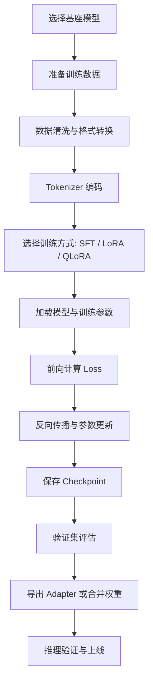

# 大模型微调

这篇主要整理基于 `LLaMA-Factory` 和 `Unsloth` 的大模型微调思路，包括常见训练 API、工作原理、训练流程，以及一个便于理解的流程图。

::: danger 注意：微调会放大数据与供应链风险
训练语料要确认版权、隐私和授权，并移除密钥、个人信息与生产指令；训练/评测必须按来源隔离，避免重复样本污染指标。模型仓库中的自定义代码和 pickle 权重可能执行任意代码，优先使用可信来源及 `safetensors`，在隔离环境校验后再加载。
:::

## 1. 技术栈

- 视频参考：`bilibili.com/video/BV1djgRzxEts`
- 微调框架：`LLaMA-Factory`
- 加速工具：`Unsloth`
- 底层生态：`PyTorch`、`Transformers`、`Datasets`、`PEFT`、`TRL`

`LLaMA-Factory` 是一个社区维护的开源 LLM 微调框架，底层主要基于 Hugging Face 生态，常用于快速微调 `LLaMA`、`Qwen`、`Baichuan`、`ChatGLM` 等模型。  
`Unsloth` 更偏向高性能训练工具，目标是在更低显存占用下加速 `LoRA / QLoRA` 微调。

## 2. 安装与启动

```bash
conda create -n llama-fac python=3.10
conda activate llama-fac
cd LLaMA-Factory
pip install -e ".[torch,metrics]" --no-build-isolation
llamafactory-cli webui
```

后台启动可以使用：

```bash
nohup llamafactory-cli webui > llamafactory.log 2>&1 &
```

如果要结合 `Unsloth`，通常是在训练配置里选择支持的模型、量化方式和 LoRA 训练参数，而不是完全替换掉整个训练框架。

## 3. 为什么要微调

大模型预训练后具备通用语言能力，但通常还不够贴近具体业务。微调的主要目标包括：

- 让模型学习特定领域术语和表达风格。
- 强化某类任务能力，例如问答、分类、抽取、SQL 生成。
- 让模型更符合业务输出格式，例如 JSON、固定模板或工具调用结构。
- 在较低成本下对基座模型进行定制，而不是从头训练。

## 4. 工作原理

### 4.1. 核心思路

大模型微调本质上是在已有预训练参数基础上，继续使用特定数据做梯度更新，让模型在新任务上输出更符合目标分布。

对于自回归语言模型，训练目标通常仍然是：

- 给定前文 token
- 预测下一个 token
- 通过交叉熵损失衡量预测误差
- 反向传播更新参数

### 4.2. 全量微调与参数高效微调

- 全量微调：直接更新模型全部参数，效果强但显存、算力和存储开销大。
- LoRA：只在部分线性层旁边增加低秩适配矩阵，训练时只更新新增参数。
- QLoRA：在量化模型基础上再做 LoRA，进一步降低显存占用。

现在大多数工程实践里，`LoRA / QLoRA` 是主流方案，因为它们更适合单机多卡或消费级显卡环境。

### 4.3. 数据是如何参与训练的

训练样本通常会被整理成如下结构：

- `instruction`
- `input`
- `output`

或聊天格式：

- `system`
- `user`
- `assistant`

这些字段最终会经过模板拼接、tokenizer 编码，转换成模型输入的 `input_ids`、`attention_mask` 和训练标签 `labels`。

## 5. 训练流程

### 5.1. 训练步骤

一个完整的微调流程通常如下：

1. 选择基础模型，例如 `Qwen`、`LLaMA`。
2. 准备训练集、验证集，并统一成框架支持的数据格式。
3. 选择训练方式，例如 `SFT`、`LoRA`、`QLoRA`。
4. 配置 tokenizer、模板、最大长度、batch size、学习率等参数。
5. 加载模型并注入 LoRA 适配层。
6. 启动训练，周期性评估并保存 checkpoint。
7. 合并权重或保留 adapter，最后进入推理验证。

### 5.2. 流程图



## 6. 常见 API 与组件

### 6.1. Transformers

最常见的底层 API 基本都来自 Hugging Face：

```python
from transformers import AutoTokenizer, AutoModelForCausalLM

tokenizer = AutoTokenizer.from_pretrained("Qwen/Qwen2.5-7B-Instruct")
model = AutoModelForCausalLM.from_pretrained("Qwen/Qwen2.5-7B-Instruct")
```

常见作用：

- `AutoTokenizer.from_pretrained`：加载分词器。
- `AutoModelForCausalLM.from_pretrained`：加载自回归语言模型。
- `model.generate(...)`：推理生成。
- `tokenizer(...)`：把文本编码成 token。

### 6.2. Datasets

数据集加载与预处理通常使用：

```python
from datasets import load_dataset

dataset = load_dataset("json", data_files="train.json")
```

常见用法：

- `load_dataset`：加载本地或远程数据集。
- `dataset.map(...)`：对样本做格式转换、模板拼接、tokenize。
- `train_test_split(...)`：切分训练集和验证集。

### 6.3. PEFT

LoRA 训练经常会用到：

```python
from peft import LoraConfig, get_peft_model

lora_config = LoraConfig(
    r=8,
    lora_alpha=16,
    lora_dropout=0.05,
    target_modules=["q_proj", "v_proj"]
)
model = get_peft_model(model, lora_config)
```

常见作用：

- `LoraConfig`：配置 LoRA 超参数。
- `get_peft_model`：给基础模型注入 LoRA 层。
- `model.print_trainable_parameters()`：查看实际可训练参数比例。

### 6.4. Trainer / SFTTrainer

训练通常通过 Trainer 抽象来完成：

```python
from transformers import TrainingArguments, Trainer

training_args = TrainingArguments(
    output_dir="./output",
    per_device_train_batch_size=2,
    gradient_accumulation_steps=8,
    learning_rate=2e-4,
    num_train_epochs=3,
    logging_steps=10,
    save_steps=100
)
```

常见作用：

- `TrainingArguments`：统一定义训练超参数。
- `Trainer`：通用训练入口。
- `SFTTrainer`：更适合监督微调场景，常见于 `TRL` 生态。

### 6.5. 推理相关 API

训练后常见验证方式：

```python
inputs = tokenizer("请介绍一下 LoRA 微调。", return_tensors="pt")
outputs = model.generate(**inputs, max_new_tokens=256)
print(tokenizer.decode(outputs[0], skip_special_tokens=True))
```

这一组 API 用于做快速 smoke test，判断微调结果有没有学到目标任务。

## 7. LLaMA-Factory 与 Unsloth 的关系

### 7.1. LLaMA-Factory

它更像一个“训练控制台”：

- 提供 WebUI 和 CLI。
- 封装数据集配置、模板配置、训练方式配置。
- 能统一管理 SFT、DPO、奖励模型、推理和导出。

适合：

- 想快速把训练跑起来。
- 不想手写太多底层训练代码。
- 需要管理多组实验参数。

### 7.2. Unsloth

它更像一个“训练加速器”：

- 重点解决显存和速度问题。
- 对 LoRA / QLoRA 场景更友好。
- 适合在较弱硬件上跑更大的模型。

适合：

- 显存预算有限。
- 希望更快迭代实验。
- 训练模型以 `LoRA / QLoRA` 为主。

## 8. 常见问题

### 8.1. 为什么训练 loss 降了，效果还是不好

常见原因：

- 数据质量差，答案本身不稳定。
- 训练样本太少，泛化不够。
- 模板不一致，训练和推理格式不统一。
- 只看 loss，没有做实际推理抽样验证。

### 8.2. 为什么显存总是不够

可以从这些方向排查：

- 降低 `max_seq_length`
- 降低 `batch size`
- 使用 `gradient_accumulation`
- 使用 `LoRA / QLoRA`
- 开启更低位量化

### 8.3. 训练后的模型怎么部署

常见有两种方式：

- 只保存 `adapter`，推理时和基座模型一起加载。
- 把 `LoRA` 权重合并回基础模型，再统一导出部署。

如果后续要频繁切换多个任务版本，保留 adapter 往往更灵活。

## 9. easy dataset

- 项目地址：https://github.com/ConardLi/easy-dataset

这类数据集整理工具适合在微调前做数据清洗、标注整理和格式转换。真正影响微调效果的，通常不是训练命令本身，而是数据格式是否稳定、指令是否一致、答案是否足够干净。

## 10. 常见名词解释和缩写来源

学习大模型微调时，经常会看到很多英文缩写。下面按“名称、全称、来源、作用”整理。

| 名称 | 英文全称 | 名称来源 | 主要作用 |
| --- | --- | --- | --- |
| `LLM` | Large Language Model | Large 表示参数规模大，Language 表示处理语言，Model 表示模型。 | 泛指 GPT、Qwen、LLaMA、DeepSeek、GLM、Gemma 这类大语言模型。 |
| `NLP` | Natural Language Processing | 自然语言处理。 | 传统 NLP 包括分词、分类、翻译、问答、摘要；LLM 是 NLP 发展到大模型阶段后的核心技术。 |
| `PLM` | Pre-trained Language Model | 预训练语言模型。 | 指先在大规模语料上预训练，再迁移到下游任务的模型。BERT、GPT、Qwen 都属于这个路线。 |
| `SFT` | Supervised Fine-Tuning | Supervised 表示有监督，Fine-Tuning 表示微调。 | 用“问题-答案”样本继续训练模型，让模型学会按指令回答。 |
| `RLHF` | Reinforcement Learning from Human Feedback | 从人类反馈中做强化学习。 | 用人工偏好训练奖励模型，再用强化学习优化回答风格和偏好。 |
| `DPO` | Direct Preference Optimization | 直接偏好优化。 | 不单独训练奖励模型，直接用偏好数据优化模型输出。 |
| `PEFT` | Parameter-Efficient Fine-Tuning | 参数高效微调。 | 不更新全部模型参数，只训练少量新增参数，降低显存和存储成本。 |
| `LoRA` | Low-Rank Adaptation | 低秩适配。 | 冻结原模型，只在部分线性层旁边加入低秩矩阵，训练这些小矩阵。 |
| `QLoRA` | Quantized Low-Rank Adaptation | Quantized 表示量化，LoRA 表示低秩适配。 | 先把基础模型量化成 4bit，再挂 LoRA 训练，适合单卡资源有限场景。 |
| `Adapter` | Adapter Module | 适配器模块。 | 微调后保存的小权重，推理时和基础模型一起加载。 |
| `Causal LM` | Causal Language Model | Causal 表示只能看当前位置之前的 token。 | 自回归语言模型，训练目标是预测下一个 token。GPT、Qwen、LLaMA 都是这种形式。 |
| `Tokenizer` | Tokenizer | token 化工具。 | 把文本切成 token id，让模型能处理自然语言。 |
| `Token` | Token | 模型处理文本的基本单位。 | 可能是一个汉字、一个词、一段子词或一个标点。训练和推理都按 token 计算。 |
| `Embedding` | Embedding | 嵌入向量。 | 把 token id 映射成连续向量，作为神经网络输入。 |
| `Checkpoint` | Checkpoint | 检查点。 | 训练过程中的模型快照，用于恢复训练或选择最佳版本。 |
| `Epoch` | Epoch | 一个训练轮次。 | 训练集完整被模型看一遍，记为 1 个 epoch。 |
| `Batch Size` | Batch Size | 一批样本数量。 | 每次前向/反向计算喂给模型的样本数。越大越吃显存。 |
| `Gradient Accumulation` | Gradient Accumulation | 梯度累积。 | 显存不够时，多次小 batch 累积后再更新一次参数，模拟更大的 batch。 |
| `Learning Rate` | Learning Rate | 学习率。 | 控制参数每次更新的步长。过大容易不稳定，过小收敛慢。 |
| `BF16` | Brain Floating Point 16 | Google Brain 提出的 16 位浮点格式。 | 比 FP32 省显存，比 FP16 数值范围更大，常用于大模型训练和推理。 |
| `FP16` | Floating Point 16 | 16 位浮点数。 | 降低显存和计算开销，但数值范围比 BF16 小。 |
| `INT8` | 8-bit Integer | 8 位整数。 | 推理量化常见格式，比浮点模型更省显存。 |
| `INT4` | 4-bit Integer | 4 位整数。 | 更激进的量化格式，显存更低，但可能影响效果。 |
| `NF4` | Normal Float 4 | QLoRA 常用的 4bit 量化格式。 | 比普通 INT4 更适合神经网络权重分布。 |
| `RAG` | Retrieval-Augmented Generation | 检索增强生成。 | 先从知识库检索相关资料，再让模型基于资料回答。 |
| `MoE` | Mixture of Experts | 专家混合模型。 | 模型内部有多个专家子网络，每次只激活一部分，提高容量和效率。 |
| `MMLU` | Massive Multitask Language Understanding | 大规模多任务语言理解评测。 | 覆盖多学科选择题，常用 `acc` 评估。 |
| `GSM8K` | Grade School Math 8K | 约 8K 条小学数学应用题。 | 评测数学推理，常用 `exact_match`。 |
| `HumanEval` | Human Evaluation | 面向代码生成的人类编写评测集。 | 让模型生成 Python 函数，常用 `pass@1`。 |
| `C-Eval` | Chinese Evaluation | 中文综合能力评测。 | 评测中文知识和考试题能力，常用 `acc`。 |
| `EM` | Exact Match | 精确匹配。 | 预测答案和标准答案规范化后完全一样才算对。 |
| `F1` | F1 Score | Precision 和 Recall 的调和平均。 | 衡量预测答案和参考答案的重叠程度。 |
| `PPL` | Perplexity | 困惑度。 | 衡量语言模型对文本的困惑程度，越低通常表示模型越能预测文本。 |
| `lm-eval` | Language Model Evaluation Harness | EleutherAI 的大模型评测工具。 | 统一跑 MMLU、GSM8K、HumanEval、C-Eval 等标准 benchmark。 |

新手可以按这条线理解：

```text
LLM 是模型
SFT 是有监督微调方法
PEFT 是低成本微调大类
LoRA 是 PEFT 里最常见的方法
QLoRA 是 4bit 量化版 LoRA
lm-eval 是评测工具
MMLU/GSM8K/HumanEval/C-Eval 是评测任务
```

## 11. 结合项目理解两个本地域任务

下面结合 `/ds1/workspace/ai/resource-constrained-llm-eval` 的真实配置说明。项目里既有公开评测任务，也有自己构建的铁路领域任务。

任务注册表路径：

```text
/ds1/workspace/ai/resource-constrained-llm-eval/configs/datasets/tasks.yaml
```

本地域任务有两个：

```yaml
domain_qa:
  suite: local_jsonl
  train_file: data/domain/train.jsonl
  valid_file: data/domain/valid.jsonl
  test_file: data/domain/test.jsonl
  metric: exact_match
  prompt_field: prompt
  answer_field: answer
  text_field: text

domain_regqa:
  suite: local_jsonl
  train_file: data/domain_regqa/train.jsonl
  valid_file: data/domain_regqa/valid.jsonl
  test_file: data/domain_regqa/test.jsonl
  metric: exact_match
  prompt_field: prompt
  answer_field: answer
  text_field: text
```

这两个任务都使用 JSONL 文件，每一行是一条样本。评测时读取 `prompt` 让模型生成答案，再和 `answer` 做比较；训练 QLoRA 时读取 `text`，它已经拼成了 `Question: ...\nAnswer: ...` 的训练文本。

### 11.1. domain_qa：铁路术语和翻译任务

数据目录：

```text
data/domain/
```

真实规模：

| 切分 | 样本数 |
| --- | ---: |
| train | 22164 |
| valid | 2770 |
| test | 2770 |

类别：

| 类别 | 含义 |
| --- | --- |
| `terminology_en_to_zh` | 英文铁路术语翻译成中文。 |
| `terminology_zh_to_en` | 中文铁路术语翻译成英文。 |
| `en_to_zh_translation` | 英文铁路领域句段翻译成中文。 |
| `zh_to_en_translation` | 中文铁路领域句段翻译成英文。 |

训练集中的真实样例：

```json
{
  "prompt": "Translate the following railway-domain Chinese text into English.\nReturn only the final answer. Do not explain. Do not add prefixes, suffixes, quotes, or labels.\n维修基地：贯彻执行上级有关规章、标准和制度；补充制定相关管理标准、工作标准；制定接触网作业指导书；制定生产计划并组织实施；定期检查、分析、鉴定设备运行状态，组织评比和考核；组织技术革新和职工培训，保证设备运行质量和安全可靠供电。",
  "answer": "Maintenance base: implement the relevant regulations, standards and systems of higher authorities; Supplement and formulate relevant management standards and work standards; Formulate catenary operation instructions; Make production plan and organize its implementation; Regularly check, analyze and identify the running status of equipment, and organize appraisal and assessment; Organize technical innovation and staff training to ensure equipment operation quality and safe and reliable power supply.",
  "category": "zh_to_en_translation",
  "source": "规章43：ECRL牵引供电设备运行维护管理办法（修订）_zh2en_transResult.docx"
}
```

术语任务样例：

```json
{
  "prompt": "Provide the English railway technical term.\nReturn only the final answer. Do not explain. Do not add prefixes, suffixes, quotes, or labels.\n信令点",
  "answer": "signalling point",
  "category": "terminology_zh_to_en",
  "source": "铁路中英文词汇（全）.docx"
}
```

这个任务重点不是让模型自由发挥，而是让模型输出“短、准、格式稳定”的答案。所以 prompt 里反复强调：

```text
Return only the final answer.
Do not explain.
Do not add prefixes, suffixes, quotes, or labels.
```

### 11.2. domain_regqa：铁路规章抽取问答

数据目录：

```text
data/domain_regqa/
```

真实规模：

| 切分 | 样本数 |
| --- | ---: |
| train | 1600 |
| valid | 200 |
| test | 200 |
| total | 2000 |

这个任务的答案来自规章原文，是规则抽取生成的，不是 LLM 生成的。数据说明里明确写了：

```text
Every answer is an exact substring of the stored evidence field.
```

真实样例：

```json
{
  "prompt": "根据铁路规章回答问题。\n只返回最终答案，不要解释，不要添加前缀、后缀、引号或标签。\n根据规章，该条款应满足什么要求？",
  "answer": "且应满足受电弓最大动态抬升量的限位要求，在 1.5 倍最大动态抬升量时限位间隙为 0。",
  "category": "regulation_requirement_qa",
  "source": "规章43：ECRL牵引供电设备运行维护管理办法（修订）_zh2en_transResult.docx",
  "paragraph_id": "规章43：ECRL牵引供_75e8b30e_p0748",
  "evidence": "定位器限位间隙应符合设计要求，允许偏差±lmm。且应满足受电弓最大动态抬升量的限位要求，在 1.5 倍最大动态抬升量时限位间隙为 0。非限位定位器根部与接触线高差符合设计要求，允许偏差±l0mm。",
  "answer_start": 24,
  "generation_method": "rule_based_extractive"
}
```

字段含义：

| 字段 | 作用 |
| --- | --- |
| `prompt` | 评测时给模型看的问题。 |
| `answer` | 标准答案。 |
| `text` | QLoRA 训练时使用的完整文本，格式是 `Question: ...\nAnswer: ...`。 |
| `category` | 样本类型，例如条款问答、标准问答、禁止性要求问答。 |
| `source` | 来源文档。 |
| `paragraph_id` | 来源段落 ID。 |
| `evidence` | 答案所在的原始证据文本。 |
| `answer_start` | 答案在 evidence 里的起始位置。 |
| `generation_method` | 数据生成方式，这里是规则抽取。 |

### 11.3. 本项目 QLoRA 训练参数

训练配置来自：

```text
configs/experiments/single_gpu_3090.yaml
```

核心参数：

| 参数 | 项目取值 | 学习理解 |
| --- | --- | --- |
| `candidate_models` | `qwen3_4b`、`qwen2_5_7b_instruct`、`phi_3_mini_4k_instruct` | 选择哪些模型做 QLoRA。 |
| `target_modules` | `q_proj`、`k_proj`、`v_proj`、`o_proj`、`up_proj`、`down_proj`、`gate_proj` | LoRA 插入到 Transformer 的哪些线性层。 |
| `lora_r` | `64` | LoRA 低秩矩阵的秩，越大表达能力越强，也更耗显存。 |
| `lora_alpha` | `16` | LoRA 缩放系数。 |
| `lora_dropout` | `0.05` | LoRA 层 dropout，防止过拟合。 |
| `learning_rate` | `2.0e-4` | 学习率。 |
| `num_train_epochs` | `3` | 训练 3 轮。 |
| `per_device_train_batch_size` | `1` | 单卡 batch size 为 1，适合 24GB 显存。 |
| `gradient_accumulation_steps` | `16` | 累积 16 次梯度后再更新，相当于有效 batch size 约为 16。 |
| `max_seq_length` | `2048` | 输入最长 2048 token。 |
| `warmup_ratio` | `0.03` | 前 3% 步数做学习率 warmup。 |
| `logging_steps` | `10` | 每 10 step 记录一次日志。 |
| `save_strategy` | `epoch` | 每个 epoch 保存一次。 |
| `evaluation_strategy` | `epoch` | 每个 epoch 验证一次。 |

项目真实训练流程可以简化成：

```text
读取 YAML 配置
加载 4bit 基础模型
prepare_model_for_kbit_training
挂 LoRA adapter
读取 domain_qa 或 domain_regqa 的 train/valid JSONL
tokenizer 编码 text 字段
Trainer 训练
保存 adapter
再用 run-eval 做微调后评测
```

## 12. 大语言模型常见评测标准

大模型评测一般分成三类：

1. 能力评测：看模型会不会做题，例如 MMLU、GSM8K、C-Eval、HumanEval。
2. 领域评测：看模型在业务数据上是否回答准确，例如本项目的 `domain_qa` 和 `domain_regqa`。
3. 效率评测：看模型跑得快不快、显存占用高不高，例如 latency、tokens/s、peak memory。

本项目真实覆盖的任务如下：

| 任务 | 来源 | 指标 | 主要考察 |
| --- | --- | --- | --- |
| `mmlu` | `lm_eval` | `acc` | 多学科知识和理解能力。 |
| `gsm8k` | `lm_eval` | `exact_match` | 数学应用题推理。 |
| `humaneval` | `lm_eval` | `pass_at_1` | 代码生成是否通过单元测试。 |
| `ceval` | `lm_eval` | `acc` | 中文考试和知识能力。 |
| `domain_qa` | 本地 JSONL | `exact_match`、`char_f1`、`token_f1` 等 | 铁路术语和翻译。 |
| `domain_regqa` | 本地 JSONL | `exact_match`、`char_f1`、`token_f1` 等 | 铁路规章问答。 |
| `efficiency` | 本地 prompts | latency、tokens/s、peak memory | 推理效率和资源消耗。 |

### 12.1. Accuracy

Accuracy 是准确率，适合选择题、分类题。

公式：

$$
Accuracy = \frac{Number\ of\ Correct\ Predictions}{Total\ Number\ of\ Examples}
$$

例如 100 道题答对 73 道：

$$
Accuracy = \frac{73}{100} = 0.73
$$

本项目中：

- `mmlu` 使用 `acc`。
- `ceval` 使用 `acc`。
- QLoRA 验证阶段也计算 token-level accuracy。

### 12.2. Exact Match

Exact Match 简称 `EM`，意思是预测答案和标准答案完全一致才算正确。

公式：

$$
EM = \frac{1}{N}\sum_{i=1}^{N}\mathbf{1}(\hat{y_i} = y_i)
$$

其中：

- $\hat{y_i}$ 是模型预测。
- $y_i$ 是标准答案。
- $\mathbf{1}(\cdot)$ 表示条件成立为 1，否则为 0。

本项目的本地域问答会先做文本规范化，再比较是否完全一致：

```python
normalized_prediction = normalize_answer(prediction)
normalized_reference = normalize_answer(reference)
exact_match = normalized_prediction == normalized_reference
```

`normalize_answer` 会做三件事：

1. 去掉首尾空白并转小写。
2. 把标点替换为空格。
3. 合并多余空白。

这样可以减少大小写、标点、换行对评测的干扰。

### 12.3. Precision、Recall、F1

F1 用来衡量预测答案和标准答案的重叠程度，比 Exact Match 宽松。

Precision：

$$
Precision = \frac{Overlap}{Prediction\ Length}
$$

Recall：

$$
Recall = \frac{Overlap}{Reference\ Length}
$$

F1：

$$
F1 = \frac{2 \times Precision \times Recall}{Precision + Recall}
$$

本项目有两个 F1：

- `char_f1`：按字符算重叠，适合中文。
- `token_f1`：按空格切 token 算重叠，适合英文。

真实代码逻辑：

```python
prediction_counts = Counter(prediction_units)
reference_counts = Counter(reference_units)
overlap = sum((prediction_counts & reference_counts).values())
precision = overlap / len(prediction_units)
recall = overlap / len(reference_units)
f1 = 2 * precision * recall / (precision + recall)
```

举例：

```text
reference: 列车管
prediction: 列车管。
```

如果标点被规范化去掉，Exact Match 可能就是正确；如果模型多输出解释，Exact Match 可能失败，但 `char_f1` 仍然能反映答案主体是否接近。

### 12.4. reference_contained

本项目还定义了 `reference_contained`：

```python
reference_contained = bool(normalized_reference and normalized_reference in normalized_prediction)
```

它判断标准答案是否包含在模型输出里。

例如：

```text
reference: 列车管
prediction: 最终答案是列车管
```

这种情况下：

- `exact_match` 可能是 false。
- `reference_contained` 可能是 true。

这对大模型很有用，因为模型经常会多输出解释或前缀。

### 12.5. length_ratio

本项目还记录 `length_ratio`：

$$
Length\ Ratio = \frac{Prediction\ Length}{Reference\ Length}
$$

它不是判断对错的核心指标，而是辅助观察模型是否啰嗦。

例如标准答案只有 3 个字，模型输出了 100 个字，`length_ratio` 会很高，说明 prompt 约束或解码策略可能需要调整。

### 12.6. pass@1

`pass@1` 常用于代码生成任务，例如 HumanEval。

含义：

```text
模型只生成 1 次代码，如果通过单元测试，就算成功。
```

公式可以理解为：

$$
pass@1 = \frac{Number\ of\ Problems\ Passed\ by\ First\ Sample}{Total\ Number\ of\ Problems}
$$

本项目里 `humaneval` 的指标来自 `lm-eval`，解析结果时会优先查找：

```python
"pass@1,create_test"
```

### 12.7. Perplexity

Perplexity 简称 `PPL`，中文常翻译为困惑度。它由 loss 指数化得到。

公式：

$$
PPL = e^{Loss}
$$

本项目 QLoRA 训练后会这样计算：

```python
if "eval_loss" in eval_metrics:
    eval_metrics["perplexity"] = math.exp(eval_metrics["eval_loss"])
```

理解方式：

- `eval_loss` 越低，`perplexity` 越低。
- `perplexity` 越低，通常说明模型越能预测验证集文本。
- 但 PPL 低不一定代表问答效果好，还要看生成式评测。

### 12.8. Token-level Accuracy

QLoRA 验证阶段计算的是 token-level accuracy。

自回归语言模型预测下一个 token，所以评估时要错位比较：

```python
shifted_predictions = predictions[:, :-1]
shifted_labels = labels[:, 1:]
mask = shifted_labels != -100
accuracy = float((shifted_predictions[mask] == shifted_labels[mask]).mean())
```

公式：

$$
TokenAccuracy = \frac{Correct\ Predicted\ Tokens}{Valid\ Target\ Tokens}
$$

这里的 `mask` 用于忽略 padding 或不参与 loss 的位置。

注意：本项目当前 `_tokenize_dataset` 里是：

```python
tokens["labels"] = [ids.copy() for ids in tokens["input_ids"]]
```

这表示 question 和 answer 都参与 causal LM loss。也就是说，它不是只对答案部分算 loss 的 completion-only 训练。

### 12.9. Latency、Throughput、Memory

效率评测看三类指标。

Latency 是单条请求耗时：

$$
Latency = EndTime - StartTime
$$

Throughput 是生成吞吐：

$$
TokensPerSecond = \frac{Generated\ Tokens}{Latency}
$$

Peak Memory 是峰值显存：

```python
allocated = torch.cuda.max_memory_allocated() / (1024**3)
reserved = torch.cuda.max_memory_reserved() / (1024**3)
```

本项目效率评测使用：

```text
data/efficiency/prompts.jsonl
```

配置里指定：

```yaml
efficiency_num_samples: 5
warmup_prompts: 1
max_new_tokens: 256
temperature: 0.0
do_sample: false
```

这里先用 1 条 prompt 预热，再统计 5 条 prompt 的平均延迟、吞吐和峰值显存。

## 13. 本项目真实评测代码怎么串起来

### 13.1. 标准 benchmark 评测

公开任务通过 `lm-eval` 执行，核心代码在：

```text
src/rc_llm_eval/pipelines/baseline.py
```

项目先把 Hugging Face 模型包装成 `HFLM`：

```python
lm = HFLM(
    pretrained=model,
    tokenizer=tokenizer,
    trust_remote_code=True,
    dtype=model_cfg.get("default_dtype", "bfloat16"),
    batch_size=baseline_cfg["batch_size"],
    device=exp_cfg["device"],
)
```

然后调用：

```python
results = evaluator.simple_evaluate(
    model=lm,
    tasks=task_names,
    num_fewshot=baseline_cfg["num_fewshot"],
    batch_size=baseline_cfg["batch_size"],
    device=exp_cfg["device"],
    limit=baseline_cfg.get("lm_eval_limit"),
    log_samples=False,
    gen_kwargs=gen_kwargs,
    confirm_run_unsafe_code=True,
)
```

本项目配置中：

```yaml
num_fewshot: 0
batch_size: auto
precision: bf16
max_new_tokens: 256
temperature: 0.0
top_p: 1.0
do_sample: false
```

这说明 baseline 是 0-shot、确定性生成，不做随机采样。

### 13.2. 本地域 JSONL 评测

本地任务不走公开 benchmark，而是走项目自己的 `run_local_domain_eval(...)`：

```python
records = read_jsonl(configs["root"] / dataset_cfg["test_file"])
```

每条样本取出 `prompt`：

```python
encoded = tokenizer(row[prompt_field], return_tensors="pt").to(device)
generated = model.generate(**encoded, **generation_kwargs)
```

模型生成后，只截取新增 token：

```python
new_tokens = generated_ids[0][input_length:]
answer = tokenizer.decode(new_tokens, skip_special_tokens=True).strip()
```

再清洗前缀：

```python
first_line = next((line.strip() for line in text.splitlines() if line.strip()), "")
first_line = re.sub(r"^(?:answer|final answer|translation|term)\s*[:：]\s*", "", first_line, flags=re.IGNORECASE)
```

最后计算：

```python
{
    "exact_match": normalized_prediction == normalized_reference,
    "char_f1": _f1_from_units(prediction_chars, reference_chars),
    "token_f1": _f1_from_units(_token_units(prediction), _token_units(reference)),
    "reference_contained": bool(normalized_reference and normalized_reference in normalized_prediction),
    "length_ratio": len(prediction_chars) / reference_len,
}
```

这套指标比只看 `exact_match` 更适合大模型学习，因为它能同时观察：

- 答案是否完全正确。
- 答案主体是否接近。
- 标准答案是否被包含。
- 模型是否输出过长。

### 13.3. QLoRA 训练后怎么评测

QLoRA 训练只保存 adapter：

```text
results/single_gpu_3090/qlora/<model_key>/adapter/
```

评测时重新加载：

```text
基础模型 + LoRA adapter
```

命令形式：

```bash
python -m src.rc_llm_eval.cli run-eval \
  --experiment configs/experiments/single_gpu_3090.yaml \
  --model qwen2_5_7b_instruct \
  --precision int4 \
  --peft-path results/single_gpu_3090/qlora/qwen2_5_7b_instruct/adapter \
  --output-group qlora_eval
```

这样就能比较：

```text
baseline 模型在 domain_qa/domain_regqa 上的分数
QLoRA adapter 后模型在 domain_qa/domain_regqa 上的分数
```

这也是论文里常见的 before/after 对比。

### 13.4. 新手应该怎么看这些指标

不要只看一个分数。比较合理的顺序是：

1. 先看 `exact_match`：模型是否能输出完全正确答案。
2. 再看 `char_f1/token_f1`：如果 EM 低，答案主体是不是接近。
3. 再看 `reference_contained`：模型是不是答到了关键内容但多输出解释。
4. 再看 `length_ratio`：模型是不是太啰嗦。
5. 再看 `latency/tokens_per_second/peak_memory`：这个模型在当前显卡上是否实用。
6. 最后看公开 benchmark：微调有没有损伤通用能力。

对这个项目来说，最重要的学习点是：

```text
标准 benchmark 负责看通用能力
本地域 JSONL 负责看铁路领域能力
效率指标负责看单卡能不能跑得动
QLoRA 前后对比负责看微调有没有真实收益
```
