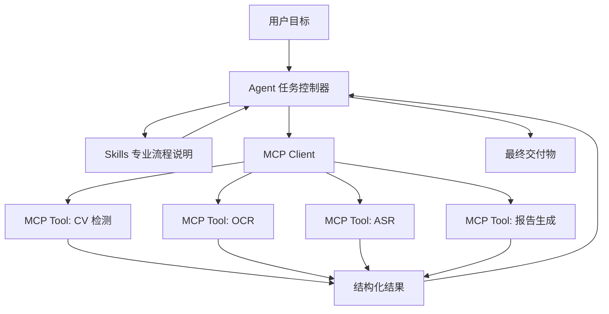
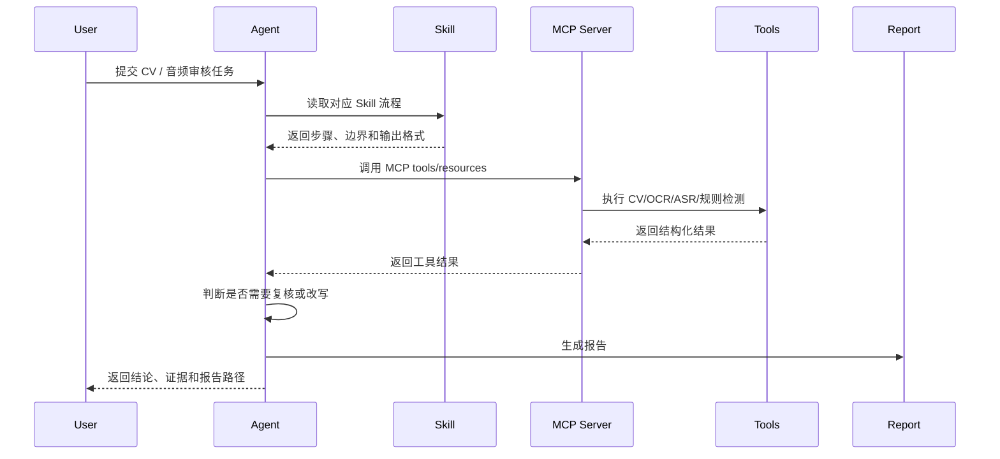

# MCP Agent Skills 开发实战

这篇文章整理 `MCP`、`Agent`、`Skills` 三类开发概念，以及它们在真实任务中的组合方式。为了避免停留在“查天气、查数据库”这种简单例子，下面以两个更接近工程落地的场景说明：

- `CV 质检 Agent`：对生产线图片做缺陷检测、OCR、规则判断和报告生成。
- `音频广告审核 Agent`：对广告音频做转写、敏感词检测、响度检测、时长检测和整改建议。

这三个概念可以先粗略理解成：

```text
MCP = 工具接入协议
Agent = 任务规划和执行控制器
Skills = 可复用的专业工作流能力包
```

[[toc]]

## 1. 三者分别是什么

### 1.1. MCP 是什么

`MCP` 全称是 `Model Context Protocol`，中文可以理解为“模型上下文协议”。

它解决的是：

```text
大模型如何标准化地调用外部工具、读取外部资源、复用提示模板
```

MCP 不是某个具体模型，也不是 Agent 框架。它更像一套接口协议，让不同工具可以用统一方式暴露给大模型或 Agent。

MCP 中常见三类能力：

| 能力 | 含义 | 例子 |
| --- | --- | --- |
| `tools` | 可被模型主动调用的函数能力 | OCR、目标检测、音频转写、生成报告 |
| `resources` | 可读取的上下文资源 | 检测规则、词库、项目配置、素材清单 |
| `prompts` | 可复用的提示模板 | 质检报告模板、广告审核模板、缺陷解释模板 |

如果不用 MCP，Agent 调工具通常要自己约定参数格式、调用方式和返回格式。工具一多，就会非常乱。

用了 MCP 后，每个工具都可以标准化描述：

- 工具叫什么。
- 参数是什么。
- 返回什么。
- 错误如何表达。
- 哪些资源可以被读取。

### 1.2. Agent 是什么

`Agent` 可以理解为“带目标的自动执行器”。它不只是回答问题，而是围绕一个目标反复执行：

```text
理解任务 -> 制定计划 -> 调用工具 -> 观察结果 -> 修正计划 -> 输出结果
```

Agent 关注的是流程控制：

- 先做什么，后做什么。
- 当前结果是否足够。
- 是否需要继续调用工具。
- 工具失败后怎么降级。
- 最终结果如何汇总。

以 CV 质检为例，Agent 不是简单问模型“图片有没有问题”，而是会拆成：

1. 读取图片元数据。
2. 调用目标检测模型找零件区域。
3. 调用 OCR 读取标签文字。
4. 调用缺陷检测模型判断划痕、污渍、缺件。
5. 根据质检规则判断是否合格。
6. 生成结构化报告。

### 1.3. Skills 是什么

`Skills` 可以理解为“可复用的专业能力包”。

它不是简单函数，而是把某类任务的经验沉淀下来，例如：

- 任务适用场景。
- 输入输出约定。
- 步骤顺序。
- 质量标准。
- 常见错误。
- 可调用工具。
- 示例和模板。

在 Codex 或 Agent 工程里，Skill 常见形态是一个 `SKILL.md`，里面写明：

```text
什么时候使用这个 skill
任务怎么拆
应该调用哪些工具
输出格式是什么
需要注意哪些边界
```

Skill 的价值是把专家经验固化下来。这样 Agent 下次遇到相似任务，不需要从零思考。

## 2. MCP、Agent、Skills 的关系

三者关系可以画成这样：



分层理解：

| 层级 | 负责什么 | 不负责什么 |
| --- | --- | --- |
| Skills | 固化领域工作流和经验 | 不直接执行底层工具 |
| Agent | 规划、调度、纠错、汇总 | 不应该把所有工具逻辑写死 |
| MCP | 标准化暴露工具和资源 | 不负责自主规划 |
| 工具服务 | 真正执行 OCR、CV、ASR、检测、导出 | 不负责理解用户完整目标 |

一句话总结：

```text
Skills 告诉 Agent 怎么做，Agent 决定下一步做什么，MCP 让 Agent 能稳定调用外部工具。
```

## 3. 开发一个 MCP Server

下面用 `CV 质检` 和 `音频广告审核` 做例子。重点不是代码能不能直接复制运行，而是看清楚 MCP 工具应该如何设计。

### 3.1. 场景一：CV 质检 MCP Server

需求：

```text
输入一批生产线图片，自动识别零件、标签、缺陷，并输出质检结论。
```

MCP Server 可以暴露这些工具：

| 工具 | 参数 | 返回 |
| --- | --- | --- |
| `inspect_image_batch` | 图片目录、批次号、规则版本 | 批量检测任务结果 |
| `detect_defects` | 单张图片路径、检测阈值 | 缺陷框、缺陷类别、置信度 |
| `run_ocr` | 图片路径、区域坐标 | OCR 文本和置信度 |
| `load_inspection_rules` | 产品型号、规则版本 | 质检规则 |
| `render_inspection_report` | 检测结果、输出目录 | HTML / PDF 报告路径 |

一个接近工程结构的 MCP Server 伪代码：

```python
from pathlib import Path
from typing import Any

from mcp.server.fastmcp import FastMCP

mcp = FastMCP("cv-inspection-server")


@mcp.resource("inspection://rules/{product_code}/{version}")
def load_inspection_rules(product_code: str, version: str) -> dict[str, Any]:
    return {
        "product_code": product_code,
        "version": version,
        "required_labels": ["SN", "MODEL", "QC"],
        "defect_thresholds": {
            "scratch": 0.62,
            "stain": 0.58,
            "missing_part": 0.72
        },
        "reject_rules": [
            "missing_part.confidence >= 0.72",
            "scratch.area_ratio > 0.08",
            "required_label_missing == true"
        ]
    }


@mcp.tool()
def detect_defects(image_path: str, threshold: float = 0.6) -> dict[str, Any]:
    # 真实工程中这里会调用 YOLO、Detectron2、GroundingDINO 或内部检测服务。
    # 返回结构要稳定，方便 Agent 后续做规则判断。
    return {
        "image_path": image_path,
        "detections": [
            {
                "label": "scratch",
                "confidence": 0.81,
                "box": [118, 72, 260, 128],
                "area_ratio": 0.031
            },
            {
                "label": "missing_part",
                "confidence": 0.76,
                "box": [420, 210, 486, 296],
                "area_ratio": 0.022
            }
        ],
        "threshold": threshold
    }


@mcp.tool()
def run_ocr(image_path: str, regions: list[list[int]]) -> dict[str, Any]:
    # 真实工程中这里会调用 PaddleOCR、Tesseract 或云 OCR。
    return {
        "image_path": image_path,
        "texts": [
            {
                "region": regions[0],
                "text": "MODEL: AX-1024",
                "confidence": 0.96
            },
            {
                "region": regions[1],
                "text": "SN: 202606030018",
                "confidence": 0.94
            }
        ]
    }


@mcp.tool()
def inspect_image_batch(
    image_dir: str,
    product_code: str,
    rule_version: str,
    output_dir: str
) -> dict[str, Any]:
    rules = load_inspection_rules(product_code, rule_version)
    image_paths = sorted(Path(image_dir).glob("*.jpg"))
    samples = []

    for image_path in image_paths:
        defect_result = detect_defects(str(image_path), threshold=0.6)
        ocr_result = run_ocr(
            str(image_path),
            regions=[[20, 20, 320, 90], [20, 90, 360, 150]]
        )
        decision = apply_cv_rules(defect_result, ocr_result, rules)
        samples.append({
            "image_path": str(image_path),
            "defects": defect_result["detections"],
            "ocr": ocr_result["texts"],
            "decision": decision
        })

    report_path = render_inspection_report(samples, output_dir)
    return {
        "batch": Path(image_dir).name,
        "product_code": product_code,
        "rule_version": rule_version,
        "total": len(samples),
        "failed": sum(1 for item in samples if item["decision"]["status"] == "reject"),
        "report_path": report_path,
        "samples": samples
    }


def apply_cv_rules(defect_result: dict, ocr_result: dict, rules: dict) -> dict[str, Any]:
    labels = {item["label"] for item in defect_result["detections"]}
    ocr_text = "\n".join(item["text"] for item in ocr_result["texts"])
    missing_labels = [
        label for label in rules["required_labels"]
        if label not in ocr_text
    ]

    reasons = []
    if "missing_part" in labels:
        reasons.append("检测到缺件")
    if missing_labels:
        reasons.append(f"标签缺失: {', '.join(missing_labels)}")

    return {
        "status": "reject" if reasons else "pass",
        "reasons": reasons
    }


def render_inspection_report(samples: list[dict], output_dir: str) -> str:
    Path(output_dir).mkdir(parents=True, exist_ok=True)
    report_path = Path(output_dir) / "inspection-report.html"
    report_path.write_text("<html><body>inspection report</body></html>", encoding="utf-8")
    return str(report_path)


if __name__ == "__main__":
    mcp.run()
```

这个例子比“查天气”复杂，因为它有：

- 多张图片批处理。
- CV 检测。
- OCR。
- 规则资源。
- 结构化判断。
- 报告产物。

MCP 的重点不是让模型自己看图片，而是把“图像模型、OCR、规则系统、报告生成器”这些外部能力包装成稳定工具。

### 3.2. 场景二：音频广告审核 MCP Server

需求：

```text
输入一段广告音频，检查是否存在敏感表达、时长不合规、响度异常、免责声明缺失等问题。
```

MCP Server 可以暴露这些工具：

| 工具 | 参数 | 返回 |
| --- | --- | --- |
| `transcribe_audio` | 音频路径、语言 | ASR 文本、时间戳 |
| `measure_loudness` | 音频路径 | LUFS、峰值、时长 |
| `scan_ad_policy` | 文案、行业、规则版本 | 违规项、风险等级 |
| `suggest_rewrite` | 原文、违规项 | 修改建议 |
| `render_audio_ad_report` | 审核结果 | 报告文件 |

伪代码：

```python
from typing import Any

from mcp.server.fastmcp import FastMCP

mcp = FastMCP("audio-ad-review-server")


@mcp.resource("ad-policy://{industry}/{version}")
def load_ad_policy(industry: str, version: str) -> dict[str, Any]:
    return {
        "industry": industry,
        "version": version,
        "sensitive_phrases": ["最便宜", "保证治愈", "100%有效", "永久收益"],
        "required_disclaimer": ["具体效果因人而异"],
        "max_duration_seconds": 30,
        "target_lufs": -16,
        "max_true_peak_db": -1
    }


@mcp.tool()
def transcribe_audio(audio_path: str, language: str = "zh") -> dict[str, Any]:
    # 真实工程中这里可接 Whisper、FunASR、Paraformer 或内部 ASR 服务。
    return {
        "audio_path": audio_path,
        "language": language,
        "segments": [
            {"start": 0.0, "end": 4.8, "text": "这款产品是全网最便宜的选择"},
            {"start": 4.8, "end": 13.2, "text": "使用后效果明显，具体效果因人而异"}
        ],
        "text": "这款产品是全网最便宜的选择。使用后效果明显，具体效果因人而异。"
    }


@mcp.tool()
def measure_loudness(audio_path: str) -> dict[str, Any]:
    # 真实工程中这里可调用 ffmpeg / pyloudnorm / ebur128。
    return {
        "audio_path": audio_path,
        "duration_seconds": 32.4,
        "integrated_lufs": -12.8,
        "true_peak_db": -0.3
    }


@mcp.tool()
def scan_ad_policy(text: str, industry: str, version: str) -> dict[str, Any]:
    policy = load_ad_policy(industry, version)
    violations = []

    for phrase in policy["sensitive_phrases"]:
        if phrase in text:
            violations.append({
                "type": "sensitive_phrase",
                "phrase": phrase,
                "severity": "high",
                "reason": "广告文案包含绝对化或承诺性表达"
            })

    for disclaimer in policy["required_disclaimer"]:
        if disclaimer not in text:
            violations.append({
                "type": "missing_disclaimer",
                "phrase": disclaimer,
                "severity": "medium",
                "reason": "缺少必要免责声明"
            })

    return {
        "industry": industry,
        "version": version,
        "risk_level": "high" if any(v["severity"] == "high" for v in violations) else "low",
        "violations": violations
    }


@mcp.tool()
def review_audio_ad(audio_path: str, industry: str, rule_version: str) -> dict[str, Any]:
    transcript = transcribe_audio(audio_path)
    loudness = measure_loudness(audio_path)
    policy_result = scan_ad_policy(transcript["text"], industry, rule_version)
    policy = load_ad_policy(industry, rule_version)

    technical_issues = []
    if loudness["duration_seconds"] > policy["max_duration_seconds"]:
        technical_issues.append({
            "type": "duration_exceeded",
            "value": loudness["duration_seconds"],
            "limit": policy["max_duration_seconds"]
        })
    if loudness["integrated_lufs"] > policy["target_lufs"] + 2:
        technical_issues.append({
            "type": "too_loud",
            "value": loudness["integrated_lufs"],
            "target": policy["target_lufs"]
        })

    return {
        "audio_path": audio_path,
        "transcript": transcript,
        "loudness": loudness,
        "policy": policy_result,
        "technical_issues": technical_issues,
        "final_status": "reject" if policy_result["violations"] or technical_issues else "pass"
    }
```

这个 MCP Server 不只是“识别音频文字”，它把广告审核拆成了：

```text
ASR 转写
响度测量
时长测量
规则扫描
整改建议
审核报告
```

这就是 MCP 在真实任务里的价值：让 Agent 可以稳定调用多个专业工具，而不是让大模型凭空判断。

## 4. 开发一个 Agent

Agent 不应该把所有业务逻辑写在一个巨大的 prompt 里。更合理的方式是：

```text
Agent 负责规划和调度
MCP Server 负责工具执行
Skill 负责沉淀专业流程
```

### 4.1. CV 质检 Agent 的执行流程

用户目标：

```text
检查今天 3 号线 AX-1024 批次的 200 张质检图片，生成不合格样本报告。
```

Agent 应该拆成：

1. 读取产品型号和规则版本。
2. 调用 MCP resource 获取质检规则。
3. 调用 `inspect_image_batch` 做批量检测。
4. 对 reject 样本做二次复核。
5. 生成报告摘要。
6. 输出复核建议。

Agent 控制器伪代码：

```python
class CvInspectionAgent:
    def __init__(self, mcp_client, llm):
        self.mcp = mcp_client
        self.llm = llm

    def run(self, image_dir: str, product_code: str, rule_version: str) -> dict:
        rules = self.mcp.read_resource(
            f"inspection://rules/{product_code}/{rule_version}"
        )

        batch_result = self.mcp.call_tool(
            "inspect_image_batch",
            {
                "image_dir": image_dir,
                "product_code": product_code,
                "rule_version": rule_version,
                "output_dir": "reports/cv-inspection"
            }
        )

        reject_samples = [
            item for item in batch_result["samples"]
            if item["decision"]["status"] == "reject"
        ]

        review_prompt = self.build_review_prompt(rules, reject_samples[:20])
        review_summary = self.llm.generate(review_prompt)

        return {
            "status": "done",
            "total": batch_result["total"],
            "failed": batch_result["failed"],
            "report_path": batch_result["report_path"],
            "review_summary": review_summary
        }

    def build_review_prompt(self, rules: dict, samples: list[dict]) -> str:
        return f"""
你是生产线视觉质检复核员。

请根据质检规则和不合格样本，输出：
1. 主要不合格类型
2. 是否可能存在误检
3. 下一步人工复核优先级
4. 给产线的整改建议

质检规则：
{rules}

不合格样本：
{samples}
"""
```

注意这里的 LLM 只做“复核总结”和“建议生成”，不直接代替 CV 模型判断图片缺陷。

合理边界是：

```text
CV 模型负责看图
OCR 工具负责读字
规则引擎负责判定
LLM 负责解释和汇总
Agent 负责串流程
```

### 4.2. 音频广告审核 Agent 的执行流程

用户目标：

```text
审核这批 30 秒音频广告，检查是否合规，并给出可修改文案。
```

Agent 拆解：

1. 调用 ASR 转写音频。
2. 调用响度检测工具。
3. 读取广告审核规则。
4. 调用规则扫描。
5. 对违规句子生成改写建议。
6. 输出审核表。

Agent 伪代码：

```python
class AudioAdReviewAgent:
    def __init__(self, mcp_client, llm):
        self.mcp = mcp_client
        self.llm = llm

    def run(self, audio_path: str, industry: str, rule_version: str) -> dict:
        review = self.mcp.call_tool(
            "review_audio_ad",
            {
                "audio_path": audio_path,
                "industry": industry,
                "rule_version": rule_version
            }
        )

        rewrite_plan = None
        if review["final_status"] == "reject":
            rewrite_plan = self.rewrite_ad_copy(review)

        return {
            "audio_path": audio_path,
            "final_status": review["final_status"],
            "risk_level": review["policy"]["risk_level"],
            "violations": review["policy"]["violations"],
            "technical_issues": review["technical_issues"],
            "rewrite_plan": rewrite_plan
        }

    def rewrite_ad_copy(self, review: dict) -> str:
        prompt = f"""
你是广告合规审核助手。

请根据违规原因改写广告文案。
要求：
- 不使用绝对化承诺
- 保留原始卖点
- 保留必要免责声明
- 输出 15 秒和 30 秒两个版本

ASR 原文：
{review["transcript"]["text"]}

违规项：
{review["policy"]["violations"]}

技术问题：
{review["technical_issues"]}
"""
        return self.llm.generate(prompt)
```

这个 Agent 的重点是：

- 不让 LLM 自己猜音频内容，先通过 ASR 拿文本。
- 不让 LLM 自己猜响度，先通过工具测量。
- 不让 LLM 自己记规则，先读取规则资源。
- LLM 主要负责解释、总结和改写。

## 5. 开发 Skills

Skill 是把一类任务沉淀成可复用规则。它不一定是代码，也可以是一个规范化说明文件。

### 5.1. CV 质检 Skill 示例

可以创建一个 `cv-inspection-skill/SKILL.md`：

```md
# CV Inspection Skill

## 什么时候使用

当用户要求对图片、生产线照片、零件照片、包装照片进行质量检查、缺陷识别、OCR 标签核对或批量质检报告生成时使用。

## 输入

- 图片目录或图片列表
- 产品型号
- 质检规则版本
- 输出报告目录

## 工作流程

1. 确认产品型号和规则版本。
2. 读取 MCP resource: `inspection://rules/{product_code}/{version}`。
3. 调用 MCP tool: `inspect_image_batch`。
4. 对 reject 样本按缺陷类型聚合。
5. 生成质检摘要。
6. 输出人工复核建议。

## 质量标准

- 每个 reject 样本必须包含原因。
- 缺陷类结论必须包含 confidence。
- OCR 类结论必须包含识别文本和置信度。
- 最终报告必须包含 total、failed、pass_rate、report_path。

## 禁止事项

- 不允许只凭 LLM 视觉想象判断缺陷。
- 不允许忽略 OCR 置信度。
- 不允许把低置信度结果写成确定性结论。
```

这个 Skill 的价值是：Agent 下次再做 CV 质检时，不需要重新设计流程。

### 5.2. 音频广告审核 Skill 示例

可以创建一个 `audio-ad-review-skill/SKILL.md`：

```md
# Audio Ad Review Skill

## 什么时候使用

当用户要求审核广告音频、广告口播、短视频旁白、直播切片音频是否合规时使用。

## 输入

- 音频文件路径
- 行业类型
- 审核规则版本
- 目标投放平台

## 工作流程

1. 调用 `transcribe_audio` 获取 ASR 文本和时间戳。
2. 调用 `measure_loudness` 获取时长、LUFS、true peak。
3. 读取 `ad-policy://{industry}/{version}`。
4. 调用 `scan_ad_policy` 检测敏感表达和免责声明。
5. 如果不合规，生成整改文案。
6. 输出审核报告。

## 输出格式

- final_status: pass / reject
- risk_level: low / medium / high
- transcript
- violations
- technical_issues
- rewrite_plan

## 注意事项

- ASR 低置信度片段需要标记为需要人工复核。
- 音频超长和文案违规是两类问题，不能混在一起。
- 改写建议不能改变产品事实。
```

这个 Skill 更像一个“专业 SOP”。Agent 读取它后，会更稳定地执行广告审核，而不是每次都靠模型临时发挥。

## 6. 三者组合后的完整工程形态

一个完整工程通常长这样：

```text
ai-workflow/
├─ agents/
│  ├─ cv_inspection_agent.py
│  └─ audio_ad_review_agent.py
├─ mcp_servers/
│  ├─ cv_inspection_server.py
│  └─ audio_ad_review_server.py
├─ skills/
│  ├─ cv-inspection-skill/
│  │  └─ SKILL.md
│  └─ audio-ad-review-skill/
│     └─ SKILL.md
├─ rules/
│  ├─ inspection/
│  └─ ad-policy/
├─ reports/
└─ README.md
```

调用链路：



## 7. 开发时的设计原则

### 7.1. MCP 工具要稳定

工具返回值要结构化，不要只返回一句自然语言。

推荐：

```json
{
  "status": "reject",
  "reason": ["检测到缺件", "标签缺失: QC"],
  "confidence": 0.76,
  "evidence": {
    "image_path": "batch/001.jpg",
    "box": [420, 210, 486, 296]
  }
}
```

不推荐：

```text
这张图好像有点问题，可能不合格。
```

### 7.2. Agent 要能处理失败

真实工具会失败，例如：

- OCR 置信度低。
- 图片路径不存在。
- ASR 转写失败。
- 音频编码格式不支持。
- 规则版本不存在。

Agent 应该设计降级逻辑：

```text
工具失败 -> 记录错误 -> 尝试备用工具 -> 仍失败则标记人工复核
```

### 7.3. Skills 要写边界

Skill 不能只写“怎么做”，还要写“不能怎么做”。

例如 CV 质检 Skill 必须写：

```text
不允许只凭 LLM 视觉想象判断缺陷
```

音频广告 Skill 必须写：

```text
不允许在没有 ASR 文本和规则证据的情况下给出违规结论
```

### 7.4. 报告要包含证据

真实工程里，结论必须可复核。

CV 报告至少包含：

- 原图路径。
- 缺陷框。
- 缺陷类别。
- 置信度。
- OCR 文本。
- 质检规则。

音频广告报告至少包含：

- ASR 文本。
- 时间戳。
- 敏感词命中位置。
- 响度指标。
- 时长指标。
- 改写建议。

## 8. 一句话总结

`MCP`、`Agent`、`Skills` 不是互相替代的关系，而是三层协作：

```text
MCP 让工具可调用
Agent 让任务可执行
Skills 让经验可复用
```

如果任务只是简单查询，用一个工具函数就够了。  
如果任务是 CV 质检、音频广告审核、视频生成、论文实验、代码迁移这类多步骤工作，就需要：

```text
Skills 定义专业流程
Agent 负责规划和决策
MCP Server 暴露真实工具
外部模型和系统完成具体计算
```

这才是 MCP、Agent 和 Skills 在工程开发里的真实价值。
