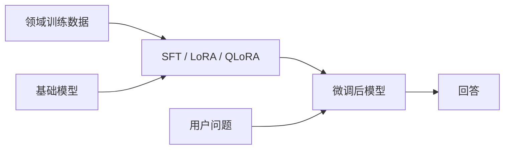
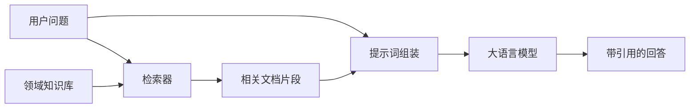
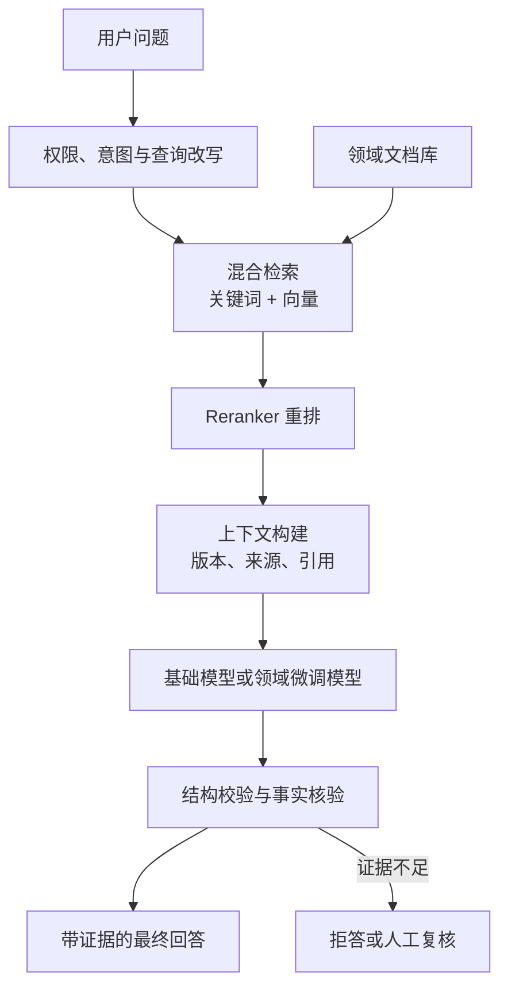
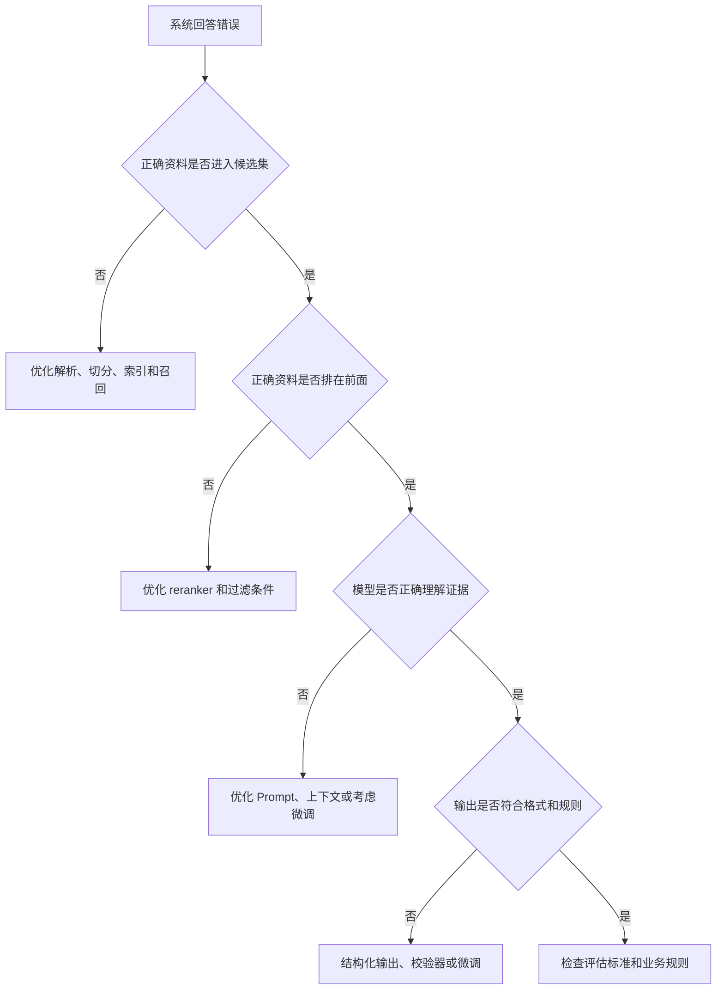

# 微调模型与 RAG 系统的区别及垂直领域选型

在大语言模型落地过程中，经常会遇到一个选择：

> 应该直接训练或微调模型，还是建设 RAG 系统？

可以先记住两句话：

```text
微调模型：把任务模式、行为习惯和领域表达写进模型参数。
RAG 系统：不修改模型参数，在回答前检索外部资料供模型参考。
```

更简洁地说：

> **RAG 主要解决“模型当前需要知道什么”，微调主要解决“模型应该怎样完成任务”。**

对于知识非常精细的垂直领域，通常不是二选一，而是先建设高质量 RAG，再根据评估结果决定是否增加轻量微调。

[[toc]]

## 1. 先区分预训练、继续预训练和微调

“直接训练模型”可能表示不同事情，不能全部混为微调。

| 训练方式 | 英文名称 | 修改参数 | 主要目的 | 数据形式 |
| --- | --- | --- | --- | --- |
| 从头预训练 | Pre-training from Scratch | 是 | 从零学习语言和通用知识 | 海量无标注文本 |
| 领域继续预训练 | Domain-Adaptive Pre-training，DAPT | 是 | 学习领域语料分布、术语和表达 | 大量领域原始文本 |
| 监督微调 | Supervised Fine-Tuning，SFT | 是 | 学习任务步骤、回答方式和输出格式 | 高质量指令与答案 |
| 参数高效微调 | PEFT / LoRA / QLoRA | 部分或附加参数 | 低成本改变模型行为 | 高质量指令与答案 |
| 偏好对齐 | DPO / RLHF 等 | 是 | 让输出更符合人的偏好或规则 | 偏好对、奖励数据 |
| RAG | Retrieval-Augmented Generation | 否 | 动态获取外部知识 | 文档库、索引和检索结果 |

实际项目中，普通团队很少从头训练基础大模型，因为它需要：

- 海量高质量语料。
- 大规模 GPU 集群。
- 分布式训练工程。
- 长周期的数据治理与模型评估。

大部分“训练自己的模型”，实际指的是在现有基础模型上进行 `SFT`、`LoRA`、`QLoRA` 或领域继续预训练。

## 2. 微调与 RAG 的工作流程

### 2.1. 微调模型

微调阶段先使用训练数据更新模型参数，部署后直接进行推理。



例如，准备很多这样的训练样本：

```json
{
  "instruction": "分析下面论文摘要",
  "input": "论文摘要内容……",
  "output": {
    "research_question": "研究问题",
    "method": "研究方法",
    "contribution": "主要贡献",
    "limitations": "研究局限"
  }
}
```

模型通过微调学习：

- 如何识别任务。
- 应该采用什么分析顺序。
- 应该使用哪些领域术语。
- 应该输出什么结构。

它并不等于可靠地记住训练集中每一份文档。

### 2.2. RAG 系统

`RAG` 全称为 `Retrieval-Augmented Generation`，即检索增强生成。

它在回答问题前先查找外部资料：



知识库可以包含：

- 论文和技术报告。
- 企业制度和产品手册。
- 医疗指南、法律法规或行业标准。
- 数据库记录和实验结果。
- 历史案例、故障记录和专家经验。

文档发生变化时，只需要重新解析或更新索引，不需要重新训练模型。

## 3. 核心区别

| 对比项 | 微调模型 | RAG 系统 |
| --- | --- | --- |
| 是否修改模型参数 | 修改 | 不修改 |
| 主要解决的问题 | 任务行为、格式、风格、领域表达 | 外部知识、私有知识、最新资料 |
| 知识更新方式 | 重新训练或继续微调 | 更新文档和索引 |
| 数据要求 | 高质量训练样本 | 高质量原始文档和元数据 |
| 建设成本 | 训练、算力、数据标注和模型版本管理 | 文档解析、索引、检索、重排和引用 |
| 迭代速度 | 相对较慢 | 相对较快 |
| 可追溯性 | 参数中的知识难以定位来源 | 可以返回文档出处和引用片段 |
| 幻觉控制 | 微调本身不保证减少幻觉 | 检索准确且有证据约束时更容易控制 |
| 私有知识使用 | 可能学入参数，但难更新和删除 | 查询时动态读取，权限更容易控制 |
| 典型场景 | 分类、抽取、固定格式、专业话术 | 文档问答、政策查询、论文分析 |

两者都有工程成本，只是成本位置不同：

```text
微调的难点集中在训练数据、算力、训练稳定性和模型评估。
RAG 的难点集中在文档处理、召回、重排、上下文组织和引用验证。
```

## 4. 一个论文助手的对比例子

假设系统需要回答：

> 这篇论文的创新点是什么？

### 4.1. 使用 RAG

处理流程：

1. 解析 PDF 的标题、摘要、方法、实验和结论。
2. 根据问题检索相关章节。
3. 对候选片段进行重排。
4. 将高相关片段和问题交给模型。
5. 要求模型基于证据回答并标注出处。

优点：

- 新增论文后不需要重新训练。
- 可以引用页码、章节或文档。
- 用户可以核对回答依据。

局限：

- 文档解析错误会影响答案。
- 切分不合理可能破坏上下文。
- 检索不到关键片段时，模型没有可靠依据。

### 4.2. 使用微调

可以准备大量“论文内容到结构化分析结果”的监督样本，让模型学习固定分析方法：

```text
研究问题 -> 使用方法 -> 主要贡献 -> 实验依据 -> 局限性
```

优点：

- 输出结构更稳定。
- 更容易形成统一的分析风格。
- 可以学习领域术语和细粒度标签。

局限：

- 新论文不会自动进入模型知识。
- 训练样本中的事实不一定被完整、准确地记住。
- 难以说明某个结论具体来自哪一页。

因此，论文助手通常采用：

```text
RAG 提供论文证据
+ Prompt 约束分析任务
+ 必要时微调固定分析方法
```

## 5. 为什么不能把微调当作知识库

将大量文档转换成训练语料，不代表模型能像数据库一样准确存取事实。

主要原因包括：

### 5.1. 参数记忆不是精确存储

模型学习的是文本中的统计规律，而不是建立可精确查询的文档表。

它可能：

- 记住部分高频内容。
- 混合多个相似事实。
- 在相近概念之间产生错误关联。
- 无法返回事实对应的原始文档位置。

### 5.2. 知识难以更新

如果一项规则从 `2025 版` 更新为 `2026 版`，参数中可能同时存在新旧模式。重新微调也不一定能确保旧知识完全消失。

RAG 可以通过：

- 替换旧文档。
- 标记生效时间。
- 按版本过滤。
- 按用户权限检索。

来控制模型本次能看到什么。

### 5.3. 删除和合规更困难

如果敏感数据进入模型参数，后续删除和验证遗忘都比较困难。RAG 把知识保留在外部系统，更容易实施访问控制、审计和删除。

## 6. 为什么只有 RAG 也不一定够

高质量 RAG 只能确保“资料有机会被找到并交给模型”，不能自动保证模型能够正确使用资料。

精细垂直领域里常见的问题包括：

- 检索到了资料，但模型没有识别关键条件。
- 相似术语容易混淆。
- 模型不会遵循领域判断顺序。
- 输出不像专业报告。
- 分类标签和字段不稳定。
- 面对冲突证据时不会按业务规则处理。

例如医疗、金融、法律、工业质检等领域，结论通常不是把一句原文复制出来，而是需要：

```text
识别对象
-> 确定适用规则
-> 检查前置条件
-> 比较多个证据
-> 执行专业判断
-> 输出结论和依据
```

如果模型反复在这些固定步骤上出错，微调才有明确价值。

## 7. 精细垂直领域应该如何选择

推荐结论是：

> **RAG 优先，微调辅助；知识放在外部系统，稳定的任务能力再考虑写入模型参数。**

### 7.1. 优先使用 RAG 的情况

- 知识经常更新。
- 回答必须引用来源。
- 数据包含企业私有文档。
- 不同用户只能访问不同资料。
- 需要按地区、时间、版本或产品过滤。
- 任务主要是查询、总结和证据问答。

典型场景：

| 场景 | 原因 |
| --- | --- |
| 企业制度问答 | 制度会更新，而且需要指出依据。 |
| 法规与标准查询 | 必须区分版本、生效时间和适用范围。 |
| 论文知识库 | 新论文持续增加，需要引用原文。 |
| 产品支持 | 产品型号、手册和故障记录不断变化。 |
| 项目文档助手 | 需要读取当前代码、设计文档和数据库。 |

### 7.2. 更适合微调的情况

- 输入输出关系固定。
- 标签体系稳定。
- 已有足够多高质量标注样本。
- 模型经常不遵循固定业务步骤。
- 输出格式、术语或语气要求高度一致。
- 希望让小模型学习大模型在特定任务上的能力。

典型场景：

| 场景 | 微调目标 |
| --- | --- |
| 文本细粒度分类 | 学习稳定标签边界。 |
| 信息抽取 | 稳定输出实体、关系和字段。 |
| 客服回复 | 学习统一话术和处理流程。 |
| 论文审稿辅助 | 学习固定审稿维度和输出结构。 |
| 领域报告生成 | 学习专业术语、模板和表达方式。 |

### 7.3. 适合 RAG 与微调结合的情况

- 知识持续变化，但分析方法相对稳定。
- 既需要引用证据，又需要专家式判断。
- 系统需要复杂领域流程或专业 Agent。
- 基础模型能够阅读资料，但行为不够稳定。

例如一个专业科研助手：

```text
RAG：检索论文原文、实验数据、公式和表格。
微调：学习研究问题、方法、贡献、局限的分析框架。
Prompt：描述本次任务的具体要求。
工具：执行代码、统计检验或图表分析。
```

## 8. 垂直领域推荐架构



这套架构中各组件职责不同：

| 组件 | 主要职责 |
| --- | --- |
| 文档库 | 保存领域事实、规则和最新资料。 |
| 混合检索 | 同时利用关键词精确匹配和语义召回。 |
| Reranker | 从候选文档中选出最相关证据。 |
| Prompt / Workflow | 描述当前任务和处理步骤。 |
| 微调模型 | 稳定执行领域任务和输出形式。 |
| 校验器 | 检查字段、引用、数值和规则是否有效。 |
| 人工复核 | 处理高风险或证据不足的结果。 |

## 9. RAG 的关键工程步骤

一个可靠的 RAG 系统不只是“把 PDF 存进向量数据库”。

### 9.1. 文档治理

需要保存：

- 文档名称和唯一 ID。
- 来源、作者和发布时间。
- 版本、生效时间和失效时间。
- 业务类型、产品型号和所属部门。
- 访问权限和保密级别。

如果元数据不完整，就很难处理“只检索当前有效法规”这类条件。

### 9.2. 文档切分

切分策略要服从文档结构：

- 普通说明文档可以按标题和段落切分。
- 法规应保留章、节、条、款层级。
- 论文应区分摘要、方法、实验和结论。
- 表格应保留表头和单位。
- 代码文档应尽量保留类、函数或模块边界。

切得太小会丢失上下文，切得太大又会引入大量无关内容。

### 9.3. 混合检索

精细领域常常同时需要：

```text
关键词检索：适合型号、法规编号、药品名、错误码等精确词。
向量检索：适合语义相近但表达不同的问题。
```

可以将两种检索结果融合，再交给 reranker。

### 9.4. 重排

第一阶段召回追求“不要漏”，reranker 负责从候选片段中挑出真正相关的内容。

没有重排时，模型可能收到很多表面相似但不适用的片段。

### 9.5. 引用与拒答

最终回答应该能够返回：

- 文档名称。
- 章节或页码。
- 规则版本。
- 引用片段。

如果没有足够证据，应明确输出：

```text
当前知识库中没有找到足够依据，无法可靠回答。
```

这比依靠模型补全一个看似合理的答案更安全。

## 10. 微调的关键工程步骤

### 10.1. 先定义要改变什么

不要用“让模型更懂领域”作为模糊目标。应改成可评估目标，例如：

- 分类 F1 从 0.78 提高到 0.88。
- JSON 格式有效率达到 99%。
- 领域术语使用准确率达到 95%。
- 固定业务步骤遵循率达到 98%。

### 10.2. 准备高质量数据

微调数据应包含：

- 真实业务输入。
- 专家认可的输出。
- 困难样本和边界样本。
- 容易混淆的负例。
- 不应回答或需要拒答的样本。

少量高质量样本通常比大量低质量合成数据更有价值。

### 10.3. 划分训练集与测试集

训练数据不能同时用于证明模型效果。至少需要：

```text
训练集：更新参数。
验证集：选择参数和训练轮次。
测试集：最终评估，不能参与训练。
```

还应建立独立的业务回归集，防止新模型修复一个问题后破坏其他能力。

### 10.4. 从轻量方法开始

通常可以按成本逐步尝试：

```text
Prompt / Structured Output
-> Few-shot
-> RAG
-> LoRA / QLoRA
-> 全参数微调
-> 领域继续预训练
```

如果 Prompt 和工作流已经能稳定解决问题，就没有必要为了“使用微调”而增加训练复杂度。

## 11. 最重要的错误归因

在决定微调前，先判断错误发生在哪一层。



可以用下面的表格快速定位：

| 错误表现 | 优先处理方向 |
| --- | --- |
| 根本没找到正确文档 | 优化 RAG 召回 |
| 找到了，但被错误文档挤掉 | 优化 reranker |
| 文档版本不对 | 完善元数据和过滤条件 |
| 证据正确，但模型理解错误 | Prompt、工作流或微调 |
| 答案内容正确但格式不稳定 | 结构化输出或微调 |
| 标签边界长期混乱 | 增加边界样本并微调 |
| 没有证据仍然强行回答 | 引用约束、拒答和评估 |

最常见的错误是：

> 明明是检索系统没有找到正确资料，却通过微调模型试图补救。

这种做法通常不能从根本上解决问题。

## 12. 分阶段实施方案

### 12.1. 第一阶段：建立评估基线

先准备一批真实问题，并为每个问题标注：

- 正确答案。
- 所需证据。
- 正确文档。
- 允许和不允许的回答。
- 风险等级。

没有评估集，就无法判断应该改 RAG 还是微调。

### 12.2. 第二阶段：建设基础 RAG

完成：

- 文档解析与清洗。
- 结构化切分。
- 关键词和向量混合检索。
- Reranker。
- 来源引用。
- 证据不足时拒答。

### 12.3. 第三阶段：分析失败案例

将失败分为：

```text
解析失败
召回失败
排序失败
上下文缺失
理解失败
规则执行失败
格式失败
```

先修复占比最高的问题。

### 12.4. 第四阶段：必要时轻量微调

当评估证明“正确证据已经进入上下文，但模型仍然不会按领域方法处理”时，再用高质量样本进行 LoRA 或 QLoRA 微调。

### 12.5. 第五阶段：联合评估

最终评估的是整个系统，而不是只看模型训练损失：

- 检索召回率。
- 重排准确率。
- 答案正确率。
- 引用正确率。
- 格式有效率。
- 拒答准确率。
- 响应时间和成本。
- 高风险任务的人工复核率。

## 13. 常见场景选型

| 需求 | 推荐方案 |
| --- | --- |
| 企业文档问答 | RAG 优先 |
| 最新政策、法规和论文查询 | RAG |
| 固定文本分类 | 微调 |
| 固定字段抽取 | Structured Output，必要时微调 |
| 固定客服话术 | Prompt 或微调 |
| 专业报告生成 | RAG + 模板，必要时微调 |
| 医疗、金融、法律辅助分析 | RAG + 规则 + 人工复核，必要时微调 |
| 垂直领域 Agent | RAG + 工具调用 + 工作流 + 可选微调 |
| 将大模型能力迁移到小模型 | 蒸馏或微调 |
| 让模型掌握大量最新私有资料 | RAG，不应只依赖微调 |

## 14. 最终结论

微调和 RAG 不是互相替代的两个方案，它们解决的是不同层次的问题：

```text
RAG 管理外部知识和证据。
微调塑造模型行为和任务能力。
Prompt 描述当前任务。
Workflow 控制执行步骤。
工具负责获取数据或执行动作。
```

对于非常精细的垂直领域，推荐顺序是：

1. 先建立真实评估集。
2. 建设高质量 RAG 和引用机制。
3. 分析错误发生在检索层还是生成层。
4. 检索正确但模型仍不会专业处理时，再做轻量微调。
5. 高风险场景增加规则校验和人工复核。

一句话总结：

> **知识频繁变化、需要引用时使用 RAG；任务模式稳定、行为需要固化时使用微调；精细垂直领域通常采用高质量 RAG 加少量高质量微调。**
