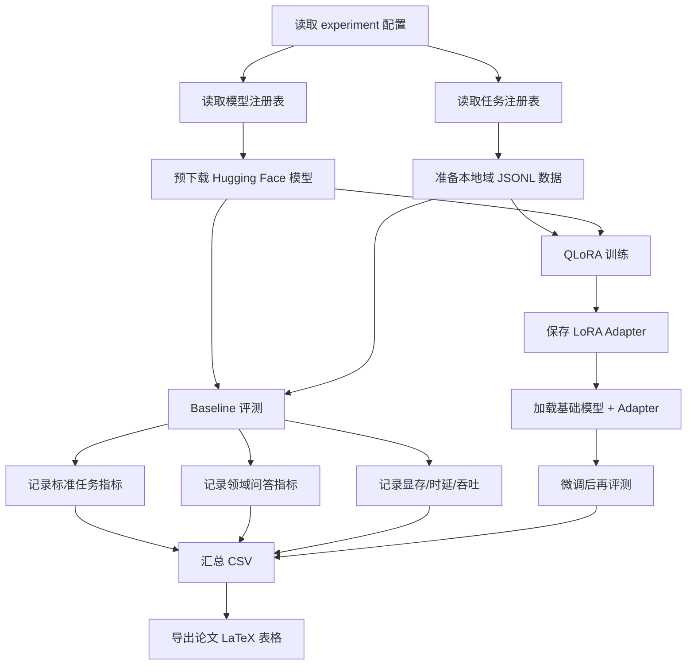

# 1. 资源受限大模型评测与 QLoRA 项目源码导读

这篇是对 `/ds1/workspace/ai/resource-constrained-llm-eval` 项目的系统阅读笔记。假设读者刚接触大语言模型微调，因此会先讲项目整体在做什么，再讲每个 Python 文件的作用，最后把和大模型微调相关的常见框架、方法和本项目中的具体用法整理清楚。

项目主题可以概括为一句话：

> 在单张 RTX 3090 24GB 这类资源受限环境下，对 8B 以内开源大模型做统一评测，并用 QLoRA 做铁路领域适配，再比较微调前后的效果、速度和显存占用。

[[toc]]

## 2. 这个项目到底在做什么

这个项目不是一个普通的聊天机器人项目，而是一个实验型项目，目标更接近论文实验：

1. 选择一批开源大模型。
2. 在同一批任务上跑 baseline 评测。
3. 比较 `bf16`、`int8`、`int4` 等不同精度下的效果和资源消耗。
4. 选择部分模型做 QLoRA 微调。
5. 微调后重新评测。
6. 汇总成 CSV 和 LaTeX 表格，用于论文写作。

项目目标硬件是：

- 单卡 RTX 3090
- 24GB 显存
- CUDA 12.1
- Python 3.10

这就是“资源受限”的含义：不是多卡 A100/H100，而是在单张消费级显卡上尽量完成 4B、7B、8B 级别模型的评测和微调。

## 3. 项目目录怎么读

核心目录如下：

```text
configs/         实验、模型、任务配置
data/            本地域数据集和效率测试提示词
scripts/         环境、下载、评测、微调、汇总脚本
src/             Python 核心代码
results/         评测和训练输出
paper/           论文 LaTeX 工作区
```

如果是新手，建议按这个顺序读：

1. `README-CN.md`：先理解项目目标和命令。
2. `configs/experiments/single_gpu_3090.yaml`：看实验怎么配置。
3. `configs/models/models.yaml`：看有哪些模型。
4. `configs/datasets/tasks.yaml`：看有哪些任务和数据集。
5. `src/rc_llm_eval/cli.py`：看命令入口。
6. `src/rc_llm_eval/pipelines/baseline.py`：看 baseline 怎么评测。
7. `src/rc_llm_eval/pipelines/qlora.py`：看 QLoRA 怎么训练。
8. `src/rc_llm_eval/utils/modeling.py`：看模型、分词器、量化和 PEFT adapter 怎么加载。

## 4. 一张图看完整流程



## 5. 配置文件：项目的实验说明书

### 5.1. 主实验配置

路径：

```text
configs/experiments/single_gpu_3090.yaml
```

它定义了实验环境、baseline 模型列表、任务列表、量化模式和 QLoRA 参数。

关键配置：

```yaml
experiment:
  name: single_gpu_3090
  device: cuda:0
  gpu_name: RTX_3090
  vram_gb: 24
  seed: 42
  output_root: results/single_gpu_3090
```

含义：

- `device: cuda:0`：使用第一张 GPU。
- `vram_gb: 24`：目标显存预算是 24GB。
- `seed: 42`：固定随机种子，方便复现实验。
- `output_root`：所有正式实验结果写入 `results/single_gpu_3090`。

baseline 配置：

```yaml
baseline:
  models:
    - qwen3_4b
    - qwen3_8b
    - qwen2_5_7b_instruct
    - deepseek_r1_distill_qwen_7b
    - phi_3_mini_4k_instruct
    - yi_6b_chat
    - mistral_7b_instruct_v0_3
    - gemma_3_4b
    - gemma_2_9b_it
    - glm_4_9b_chat_hf
  tasks:
    - mmlu
    - gsm8k
    - humaneval
    - ceval
    - domain_qa
    - domain_regqa
  precision: bf16
  batch_size: auto
  max_new_tokens: 256
  temperature: 0.0
  do_sample: false
```

含义：

- `models`：要评测的模型 key，不是 Hugging Face 模型全名。
- `tasks`：要跑的任务，包括公开任务和本地域任务。
- `precision: bf16`：默认使用 bfloat16。
- `batch_size: auto`：交给评测框架自动处理。
- `temperature: 0.0` 和 `do_sample: false`：使用确定性生成，减少随机性。

QLoRA 配置：

```yaml
qlora:
  candidate_models:
    - qwen3_4b
    - qwen2_5_7b_instruct
    - phi_3_mini_4k_instruct
  target_modules:
    - q_proj
    - k_proj
    - v_proj
    - o_proj
    - up_proj
    - down_proj
    - gate_proj
  lora_r: 64
  lora_alpha: 16
  lora_dropout: 0.05
  learning_rate: 2.0e-4
  num_train_epochs: 3
  per_device_train_batch_size: 1
  gradient_accumulation_steps: 16
  max_seq_length: 2048
```

这段就是微调配方：

- `candidate_models`：哪些模型要做 QLoRA。
- `target_modules`：LoRA adapter 插到模型哪些线性层上。
- `lora_r`：LoRA 低秩矩阵的 rank，越大可训练能力越强，但更耗显存。
- `lora_alpha`：LoRA 缩放系数。
- `lora_dropout`：LoRA 层 dropout。
- `learning_rate`：学习率。
- `per_device_train_batch_size: 1`：单卡显存有限，所以每次只放 1 条样本。
- `gradient_accumulation_steps: 16`：梯度累积 16 次，相当于扩大有效 batch size。
- `max_seq_length: 2048`：训练时最长输入长度。

### 5.2. 模型注册表

路径：

```text
configs/models/models.yaml
```

它把内部模型 key 映射到 Hugging Face 模型 ID。

例子：

```yaml
qwen2_5_7b_instruct:
  hf_id: Qwen/Qwen2.5-7B-Instruct
  family: qwen2_5
  params_b: 7.0
  type: dense
  default_dtype: bfloat16
  supports_thinking: false
```

含义：

- `qwen2_5_7b_instruct` 是项目内部名字。
- `hf_id` 是真正从 Hugging Face 加载的模型名。
- `params_b` 表示参数量，单位是 billion。
- `default_dtype` 表示默认加载精度。
- `cache_dir` 如果存在，表示指定模型缓存目录。
- `trust_remote_code` 如果存在，用于控制是否信任远端模型自定义代码。

本项目配置过的模型包括：

| 模型 key | Hugging Face ID | 参数量 | 说明 |
| --- | --- | ---: | --- |
| `qwen3_4b` | `Qwen/Qwen3-4B` | 4B | Qwen3 系列。 |
| `qwen3_8b` | `Qwen/Qwen3-8B` | 8B | Qwen3 系列。 |
| `qwen2_5_7b_instruct` | `Qwen/Qwen2.5-7B-Instruct` | 7B | 指令模型。 |
| `deepseek_r1_distill_qwen_7b` | `deepseek-ai/DeepSeek-R1-Distill-Qwen-7B` | 7B | DeepSeek 蒸馏模型。 |
| `phi_3_mini_4k_instruct` | `microsoft/Phi-3-mini-4k-instruct` | 3.8B | 小模型指令版本。 |
| `yi_6b_chat` | `01-ai/Yi-6B-Chat` | 6B | Yi 聊天模型。 |
| `mistral_7b_instruct_v0_3` | `mistralai/Mistral-7B-Instruct-v0.3` | 7B | Mistral 指令模型。 |
| `gemma_3_4b` | `google/gemma-3-4b-it` | 4B | Gemma 指令模型。 |
| `gemma_2_9b_it` | `google/gemma-2-9b-it` | 9B | 超过 8B，但也进入配置。 |
| `glm_4_9b_chat_hf` | `THUDM/glm-4-9b-chat-hf` | 9B | GLM 聊天模型。 |

### 5.3. 任务注册表

路径：

```text
configs/datasets/tasks.yaml
```

这个文件把任务分成两类：

1. `lm_eval` 任务：公开标准 benchmark。
2. `local_jsonl` 任务：项目自建 JSONL 领域任务。

公开任务：

| task key | suite | task_name | 用途 |
| --- | --- | --- | --- |
| `mmlu` | `lm_eval` | `mmlu` | 综合知识选择题。 |
| `gsm8k` | `lm_eval` | `gsm8k` | 数学推理。 |
| `humaneval` | `lm_eval` | `humaneval` | 代码生成。 |
| `ceval` | `lm_eval` | `ceval-valid` | 中文考试类知识评测。 |

本地域任务：

| task key | 数据来源 | 用途 |
| --- | --- | --- |
| `domain_qa` | `data/domain/*.jsonl` | 铁路术语和中英翻译问答。 |
| `domain_regqa` | `data/domain_regqa/*.jsonl` | 铁路规章抽取式问答。 |

本地域任务都有这些字段：

- `prompt`：问题。
- `answer`：答案。
- `text`：训练文本，格式是 `Question: ...\nAnswer: ...`。
- `category`：样本类别。
- `source`：来源文件。

## 6. Python 入口：cli.py

路径：

```text
src/rc_llm_eval/cli.py
```

它是统一命令入口，负责把命令分发给不同 pipeline。

支持的命令：

| 命令 | 对应函数 | 作用 |
| --- | --- | --- |
| `print-plan` | `cmd_print_plan` | 打印当前实验计划。 |
| `run-eval` | `run_eval` | 跑 baseline 或 adapter 评测。 |
| `run-qlora` | `run_qlora` | 对单个模型执行 QLoRA 训练。 |
| `summarize-results` | `summarize_results` | 汇总结果 JSON，生成 CSV。 |
| `export-paper-tables` | `export_paper_tables` | 导出论文 LaTeX 表格。 |

常见命令：

```bash
python -m src.rc_llm_eval.cli print-plan \
  --experiment configs/experiments/single_gpu_3090.yaml
```

```bash
python -m src.rc_llm_eval.cli run-eval \
  --experiment configs/experiments/single_gpu_3090.yaml \
  --model qwen3_4b
```

```bash
python -m src.rc_llm_eval.cli run-qlora \
  --experiment configs/experiments/single_gpu_3090.yaml \
  --model qwen3_4b \
  --dataset domain_qa
```

新手可以把 `cli.py` 理解成项目的“总开关”：它不做具体训练细节，而是根据命令调用对应的 pipeline。

## 7. Baseline 评测流水线

路径：

```text
src/rc_llm_eval/pipelines/baseline.py
```

这个文件做三件事：

1. 跑公开 benchmark。
2. 跑本地域问答。
3. 记录效率指标。

### 7.1. 公开 benchmark：lm-eval

核心函数：

```python
run_lm_eval(...)
```

它使用：

```python
from lm_eval import evaluator
from lm_eval.models.huggingface import HFLM
```

流程是：

1. 根据模型配置加载模型和 tokenizer。
2. 用 `HFLM` 把 Hugging Face 模型包装成 lm-eval 能识别的对象。
3. 调用 `evaluator.simple_evaluate(...)`。
4. 把结果写入 `*_lm_eval.json`。

它评测的公开任务来自配置：

- MMLU
- GSM8K
- HumanEval
- C-Eval

其中 HumanEval 涉及代码评测，所以代码中设置了：

```python
os.environ["HF_ALLOW_CODE_EVAL"] = "1"
confirm_run_unsafe_code=True
```

这表示允许执行代码类评测。这个开关要谨慎使用，只应该在可信环境里跑。

### 7.2. 本地域问答评测

核心函数：

```python
run_local_domain_eval(...)
```

它不依赖 lm-eval，而是项目自己写了生成式评测逻辑。

流程：

1. 读取 `data/domain/test.jsonl` 或 `data/domain_regqa/test.jsonl`。
2. 对每条样本读取 `prompt`。
3. 调用模型 `generate` 生成答案。
4. 截掉 prompt，只保留新生成的 token。
5. 清洗答案前缀，比如 `Answer:`、`Final answer:`。
6. 和标准答案比较。
7. 输出指标。

本地域指标包括：

| 指标 | 含义 |
| --- | --- |
| `exact_match` | 清洗后预测答案是否和参考答案完全一致。 |
| `char_f1` | 按字符计算 F1，适合中文。 |
| `token_f1` | 按空格 token 计算 F1，适合英文。 |
| `reference_contained` | 标准答案是否被包含在预测结果里。 |
| `length_ratio` | 预测答案长度和标准答案长度比例。 |

这部分比只看 `exact_match` 更合理，因为大模型经常会多输出解释，完全匹配会很苛刻。

### 7.3. 效率评测

核心函数：

```python
run_efficiency_benchmark(...)
```

它使用 `data/efficiency/prompts.jsonl` 里的提示词做效率测试。

记录指标：

| 指标 | 含义 |
| --- | --- |
| `mean_latency_s` | 平均生成耗时。 |
| `median_latency_s` | 中位耗时。 |
| `mean_tokens_per_second` | 平均每秒生成 token 数。 |
| `peak_memory_allocated_gb` | PyTorch 实际分配峰值显存。 |
| `peak_memory_reserved_gb` | PyTorch 保留峰值显存。 |

代码里还做了 warmup：

```python
warmup_count = min(baseline_cfg["warmup_prompts"], len(prompts))
```

原因是第一次推理可能受到 CUDA kernel 初始化、缓存构建等影响，直接统计首条样本会导致延迟偏高。

### 7.4. 完整 run_eval 流程

核心函数：

```python
run_eval(...)
```

流程：

```text
写 plan.json
  -> run_lm_eval
  -> parse_lm_eval_metrics
  -> run_local_domain_eval
  -> run_efficiency_benchmark
  -> 写 summary.json
  -> 写 summary.csv
  -> 发送钉钉通知
```

输出位置类似：

```text
results/single_gpu_3090/baseline/<model_key>/
```

常见文件：

```text
<model>_<precision>_plan.json
<model>_<precision>_lm_eval.json
<model>_<precision>_domain_qa.json
<model>_<precision>_domain_generations.json
<model>_<precision>_efficiency.json
<model>_<precision>_summary.json
<model>_<precision>_summary.csv
```

## 8. QLoRA 微调流水线

路径：

```text
src/rc_llm_eval/pipelines/qlora.py
```

这是最重要的微调代码。

### 8.1. QLoRA 是什么

先理解三个概念：

- LoRA：冻结原模型参数，只训练很小的低秩 adapter。
- 4bit 量化：把基础模型权重压到 4bit，节省显存。
- QLoRA：4bit 量化基础模型 + LoRA adapter 训练。

所以 QLoRA 的核心思想是：

> 大模型本体尽量省显存、不全量更新，只训练少量 adapter 参数。

这非常适合 24GB 单卡场景。

### 8.2. QLoRA 训练整体流程

`run_qlora(...)` 做的事情：

```text
读取实验配置
  -> 读取模型配置
  -> 读取数据集配置
  -> 创建输出目录
  -> 写 run_config.json
  -> 构建 BitsAndBytes 4bit 配置
  -> 加载 tokenizer
  -> 4bit 加载 AutoModelForCausalLM
  -> prepare_model_for_kbit_training
  -> 构建 LoraConfig
  -> get_peft_model 挂载 LoRA
  -> load_dataset 读取 JSONL
  -> tokenizer 编码数据
  -> TrainingArguments
  -> Trainer.train
  -> Trainer.evaluate
  -> 保存 adapter
  -> 保存 train_metrics/eval_metrics
  -> TensorBoard 记录
  -> 钉钉通知
```

### 8.3. 4bit 量化配置

代码使用：

```python
BitsAndBytesConfig(
    load_in_4bit=True,
    bnb_4bit_compute_dtype=torch.bfloat16,
    bnb_4bit_quant_type="nf4",
    bnb_4bit_use_double_quant=True,
)
```

解释：

- `load_in_4bit=True`：模型权重用 4bit 加载。
- `bnb_4bit_compute_dtype=torch.bfloat16`：计算时使用 bf16。
- `bnb_4bit_quant_type="nf4"`：使用 NF4 量化格式，这是 QLoRA 常用格式。
- `bnb_4bit_use_double_quant=True`：二次量化，进一步节省显存。

### 8.4. 模型加载

代码使用：

```python
AutoModelForCausalLM.from_pretrained(
    model_cfg["hf_id"],
    quantization_config=bnb_config,
    device_map="auto",
    torch_dtype=resolve_dtype(model_cfg.get("default_dtype", "bfloat16")),
    trust_remote_code=trust_remote_code,
    cache_dir=cache_dir,
)
```

解释：

- `AutoModelForCausalLM`：加载因果语言模型，也就是常见自回归大模型。
- `from_pretrained`：从 Hugging Face 模型名或本地缓存加载。
- `quantization_config`：使用刚才的 4bit 配置。
- `device_map="auto"`：自动把模型放到 GPU/CPU 合适位置，这依赖 Accelerate 能力。
- `trust_remote_code`：是否允许加载模型仓库里的自定义 Python 代码。
- `cache_dir`：模型缓存目录。

### 8.5. k-bit 训练准备

代码：

```python
model = prepare_model_for_kbit_training(model)
```

这是 PEFT 里的函数。它会对 k-bit 量化模型做训练前准备，例如处理某些层的 dtype、梯度需求等，让 4bit 模型能稳定挂 LoRA 训练。

### 8.6. LoRA 配置

代码：

```python
peft_config = LoraConfig(
    r=qlora_cfg["lora_r"],
    lora_alpha=qlora_cfg["lora_alpha"],
    lora_dropout=qlora_cfg["lora_dropout"],
    bias="none",
    task_type="CAUSAL_LM",
    target_modules=qlora_cfg["target_modules"],
)
model = get_peft_model(model, peft_config)
```

解释：

- `r`：低秩矩阵大小，配置里是 `64`。
- `lora_alpha`：缩放系数，配置里是 `16`。
- `lora_dropout`：防过拟合，配置里是 `0.05`。
- `bias="none"`：不训练 bias。
- `task_type="CAUSAL_LM"`：任务类型是因果语言建模。
- `target_modules`：LoRA 插入哪些层。

本项目插入的层：

```text
q_proj, k_proj, v_proj, o_proj,
up_proj, down_proj, gate_proj
```

这些层主要覆盖 attention 和 MLP：

- `q_proj/k_proj/v_proj/o_proj`：注意力层相关。
- `up_proj/down_proj/gate_proj`：前馈网络相关。

这比只插 `q_proj/v_proj` 更激进一些，adapter 表达能力更强，但训练参数也更多。

### 8.7. 数据加载和编码

代码：

```python
dataset = load_dataset(
    "json",
    data_files={
        "train": str(configs["root"] / dataset_cfg["train_file"]),
        "validation": str(configs["root"] / dataset_cfg["valid_file"]),
    },
)
```

这里用 Hugging Face Datasets 读取 JSONL。

然后 `_tokenize_dataset(...)` 做编码：

```python
tokens = tokenizer(
    batch[text_field],
    truncation=True,
    max_length=max_length,
    padding=False,
)
tokens["labels"] = [ids.copy() for ids in tokens["input_ids"]]
```

新手重点理解：

- 输入文本来自 `text` 字段。
- `text` 已经拼成 `Question: ...\nAnswer: ...`。
- tokenizer 把文本变成 token id。
- labels 直接复制 input_ids。
- 这就是自回归语言模型训练：给前面的 token，预测下一个 token。

这个写法是“全段 causal LM 训练”。它没有只对 answer 部分计算 loss，因此 question 部分也会参与训练目标。项目论文表格里也出现了 completion-only adapter 的计划，说明后续可能会改成只训练答案部分。

### 8.8. TrainingArguments

代码使用 Transformers 的 `TrainingArguments`：

```python
TrainingArguments(
    output_dir=str(output_dir / "checkpoint"),
    learning_rate=qlora_cfg["learning_rate"],
    num_train_epochs=qlora_cfg["num_train_epochs"],
    per_device_train_batch_size=qlora_cfg["per_device_train_batch_size"],
    per_device_eval_batch_size=1,
    gradient_accumulation_steps=qlora_cfg["gradient_accumulation_steps"],
    warmup_ratio=qlora_cfg["warmup_ratio"],
    logging_steps=qlora_cfg["logging_steps"],
    save_strategy=qlora_cfg["save_strategy"],
    eval_strategy=qlora_cfg["evaluation_strategy"],
    bf16=True,
    report_to="none",
    logging_dir=str(log_dir),
    run_name=run_name,
    seed=exp_cfg.get("seed", 42),
    remove_unused_columns=False,
)
```

几个关键点：

- `output_dir`：保存 checkpoint。
- `learning_rate`：学习率。
- `num_train_epochs`：训练轮数。
- `per_device_train_batch_size=1`：单卡显存小，所以 batch size 小。
- `gradient_accumulation_steps=16`：累积梯度，模拟更大的 batch。
- `bf16=True`：训练计算使用 bf16。
- `eval_strategy=epoch`：每个 epoch 做一次验证。
- `save_strategy=epoch`：每个 epoch 保存一次。

### 8.9. Trainer

代码使用：

```python
trainer = Trainer(
    model=model,
    args=training_args,
    train_dataset=train_dataset,
    eval_dataset=eval_dataset,
    processing_class=tokenizer,
    data_collator=DataCollatorForLanguageModeling(tokenizer=tokenizer, mlm=False),
    compute_metrics=_compute_autoregressive_metrics,
    preprocess_logits_for_metrics=_preprocess_logits_for_metrics,
    callbacks=[TensorBoardLoggerCallback(...)],
)
```

解释：

- `Trainer` 是 Transformers 提供的训练器。
- `DataCollatorForLanguageModeling(..., mlm=False)` 表示因果语言模型训练，不是 BERT 那种 masked language modeling。
- `compute_metrics` 计算 token-level accuracy。
- `preprocess_logits_for_metrics` 只保留 argmax，减少评估时内存消耗。
- `TensorBoardLoggerCallback` 是项目自定义 callback，用于记录训练日志。

训练和评估：

```python
train_result = trainer.train()
eval_metrics = trainer.evaluate()
trainer.save_model(str(adapter_dir))
tokenizer.save_pretrained(str(adapter_dir))
```

最终保存：

```text
results/single_gpu_3090/qlora/<model_key>/
  run_config.json
  checkpoint/
  train_metrics.json
  eval_metrics.json
  adapter/
```

`adapter/` 里保存的是 LoRA adapter，不是完整大模型权重。

## 9. 模型加载与量化工具

路径：

```text
src/rc_llm_eval/utils/modeling.py
```

这个文件负责统一加载模型、tokenizer、量化配置和 PEFT adapter。

### 9.1. dtype 映射

```python
resolve_dtype("bfloat16") -> torch.bfloat16
resolve_dtype("float16") -> torch.float16
resolve_dtype("float32") -> torch.float32
```

配置文件里写的是字符串，真正传给 PyTorch 时要变成 `torch.dtype`。

### 9.2. 量化模式

```python
build_quantization_config(mode, dtype_name)
```

支持三种模式：

| mode | 含义 |
| --- | --- |
| `bf16` | 不使用 bitsandbytes 量化，按 bf16 加载。 |
| `int8` | 使用 bitsandbytes 8bit 加载。 |
| `int4` | 使用 bitsandbytes 4bit NF4 加载。 |

int4 配置：

```python
BitsAndBytesConfig(
    load_in_4bit=True,
    bnb_4bit_quant_type="nf4",
    bnb_4bit_use_double_quant=True,
    bnb_4bit_compute_dtype=compute_dtype,
)
```

### 9.3. 推理时挂 adapter

```python
if peft_path:
    model = PeftModel.from_pretrained(model, peft_path)
```

这一步用于“微调后再评测”：

1. 先加载基础模型。
2. 再从 adapter 目录加载 LoRA 权重。
3. 得到“基础模型 + adapter”的组合模型。
4. 跑和 baseline 一样的评测。

这也是 PEFT 的优势：不用保存一份完整 7B/8B 模型，只保存很小的 adapter。

## 10. 数据集构建：铁路领域数据怎么来

项目里有两个数据集构建脚本。

### 10.1. domain_qa

路径：

```text
scripts/build_railway_domain_dataset.py
data/domain/
```

这个数据集来自本地铁路双语文档和铁路术语文档。

数据规模：

| split | 数量 |
| --- | ---: |
| train | 22164 |
| valid | 2770 |
| test | 2770 |

类别：

| 类别 | 数量 | 含义 |
| --- | ---: | --- |
| `terminology_zh_to_en` | 12691 | 中文铁路术语转英文。 |
| `terminology_en_to_zh` | 12691 | 英文铁路术语转中文。 |
| `zh_to_en_translation` | 1161 | 中文铁路段落翻译成英文。 |
| `en_to_zh_translation` | 1161 | 英文铁路段落翻译成中文。 |

样本格式：

```json
{
  "prompt": "Provide the English railway technical term.\nReturn only the final answer...\n信令点",
  "answer": "signalling point",
  "text": "Question: ...\nAnswer: signalling point",
  "category": "terminology_zh_to_en",
  "source": "铁路中英文词汇（全）.docx"
}
```

训练时真正用的是 `text` 字段。

### 10.2. domain_regqa

路径：

```text
scripts/build_regulation_qa_dataset.py
data/domain_regqa/
```

这个数据集来自铁路规章文档，特点是“不用大模型生成数据”，而是用规则抽取。

数据规模：

| split | 数量 |
| --- | ---: |
| train | 1600 |
| valid | 200 |
| test | 200 |
| total | 2000 |

类别：

| 类别 | 数量 | 含义 |
| --- | ---: | --- |
| `regulation_clause_qa` | 820 | 条款原文问答。 |
| `regulation_requirement_qa` | 478 | 要求类问答。 |
| `regulation_inspection_qa` | 315 | 检查、检测、维修类问答。 |
| `regulation_standard_qa` | 190 | 标准类问答。 |
| `regulation_prohibition_qa` | 143 | 禁止性要求问答。 |

这个数据集多了几个字段：

- `paragraph_id`：段落 ID。
- `evidence`：答案来自哪段原文。
- `answer_start`：答案在 evidence 中的位置。
- `generation_method: rule_based_extractive`：表示规则抽取生成。

它的优势是可追溯，答案是原文子串，适合做规章类问答评估。

## 11. 和大模型微调相关的常见框架

下面按“本项目真实使用情况”分组。

## 11.1. PyTorch

安装声明：

```text
torch>=2.3.0
pytorch-cuda=12.1
```

本项目用途：

- 判断 CUDA 是否可用。
- 设置 dtype，例如 `torch.bfloat16`。
- 使用 `torch.inference_mode()` 做推理。
- 读取 CUDA 峰值显存。
- 清理显存缓存。
- TensorBoard 写日志。

典型代码：

```python
if torch.cuda.is_available():
    torch.cuda.empty_cache()
    torch.cuda.ipc_collect()
```

新手理解：

> PyTorch 是底层深度学习框架，Transformers、PEFT、bitsandbytes 这些上层工具最终都依赖它。

## 11.2. Transformers

安装声明：

```text
transformers>=4.51.0
```

本项目用途：

- 加载 tokenizer。
- 加载 causal LM。
- 配置 4bit / 8bit 量化。
- 使用 Trainer 训练。
- 使用 TrainingArguments 管理训练参数。
- 使用 DataCollatorForLanguageModeling 组织 batch。

典型类：

| 类 | 用途 |
| --- | --- |
| `AutoTokenizer` | 自动加载分词器。 |
| `AutoModelForCausalLM` | 自动加载自回归语言模型。 |
| `BitsAndBytesConfig` | 传递 bitsandbytes 量化配置。 |
| `Trainer` | 通用训练器。 |
| `TrainingArguments` | 训练参数集合。 |
| `DataCollatorForLanguageModeling` | 语言模型训练 batch 组织器。 |

新手理解：

> Transformers 是 Hugging Face 的核心库，负责“模型怎么加载、tokenizer 怎么加载、训练器怎么跑”。

## 11.3. Datasets

安装声明：

```text
datasets>=2.19.0
```

本项目用途：

- 用 `load_dataset("json", data_files=...)` 读取 JSONL 训练集。
- 用 `dataset.map(...)` 批量 tokenizer 编码。
- 生成 train / validation 数据集传给 Trainer。

典型代码：

```python
dataset = load_dataset(
    "json",
    data_files={
        "train": ".../train.jsonl",
        "validation": ".../valid.jsonl",
    },
)
```

新手理解：

> Datasets 是数据加载和预处理工具。它把 JSONL 这种普通文件变成 Trainer 能吃的数据对象。

## 11.4. PEFT

安装声明：

```text
peft>=0.12.0
```

本项目用途：

- 配置 LoRA。
- 让 4bit 模型具备 k-bit training 能力。
- 给基础模型挂 LoRA adapter。
- 推理时加载训练好的 adapter。

典型类和函数：

| 类或函数 | 用途 |
| --- | --- |
| `LoraConfig` | 定义 LoRA 参数。 |
| `get_peft_model` | 给模型挂 LoRA adapter。 |
| `prepare_model_for_kbit_training` | 让量化模型适合训练。 |
| `PeftModel.from_pretrained` | 推理时加载 adapter。 |

新手理解：

> PEFT 是“参数高效微调”工具。它让你不用训练整个大模型，只训练很小的一部分 adapter。

## 11.5. bitsandbytes

安装声明：

```text
bitsandbytes>=0.43.0
```

本项目用途：

- 8bit 加载模型。
- 4bit 加载模型。
- QLoRA 训练时使用 NF4 量化。
- 降低显存占用。

典型配置：

```python
BitsAndBytesConfig(load_in_8bit=True)
```

```python
BitsAndBytesConfig(
    load_in_4bit=True,
    bnb_4bit_quant_type="nf4",
    bnb_4bit_use_double_quant=True,
)
```

新手理解：

> bitsandbytes 是量化工具。没有它，7B/8B 模型在 24GB 单卡上做训练会非常吃紧。

## 11.6. Accelerate

安装声明：

```text
accelerate>=0.30.0
```

当前代码没有直接 `import accelerate`，但它仍然重要。

本项目间接用途：

- `device_map="auto"` 背后依赖 Accelerate 的设备放置能力。
- Transformers 量化加载大模型时，经常需要 Accelerate 支持。
- Trainer 在复杂训练环境中也会用到 Accelerate 的能力。

新手理解：

> Accelerate 是 Hugging Face 的训练/推理加速和设备管理工具。即使代码里没直接导入，它也经常作为 Transformers 的底层依赖发挥作用。

## 11.7. TRL

安装声明：

```text
trl>=0.9.0
```

当前 `qlora.py` 没有直接使用 TRL，而是使用 Transformers `Trainer`。

TRL 常见用途：

- `SFTTrainer`：监督微调。
- `DPOTrainer`：偏好优化。
- PPO/RLHF 相关训练。

本项目中的状态：

- 已安装。
- 当前微调代码没有直接调用。
- 可能为后续 SFTTrainer、DPO 或偏好优化预留。

新手理解：

> TRL 是更偏“指令微调、偏好优化、RLHF”的框架。本项目现在走的是更基础的 Transformers Trainer。

## 11.8. lm-evaluation-harness

安装声明：

```text
lm-eval>=0.4.7
```

本项目用途：

- 跑 MMLU、GSM8K、HumanEval、C-Eval 等公开评测任务。
- 使用 `HFLM` 包装 Hugging Face 模型。
- 使用 `evaluator.simple_evaluate` 统一评测。

典型代码：

```python
from lm_eval import evaluator
from lm_eval.models.huggingface import HFLM
```

新手理解：

> lm-eval 是大模型评测框架，不是微调框架。它负责告诉你模型微调前后到底表现如何。

## 11.9. Hugging Face Hub

代码中使用：

```python
from huggingface_hub import snapshot_download
```

用途：

- 根据模型配置预下载模型。
- 支持断点续传。
- 把模型缓存到本地。

脚本路径：

```text
scripts/prefetch_models.py
```

新手理解：

> Hugging Face Hub 是模型仓库。训练前最好先把模型下载好，否则长实验中途下载失败会很麻烦。

## 11.10. TensorBoard

安装声明：

```text
tensorboard>=2.17.0
```

本项目用途：

- 记录训练 loss、eval loss、accuracy 等。
- 保存 hparams。
- 查看训练曲线。

代码里使用：

```python
from torch.utils.tensorboard import SummaryWriter
```

日志目录由项目工具生成，类似：

```text
runs/resource-constrained-llm-eval/<run_name>/
```

新手理解：

> TensorBoard 是训练可视化工具，方便看模型是不是在正常收敛。

## 11.11. pandas / numpy / matplotlib / scikit-learn

安装声明：

```text
pandas>=2.2.0
numpy>=1.26.0
matplotlib>=3.8.0
scikit-learn>=1.5.0
```

本项目用途：

- `numpy`：计算 token-level accuracy。
- `pandas`：汇总 CSV，导出论文表格。
- `matplotlib`：依赖中有，适合后续画图。
- `scikit-learn`：依赖中有，当前核心代码未明显直接使用。

## 11.12. PyYAML

安装声明：

```text
PyYAML>=6.0
```

本项目用途：

- 读取 `configs/*.yaml`。
- 把实验、模型、任务配置统一加载成 Python dict。

代码位置：

```text
src/rc_llm_eval/utils/config.py
```

新手理解：

> YAML 是实验配置文件格式。模型、任务、训练参数不写死在 Python 里，而是写在 YAML 里，方便改实验。

## 12. 常见但本项目没有直接采用的微调框架

为了建立完整知识地图，下面这些也是大模型微调里经常见到的框架，但当前项目没有作为主流程使用。

| 框架 | 常见用途 | 本项目状态 |
| --- | --- | --- |
| LLaMA-Factory | 图形化/命令行微调多种 LLM，支持 LoRA、QLoRA、DPO 等。 | 未直接使用。 |
| Axolotl | YAML 驱动的大模型微调框架，适合批量实验。 | 未直接使用。 |
| Unsloth | 提升 LoRA/QLoRA 训练速度、降低显存。 | 未直接使用。 |
| DeepSpeed | 多卡训练、ZeRO 优化、超大模型训练。 | 未直接使用。单卡项目暂不需要。 |
| FSDP | PyTorch 分布式参数切分训练。 | 未直接使用。 |
| vLLM | 高吞吐推理服务。 | 未直接使用。项目评测直接用 Transformers 生成。 |
| llama.cpp | CPU/GGUF/本地轻量推理。 | 未直接使用。 |
| Ollama | 本地模型运行和服务化。 | 未直接使用。 |

新手可以这样理解：

- 想自己掌控训练细节：看 Transformers + PEFT。
- 想快速微调：看 LLaMA-Factory、Axolotl、Unsloth。
- 想多卡训练：看 DeepSpeed、FSDP、Accelerate。
- 想高并发推理服务：看 vLLM。
- 想本地轻量跑模型：看 llama.cpp、Ollama。

本项目选择的是“可控、论文实验友好”的路线：自己写 pipeline，用 Transformers + PEFT + bitsandbytes 串起来。

## 13. 本项目的 QLoRA 训练和评测命令

查看计划：

```bash
python -m src.rc_llm_eval.cli print-plan \
  --experiment configs/experiments/single_gpu_3090.yaml
```

运行 baseline：

```bash
python -m src.rc_llm_eval.cli run-eval \
  --experiment configs/experiments/single_gpu_3090.yaml \
  --model qwen3_4b
```

运行 QLoRA：

```bash
python -m src.rc_llm_eval.cli run-qlora \
  --experiment configs/experiments/single_gpu_3090.yaml \
  --model qwen3_4b \
  --dataset domain_qa
```

运行 QLoRA 后评测：

```bash
python -m src.rc_llm_eval.cli run-eval \
  --experiment configs/experiments/single_gpu_3090.yaml \
  --model qwen3_4b \
  --precision int4 \
  --peft-adapter results/single_gpu_3090/qlora/qwen3_4b/adapter \
  --output-group qlora_eval \
  --label domain_qa_adapter
```

批量脚本：

```bash
bash scripts/run_baseline_all.sh
bash scripts/run_qlora_all.sh
bash scripts/run_qlora_eval_all.sh
```

Makefile 也提供了简化命令：

```bash
make baseline MODEL=qwen3_4b
make qlora MODEL=qwen3_4b DATASET=domain_qa
make summarize
make export-paper-tables
```

## 14. 当前已经落盘的结果

从 `results/` 和 `paper/tables/` 看，项目已经产生了不少实验输出。

### 14.1. baseline 结果

存在这些聚合文件：

```text
results/single_gpu_3090/baseline/all_metrics.csv
results/single_gpu_3090/baseline/all_efficiency.csv
```

论文表格：

```text
paper/tables/generated_main_results.tex
paper/tables/generated_efficiency_results.tex
```

`generated_efficiency_results.tex` 里可以看到一些典型效率结果：

| 模型 | precision | 峰值显存 allocated GB | 平均延迟 s | 平均 tokens/s |
| --- | --- | ---: | ---: | ---: |
| `qwen3_0_6b` | bf16 | 1.1492 | 4.716741 | 54.2756 |
| `qwen3_4b` | bf16 | 7.5392 | 6.607462 | 38.7444 |
| `qwen3_8b` | bf16 | 15.3032 | 6.449958 | 39.6902 |
| `qwen3_4b` | int4 | 2.5545 | 11.440485 | 22.3779 |
| `qwen3_8b` | int4 | 5.7761 | 11.396814 | 22.4626 |
| `qwen2_5_7b_instruct` | int8 | 8.1636 | 20.148946 | 12.706 |

可以看到：

- `int4` 明显降低显存。
- 但当前结果里 `int4/int8` 吞吐不一定更快，可能因为量化 kernel、硬件、batch size、实现路径等因素影响。
- `bf16` 显存更高，但在这批效率样本上 tokens/s 反而更高。

### 14.2. QLoRA 训练结果

存在这些训练结果：

```text
results/single_gpu_3090/qlora/qwen2_5_7b_instruct/train_metrics.json
results/single_gpu_3090/qlora/qwen2_5_7b_instruct/eval_metrics.json
results/single_gpu_3090/qlora/qwen3_4b/train_metrics.json
results/single_gpu_3090/qlora/qwen3_4b/eval_metrics.json
results/single_gpu_3090/qlora/qwen3_8b/train_metrics.json
results/single_gpu_3090/qlora/qwen3_8b/eval_metrics.json
```

论文表格 `paper/tables/qlora_training_results.tex` 里记录了：

| 模型 | 数据 | epochs | runtime s | train loss | eval loss | eval accuracy |
| --- | --- | ---: | ---: | ---: | ---: | ---: |
| `qwen2_5_7b_instruct` | Domain-QA | 3 | 17987 | 0.464 | 0.494 | 0.894 |
| `qwen3_8b` | Domain-QA | 3 | 24052 | 0.488 | 0.507 | 0.889 |

说明这两个模型已经完成过 Domain-QA adapter 训练。

### 14.3. QLoRA 后评测结果

存在：

```text
results/single_gpu_3090/qlora_eval/all_metrics.csv
results/single_gpu_3090/qlora_eval/all_efficiency.csv
paper/tables/generated_qlora_results.tex
paper/tables/qlora_results.tex
```

`paper/tables/qlora_results.tex` 中有一行：

| 模型 | 设置 | Domain-QA EM | Domain-QA Char-F1 | Ref contained | MMLU | C-Eval | Tokens/s |
| --- | --- | ---: | ---: | ---: | ---: | ---: | ---: |
| `qwen2_5_7b_instruct` | Adapter-A / Domain-QA | 0.000 | 0.163 | 0.420 | 0.711 | 0.785 | 18.17 |
| `qwen3_8b` | baseline int4 | 0.094 | 0.317 | 0.189 | 0.717 | 0.782 | 22.46 |

这里要注意：

- `exact_match` 很严格，所以可能是 0。
- `char_f1` 和 `reference_contained` 更能反映部分命中。
- 表格里还有一些 placeholder，说明后续 adapter 变体还没全部完成。

## 15. 对新手最重要的概念串起来

### 15.1. tokenizer 是什么

大模型不能直接读中文或英文字符串，它读的是 token id。

```text
文本 -> tokenizer -> input_ids -> 模型
```

训练时还会构造：

```text
labels = input_ids.copy()
```

意思是让模型学习“根据前文预测下一个 token”。

### 15.2. causal LM 是什么

`AutoModelForCausalLM` 加载的是因果语言模型。

它的训练目标是：

```text
看到 token 1...n-1，预测 token n
```

聊天模型、补全文本模型、本项目 QLoRA 训练都属于这个路线。

### 15.3. adapter 是什么

adapter 是挂在原模型上的小模块。

原模型：

```text
7B 参数，基本冻结
```

adapter：

```text
少量可训练参数
```

训练结束后只保存 adapter，下次推理时再把它挂回基础模型。

### 15.4. 为什么用 QLoRA

如果全量微调 7B/8B 模型，24GB 显存通常很紧张，甚至跑不起来。

QLoRA 的策略是：

```text
基础模型 4bit 加载
只训练 LoRA adapter
梯度累积模拟较大 batch
```

这样就能在单卡 3090 上做领域适配实验。

### 15.5. baseline 和 fine-tune 的区别

baseline：

```text
原始模型不训练，直接评测
```

QLoRA：

```text
用领域数据训练 adapter
```

post-QLoRA eval：

```text
基础模型 + adapter，再跑同样评测
```

最终比较：

```text
微调前指标 vs 微调后指标
显存、速度、准确率是否值得
```

## 16. 这个项目的工程设计优点

1. 配置和代码分离：模型、任务、训练参数都在 YAML 中。
2. 单卡友好：默认 batch size 小，使用 gradient accumulation。
3. 可恢复：每个模型输出独立目录。
4. 结果可追踪：保存 plan、summary、generations、efficiency。
5. 论文友好：能直接导出 LaTeX 表格。
6. 领域数据明确：铁路术语、翻译、规章问答都有来源。
7. 微调方式务实：采用 PEFT + bitsandbytes 的 QLoRA 路线。

## 17. 需要注意的问题

1. 当前 QLoRA 训练是全段 causal LM loss，question 和 answer 都参与 loss；如果想更贴近问答微调，可以改成只对 answer 部分计算 loss。
2. `trl` 已安装但当前没有直接使用；如果后续要做标准 SFT，可以考虑 `SFTTrainer`。
3. `exact_match` 对大模型生成很苛刻，领域问答要同时看 `char_f1` 和 `reference_contained`。
4. `int4` 省显存但不一定更快，需要结合 GPU、kernel、batch size 和任务长度分析。
5. 评测 HumanEval 时允许执行代码，要注意环境安全。
6. 结果表中有 placeholder，说明部分 adapter 变体和对比实验还未完全落地。
7. 模型列表里有 9B 模型，虽然项目主题偏 8B 以内，但配置中确实包含 `gemma_2_9b_it` 和 `glm_4_9b_chat_hf`。

## 18. 一句话总结

这个项目用 `Transformers + PEFT + bitsandbytes + Datasets + Trainer` 搭出了一条可控的 QLoRA 微调流水线，用 `lm-eval + 本地域评测 + 效率测试` 评估模型效果和资源消耗，再用 `pandas` 导出论文表格。对新手来说，最值得重点读的是 `qlora.py`、`baseline.py`、`modeling.py` 和三个 YAML 配置文件，因为它们完整串起了“模型加载、量化、adapter 微调、评测、结果汇总”的大模型实验闭环。
