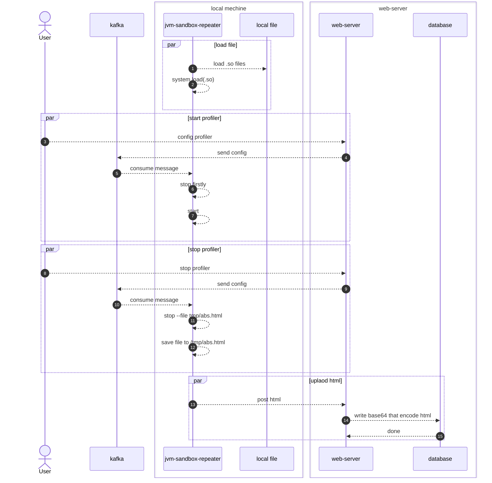

# 1. 需求

在压力测试过程中，需要观测机器的各项性能指标。一般机器上都有Prometheus来记录
jvm中的各项指标。

其中有一个需求，可定位到具体的耗时方法。对此调研后，
可以采用aysn-profiler来达到这个目的。

- https://github.com/async-profiler/async-profiler

# 2. 时序图



# 3. profiler命令

```shell
profiler start
profiler execute 'stop,start'
profiler execute 'stop,file=/tmp/result.html'
profiler start --include 'java/*' --include 'demo/*' --exclude '*Unsafe.park*'
```

# 4. 设计目的

这套方案的重点不是替代 Prometheus，而是补齐“压测时能定位到具体热点方法”的能力。

## 4.1. 为什么需要 async-profiler

- Prometheus 更适合看整体指标趋势。
- async-profiler 更适合看 CPU、锁、分配热点落在哪些方法上。
- 两者结合后，既能知道“机器变差了”，也能知道“哪段代码在变差”。

## 4.2. 落地关注点

- profiler 采样本身也有成本，不建议全量长期开启。
- 最好只在特定压测窗口和目标服务上启用。
- 结果文件上传和展示链路要注意权限和文件大小。
