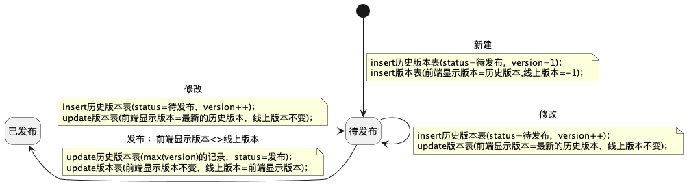

# 1. 背景

多版本数据通常用于保留历史状态、支持回滚、审计追踪或灰度发布。设计时需要明确版本号生成规则、当前生效版本、历史版本查询方式，以及版本切换时的数据一致性约束。

- https://juejin.cn/post/7095671785336619045

# 2. 状态图

状态图用于描述版本从草稿、发布到失效的流转关系，实际落地时应避免多个版本同时处于“生效”状态。

# 3. 常见实现方式

- 单表多版本：一张表中保留 `version`、`status`、`is_current` 等字段。
- 主表 + 历史表：当前生效数据放主表，历史版本放归档表。
- 配置中心式：通过版本号和生效时间控制灰度与切换。

# 4. 风险点

- 同时存在多个有效版本。
- 版本切换与缓存刷新不同步。
- 回滚时只回滚了配置，没有回滚关联数据。
