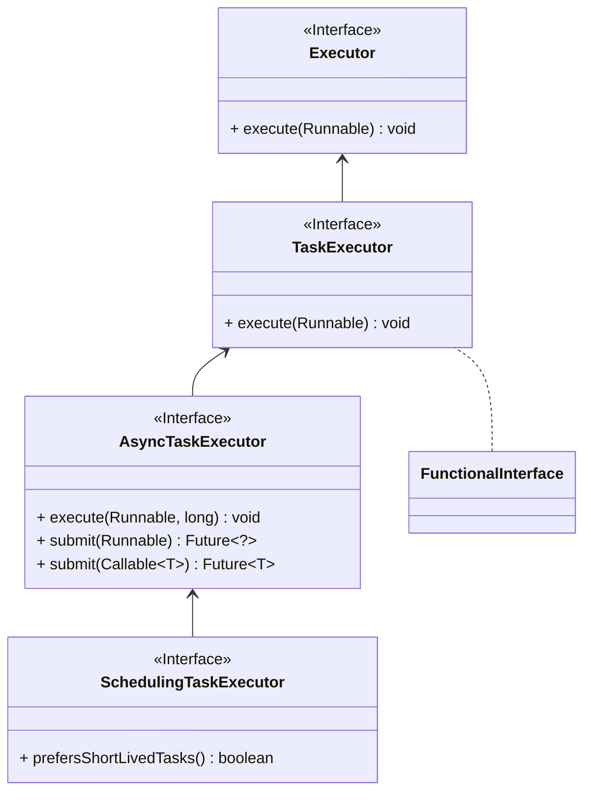

# 1. 包结构

- 位于spring-context的包下面

# 2.  Class

## 2.1. SchedulingTaskExecutor

## 2.2. SchedulingAwareRunnable

## 2.3. ScheduledAnnotationBeanPostProcessor

## 3. 核心作用

Spring Scheduling 主要解决的是定时任务的注册和执行问题。最常见的使用方式就是：

- `@EnableScheduling`
- `@Scheduled`

框架会在启动时扫描这些注解，并把对应方法注册成定时任务。

## 4. 使用关注点

- 定时任务默认并不一定并发执行，要看具体线程池配置。
- 任务方法里如果抛异常，可能会影响后续调度。
- 长任务和高频任务要重点关注线程池、重入和幂等。
