# 具身智能机械臂从零训练完整路线

本文依据视频《具身智能课程》的 115 个章节整理，**章节标题、编号和顺序与视频列表保持一致**，并按内容主线重组为 10 个阶段。每一章都包含四部分：**原理**（物理量、单位和公式）、**代码**（可直接运行的示例）、**流程图**（流程型章节）、**验收**（可量化的检查标准）。

最终目标是把"看见物体 → 判断位姿 → 机械臂靠近 → 抓取 → 移动 → 放置"串成一个可测试的系统，并用遥操作采集数据、训练行为克隆策略，让机械臂自己完成抓取。

::: danger 安全边界
以下代码先在仿真或断电测试台运行。真机必须增加急停、软硬限位、速度/力矩上限、碰撞检测、看门狗和人工确认；视觉模型的预测不能直接绕过独立的安全控制器。任何"看起来能跑"的策略，第一次上真机都要以最低速度单步执行。
:::

## 总路线图：115 章 → 10 个阶段

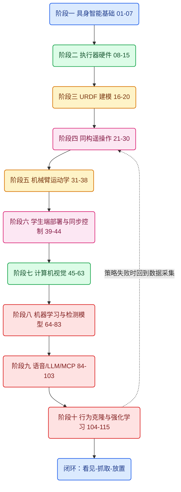

### 阶段总览表

| 阶段 | 章节 | 核心交付物 | 阶段验收 |
| --- | --- | --- | --- |
| 一 具身智能基础 | 01–07 | 感知-决策-执行闭环模型 | 能画出系统架构并跑通闭环模拟 |
| 二 执行器硬件 | 08–15 | 关节执行器选型计算表 | 完成一台关节的电机/减速/编码器选型 |
| 三 URDF 建模 | 16–20 | 可加载的机械臂 URDF | RViz 中正确显示并驱动各关节 |
| 四 同构遥操作 | 21–30 | 教师端角度实时采集与前端 | 手动拖动教师端，前端实时跟随 |
| 五 机械臂运动学 | 31–38 | 正解/逆解库与示教器 | 末端到达指定坐标，误差 < 1 cm |
| 六 学生端部署 | 39–44 | PID 整定后的学生端 | 同步遥操作无振荡、无超调 |
| 七 计算机视觉 | 45–63 | 检测/标定/测量工具链 | 手眼标定重投影误差 < 2 px |
| 八 机器学习 | 64–83 | YOLO 训练与推理流水线 | 自训模型 mAP50 > 0.9 |
| 九 语音/LLM/MCP | 84–103 | MCP 工具调用机械臂 | 一句话让机械臂执行结构化任务 |
| 十 行为克隆与 RL | 104–115 | LeRobot 采集-训练-回放闭环 | 抓取成功率 ≥ 90%（固定场景） |

## 目录（与视频章节 1:1，按阶段分组）

标 ⭐ 的为核心章节，内容更深。

### 阶段一 具身智能基础与架构（01–07）

1. 01_具身智能课程介绍
2. 02_什么是具身智能 ⭐
3. 03_具身智能的技术架构 ⭐
4. 04_具身智能的挑战
5. 05_大语言模型与具身智能
6. 06_具身智能的执行单元
7. 07_具身智能案例分析

### 阶段二 执行器硬件（08–15）

8. 08_步进电机介绍
9. 09_无刷电机介绍
10. 10_电机选型指南
11. 11_四两拨千斤的秘密 ⭐
12. 12_减速箱的阿喀琉斯之踵 ⭐
13. 13_位置采集的原理 ⭐
14. 14_位置编码器的实物和选型方法
15. 15_Sim2Real的高薪密码 ⭐

### 阶段三 机械臂建模 URDF（16–20）

16. 16_urdf入门
17. 17_urdf环境搭建
18. 18_构建机械臂的基座模型
19. 19_构建机械臂的第一个大臂
20. 20_构建机械臂的其他关节

### 阶段四 同构遥操作（21–30）

21. 21_遥操作 ⭐
22. 22_教师端结构的搭建
23. 23_搭建自己的编码器舵机 ⭐
24. 24_验证官方的sdk
25. 25_聊聊vibe coding
26. 26_vibe coding初体验
27. 27_读取教师端6个编码器舵机的角度 ⭐
28. 28_增加前端机械臂角度控制的代码
29. 29_随机更新角度信息发给前端展示
30. 30_同构遥操作案例的完成

### 阶段五 机械臂运动学（31–38）

31. 31_机械臂运动学数学速成 ⭐
32. 32_机械臂运动学正解 ⭐
33. 33_旋转平移的矩阵表达 ⭐
34. 34_机械臂正解的代码实现 ⭐
35. 35_运动学逆解介绍 ⭐
36. 36_运动学逆解求解思路 ⭐
37. 37_机械臂末端坐标的计算与展示
38. 38_机械臂示教器的完成

### 阶段六 学生端部署与同步控制（39–44）

39. 39_学生端机械臂的安装
40. 40_学生端机械臂的配置与标定
41. 41_为什么机械臂会出现帕金森 ⭐
42. 42_机械臂PID的配置 ⭐
43. 43_机械臂同步遥操作的实现
44. 44_机械臂同步优化的策略

### 阶段七 计算机视觉（45–63）

45. 45_计算机视觉介绍
46. 46_计算机存储图像的原理
47. 47_摄像头画面抖动的原因
48. 48_opencv入门
49. 49_opencv的ROI选取
50. 50_opencv颜色识别
51. 51_opencv超参数调整技巧
52. 52_高级案例白色瓶盖计数
53. 53_眼在手上眼在手外 ⭐
54. 54_机器视觉物体宽高测量
55. 55_手眼标定和差值计算 ⭐
56. 56_opencv形状识别和优化
57. 57_opencv目标追踪
58. 58_opencv仿射变换上帝视角 ⭐
59. 59_opencv旋转角和中心点识别案例分析
60. 60_中心点和旋转角代码实现
61. 61_opencv二维码识别
62. 62_opencv人脸识别
63. 63_opencv的局限性

### 阶段八 机器学习与检测模型（64–83）

64. 64_机器学习概念入门 ⭐
65. 65_端到端学习的概念 ⭐
66. 66_ai推理机器学习三要素
67. 67_机器学习流程总结
68. 68_误差函数和sklearn框架安装 ⭐
69. 69_梯度下降和神经元结构原理 ⭐
70. 70_图像数据收集和特征工程
71. 71_模型训练
72. 72_模型文件的解析和推理
73. 73_混淆矩阵和交叉熵 ⭐
74. 74_yolo快速入门 ⭐
75. 75_数据标注
76. 76_标注数据的格式转化
77. 77_训练和结果展示
78. 78_卷积神经网络 ⭐
79. 79_卷积核与特征提取器 ⭐
80. 80_卷积神经网络与应用
81. 81_图像合成与标注原理分析
82. 82_合成带有标注信息的图片
83. 83_数据合成训练效果展示

### 阶段九 语音、LLM 与 MCP（84–103）

84. 84_离线语音识别
85. 85_在线语音模型和模型的获取方法
86. 86_音频合成
87. 87_传统模式匹配代码的解析
88. 88_基于规则的传统语音聊天机器人的实现
89. 89_接入deepseek实现智能对话 ⭐
90. 90_ai智能体的开发
91. 91_大模型的本地化部署
92. 92_本地大模型的python调用
93. 93_使用streamlit搭建一个本地的大模型聊天软件
94. 94_mcp协议概念入门 ⭐
95. 95_大语言模型的幻觉问题
96. 96_mcp客户端和服务器端交互流程 ⭐
97. 97_大模型识别工具并调用的原理分析 ⭐
98. 98_大语言模型聊天交互调用mcp服务器
99. 99_mcp服务器集成本地文件搜索
100. 100_mcp操作真实机械臂 ⭐
101. 101_mcp语音播报流程展示
102. 102_conda环境的安装
103. 103_自制python解析器（扩展）

### 阶段十 行为克隆与强化学习（104–115）

104. 104_强化学习最终效果展示
105. 105_端到端神经网络概念介绍 ⭐
106. 106_lerobot项目和环境搭建 ⭐
107. 107_教师端和学生端的标定 ⭐
108. 108_准备行为克隆的摄像头
109. 109_数据采集展示
110. 110_最终训练好效果展示
111. 111_数据集的录制和查看
112. 112_录制动作的回放
113. 113_数据采集注意事项 ⭐
114. 114_本地电脑训练流程 ⭐
115. 115_云服务器训练的流程

## 阶段一 具身智能基础与架构（01–07）

**阶段目标**：建立"感知 → 决策 → 行动 → 反馈"的闭环心智模型。之后的电机、运动学、视觉、模型，全部是这条链路上的一环。

**阶段闭环**：跑通第 2 章的闭环模拟，并用第 7 章的模板拆解一个真实案例。

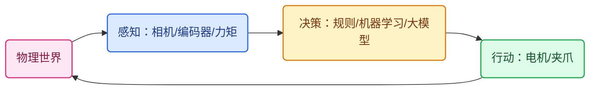

### 1. 01_具身智能课程介绍

**原理**：课程从电机、编码器这些最底层的执行器讲起，逐层往上搭：URDF 建模 → 遥操作 → 运动学 → 视觉 → 机器学习 → 大模型 → 行为克隆，最后用 LeRobot 完成"看 → 抓 → 放"的端到端闭环。学完的交付物不是知识点列表，而是一套能采集数据、训练策略、执行任务的机械臂系统。

**代码**：第一课先确认环境，缺什么补什么：

```python
import importlib
import sys

def check_env():
    """课程第一课：确认环境，缺什么补什么。"""
    required = {"numpy", "cv2", "torch", "pyserial"}
    for mod in sorted(required):
        try:
            importlib.import_module(mod)
            print(f"[OK]   {mod}")
        except ImportError:
            print(f"[缺失] {mod}  -> pip install {mod}")
    print(f"python {sys.version.split()[0]}")

check_env()
```

**验收**：运行后 4 个依赖全部 `[OK]`，Python ≥ 3.9。

### 2. 02_什么是具身智能

**原理**：具身智能（Embodied AI）指智能体用**身体**（传感器 + 执行器）与物理世界闭环交互。它和纯语言模型有三点本质区别：输出不是文本而是物理动作；错误不是"答错"而是碰撞、跌落、伤人；反馈不是评分而是真实的力、位移、图像。因此一切设计都要围绕闭环展开：感知 → 决策 → 行动 → 反馈，频率越高、延迟越低，控制越稳。

**代码**：一个最小闭环模拟——夹爪不断靠近，感知到距离足够近时停止：

```python
class EmbodiedLoop:
    """具身智能最小闭环：感知 -> 决策 -> 行动，直到任务完成。"""
    def __init__(self, dist: float = 1.0):
        self.dist = dist

    def perceive(self) -> float:
        return self.dist                      # 传感器读数

    def decide(self, s: float) -> str:
        return "close" if s > 0.05 else "stop"   # 决策：距离大就继续靠近

    def act(self, a: str) -> bool:
        if a == "close":
            self.dist *= 0.5                  # 行动：夹爪逼近一半
            return True
        return False                          # stop = 任务结束

loop = EmbodiedLoop()
for step in range(20):
    if not loop.act(loop.decide(loop.perceive())):
        print(f"第 {step + 1} 步抓取完成")
        break
```

**验收**：循环在有限步内收敛（本例第 5 步），每次迭代都经过感知、决策、行动三个函数。

### 3. 03_具身智能的技术架构

**原理**：主流架构分三层——**感知层**（相机、编码器、力矩传感器，把物理量变成数字量）、**决策层**（规则 / 传统机器学习 / 强化学习 / 大模型，把观测变成意图）、**执行层**（驱动器、电机、减速箱，把意图变成力和位移）。经典"感知-规划-行动"（Sense-Plan-Act）把三层串行；端到端策略（第 105 章）则把后两层压进一个神经网络。三层之间必须定义清晰的数据契约：单位（米 or 毫米、弧度 or 度）、频率、延迟。

**代码**：三层架构的最小骨架：

```python
from dataclasses import dataclass, field

@dataclass
class RobotSystem:
    """感知层 + 决策层 + 执行层的最小骨架。"""
    sensors: list = field(default_factory=list)     # 相机/编码器/力矩
    planner: object = None                          # 规则 / ML / LLM
    controller: object = None                       # 位置/速度/电流环

    def step(self, obs):
        plan = self.planner(obs)                    # 决策层
        cmd = self.controller(plan)                 # 执行层：安全限幅
        for s, c in zip(self.sensors, cmd):
            s.write(c)                              # 写入硬件
        return [s.read() for s in self.sensors]     # 感知层回流
```

**验收**：能画出你自己的系统三层结构，并标出每层的数据流向和单位。

### 4. 04_具身智能的挑战

**原理**：四个核心挑战，每个都对应课程后面的解法：

| 挑战 | 具体表现 | 课程中的解法 |
| --- | --- | --- |
| 数据获取难 | 真实示教采集慢、成本高 | 遥操作（阶段四）+ 数据合成（81–83） |
| 泛化差 | 换个光照/背景策略就失效 | 数据多样性（113）+ 域随机化（15） |
| 安全问题 | 碰撞、过流、伤人 | 限位/限速/急停/看门狗（全程） |
| Sim2Real 差距 | 仿真里好、真机上差 | 系统辨识 + 域随机化（15） |

**代码**：所有挑战最终都落在"失败要可控"上，任何易失败的操作都要包重试：

```python
def safe_attempt(fn, retries=3):
    """数据、泛化、安全、Sim2Real：失败必须可控、可重试。"""
    for i in range(retries):
        try:
            return fn()
        except Exception as e:
            print(f"第 {i + 1} 次尝试失败: {e}")
    raise RuntimeError("超过最大重试次数，转人工接管")
```

**验收**：列出你工作场景中的 3 个具体挑战，并写出对应解法。

### 5. 05_大语言模型与具身智能

**原理**：大语言模型在具身智能里做"大脑"：解析自然语言指令、做任务规划、生成代码、多模态理解。但关键原则是 **LLM 不直接输出电机 PWM**——它输出结构化任务描述（抓什么、放哪），交给运动学、规划器和安全控制器执行。视觉-语言-动作（VLA）模型是趋势（如 RT 系列、π0），但工程落地上"LLM 出意图 + 传统控制执行"仍然最稳。

**代码**：LLM 的输出必须是结构化任务，而不是动作：

```python
import json

def llm_to_task(reply: str) -> dict:
    """LLM 输出结构化任务描述，而不是电机 PWM。"""
    task = json.loads(reply)
    assert task["action"] in {"pick", "place"}, "未知动作"
    return task   # 交给 IK / 规划器 / 安全控制器执行

print(llm_to_task('{"action": "pick", "target": "red cube", "goal": "box"}'))
```

**验收**：能解释为什么 LLM 的输出必须经过运动学与安全层，而不是直接驱动电机。

### 6. 06_具身智能的执行单元

**原理**：执行单元 = 电机 + 减速箱 + 编码器 + 驱动器 + 控制器。控制上分三级环：**电流环**（最快，kHz 级，控制力矩）、**速度环**（百 Hz 级）、**位置环**（几十 Hz 级），带宽由内到外逐层降低。执行器类型决定控制方式：舵机（内置位置环，便宜）、步进（开环脉冲定位）、BLDC（FOC，高速高转矩密度）。本课程机械臂关节用的是带编码器反馈的舵机（第 23 章自制）。

**代码**：执行器统一接口，软件限位永远先于硬件：

```python
class Actuator:
    """执行单元统一接口：给定目标，读取状态。"""
    def set_target(self, q): raise NotImplementedError
    def read_state(self): raise NotImplementedError

class Servo(Actuator):
    def __init__(self, sid: int, limit_deg: float = 90.0):
        self.sid, self.limit, self.q = sid, limit_deg, 0.0

    def set_target(self, q: float):
        self.q = max(-self.limit, min(self.limit, q))   # 软件限位

    def read_state(self) -> float:
        return self.q
```

**验收**：说出三级控制环的名称和带宽关系（电流环 > 速度环 > 位置环）。

### 7. 07_具身智能案例分析

**原理**：任何具身智能系统都能拆成四要素：感知、决策、执行、闭环频率。课程主线案例是**机械臂抓取放置**（也是全文最终闭环）；机器狗是另一个典型（感知=IMU+足底力，执行=12 个关节电机，闭环 500 Hz+）；自动驾驶是规模最大的具身场景。分析案例的目的不是记住结论，而是习惯"先问感知从哪里来、动作到哪里去"。

**代码**：案例拆解模板：

```python
def analyze_case(name, sense, decide, act, freq):
    """把任意案例拆成 感知/决策/执行/闭环频率 四要素。"""
    print(f"{name}: 感知={sense} | 决策={decide} | 执行={act} | 闭环={freq}Hz")

analyze_case("机械臂抓取", "RGB-D相机+编码器", "规划器/策略网络", "伺服关节", 30)
analyze_case("四足机器狗", "IMU+足底力", "MPC/强化学习", "12关节BLDC", 500)
```

**验收**：用这个模板拆解一个你感兴趣的案例（扫地机、无人机、自动驾驶均可）。

## 阶段二 执行器硬件（08–15）

**阶段目标**：理解机械臂关节的完整链路——电机产生运动，减速箱放大转矩，编码器反馈位置，选型时三者要匹配。这部分与 [具身智能核心电机全解](./具身智能核心电机全解.md) 互补，那里有交互式演示，这里只讲与课程对应的要点。

**阶段闭环**：为你的机械臂关节完成一张选型计算表（电机 → 减速比 → 编码器分辨率）。

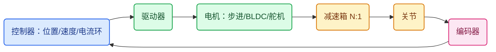

### 8. 08_步进电机介绍

**原理**：步进电机每收到一个脉冲，转子转过一个固定**步距角**，例如两相混合式常用 1.8°（200 步/圈）。细分驱动把一步再切分成 M 微步，让运行更平滑：

$$\theta_{step}=\frac{360°}{N_{step}\cdot M}$$

优点：开环即可定位、便宜、低速转矩大。缺点：高速掉矩、丢步无反馈、振动噪声大。适合 3D 打印机、轻载平移台，不适合需要碰撞检测的机械臂关节。

**代码**：

```python
class Stepper:
    """步进电机：脉冲数 x 步距角(含细分) = 角位移。"""
    def __init__(self, steps_per_rev: int = 200, microstep: int = 16):
        self.res = 360.0 / (steps_per_rev * microstep)   # 每脉冲角度

    def pulses_for(self, deg: float) -> int:
        return round(deg / self.res)

s = Stepper()
print(s.pulses_for(90))   # 8000 个脉冲转 90°
```

**验收**：1.8° 步进电机、16 细分，转 90° 需要 8000 个脉冲；算错说明步距角或细分理解有误。

### 9. 09_无刷电机介绍

**原理**：无刷电机（BLDC）用电子换相替代电刷，寿命长、转速高、转矩密度大。两条核心公式：电磁转矩 $T=K_t I$，反电动势 $E=K_e\omega$，国际单位制下 $K_t\approx K_e$。FOC（磁场定向控制）让电流矢量始终与转子磁场正交，用最小电流产生最大转矩。机械臂肩肘关节用 BLDC + 谐波减速是高端标配。

**代码**：

```python
import math

class BLDC:
    """无刷电机：T = Kt·I，反电动势 E = Ke·ω（SI 单位制 Kt ≈ Ke）。"""
    def __init__(self, kt: float):
        self.kt = kt                          # N·m/A

    def torque(self, current: float) -> float:
        return self.kt * current

    def back_emf(self, rpm: float) -> float:
        return self.kt * rpm * 2 * math.pi / 60   # V

m = BLDC(kt=0.05)
print(m.torque(2.0), m.back_emf(3000))   # 0.1 N·m, 15.7 V
```

**验收**：给定 Kt、电流、转速，能口算转矩和反电动势，并解释 $K_t \approx K_e$ 在 SI 单位下为何成立。

### 10. 10_电机选型指南

**原理**：选型四步：① 算负载——转动惯量 J 与角加速度 α 决定动态转矩，摩擦与重力决定持续转矩；② 定峰值/持续转矩，取安全系数 1.5–2；③ 校核转速（减速后）；④ 选反馈（编码器分辨率）与供电、尺寸。选错最常见的两个原因是只算重力不算惯量、只算持续不校核峰值。

**代码**：

```python
def motor_sizing(J, alpha, tau_friction, tau_gravity, sf=1.5):
    """J: 惯量 kg·m²；alpha: 角加速度 rad/s²；转矩单位 N·m。"""
    tau_cont = tau_friction + tau_gravity          # 连续转矩需求
    tau_peak = (J * alpha + tau_cont) * sf         # 峰值转矩需求
    return {"连续转矩": round(tau_cont, 3), "峰值转矩": round(tau_peak, 3)}

# 例：0.01 kg·m² 的关节，2 rad/s² 加速，摩擦 0.05 N·m，重力 0.1 N·m
print(motor_sizing(J=0.01, alpha=2.0, tau_friction=0.05, tau_gravity=0.1))
```

**验收**：用你机械臂最重的一个关节的参数跑一遍，给出连续/峰值转矩和所选电机的对应规格。

### 11. 11_四两拨千斤的秘密（减速比）

**原理**：电机转速高、转矩小，关节需要低速大转矩。减速箱用 N:1 的齿比把转速除以 N、转矩放大 N 倍（再乘效率 η，通常 0.85–0.95）：

$$\omega_{out}=\frac{\omega_{in}}{N},\qquad T_{out}=T_{in}\cdot N\cdot\eta$$

3000 RPM 电机经 30:1 减速后输出 100 RPM、转矩放大 30 倍——这就是"四两拨千斤"。代价有两个：回差（下一章）和**惯量反射**（负载惯量折算到电机侧除以 N²）。

**代码**：

```python
class Gearbox:
    """一级减速箱模型：转速除以 ratio，转矩乘以 ratio 与效率。"""
    def __init__(self, ratio: float, efficiency: float = 0.9):
        assert ratio >= 1 and 0 < efficiency <= 1
        self.ratio, self.eta = ratio, efficiency

    def out_speed(self, motor_rpm: float) -> float:
        return motor_rpm / self.ratio

    def out_torque(self, motor_torque: float) -> float:
        return motor_torque * self.ratio * self.eta

    def reflected_inertia(self, load_J: float) -> float:
        return load_J / self.ratio ** 2    # 负载惯量反射到电机侧

gb = Gearbox(ratio=30, efficiency=0.9)
print(gb.out_speed(3000), gb.out_torque(0.1))   # 100.0 RPM, 2.7 N·m
```

**验收**：实测输入/输出转速与转矩，效率 η 偏差 < 5%；理解惯量反射为何让大减速比的控制更难。

### 12. 12_减速箱的阿喀琉斯之踵（回差）

**原理**：回差（backlash，背隙）指主动轮反转时，从动轮要空转一个小角度才跟随——齿轮啮合间隙的必然产物。它直接变成末端的**重复定位误差**：正向逼近和反向逼近同一目标，停的位置不同。常见减速器回差量级：直齿轮 > 行星（3–10 角分）> 谐波（<1 角分）。消差手段：单向逼近、双齿轮消隙、换谐波减速器。

**代码**：回差测量——正反两个方向逼近同一目标，读数之差即回差：

```python
def measure_backlash(move_to, read_pos, target=30.0):
    """正向、反向逼近同一目标，两次读数之差即回差（单位：度）。"""
    move_to(target)                    # 正向逼近
    p1 = read_pos()
    move_to(target + 20.0)             # 越过目标
    move_to(target)                    # 反向逼近
    p2 = read_pos()
    return abs(p2 - p1)

# move_to / read_pos 换成你的机械臂 SDK 对应函数
print(f"回差: {measure_backlash(...)}°")
```

**验收**：重复测量 10 次取均值，回差稳定（波动 < 0.05°）；与控制中"永远从同一方向逼近目标"的策略配对使用。

### 13. 13_位置采集的原理

**原理**：编码器把角位移变成数字量。**增量式**输出 A/B 两相正交脉冲（相位差 90°），4 倍频后每圈计数 = 4 × CPR，便宜但断电丢位、需要找零；**绝对式**直接输出当前角度（单圈/多圈），断电不丢位。分辨率 ≠ 精度：分辨率是数字量的粒度，精度还受安装偏心、温漂、磁场干扰影响。

**代码**：正交编码 4 倍频计数：

```python
class QuadEncoder:
    """增量式正交编码器：A/B 相位差 90°，4 倍频计数。"""
    def __init__(self, cpr: int = 1000):
        self.cpr, self.count, self.prev = cpr, 0, (0, 0)
        self.table = {
            ((0, 0), (0, 1)): 1,  ((0, 1), (1, 1)): 1,
            ((1, 1), (1, 0)): 1,  ((1, 0), (0, 0)): 1,
            ((0, 0), (1, 0)): -1, ((1, 0), (1, 1)): -1,
            ((1, 1), (0, 1)): -1, ((0, 1), (0, 0)): -1,
        }

    def update(self, a: int, b: int) -> float:
        state = (a, b)
        self.count += self.table.get((self.prev, state), 0)
        self.prev = state
        return self.angle()

    def angle(self) -> float:
        return 360.0 * self.count / (self.cpr * 4)

enc = QuadEncoder(cpr=1000)
for a, b in [(0, 1), (1, 1), (1, 0), (0, 0)] * 10:   # 正转 10 个周期
    enc.update(a, b)
print(enc.count, enc.angle())   # 40 计数, 3.6°
```

**验收**：CPR=1000 的编码器 4 倍频后分辨率 0.09°/计数；10 个完整周期 = 40 计数 = 3.6°。

### 14. 14_位置编码器的实物和选型方法

**原理**：选型看五个维度：**分辨率**（磁编码器常见 12bit/4096、14bit/16384 每圈）、**精度**（分辨率的 1/4~1/2 才是真实可用精度）、**接口**（ABZ 增量 / SPI / I2C / RS485 / PWM）、**原理**（磁式便宜抗油污，光电精度高怕脏）、**抗干扰**（差分输出 > 单端）。课程第 23 章自制的编码器舵机，典型方案就是磁编码器（如 AS5600）贴在马达输出轴上做反馈。

**代码**：三种标称方式统一换算成每圈计数与角度分辨率：

```python
def encoder_spec(bits=None, cpr=None, ppr=None):
    """三种常见标称方式 -> 每圈计数与角度分辨率。"""
    if bits is not None:
        counts = 2 ** bits            # 磁编码器：12bit -> 4096
    elif cpr is not None:
        counts = cpr * 4              # 正交 A/B 4 倍频
    elif ppr is not None:
        counts = ppr                  # 部分厂商已标 4 倍频后的值
    else:
        raise ValueError("需要 bits/cpr/ppr 之一")
    return counts, round(360.0 / counts, 3)

print(encoder_spec(bits=12))   # (4096, 0.088)
print(encoder_spec(cpr=1000))  # (4000, 0.09)
```

**验收**：写出你要买的编码器的五个维度参数，并计算 12bit 磁编码器在 30:1 减速后的关节端分辨率（0.0029°/计数）。

### 15. 15_Sim2Real的高薪密码

**原理**：Sim2Real gap 的四大来源：动力学参数不准（质量/摩擦/阻尼）、视觉渲染与真实光照不一致、真实系统有延迟与噪声、接触与碰撞难以建模。缩小差距的三大技术：**系统辨识**（把真实参数测出来灌进仿真）、**域随机化**（训练时随机化参数，逼策略适应分布而不是单点）、**真机微调**（仿真预训练 + 少量真实数据）。强化学习能大规模试错，前提是仿真可信——这就是"高薪密码"：能解决 gap 的工程师稀缺。

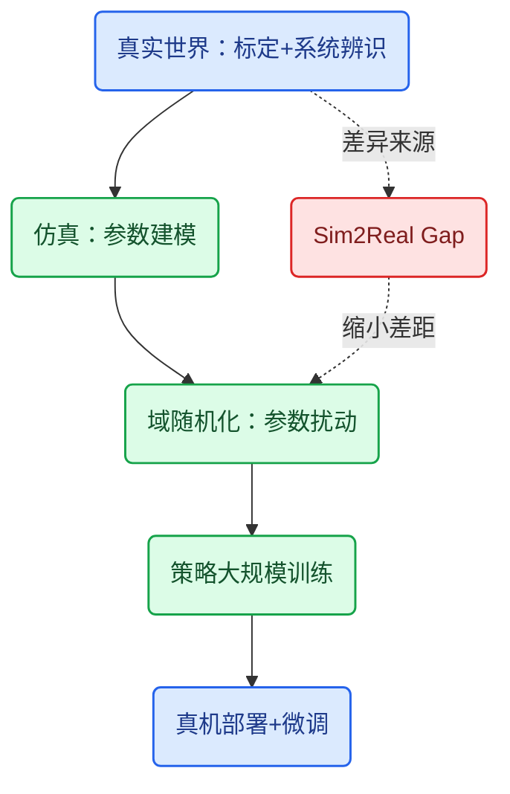

**代码**：域随机化——每次重置环境都在参数区间内采样：

```python
import random

def domain_randomize(mass, mu, delay_ms):
    """每次 reset 在参数区间内采样，逼策略适应分布而不是单点。"""
    return (
        mass * random.uniform(0.9, 1.1),      # 质量 ±10%
        mu * random.uniform(0.7, 1.3),        # 摩擦 ±30%
        delay_ms + random.randint(0, 8),      # 通信延迟 0~8ms
    )

for _ in range(3):
    print(domain_randomize(mass=1.0, mu=0.5, delay_ms=2))
```

**验收**：列出你的任务里 3 个真实-仿真差异（动力学/视觉/延迟），各写出一种对策。

## 阶段三 机械臂建模 URDF（16–20）

**阶段目标**：用 XML 把机械臂描述成 link + joint 树，在 RViz 里看到它、驱动它。深挖版见 [URDF 从零到两关节机械臂实战](./URDF从零到两关节机械臂实战.md)（Link/Joint、Xacro、RViz、TF、Gazebo、ros2_control），本章只保留与课程对应的主干。

**阶段闭环**：check_urdf 校验通过 + RViz 显示完整手臂 + 每个关节能单独驱动。

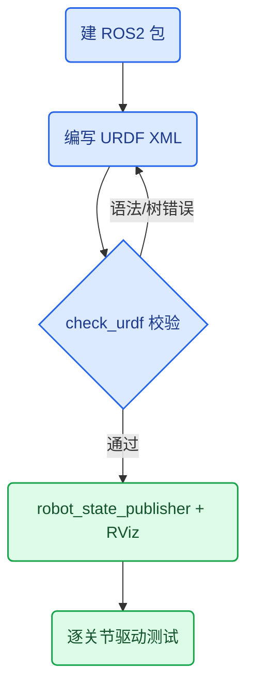

### 16. 16_urdf入门

**原理**：URDF（Unified Robot Description Format）是 XML 格式的机器人描述文件。两个核心元素：**link** = 刚体（质量、惯量、视觉形状、碰撞形状），**joint** = 连接关系（父 link、子 link、类型、原点、转轴、限位）。整台机器是一棵树：从 base_link 出发，每个 joint 挂一个子 link。六种 joint 类型里最常用三种：`revolute`（旋转、有限位）、`continuous`（无限旋转）、`fixed`（固定）。

**代码**：最小合法模型——底座加一个旋转关节：

```xml
<?xml version="1.0"?>
<robot name="my_arm">
  <link name="base_link"/>

  <joint name="joint1" type="revolute">
    <parent link="base_link"/>
    <child link="link1"/>
    <origin xyz="0 0 0.1" rpy="0 0 0"/>
    <axis xyz="0 0 1"/>
    <limit lower="-1.57" upper="1.57" effort="10" velocity="1.0"/>
  </joint>

  <link name="link1"/>
</robot>
```

**验收**：逐字段解释 parent/child/origin/axis/limit 的含义和单位；画出这个模型的树结构。

### 17. 17_urdf环境搭建

**原理**：URDF 需要 ROS2 环境才能"活起来"：robot_state_publisher 把 joint 状态发布成 TF 变换，RViz 负责渲染。搭建链路：建包 → 放 URDF → check_urdf 校验 → launch 文件启动显示。先校验树结构，再谈显示——90% 的"RViz 不显示"都是 URDF 本身有错。

**代码**：

```bash
mkdir -p ~/ws/src && cd ~/ws/src
ros2 pkg create my_arm_description
mkdir -p my_arm_description/urdf my_arm_description/launch

# 校验工具（一次性安装）：sudo apt install liburdfdom-tools
# 把 arm.urdf 放进 urdf/ 后先校验语法与树结构：
check_urdf urdf/arm.urdf

# 显示：robot_state_publisher + rviz2
ros2 launch urdf_tutorial display.launch.py model:=urdf/arm.urdf
```

**验收**：check_urdf 输出完整 link/joint 树；RViz 里看到模型且无红色报错。

### 18. 18_构建机械臂的基座模型

**原理**：base_link 是树的根，通过 fixed joint 固定在世界系。一个 link 三个子元素：**visual**（渲染：几何形状 + 材质颜色）、**collision**（碰撞体，可简化）、**inertial**（质量 kg + 惯量矩阵 kg·m²）。只写 visual 也能显示，但 Gazebo 仿真和动力学必须要有 inertial。两个常见错误：尺寸单位用错（URDF 一律米）、惯量矩阵乱填导致仿真发散。

**代码**：

```xml
<link name="base_link">
  <visual>
    <geometry>
      <cylinder radius="0.08" length="0.06"/>
    </geometry>
    <material name="gray">
      <color rgba="0.4 0.4 0.4 1.0"/>
    </material>
  </visual>
  <collision>
    <geometry>
      <cylinder radius="0.08" length="0.06"/>
    </geometry>
  </collision>
  <inertial>
    <mass value="0.5"/>
    <inertia ixx="0.001" ixy="0" ixz="0"
             iyy="0.001" iyz="0" izz="0.001"/>
  </inertial>
</link>

<joint name="base_joint" type="fixed">
  <parent link="world"/>
  <child link="base_link"/>
  <origin xyz="0 0 0" rpy="0 0 0"/>
</joint>
```

**验收**：RViz 中基座出现在原点；解释 visual/collision/inertial 三者的作用差异。

### 19. 19_构建机械臂的第一个大臂

**原理**：第一个 `revolute` 关节连接基座与大臂。三个关键属性：**origin** = 子坐标系相对父坐标系的位姿（xyz 米、rpy 弧度，固定轴顺序 roll→pitch→yaw）；**axis** = 转轴方向（单位向量）；**limit** = 限位（弧度）/ 最大力矩（N·m）/ 最大速度（rad/s）。origin 的 rpy 最容易写错——转轴不在预期方向，关节就转歪。

**代码**：

```xml
<link name="link1">
  <visual>
    <geometry>
      <box size="0.04 0.04 0.30"/>
    </geometry>
  </visual>
  <inertial>
    <mass value="0.4"/>
    <inertia ixx="0.01" ixy="0" ixz="0"
             iyy="0.01" iyz="0" izz="0.001"/>
  </inertial>
</link>

<joint name="joint1" type="revolute">
  <parent link="base_link"/>
  <child link="link1"/>
  <origin xyz="0 0 0.03" rpy="0 0 0"/>
  <axis xyz="0 0 1"/>
  <limit lower="-2.0" upper="2.0" effort="5.0" velocity="1.5"/>
</joint>
```

**验收**：修改 origin 的 xyz 和 axis 各一次，在 RViz 中观察大臂如何平移/改变转轴；用 joint_state_publisher_gui 把关节拖到 ±2.0 限位处。

### 20. 20_构建机械臂的其他关节

**原理**：按同样的模式加肘、腕和夹爪：每个关节独立 origin/axis/limit，子 link 挂在父 link 上形成链。两个工程经验：① 先用 box/cylinder 占位，全部关节调通后再换真实 mesh；② 重复结构用 **xacro 宏**消除复制粘贴，改一处生效全部。关节顺序在这里定死，就是阶段五运动学的关节编号。

**代码**：xacro 宏：

```xml
<xacro:macro name="arm_link" params="name mass size">
  <link name="${name}">
    <visual>
      <geometry>
        <box size="${size}"/>
      </geometry>
    </visual>
    <inertial>
      <mass value="${mass}"/>
      <inertia ixx="0.01" ixy="0" ixz="0"
               iyy="0.01" iyz="0" izz="0.001"/>
    </inertial>
  </link>
</xacro:macro>

<xacro:arm_link name="link2" mass="0.3" size="0.03 0.03 0.25"/>
<xacro:arm_link name="link3" mass="0.2" size="0.02 0.02 0.20"/>
```

**验收**：完整手臂（基座 + 大臂 + 肘 + 腕 + 夹爪）在 RViz 显示，6 个关节全部可驱动；与 [URDF 实战](./URDF从零到两关节机械臂实战.md) 对照补齐 Gazebo / ros2_control 部分。

## 阶段四 同构遥操作（21–30）

**阶段目标**：人手拖动教师端（6 个编码器舵机），学生端实时复现。这条链路是阶段十行为克隆数据采集的前置——示教数据质量直接决定训练上限。

**阶段闭环**：教师端摆姿势 → 前端实时显示 → 学生端复现，延迟 < 100ms。

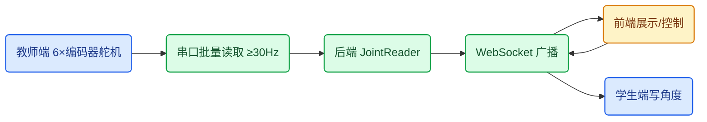

### 21. 21_遥操作

**原理**：遥操作 = 人操纵教师端（leader），学生端（follower）复现。**同构遥操作**：两端构型相同，关节角直接映射，简单可靠，课程采用这种；**异构遥操作**：构型不同（人手 → 机械臂），需要运动重定向和逆运动学。遥操作两大用途：① 危险/远程场景作业；② **行为克隆数据采集**——这是课程主线，示教质量直接决定第 105–115 章策略的上限。

**代码**：

```python
def leader_to_follower(q_leader, gain=1.0, q_min=-90.0, q_max=90.0):
    """同构遥操作：关节角直接映射 + 安全限幅。"""
    return [max(q_min, min(q_max, gain * q)) for q in q_leader]

print(leader_to_follower([10, -20, 95, 0, 0, 0]))   # [10, -20, 90, 0, 0, 0]
```

**验收**：说清同构/异构的区别，以及遥操作在课程中的两个用途。

### 22. 22_教师端结构的搭建

**原理**：教师端是被示教的一端：关节可自由转动（或小阻尼），编码器实时输出角度。课程教师端 = 6 个编码器舵机组成的 6 关节臂（基座/肩/肘/腕/夹爪）。三个搭建要点：① 关节阻力小，拖动不费力；② 角度范围与学生端一致，否则映射要缩放；③ 编码器分辨率 12bit 起步，低于 10bit 的示教数据会有明显量化噪声。

**代码**：教师端抽象——只有读，没有写：

```python
class LeaderArm:
    """教师端：关节被拖动，只读角度。"""
    def __init__(self, joint_ids=(1, 2, 3, 4, 5, 6)):
        self.joint_ids = joint_ids

    def read_angles(self):
        return [self.read_servo(j) for j in self.joint_ids]

    def read_servo(self, sid):
        raise NotImplementedError("换成你的 SDK/串口实现")
```

**验收**：6 个关节手动可自由转动；各关节实测角度范围与设计一致并记录成表。

### 23. 23_搭建自己的编码器舵机

**原理**：市售舵机是黑盒：内部反馈是电位器，分辨率低且不对外输出位置。自制编码器舵机 = 舵机 + 磁编码器贴输出轴：径向磁铁的磁场方向 = 转子机械角度，霍尔元件测出磁场方向 → 12bit 绝对角度（AS5600 等），经 I2C/SPI 读出。两个用途：教师端读角度、学生端做闭环反馈。第 13 章的编码器原理在这里落地。

**代码**：

```python
# AS5600 磁编码器：12bit 绝对角度，I2C 地址 0x36，ANGLE 寄存器 0x0E/0x0F
class AS5600:
    def __init__(self, bus, addr=0x36):
        self.bus, self.addr = bus, addr

    def raw_angle(self):
        hi = self.bus.read_byte_data(self.addr, 0x0E)
        lo = self.bus.read_byte_data(self.addr, 0x0F)
        return (hi << 8) | lo                     # 0~4095

    def angle_deg(self):
        return self.raw_angle() * 360.0 / 4096.0

# enc = AS5600(smbus.SMBus(1))   # 树莓派 I2C-1
# print(enc.angle_deg())
```

**验收**：转一圈读数 0→4095 单调线性；静止抖动 < ±2 LSB（约 0.18°）；磁铁偏心会造成非线性，更换安装位置后复测。

### 24. 24_验证官方的sdk

**原理**：舵机厂商提供 SDK 或串口总线协议（帧头 + ID + 指令 + 校验和）。接硬件前先读协议文档，再用官方例程做冒烟测试：供电 → 串口 → 枚举 ID → 读角度 → 空载写角度。原则：**先读后写**，读不通不写；记录波特率、帧格式、角度单位（度 / 0.1° / 原始值），这些参数后面的章节全要用。

**代码**：

```python
def sdk_smoke_test(sdk, joint_ids=(1, 2, 3, 4, 5, 6)):
    """冒烟测试：先读后写，验证链路、ID、角度范围。"""
    for sid in joint_ids:
        angle = sdk.read_angle(sid)
        print(f"关节 {sid}: {angle}°")
        assert -180.0 <= angle <= 180.0, "读数超出合理范围"
    print("读链路 OK，开始空载写测试（低速、小角度）")
```

**验收**：6 个 ID 全部读到角度；断电重启读数一致（绝对编码器）；写测试在空载、低速、小角度下通过。

### 25. 25_聊聊vibe coding

**原理**：Vibe coding = 用自然语言描述意图，AI 生成代码，人来验证修正。在机器人项目里的正确用法：AI 写**胶水代码**（协议解析、UI、数据处理脚本），人写并审查**控制与安全逻辑**。三条铁律：真机控制代码必须人工逐行审；先仿真/空载；小步提交、可回滚。本课程第 26 章是它的实践，第 28 章的前端代码就是典型的 vibe coding 产出。

**代码**：一个合格的 vibe coding 提示词模板：

```text
需求：串口 115200 波特率 8N1 读取 6 个舵机角度。
帧格式：帧头 0xFF 0x55，ID(1B)，长度(1B)，指令(1B)，参数，校验和(末字节=前面所有字节累加取低8位)。
要求：pyserial 实现；校验和错误丢弃并打印原始帧；超时 0.2s 返回 None；角度单位换算为度。
```

**验收**：AI 生成代码后，人工核对三点：校验和算法、超时行为、单位换算——三者全对才算过。

### 26. 26_vibe coding初体验

**原理**：把上一章的原则走一遍：提需求 → AI 生成 → 逐行读代码 → 空载验证 → 小步提交。初体验的典型产出是"能读角度的小工具"。审查重点：帧头匹配、长度校验、校验和、超时与异常路径——AI 生成的快乐路径通常能跑，异常路径通常漏。

**代码**：AI 生成的读帧骨架，人必须补的错误处理已标出：

```python
import serial

def read_frame(port, timeout=0.2):
    """串口读帧：vibe coding 产物必须补超时与校验。"""
    with serial.Serial(port, 115200, timeout=timeout) as s:
        s.reset_input_buffer()
        header = s.read(2)
        if header != b"\xff\x55":
            return None                    # 帧头不对直接丢弃
        length = s.read(1)
        if not length:
            return None                    # 超时保护
        payload = s.read(length[0] - 1)    # 长度字节本身也算在内
        return header + length + payload   # 交给上层验校验和
```

**验收**：拔线/错帧时函数返回 None 而不是抛异常或卡死；日志能还原每一帧的原始字节。

### 27. 27_读取教师端6个编码器舵机的角度

**原理**：遥操作的核心数据源。三个要点：**频率**——轮询 ≥30Hz 可接受，≥50Hz 流畅；**批量读**——总线链式帧一次读 6 个，比逐个读快数倍；**时序对齐**——同一时刻的一组角度才是一个合法位姿，必须带时间戳打包。单位统一为度，换算只发生在一处（进前端和进模型之前）。

**代码**：

```python
import time
from collections import deque

class JointReader:
    """6 关节批量读取：带时间戳与采样率统计。"""
    def __init__(self, sdk, ids=(1, 2, 3, 4, 5, 6)):
        self.sdk, self.ids = sdk, ids
        self.history = deque(maxlen=100)

    def read_all(self):
        t = time.monotonic()
        angles = [self.sdk.read_angle(i) for i in self.ids]
        self.history.append((t, angles))
        return t, angles

    def rate(self):
        """最近 1 秒的平均采样率。"""
        if len(self.history) < 2:
            return 0.0
        dt = self.history[-1][0] - self.history[0][0]
        return (len(self.history) - 1) / dt

reader = JointReader(sdk=None)   # 接上真实 SDK 后替换
```

**验收**：采样率 ≥ 30Hz；静止时 6 关节抖动 < 0.2°；单独动一个关节，其余 5 个读数不变（排除串扰）。

### 28. 28_增加前端机械臂角度控制的代码

**原理**：前端（网页）展示 6 关节角度并下发控制：滑杆/数值输入 → 后端 → 串口 → 舵机。链路：浏览器 ↔ **WebSocket**（低延迟双向）↔ Python 后端 ↔ 串口 ↔ 舵机。WebSocket 比 HTTP 轮询更适合遥操作：一次握手后双向推送，延迟从百 ms 级降到几 ms 级。

**代码**：后端骨架——接收前端命令 + 广播关节角度：

```python
import asyncio
import json

import websockets

class ArmServer:
    def __init__(self, reader, sdk):
        self.reader, self.sdk = reader, sdk
        self.clients = set()

    async def handler(self, ws):
        self.clients.add(ws)
        try:
            async for msg in ws:
                cmd = json.loads(msg)
                if cmd["type"] == "set_angle":
                    self.sdk.write_angle(cmd["joint"], cmd["angle"])
                elif cmd["type"] == "ping":
                    await ws.send(json.dumps({"angles": self.reader.read_all()[1]}))
        finally:
            self.clients.remove(ws)

    async def broadcast(self):
        while True:
            _, angles = self.reader.read_all()
            if self.clients:
                websockets.broadcast(self.clients, json.dumps({"angles": angles}))
            await asyncio.sleep(0.03)    # ~33Hz 广播

async def main():
    server = ArmServer(reader=None, sdk=None)
    async with websockets.serve(server.handler, "0.0.0.0", 8765):
        await server.broadcast()

asyncio.run(main())
```

**验收**：前端滑杆拖动 → 舵机响应延迟 < 100ms；前端显示角度与编码器读数一致。

### 29. 29_随机更新角度信息发给前端展示

**原理**：硬件未就绪前，先用模拟数据打通"后端 → 前端"展示链路——**数据管线先行，硬件后行**。用正弦波模拟 6 关节，验证 UI 渲染、帧率、延迟；硬件就绪后只换数据源类，前端零改动。这和第 25 章的 vibe coding 原则是一套：每一层都能独立验证，才敢接真机。

**代码**：

```python
import math
import time

class SimulatedJoints:
    """未接硬件前，用正弦波模拟 6 关节角度。"""
    def __init__(self, ids=(1, 2, 3, 4, 5, 6)):
        self.ids, self.t0 = ids, time.monotonic()

    def read_all(self):
        t = time.monotonic() - self.t0
        angles = [45.0 * math.sin(0.5 * t + i) for i, _ in enumerate(self.ids)]
        return time.monotonic(), angles

# 把 ArmServer(reader=SimulatedJoints(), sdk=None) 传入即可驱动前端
```

**验收**：前端 6 条曲线平滑连续、帧率稳定 ≥ 30fps；替换成真实数据源时前端代码零改动。

### 30. 30_同构遥操作案例的完成

**原理**：把 22–29 串成完整闭环：教师端（读角度）→ 后端 → 前端（展示/控制）→ 学生端（写角度）。验收三个指标：**延迟**（教师端动到学生端响应）、**角度误差**（同构映射后两端差）、**丢帧率**（长时运行）。闭环测试方法：教师端摆一个姿势，学生端复现同一姿势，目视 + 数据双重比对。

**代码**：遥操作主循环：

```python
import time

def teleop_loop(leader_reader, follower_sdk, dt=0.03, ids=(1, 2, 3, 4, 5, 6)):
    """同构遥操作主循环：读教师端 -> 限幅 -> 写学生端。"""
    while True:
        _, angles = leader_reader.read_all()
        safe = leader_to_follower(angles)              # 第 21 章
        for sid, q in zip(ids, safe):
            follower_sdk.write_angle(sid, q)
        time.sleep(dt)
```

**验收**：延迟 < 100ms；6 关节角度误差 < 1°；连续运行 10 分钟无丢帧、无超温报警。

## 阶段五 机械臂运动学（31–38）

**阶段目标**：建立"关节角 ↔ 末端位姿"的数学桥。视觉（阶段七）给出目标点的坐标，运动学把它变成关节指令——这条链路是自动抓取的核心。矩阵推导的深挖版见 [机器人位姿变换推导与交互演示](./机器人位姿变换推导与交互演示.md)，两关节案例与 [DQN 训练篇](./机器人强化学习入门：DQN训练两关节机械臂.md) 共用同一模型。

**阶段闭环**：正解逆解互相验证（fk(ik(p)) 回到 p，误差 < 1mm），并做出能录点回放的示教器。

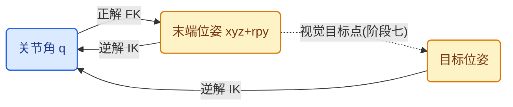

### 31. 31_机械臂运动学数学速成

**原理**：机械臂是一条刚体链，运动学研究它的几何关系（不管力和质量——那是动力学）。两个预备知识：① 弧度与度互换算（$1\ \text{rad}=57.3°$），数学库的三角函数一律用弧度；② 末端位姿 = 位置（xyz，3 个数）+ 姿态（rpy，3 个数），共 6 个数。正解（FK）：关节角 → 末端位姿；逆解（IK）：末端位姿 → 关节角。

**代码**：

```python
import math

def deg2rad(d):
    return d * math.pi / 180.0

def rad2deg(r):
    return r * 180.0 / math.pi

# 三角函数必须用弧度：sin(90°) = 1
print(math.sin(deg2rad(90)))   # 1.0
```

**验收**：任意度/弧度互转心算；能解释为什么 `math.sin(90)` 是错的（0.894… 而不是 1）。

### 32. 32_机械臂运动学正解

**原理**：正解 = 把关节角代入链式几何，算出末端在基座系下的位置。两关节平面臂（课程最短路径，与 DQN 篇同模型）：

$$x=L_1\cos q_1+L_2\cos(q_1+q_2),\qquad y=L_1\sin q_1+L_2\sin(q_1+q_2)$$

6 关节的通用方法：每个关节一个齐次变换矩阵（第 33 章），全部连乘（第 34 章）。正解是**唯一的**：一组关节角只对应一个末端位姿。

**代码**：

```python
import math

def fk_2link(q1, q2, L1=0.6, L2=0.4):
    x = L1 * math.cos(q1) + L2 * math.cos(q1 + q2)
    y = L1 * math.sin(q1) + L2 * math.sin(q1 + q2)
    return x, y

print(fk_2link(0, 0))   # (1.0, 0.0)：两臂伸直
```

**验收**：手算 q1=0、q2=0 和 q1=π/2、q2=0 两个姿势的末端位置，与代码输出一致。

### 33. 33_旋转平移的矩阵表达

**原理**：三维位姿 = 旋转矩阵 R（3×3）+ 平移 t（3×1），合成 4×4 齐次变换：

$$T=\begin{bmatrix}R & t\\ 0 & 1\end{bmatrix}$$

绕 z 轴转 θ：

$$R_z(\theta)=\begin{bmatrix}\cos\theta & -\sin\theta & 0\\ \sin\theta & \cos\theta & 0\\ 0 & 0 & 1\end{bmatrix}$$

齐次变换的好处：平移和旋转统一成矩阵乘法，整条臂就是一连串矩阵连乘。记号约定（详见位姿篇）：$T_{AB}$ 表示把 B 系坐标变换到 A 系，方向不能写反。

**代码**：

```python
import math

import numpy as np

def rot_z(th):
    c, s = math.cos(th), math.sin(th)
    return np.array([[c, -s, 0.0], [s, c, 0.0], [0.0, 0.0, 1.0]])

def hom(R, t):
    T = np.eye(4)
    T[:3, :3], T[:3, 3] = R, t
    return T

print(rot_z(math.pi / 2) @ np.array([1.0, 0.0, 0.0]))   # [0, 1, 0]
```

**验收**：用 rot_z(90°) 作用在 x 轴向量 (1,0,0) 上得到 (0,1,0)；解释齐次矩阵第四行 [0 0 0 1] 的作用。

### 34. 34_机械臂正解的代码实现

**原理**：把第 20 章定下的关节顺序写成 DH 参数表（θ, d, a, α），每个关节生成一个变换，连乘得到末端：$T_{0E}=T_{01}\cdot T_{12}\cdots T_{(n-1)n}$。实现后立即做零位验证：全部关节为 0 时，末端必须停在你预先知道的位置——这个测试能抓住 90% 的符号和顺序错误。

**代码**：

```python
import math

import numpy as np

def dh_transform(theta, d, a, alpha):
    """标准 DH：一个关节的齐次变换。"""
    ct, st = math.cos(theta), math.sin(theta)
    ca, sa = math.cos(alpha), math.sin(alpha)
    return np.array([
        [ct, -st * ca,  st * sa, a * ct],
        [st,  ct * ca, -ct * sa, a * st],
        [0,   sa,       ca,      d],
        [0,   0,        0,       1.0],
    ])

def fk_dh(q, dh_params):
    """正解：DH 参数表 + 关节角 -> 末端齐次矩阵。"""
    T = np.eye(4)
    for (d, a, alpha), qi in zip(dh_params, q):
        T = T @ dh_transform(qi, d, a, alpha)
    return T
```

**验收**：零位时末端位置与真实机械臂（尺子量）误差 < 1cm；DH 参数表与 URDF 的 origin/axis 逐项对照过。

### 35. 35_运动学逆解介绍

**原理**：逆解 = 给定末端位姿求关节角。与正解相反，逆解**不唯一**：肘上/肘下、腕翻转，一个末端位姿可对应多组关节角；也可能**无解**（目标超出工作空间）。两种解法：**解析解**（几何/代数推导，快且能给出全部解，但要求构型配合，如球形腕后三轴交于一点）；**数值解**（雅可比伪逆或优化迭代，通用但慢、可能不收敛）。课程路径：两关节几何法入门（第 36 章）→ 6 关节用现成库。

**代码**：任何逆解都必须过的检验：

```python
import numpy as np

def check_ik(q, target, fk):
    """逆解结果必须能通过正解还原目标，误差在阈值内。"""
    err = np.linalg.norm(np.array(fk(*q)) - np.array(target))
    assert err < 0.01, f"逆解误差 {err:.4f} 太大"
    return q
```

**验收**：说清正解与逆解在"唯一性"上的区别；画出两关节臂肘上/肘下两组解的示意图。

### 36. 36_运动学逆解求解思路

**原理**：两关节平面臂的几何法：由余弦定理得 $q_2$，再由反正切组合得 $q_1$：

$$\cos q_2=\frac{x^2+y^2-L_1^2-L_2^2}{2L_1L_2},\qquad q_1=\operatorname{atan2}(y,x)-\operatorname{atan2}(L_2\sin q_2,\ L_1+L_2\cos q_2)$$

6 关节机械臂：前三关节定位、后三关节定姿态（球形腕解耦），或用 ikpy 这类 URDF 驱动的库。工程处理：多解时选离当前位形最近的那组（关节动得最少）；抓取任务先解预抓取位姿（目标上方 8cm），再垂直下降，把高速移动和接触动作分离。

**代码**：

```python
import math

def ik_2link(x, y, L1=0.6, L2=0.4):
    """两关节平面臂几何逆解（肘上解）。"""
    d = (x * x + y * y - L1 * L1 - L2 * L2) / (2 * L1 * L2)
    d = max(-1.0, min(1.0, d))             # 数值安全，防止 acos 越界
    q2 = math.acos(d)
    q1 = math.atan2(y, x) - math.atan2(L2 * math.sin(q2), L1 + L2 * math.cos(q2))
    return q1, q2

# 闭环验证：先正解取一个末端点，再逆解，应回到原关节角
x, y = fk_2link(0.5, -0.3)
print(ik_2link(x, y))     # 约等于 (0.5, -0.3)
```

**验收**：对 10 个随机点做 fk(ik(p)) 闭环，误差 < 1mm；把目标放到工作空间外，确认输出 NaN 并给出显式报错而不是乱动。

### 37. 37_机械臂末端坐标的计算与展示

**原理**：把第 34 章的正解接上实时关节角：前端不再只显示角度，而是实时显示末端 xyz（单位：米）。末端坐标是唯一能用尺子对拍的物理量——调试 IK、验证标定全靠它。链路：编码器关节角 → FK → 末端 xyz → 前端数值/3D 展示。

**代码**：

```python
class EndEffectorTracker:
    """关节角 -> 末端 xyz，随动更新。"""
    def __init__(self, fk_fn):
        self.fk, self.xyz = fk_fn, (0.0, 0.0, 0.0)

    def update(self, q):
        self.xyz = self.fk(q)
        return self.xyz
```

**验收**：真机摆两个已知姿势，尺子量的末端位置与 FK 输出误差 < 1cm；前端展示刷新率 ≥ 30Hz。

### 38. 38_机械臂示教器的完成

**原理**：示教器（teach pendant）= 手动控制界面：单关节微调（Jog）、末端坐标模式、记录/回放示教点。工业示教器的核心就是**示教点序列 → 回放**。工程要点：Jog 步长可切换（粗/中/细）；回放前先以 20% 速度预览一遍路径。第 36 章逆解 + 第 28 章前端 = 示教器。

**代码**：

```python
class TeachPendant:
    """示教器：微调 + 录点 + 低速预览回放。"""
    def __init__(self, sdk):
        self.sdk, self.points = sdk, []

    def jog(self, joint, delta_deg):
        self.sdk.move_relative(joint, delta_deg)

    def record(self):
        self.points.append(tuple(self.sdk.read_all_angles()))

    def play(self, speed_scale=0.2):
        for q in self.points:
            self.sdk.move_joints(q, speed_scale=speed_scale)
```

**验收**：录 3 个示教点，先 20% 速度预览再全速回放，路径与示教一致；关节模式和末端模式都能正常控制。

## 阶段六 学生端部署与同步控制（39–44）

**阶段目标**：把学生端从"能转的舵机"变成"稳的机械臂"——标定零位、整定 PID、消除抖动，最终实现与教师端的同步遥操作。

**阶段闭环**：阶跃响应超调 < 10%、稳态误差 < 0.5°，同步跟随误差 < 1°。

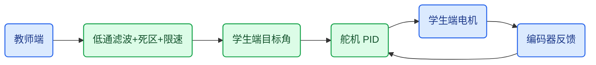

### 39. 39_学生端机械臂的安装

**原理**：学生端 = 执行端，6 个舵机按构型装配。安装要点：① 螺丝先松后紧，全部就位再统一锁紧，避免应力变形；② 舵机中位对齐——上电前手动摆到中位或用上位机设中位，防止上电瞬间甩到限位；③ 线束留余量，关节极限处不拉扯；④ 通电前用万用表确认供电电压和极性。

**代码**：上电前四查：

```python
def install_checklist(power_ok, ids_ok, wiring_ok, estop_ok):
    """上电前四查，全部为 True 才允许通电。"""
    checks = {
        "供电电压在规格内": power_ok,
        "舵机 ID 全部唯一": ids_ok,
        "极限位线束不紧绷": wiring_ok,
        "急停已断开": estop_ok,
    }
    for name, ok in checks.items():
        print(f"{'[OK]' if ok else '[NO]'} {name}")
    return all(checks.values())
```

**验收**：四查全 OK 才上电；首次上电所有关节在中位附近，运行 5 分钟无异常发热。

### 40. 40_学生端机械臂的配置与标定

**原理**：配置：给 6 个舵机写唯一 ID、设角度范围/速度/力矩上限。标定：确定每个舵机**零位偏移**——编码器零点与机械零点的偏差。方法：把关节摆到机械零位（靠山/水平仪）→ 读编码器 → offset = 机械角度 − 读数。offset 表是之后所有运动学计算的前提，必须存文件并备份。

**代码**：

```python
import json

class JointCalibration:
    """零位偏移表：机械角度 = 编码器读数 + offset。"""
    def __init__(self, path="calibration.json"):
        self.path, self.offsets = path, {}

    def calibrate(self, joint, encoder_reading, true_angle_deg):
        self.offsets[joint] = true_angle_deg - encoder_reading
        self.save()

    def to_mechanical(self, joint, reading):
        return reading + self.offsets[joint]

    def save(self):
        json.dump(self.offsets, open(self.path, "w"))
```

**验收**：标定后 6 关节摆到机械零位，读数全部为 0 ± 0.2°；offset 文件已备份到第二位置。

### 41. 41_为什么机械臂会出现帕金森

**原理**："帕金森" = 末端高频抖动/振荡。五个来源：① **P 增益过大**——超调后反向修正，来回振荡；② **编码器分辨率低**——量化台阶之间来回跳；③ **回差**（第 12 章）——到位后反向修正进入齿轮间隙死区，来回晃；④ 控制频率太低、负载变化大；⑤ 传感器噪声直接进控制器。定位方法：先听/看是高频嗡嗡（增益、噪声）还是低频摆动（回差、机械松动），再区分是静止抖动还是运动中抖。

**代码**：振荡检测：

```python
def detect_oscillation(samples, window=20, threshold_deg=1.5):
    """静止时角度峰峰值超过阈值 -> 疑似振荡。"""
    if len(samples) < window:
        return False, 0.0
    w = samples[-window:]
    pp = max(w) - min(w)
    return pp > threshold_deg, pp
```

**验收**：记录一次抖动的角度曲线，用峰峰值和频率判断属于五类中的哪一类，并给出对应修正。

### 42. 42_机械臂PID的配置

**原理**：PID 三项：**P** 比例（响应速度，过大振荡）、**I** 积分（消除稳态误差，过大超调/积分饱和）、**D** 微分（阻尼，但放大噪声）。舵机位置环常用 PI 或纯 P。整定顺序：P 从小到大小步加，出现轻微振荡后取 50–60%；再加 I 消除稳态误差；D 最后，噪声大就不加。离散化：$u=K_p e + K_i\sum e\,dt + K_d\frac{de}{dt}$，输出必须限幅，积分要抗饱和。

**代码**：

```python
class PID:
    """位置环 PID：输出限幅 + 积分抗饱和。"""
    def __init__(self, kp, ki, kd, out_max=100.0):
        self.kp, self.ki, self.kd = kp, ki, kd
        self.out_max, self.integral, self.prev_err = out_max, 0.0, 0.0

    def step(self, target, current, dt):
        err = target - current
        self.integral += err * dt
        deriv = (err - self.prev_err) / dt
        self.prev_err = err
        out = self.kp * err + self.ki * self.integral + self.kd * deriv
        out = max(-self.out_max, min(self.out_max, out))
        if abs(out) == self.out_max:      # 输出饱和时衰减积分，防 windup
            self.integral *= 0.9
        return out
```

**验收**：阶跃响应：超调 < 10%、稳态误差 < 0.5°；整定过程记录至少 3 组参数对比曲线（P 过大 / 合适 / 加 I 后）。

### 43. 43_机械臂同步遥操作的实现

**原理**：同步 = 学生端跟随教师端的**角度轨迹**，而不是一步到位。舵机内部闭环负责"到目标角"，平滑跟随靠上位机：每个周期读教师端 → 作为学生端目标 → 写。同步误差 = 教师端角度 − 学生端当前角度，正常 < 1°；持续拉大说明学生端力矩不够或限速过低。

**代码**：

```python
import time

def sync_loop(leader_reader, follower_sdk, dt=0.03, ids=(1, 2, 3, 4, 5, 6)):
    """同步遥操作：每个周期教师端角度就是学生端目标。"""
    while True:
        _, targets = leader_reader.read_all()
        for sid, q in zip(ids, targets):
            follower_sdk.set_target(sid, q)   # 舵机内部闭环执行
        time.sleep(dt)
```

**验收**：教师端匀速画圆，学生端同步画圆；同步误差 < 1°，最大延迟 < 100ms。

### 44. 44_机械臂同步优化的策略

**原理**：四个优化手段：① **低通滤波**——指数滑动平均（α≈0.3–0.5）去掉教师端手的抖动；② **死区**——角度变化 < 0.2° 不更新目标，减少总线负载和机械磨损；③ **限速**——每周期角度变化设上限，防突跳；④ **前馈**——教师端速度直接叠加到学生端目标，减小跟随滞后。对比指标：抖动峰峰值、跟随误差、总线占用率。

**代码**：

```python
class SmoothFollower:
    """低通滤波 + 死区 + 限速：同步优化的三个标准件。"""
    def __init__(self, alpha=0.4, deadband=0.2, max_step=3.0):
        self.alpha, self.deadband, self.max_step = alpha, deadband, max_step
        self.filtered = None
        self.target = None

    def update(self, raw):
        if self.filtered is None:
            self.filtered, self.target = list(raw), list(raw)
        # 1) 指数滑动平均滤波
        self.filtered = [self.alpha * r + (1 - self.alpha) * f
                         for r, f in zip(raw, self.filtered)]
        # 2) 死区 + 3) 限速
        out = []
        for f, t in zip(self.filtered, self.target):
            d = f - t
            if abs(d) < self.deadband:
                out.append(t)                    # 死区：不更新
            else:
                step = max(-self.max_step, min(self.max_step, d))
                out.append(t + step)             # 限速
        self.target = out
        return out
```

**验收**：同一次示教，优化前后对比：抖动峰峰值下降 > 50%，跟随误差仍 < 1°、延迟不劣化。

## 阶段七 计算机视觉（45–63）

**阶段目标**：让机械臂"看见"——从图像里得到目标在机器人坐标系下的位置与姿态。传统 CV 管简单稳定的任务（定位、测量、标定），阶段八的模型管语义。数据集与追踪的扩展见 [机器人学习路线与视觉数据集扩展](./机器人学习路线与视觉数据集扩展.md)，ROS2 集成见 [ROS2 自学路线](./ROS2具身智能机器人自学路线与代码.md)。

**阶段闭环**：相机看到目标 → 像素坐标 → 手眼标定变换 → 机器人坐标 → 送阶段五逆解，整条链路用标定物实测误差 < 3mm。


### 45. 45_计算机视觉介绍

**原理**：计算机视觉 = 让计算机从图像里提取结构化信息（位置/类别/姿态/尺寸），供决策层使用。机器人视觉和手机相册 AI 的区别在于**输出**：机器人要的是"物体在哪个像素、距相机多远"，输出直接进运动学；不是分类标签。经典管线：采集 → 预处理（滤波/变换）→ 分割/检测 → 特征提取 → 输出。传统 CV（本阶段）与深度学习（阶段八）的分界：特征手工设计 vs 数据驱动。

**代码**：

```python
import cv2

cap = cv2.VideoCapture(0)
ok, frame = cap.read()
if ok:
    print(frame.shape)   # (高, 宽, 3) BGR
    print(cap.get(cv2.CAP_PROP_FPS))
```

**验收**：打开相机打印分辨率/帧率；说清机器人视觉的输出是什么（坐标+姿态，不是标签）。

### 46. 46_计算机存储图像的原理

**原理**：数字图像 = 像素矩阵：高 × 宽 × 3 通道，每像素 uint8（0–255）。OpenCV 默认 **BGR** 顺序（不是 RGB），与 PIL/网页的 RGB 互转是高频坑。灰度 = 0.299R + 0.587G + 0.114B；8bit 图 255 是饱和白。内存：640×480×3 ≈ 0.9MB/帧，1920×1080×3 ≈ 6.2MB/帧。深度图每像素存的是距离（毫米或米）。

**代码**：

```python
import numpy as np

img = np.zeros((480, 640, 3), dtype=np.uint8)
img[:, :] = (0, 0, 255)        # 纯红（BGR 顺序）
pixel = img[100, 200]          # 第 100 行、200 列的 BGR 值
print(pixel)                   # [0 0 255]
```

**验收**：说清 BGR 与 RGB 的区别；算出 640×480 彩色图的内存大小。

### 47. 47_摄像头画面抖动的原因

**原理**：画面抖动/闪烁的五个来源：① **卷帘快门**（rolling shutter）逐行曝光，运动中物体变形（果冻效应）→ 换全局快门相机；② 曝光时间过长 → 运动模糊 → 手动固定曝光；③ **自动曝光/自动白平衡跳变** → 颜色阈值失效（视觉项目第一坑）→ 锁定 AE/AWB；④ 帧率不稳、丢帧；⑤ 支架松动、机械振动、USB 延长线信号干扰。

**代码**：

```python
cap = cv2.VideoCapture(0)
cap.set(cv2.CAP_PROP_FRAME_WIDTH, 640)
cap.set(cv2.CAP_PROP_FRAME_HEIGHT, 480)
cap.set(cv2.CAP_PROP_AUTO_EXPOSURE, 0.25)   # 手动曝光模式
cap.set(cv2.CAP_PROP_EXPOSURE, -6)          # 曝光值固定
```

**验收**：锁定曝光/白平衡/分辨率后，静止画面逐像素差 < 2；把五个来源逐一排除并记录。

### 48. 48_opencv入门

**原理**：OpenCV 四大基本操作：读（imread/VideoCapture）、转（cvtColor：BGR→灰度/HSV）、写（imwrite）、显（imshow）。`cv2.waitKey` 是事件循环，不调用窗口不刷新。图像坐标系原点在**左上角**，x 向右、y **向下**——与数学坐标系相反，图像坐标进运动学前必须翻转或显式转换。

**代码**：

```python
import cv2

img = cv2.imread("frame.png")
gray = cv2.cvtColor(img, cv2.COLOR_BGR2GRAY)
cv2.imshow("gray", gray)
cv2.waitKey(0)
cv2.imwrite("gray.png", gray)
```

**验收**：完成 读→转灰度→显示→保存 四步；说清图像 y 轴方向与数学坐标系的区别。

### 49. 49_opencv的ROI选取

**原理**：ROI（Region of Interest）= 只处理图像的一部分：减少计算量、排除背景干扰。视觉任务几乎都发生在工作台区域，桌面以外（人、灯光、窗户）全是干扰源。裁剪就是 numpy 切片 `img[y1:y2, x1:x2]`。

**代码**：

```python
h, w = img.shape[:2]
table = img[int(h * 0.4):h, 0:w]     # 只保留下半部分工作台
cv2.imshow("table", table)
```

**验收**：用 ROI 后单帧处理耗时明显下降；背景干扰被排除后检测误报减少。

### 50. 50_opencv颜色识别

**原理**：BGR 三通道互相耦合、对光照敏感，颜色识别改用 **HSV**：H 色相（颜色种类）、S 饱和度（纯度）、V 明度。`cv2.inRange` 把范围内像素置 255 得到二值掩膜。光照变化主要影响 V 而不影响 H——这是 HSV 比 BGR 稳的原因。注意红色 H 值环绕：0–10 和 170–180 两段都要取。

**代码**：

```python
import cv2
import numpy as np

hsv = cv2.cvtColor(img, cv2.COLOR_BGR2HSV)
mask = cv2.inRange(hsv, (0, 100, 100), (10, 255, 255))      # 红色第一段
mask |= cv2.inRange(hsv, (170, 100, 100), (180, 255, 255))  # 红色第二段
cnts, _ = cv2.findContours(mask, cv2.RETR_EXTERNAL, cv2.CHAIN_APPROX_SIMPLE)
```

**验收**：固定光照下稳定框出目标；手电筒补光后不丢失（验证 HSV 对亮度变化的鲁棒性）。

### 51. 51_opencv超参数调整技巧

**原理**：阈值类算法最难的不是原理而是调参。四个工程手段：① **Trackbar 实时调**，调完把值写进配置文件（不要硬编码回代码）；② 先粗后细：先大范围框住，再收窄；③ 参数网格扫描：脚本遍历参数组合，输出各组的检出率；④ 把光照变化当参数：换光源/角度复测，阈值要留裕量。

**代码**：

```python
def nothing(x):
    pass

cv2.namedWindow("tune")
cv2.createTrackbar("Hmin", "tune", 0, 180, nothing)
cv2.createTrackbar("Hmax", "tune", 180, 180, nothing)
# 主循环里读 trackbar 值喂给 inRange
hmin = cv2.getTrackbarPos("Hmin", "tune")
hmax = cv2.getTrackbarPos("Hmax", "tune")
```

**验收**：用 Trackbar 调出一组阈值，换三个光照条件复测全部检出；参数存入配置文件。

### 52. 52_高级案例白色瓶盖计数

**原理**：综合案例：白色物体在 HSV 里是**低饱和度、高明度**（S 小、V 大）→ 阈值 → 形态学开运算去噪 → findContours → 按面积过滤噪点 → 计数。关键坑：重叠瓶盖会连成一个轮廓导致漏计——计数类任务必须先考虑重叠分割（分水岭/距离变换），否则只对"不重叠"场景有效。

**代码**：

```python
import cv2
import numpy as np

hsv = cv2.cvtColor(img, cv2.COLOR_BGR2HSV)
mask = cv2.inRange(hsv, (0, 0, 180), (180, 40, 255))       # 白：低饱和高亮
mask = cv2.morphologyEx(mask, cv2.MORPH_OPEN, np.ones((5, 5), np.uint8))
cnts, _ = cv2.findContours(mask, cv2.RETR_EXTERNAL, cv2.CHAIN_APPROX_SIMPLE)
caps = [c for c in cnts if cv2.contourArea(c) > 200]
print(f"瓶盖数量: {len(caps)}")
```

**验收**：10 个不重叠瓶盖计数 = 10；说明两个重叠瓶盖为什么漏检，并给出应对方案。

### 53. 53_眼在手上眼在手外

**原理**：两种相机安装构型：**眼在手外**（Eye-to-hand）：相机固定在工作区外，视野大、图像稳，但机械臂会遮挡目标；**眼在手上**（Eye-in-hand）：相机装在末端，可近看、无遮挡，但视野随臂摆动、有运动模糊。构型决定标定方程：眼在手外求 $T_{相机→基座}$（一次标定永久用）；眼在手上求 $T_{相机→末端}$（每帧还要乘末端位姿）。课程抓取场景推荐眼在手外。

**代码**：两种构型的坐标系链：

```python
def eye_to_hand(T_base_cam, p_cam):
    """眼在手外：相机固定在基座上，一次标定永不变。"""
    return T_base_cam @ p_cam

def eye_in_hand(T_base_ee, T_ee_cam, p_cam):
    """眼在手上：相机随末端动，每帧都要乘末端位姿。"""
    return T_base_ee @ T_ee_cam @ p_cam
```

**验收**：画出两种构型的坐标系链；说清各自标定里什么是常量、什么是变量。

### 54. 54_机器视觉物体宽高测量

**原理**：物体尺寸（像素）× 每像素实际尺寸（mm/px）= 真实尺寸。标定 mm/px：放一个已知尺寸的标定物（20mm 硬币、棋盘格），测出像素宽，比例 k = 实际/像素。前提：物体与标定物在**同一平面**（垂直光轴），否则透视造成近大远小。物体离开该平面（被垫高）时 k 失效——要么重标定，要么用第 58 章透视变换统一到平面。

**代码**：

```python
def measure_size(contour, mm_per_px):
    x, y, w, h = cv2.boundingRect(contour)
    return w * mm_per_px, h * mm_per_px   # (宽, 高) 单位 mm

# 标定：20mm 物体在图像中 200px -> mm_per_px = 0.1
print(measure_size(c, 0.1))
```

**验收**：同平面三个物体测量误差 < 0.5mm；说明物体垫高 5cm 后误差方向（变大）和原因（透视）。

### 55. 55_手眼标定和差值计算

**原理**：手眼标定 = 求相机系与机器人基座系之间的变换 $T_{BC}$。标定后误差有两个来源：**标定残差**（系统性，用重投影误差衡量）和**标定漂移**（相机/支架移动后标定失效，只能重标）。差值计算 = 目标点机器人坐标 − 末端当前坐标 = 运动量，直接喂给逆解。标定矩阵不是魔法常数：相机移动、支架松动、深度单位从毫米变米，抓取点都会整体偏移。

**代码**：

```python
import numpy as np

def pixel_to_base(u, v, depth_m, K, T_base_camera):
    """像素中心 + 深度 -> 机器人基座坐标，单位统一为米。"""
    fx, fy = K[0, 0], K[1, 1]
    cx, cy = K[0, 2], K[1, 2]
    if not np.isfinite(depth_m) or not 0.05 < depth_m < 3.0:
        raise ValueError("深度无效或超出安全范围")
    p_camera = np.array([(u - cx) * depth_m / fx,
                         (v - cy) * depth_m / fy,
                         depth_m, 1.0])
    return T_base_camera @ p_camera
```

**验收**：重投影误差 < 2px；把相机平移 1cm 后复测，记录抓取点偏移量并重新标定。

### 56. 56_opencv形状识别和优化

**原理**：形状识别靠轮廓特征：面积、周长、近似多边形（approxPolyDP）、最小外接矩形/圆、长宽比、凸包。优化靠过滤条件：按面积滤噪点、按长宽比/圆度筛目标。approxPolyDP 顶点数判形状：3=三角形、4=矩形、多=圆。圆度 = 4π·面积/周长²（正圆 = 1，越接近 0 越不像圆）。

**代码**：

```python
peri = cv2.arcLength(c, True)
approx = cv2.approxPolyDP(c, 0.02 * peri, True)
area = cv2.contourArea(c)
circularity = 4 * 3.14159 * area / (peri * peri)
if len(approx) == 4 and 0.8 < circularity < 1.2:    # 近似正方形
    print("正方形")
```

**验收**：三角形/矩形/圆各 5 个样本全部正确分类；说出每个过滤条件的物理含义。

### 57. 57_opencv目标追踪

**原理**：追踪 = 在连续帧里锁定同一个目标。三种方案：**颜色追踪**（快，怕同色干扰）、**传统追踪器**（CSRT 准但慢、KCF 快但易丢）、**检测式追踪**（逐帧检测 + 匈牙利匹配，最稳，阶段八 YOLO + ByteTrack 即此范式）。机器人抓取的要点：目标被机械臂挡住时追踪必丢——所以接近阶段要靠运动学记忆，不能依赖视觉。

**代码**：

```python
tracker = cv2.TrackerCSRT_create()
tracker.init(frame, bbox)               # bbox = (x, y, w, h)
ok, bbox = tracker.update(frame)
if ok:
    x, y, w, h = [int(v) for v in bbox]
```

**验收**：目标缓慢移动时连续追踪 60s 不丢；说明"目标静止、相机移动"时哪种追踪器会失效及原因。

### 58. 58_opencv仿射变换上帝视角

**原理**：斜着看桌面，正方形变梯形（透视畸变）。"上帝视角" = 把图像变换成垂直俯视：取图中桌面四角 → `getPerspectiveTransform` 求透视矩阵 H → `warpPerspective` 变换。变换后图像上像素距离与真实距离成**正比**，测量和定位都大幅简化。前提：所有目标都在同一平面（桌面）上。

**代码**：

```python
import numpy as np

src = np.float32([[50, 50], [590, 60], [40, 430], [600, 440]])   # 图中桌面四角
dst = np.float32([[0, 0], [400, 0], [0, 400], [400, 400]])       # 俯视正方形
H = cv2.getPerspectiveTransform(src, dst)
bird = cv2.warpPerspective(img, H, (400, 400))
```

**验收**：俯视图中正方形物体像素长宽比 1:1；用 20mm 标定物求 mm/px，复测第 54 章物体误差 < 0.5mm。

### 59. 59_opencv旋转角和中心点识别案例分析

**原理**：案例：识别长条形物体的中心点 (cx, cy) 和旋转角 θ——抓取需要的不仅是位置，还有姿态（夹爪要对准长边）。方法：轮廓 → `minAreaRect` → 中心 + 角度。注意 minAreaRect 的角度定义（与 x 轴夹角，返回 -90°~0°，且长宽可能互换），必须实测验证角度语义，不要想当然。

**代码**：

```python
rect = cv2.minAreaRect(c)
(cx, cy), (w, h), angle = rect
box = cv2.boxPoints(rect)
box = np.int0(box)
cv2.drawContours(img, [box], 0, (0, 255, 0), 2)
```

**验收**：物体从 0° 转到 180°，每 30° 拍一张，识别角度与真实角度误差 < 2°。

### 60. 60_中心点和旋转角代码实现

**原理**：完整实现：预处理（灰度/HSV → 阈值）→ 最大轮廓 → minAreaRect → 中心 + 角度 → 可视化 → 输出结构化结果给抓取规划。工程细节：中心点用轮廓矩（M10/M00）比 minAreaRect 的中心更稳；角度要统一范围并处理 90° 歧义（长宽互换时角度跳变）。

**代码**：

```python
def detect_pose(mask):
    """掩膜 -> 目标中心点与旋转角（度）。"""
    cnts, _ = cv2.findContours(mask, cv2.RETR_EXTERNAL, cv2.CHAIN_APPROX_SIMPLE)
    if not cnts:
        return None
    c = max(cnts, key=cv2.contourArea)
    M = cv2.moments(c)
    cx, cy = M["m10"] / M["m00"], M["m01"] / M["m00"]     # 中心点
    _, (w, h), angle = cv2.minAreaRect(c)
    if w < h:
        angle += 90                                       # 统一为长边角度
    return {"center": (cx, cy), "angle": angle % 180}
```

**验收**：10 次重复测量，中心抖动 < 1px、角度抖动 < 1°；结果画在图上人工确认。

### 61. 61_opencv二维码识别

**原理**：QR 码 = 三个定位角（回字）+ 数据区。识别流程：定位角检测 → 透视校正 → 解码。OpenCV 用 `QRCodeDetector`；暗光/污损场景更稳的方案是 ZBar/pyzbar。机器人场景的用途：工件标识、料箱 ID、以及 **ArUco 标签位姿估计**（比二维码多输出 6DOF 位姿，可当手眼标定的标定板）。

**代码**：

```python
detector = cv2.QRCodeDetector()
data, pts, _ = detector.detectAndDecode(img)
if pts is not None:
    print(data)      # 内容；pts 是四角坐标
```

**验收**：正常光照 10/10 解码；说出二维码与 ArUco 在机器人里用途的区别（内容 vs 位姿）。

### 62. 62_opencv人脸识别

**原理**：经典方法 Haar 级联：矩形特征 + 级联分类器滑窗检测，快但精度一般；现代方法：深度学习检测（OpenCV DNN / RetinaFace）。它在课程里的意义：演示"**滑窗 + 分类器**"的检测范式——阶段八的 YOLO 就是它的数据驱动升级版（单次前向直接回归框）。工程提醒：人脸数据涉及隐私，采集前脱敏、最小化保存。

**代码**：

```python
face_cascade = cv2.CascadeClassifier(
    cv2.data.haarcascades + "haarcascade_frontalface_default.xml")
gray = cv2.cvtColor(img, cv2.COLOR_BGR2GRAY)
faces = face_cascade.detectMultiScale(gray, 1.1, 5)   # (scale, minNeighbors)
```

**验收**：正面人脸检出；说明 Haar 滑窗范式与 YOLO 端到端范式的区别（衔接第 74 章）。

### 63. 63_opencv的局限性

**原理**：传统 CV 的边界：① 光照变化 → 阈值失效；② 遮挡/重叠 → 轮廓粘连；③ 手工特征表达不了"语义"（"瓶盖"不只是白色圆形）；④ 每换一个物体都要重新调参。这正是阶段八机器学习的动机：让数据驱动特征。工程结论：规则 CV 做简单稳定的任务（定位、测量、标定），语义理解交给模型。

**代码**：

```python
def traditional_cv_limits():
    """传统 CV 四问：回答不上来的部分就交给阶段八的模型。"""
    return [
        "光照变化时阈值还稳吗？",
        "目标重叠/被遮挡时轮廓还分得开吗？",
        "换一个同类但不同色的物体要重调参吗？",
        "任务需要‘类别语义’还是只要‘位置’？",
    ]
```

**验收**：用自己的任务回答四问，写清哪部分用规则 CV、哪部分留给 YOLO。

## 阶段八 机器学习与检测模型（64–83）

**阶段目标**：从"手工规则"过渡到"数据驱动"：理解机器学习闭环，用 YOLO 训练出自己的物体检测模型，替换阶段七里脆弱的颜色阈值。两关节强化学习案例见 [DQN 训练篇](./机器人强化学习入门：DQN训练两关节机械臂.md)。

**阶段闭环**：自建数据集（真实 + 合成）训练 YOLO，真实场景 mAP50 > 0.9。


### 64. 64_机器学习概念入门

**原理**：机器学习 = 从数据中自动学规律，替代手工写死的规则。三大类：**监督学习**（有标签：分类/回归，本阶段主线）、**无监督学习**（聚类/降维）、**强化学习**（奖励信号，第 104 章）。与规则 CV（第 50–63 章）对比：规则是人工调的阈值，机器学习是数据学出来的函数——数据变，模型重训；场景变，规则重调。

**代码**：第一个 sklearn 模型：

```python
from sklearn.tree import DecisionTreeClassifier

# 特征: [直径, 高度] cm；标签: 0=瓶盖 1=积木
X = [[3.0, 3.0], [3.2, 3.1], [4.0, 4.0], [4.1, 4.2], [10.0, 2.0], [10.5, 2.1]]
y = [0, 0, 0, 0, 1, 1]

model = DecisionTreeClassifier().fit(X, y)
print(model.predict([[3.1, 3.0], [9.8, 2.0]]))   # [0 1]
```

**验收**：说清监督/无监督/强化学习三类的监督信号区别；跑通第一个 sklearn 模型。

### 65. 65_端到端学习的概念

**原理**：端到端 = 输入原始观测（图像 + 关节角），直接输出动作，中间没有人工拆解的模块（检测 → 标定 → IK）。对比模块化管线（阶段五–七）：模块化可解释、好调试，但每步误差**累积**；端到端（行为克隆，第 105 章）学得更灵活，但需要大量示教数据且是黑盒。课程的工程答案：模块化管线保证安全底线，端到端做策略层。

**代码**：端到端策略的函数签名：

```python
def end_to_end_policy(obs):
    """输入: 图像+关节角+夹爪状态 -> 输出: 下一时刻关节目标。"""
    x = preprocess(obs)          # 归一化/缩放
    action = policy_net(x)       # 神经网络
    return clamp(action)         # 动作限幅，安全层永远在
```

**验收**：说清端到端与模块化的误差来源差异（累积误差 vs 数据需求）。

### 66. 66_ai推理机器学习三要素

**原理**：机器学习三要素 = **数据、模型、训练算法**（损失函数 + 优化器）。分工：数据决定上限，模型逼近上限，算法决定逼近速度。对应课程：数据 = 遥操作/合成数据（75、82 章），模型 = CNN（78 章），算法 = 梯度下降（69 章）。缺一不可；数据质量差，换任何模型都救不了。

**代码**：三要素自检：

```python
def ml_checklist(X, y, model, loss_fn, lr):
    print(f"数据: {len(X)} 条, 特征维数 {len(X[0])}, 类别 {set(y)}")
    print(f"模型: {type(model).__name__}")
    print(f"训练: loss={loss_fn.__name__}, lr={lr}")
    assert len(X) == len(y), "特征与标签数量不一致"
    return X, y
```

**验收**：列出你任务的三要素；解释"数据决定上限"的含义。

### 67. 67_机器学习流程总结

**原理**：标准七步：数据收集 → 清洗 → 特征工程 → 划分（训练/验证/测试）→ 训练 → 评估 → 部署监控。两条铁律：① **测试集只在最后用一次**——反复调参后还看测试集等于考试前看答案；② 训练/验证按场景划分，不能把同一段动作的相邻帧随机拆到两边（数据泄漏会让指标虚高）。

**代码**：

```python
from sklearn.model_selection import train_test_split

X_tr, X_te, y_tr, y_te = train_test_split(X, y, test_size=0.2, random_state=42)
```

**验收**：画出七步流程并标出每一步的输入输出；解释测试集为什么不能反复用。

### 68. 68_误差函数和sklearn框架安装

**原理**：误差函数（损失）衡量预测与真实的差距：回归用 **MSE**（均方误差，对大误差惩罚重），分类用**交叉熵**（第 73 章）。sklearn 是经典机器学习库，统一 fit/predict 接口。损失决定模型学什么目标——选错损失，模型就学错方向。

**代码**：

```bash
pip install scikit-learn
```

```python
from sklearn.metrics import mean_squared_error

print(mean_squared_error([1.0, 2.0, 3.0], [1.1, 1.9, 3.2]))   # 0.02
```

**验收**：sklearn 安装成功；说清 MSE 与交叉熵分别用于哪类任务。

### 69. 69_梯度下降和神经元结构原理

**原理**：梯度下降 = 沿损失下降最快的方向（负梯度）更新参数：$w \leftarrow w - lr\cdot\frac{\partial L}{\partial w}$。学习率 lr 太小收敛慢、太大震荡发散。神经元：$y=f(\sum w_i x_i + b)$，f 是激活函数（ReLU/sigmoid），多层堆叠成 MLP。"学习"就是不断用梯度修正 w 和 b。

**代码**：

```python
# 一维梯度下降：找 f(w) = (w-3)^2 的最小值
w = 0.0
for _ in range(100):
    grad = 2 * (w - 3)          # df/dw
    w = w - 0.1 * grad          # 学习率 0.1
print(round(w, 3))              # 3.0

# 神经元: y = relu(w1*x1 + w2*x2 + b)
def neuron(x, w, b):
    z = sum(wi * xi for wi, xi in zip(w, x)) + b
    return max(0, z)            # ReLU

print(neuron([0.5, -0.2], [1.0, 2.0], 0.1))   # 0.2
```

**验收**：手推一次 w 的更新过程；解释 lr 过大/过小各会怎样。

### 70. 70_图像数据收集和特征工程

**原理**：数据收集三要点：**多样性**（角度/光照/背景都覆盖）、**平衡**（每类数量相当，否则模型偏向多数类）、**真实分布**（别只拍理想场景，难例必收）。特征工程 = 把原始输入变成模型好学的表示：图像 → 颜色直方图/HOG 或直接像素。深度学习弱化了手工特征（CNN 自己学），但数据收集依然决定上限。

**代码**：

```python
import cv2

def extract_features(img):
    hsv = cv2.cvtColor(img, cv2.COLOR_BGR2HSV)
    hist = cv2.calcHist([hsv], [0, 1], None, [16, 16], [0, 180, 0, 256])
    return cv2.normalize(hist, hist).flatten()   # 颜色直方图特征
```

**验收**：每类收集 ≥ 100 张、覆盖 3 种光照；能解释特征工程的目的是什么。

### 71. 71_模型训练

**原理**：训练 = 反复循环：前向（算预测）→ 算损失 → 反向传播（求梯度）→ 更新参数，直到损失收敛。两个关键现象：**欠拟合**（训练/验证损失都高：模型太简单或没训够）、**过拟合**（训练低验证高：模型背数据）。对策：数据增强、早停、正则化、Dropout。

**代码**：PyTorch 训练循环骨架：

```python
import torch

for epoch in range(50):
    for x, y in loader:
        pred = model(x)
        loss = loss_fn(pred, y)
        optimizer.zero_grad()
        loss.backward()          # 反向传播
        optimizer.step()         # 更新参数
    print(f"epoch {epoch}: loss {loss.item():.4f}")
```

**验收**：画出训练/验证损失曲线，判断欠拟合/过拟合并给出对策。

### 72. 72_模型文件的解析和推理

**原理**：模型文件 = 结构 + 权重（参数）。常见格式：joblib/pickle（sklearn）、.pt/.onnx（神经网络）。推理 = 加载权重 + 前向计算，**不更新参数**（`model.eval()` 关闭 Dropout/BN 训练模式）。部署第一坑：输入预处理必须和训练时完全一致（尺寸/归一化/通道顺序），否则效果崩塌。

**代码**：

```python
import joblib

joblib.dump(model, "model.joblib")       # 保存
m = joblib.load("model.joblib")          # 加载
print(m.predict([[3.0, 3.0]]))           # 推理
```

**验收**：保存 → 重启 → 加载 → 推理结果一致；说清训练与推理时模型状态的区别。

### 73. 73_混淆矩阵和交叉熵

**原理**：准确率会骗人：99% 是负样本的数据集上，"全预测负"就有 99% 准确率但毫无用处。混淆矩阵（TP/FP/FN/TN）引出：精确率 $P=TP/(TP+FP)$（预测正里有多少对）、召回率 $R=TP/(TP+FN)$（真实正里找回多少）、F1 = 调和平均。交叉熵 $L=-\sum y\log p$：预测越自信且越对，损失越小——分类任务的标准损失。

**代码**：

```python
from sklearn.metrics import confusion_matrix, classification_report

y_true = [0, 1, 1, 0, 1]
y_pred = [0, 1, 0, 0, 1]
print(confusion_matrix(y_true, y_pred))
print(classification_report(y_true, y_pred))
```

**验收**：手算一个 2×2 混淆矩阵的 P/R/F1；解释交叉熵公式每一项的含义。

### 74. 74_yolo快速入门

**原理**：YOLO（You Only Look Once）= 单次前向直接回归所有框：图像分成网格，每格预测框 + 类别 + 置信度，再 NMS 去重。与 Haar 滑窗（第 62 章）对比：快一个量级、端到端可训练。Ultralytics 封装了训练/推理/评估，是课程的视觉模型主力。

**代码**：

```python
from ultralytics import YOLO

model = YOLO("yolov8n.pt")            # 预训练权重
results = model("table.jpg")
for r in results:
    for box in r.boxes:
        cls = model.names[int(box.cls)]
        print(cls, box.conf, box.xyxy)   # 类别 / 置信度 / 框坐标
```

**验收**：官方权重跑通自己的场景图；说清 YOLO 与滑窗检测的范式差异。

### 75. 75_数据标注

**原理**：标注 = 给图像画框 + 类别标签。工具：LabelImg（本地）、Roboflow（在线协作）。原则：框贴合物体且留边一致（≤2px）；遮挡物体按可见部分框；类别边界清晰（什么算"瓶盖"要定义）；每类 ≥ 100 张起步；反光/遮挡等难例必须包含。标注质量决定模型上限——垃圾标注训练出来的模型上限很低。

**代码**：标注质量初查：

```python
from collections import Counter

def label_check(annotations, n_classes, min_per_class=100):
    counts = Counter(a["cls"] for a in annotations)
    for c in range(n_classes):
        print(f"类别 {c}: {counts[c]} 张",
              "OK" if counts[c] >= min_per_class else "不足")
```

**验收**：每类 ≥ 100 张；抽查 20 张验证贴合度与一致性。

### 76. 76_标注数据的格式转化

**原理**：三种主流格式：VOC（xml，一图一文件）、COCO（json 汇总）、YOLO（txt，归一化中心 xywh）。YOLO 格式：class cx cy w h 全部除以图宽高，归一化到 0–1。转化要点：坐标系（左上角 vs 中心）、是否归一化——转错一处，框全飘。

**代码**：

```python
def voc_to_yolo(x, y, w, h, img_w, img_h):
    """VOC 左上角 xywh(像素) -> YOLO 中心 xywh(归一化)。"""
    cx = (x + w / 2) / img_w
    cy = (y + h / 2) / img_h
    nw, nh = w / img_w, h / img_h
    return cx, cy, nw, nh

print(voc_to_yolo(100, 100, 50, 50, 400, 400))   # (0.3125, 0.3125, 0.125, 0.125)
```

**验收**：转化后可视化抽查 10 张，框与 VOC 完全重合；数据集按场景划分 train/val。

### 77. 77_训练和结果展示

**原理**：YOLO 训练 = 预训练权重 + 数据配置 + 超参（imgsz/epochs/batch）。结果看：**mAP50**（IoU=0.5 时的平均精度）、P/R 曲线、混淆矩阵、val 预测图。指标铁律：只看 val 集——train 集好 val 集差 = 过拟合，再高也没用。

**代码**：

```python
from ultralytics import YOLO

model = YOLO("yolov8n.pt")
model.train(data="caps.yaml", epochs=100, imgsz=640, batch=16)
metrics = model.val()
print(metrics.box.map50)   # mAP@0.5
```

**验收**：自建数据集 mAP50 > 0.9；能解释 val 预测图里 FP/FN 各代表什么。

### 78. 78_卷积神经网络

**原理**：CNN = 卷积层 + 池化层 + 全连接层。**卷积**：局部连接 + 权值共享（一个核滑过全图），天然适配图像的平移不变性；**池化**：下采样，增大感受野、降计算量；**全连接**：输出分类/回归。与全连接 MLP 对比：参数量少一个量级，且保留空间结构——这是 CNN 在图像上碾压 MLP 的原因。

**代码**：

```python
import torch.nn as nn

net = nn.Sequential(
    nn.Conv2d(3, 16, 3, padding=1),    # 3 通道 -> 16 个特征图
    nn.ReLU(),
    nn.MaxPool2d(2),                   # 尺寸减半
    nn.Flatten(),
    nn.Linear(16 * 112 * 112, 10),     # 输入 224x224 时
)
print(sum(p.numel() for p in net.parameters()), "参数")
```

**验收**：说清卷积/池化/全连接各自的作用；解释权值共享为什么能减少参数。

### 79. 79_卷积核与特征提取器

**原理**：卷积核 = 可学习的特征检测器，分层工作：低层学边缘/颜色（等价于 Sobel 等手工核），中层学纹理/部件，高层学物体/语义。3×3 是主流：两个 3×3 的感受野等于一个 5×5，参数更少、非线性更强。特征图 = 卷积核滑过图像的响应图，亮处表示该特征存在。

**代码**：手动卷积，Sobel 竖直边缘核：

```python
import numpy as np

sobel_x = np.array([[-1, 0, 1], [-2, 0, 2], [-1, 0, 1]])

def conv2d(img, kernel):
    k = len(kernel)
    h, w = img.shape
    out = np.zeros((h - k + 1, w - k + 1))
    for i in range(out.shape[0]):
        for j in range(out.shape[1]):
            out[i, j] = (img[i:i + k, j:j + k] * kernel).sum()
    return out
```

**验收**：用 Sobel 核在灰度图上跑出边缘图；解释"低层边缘 → 高层语义"的层级结构。

### 80. 80_卷积神经网络与应用

**原理**：CNN 应用全景：分类（ResNet）、检测（YOLO）、分割（U-Net/Mask R-CNN）、关键点。机器人视觉的选择：检测给"在哪"，分割给像素级形状（抓取点更准），关键点给"部件在哪"。小数据策略：**迁移学习** = 预训练 backbone + 换头微调，几百张图也能训。

**代码**：

```python
import torch.nn as nn
from torchvision import models

backbone = models.resnet18(weights=models.ResNet18_Weights.IMAGENET1K_V1)
backbone.fc = nn.Linear(512, 3)   # 换头：3 类任务微调
```

**验收**：说清分类/检测/分割的输出差异；用自己的数据微调一个分类头。

### 81. 81_图像合成与标注原理分析

**原理**：真实数据贵（拍摄 + 标注人工），合成数据便宜：背景图上粘贴物体图，标注**自动生成**（粘贴位置已知）。可行性依据：模型学的是"目标外观 + 背景多样性"的映射。风险：合成与真实有分布差距（光影、边缘、材质），模型可能学到"贴图痕迹"。缓解：用真实背景、随机增广、**混合训练**（合成打底 + 真实微调）。

**代码**：成本对比：

```python
def synthetic_gain(n_real, n_synth, real_hours=2, synth_hours=0.01):
    real_cost = n_real * real_hours
    synth_cost = n_synth * synth_hours
    return f"真实 {n_real} 张: {real_cost}h; 合成 {n_synth} 张: {synth_cost}h"

print(synthetic_gain(200, 1000))   # 真实 200 张: 400h; 合成 1000 张: 10h
```

**验收**：算出你任务里合成数据省下多少时间；列出 3 个合成数据的失真风险。

### 82. 82_合成带有标注信息的图片

**原理**：合成流程：准备背景图库（工作台实拍）→ 抠物体图（带 alpha 通道）→ 随机位置/旋转/缩放粘贴 → 同步生成标注。增广（亮度/对比度/噪声/模糊）让合成贴近真实。合成器输出（图像, 标注）对，直接进训练。

**代码**：

```python
import random

def compose(bg, obj, obj_mask, n=5):
    """把物体随机粘贴到背景上，返回图像和标注。"""
    samples = []
    for _ in range(n):
        h, w = bg.shape[:2]
        oh, ow = obj.shape[:2]
        x = random.randint(0, max(1, w - ow))
        y = random.randint(0, max(1, h - oh))
        roi = bg[y:y + oh, x:x + ow]
        roi[obj_mask > 0] = obj[obj_mask > 0]     # 按 mask 粘贴
        samples.append(((x, y, ow, oh), bg.copy()))
    return samples
```

**验收**：生成 200 张合成图，抽查 20 张无贴图痕迹、标注与物体完全重合。

### 83. 83_数据合成训练效果展示

**原理**：评估合成数据的价值用三组对比：A 只用真实、B 只用合成、C 合成 + 真实混合。典型结果 **C > A > B**——合成打底提量，真实微调提质。铁律：评估必须在**真实测试集**上，合成图上的指标没有意义。

**代码**：

```python
def evaluate_mix(real_map, synth_map, mix_map):
    for name, m in [("纯真实", real_map), ("纯合成", synth_map), ("混合", mix_map)]:
        print(f"{name}: mAP50 = {m:.3f}")

evaluate_mix(0.78, 0.62, 0.91)
```

**验收**：真实测试集上混合训练 mAP 高于纯真实或纯合成；画出三组对比图。

## 阶段九 语音、LLM 与 MCP（84–103）

**阶段目标**：让机械臂听懂人话——语音 → 大模型理解 → MCP 工具调用 → 机械臂执行 → 语音播报。核心原则（呼应第 5 章）：**LLM 输出意图，安全层批准执行**，模型永远不直接写 PWM。

**阶段闭环**：说一句"把方块放到盒子里"，全链路执行并语音播报结果。


### 84. 84_离线语音识别

**原理**：离线 ASR = 本地模型把语音转文字：Vosk（轻量、中文指令可用）、faster-whisper（更准、CPU int8 可跑）。离线优点：无网络依赖、数据不出本地（隐私）、零延迟费用。机器人口令场景指令集固定（几十条），离线方案足够；长尾自然语言再上在线方案。

**代码**：

```python
# pip install faster-whisper
from faster_whisper import WhisperModel

model = WhisperModel("small", device="cpu", compute_type="int8")
segments, info = model.transcribe("command.wav", language="zh")
print("".join(s.text for s in segments))
```

**验收**：10 条口令离线识别准确率 ≥ 90%；说清离线与在线方案各自的取舍。

### 85. 85_在线语音模型和模型的获取方法

**原理**：在线 ASR 走云 API：精度高、免部署，但有延迟、费用、数据出网。获取方法：云厂商控制台开通语音服务 → 申请 API Key → SDK 或 HTTP 调用。工程策略：离线做指令识别，在线兜底复杂句子——两者接口设计成可互换。

**代码**：

```python
import requests

resp = requests.post(
    "https://api.example.com/v1/audio/transcriptions",
    headers={"Authorization": f"Bearer {API_KEY}"},
    files={"file": open("command.wav", "rb")},
    data={"model": "whisper-1", "language": "zh"},
)
print(resp.json()["text"])
```

**验收**：完成一次在线识别调用；记录延迟与费用，与第 84 章离线方案做对比。

### 86. 86_音频合成

**原理**：TTS = 文字转语音，机器人"说话"的出口。方案：pyttsx3（本地离线、音质一般）、edge-tts（免费在线、音质好）、云 TTS API。机器人播报三类时机：任务开始（确认理解）、执行完成（结果）、异常（原因与安全提示）。

**代码**：

```python
import pyttsx3

engine = pyttsx3.init()
engine.setProperty("rate", 160)          # 语速
engine.say("开始抓取")
engine.runAndWait()
```

**验收**：播报 5 条机器人状态语音；说清离线/在线 TTS 的取舍。

### 87. 87_传统模式匹配代码的解析

**原理**：模式匹配 = 关键词规则："包含 A 就回复 B"。优点：零依赖、完全可控、可解释；缺点：换说法就失效（"开灯" vs "把灯打开"）。解析流程：归一化（去标点/统一大小写）→ 关键词匹配 → 默认回复。它是第 89 章 LLM 方案的对照物。

**代码**：

```python
RULES = {"开灯": "灯已打开", "关灯": "灯已关闭", "回零": "机械臂回零位"}

def rule_bot(text):
    for k, v in RULES.items():
        if k in text:
            return v
    return "没有匹配的指令"
```

**验收**：说清模式匹配的两个优点、两个缺点；写出 5 条规则的指令表。

### 88. 88_基于规则的传统语音聊天机器人的实现

**原理**：第 87 章的完整版：ASR（84）→ 规则匹配（87）→ TTS（86）串成语音对话闭环。它是理解 LLM 方案的脚手架：规则版**零幻觉、零费用**但覆盖窄；LLM 版覆盖广但有幻觉。两者的工程折中是课程主线：**LLM 生成意图 + 规则/安全层校验执行**（第 95、100 章）。

**代码**：

```python
def voice_bot(asr, rules, tts):
    """语音 -> 规则 -> 语音 的完整闭环。"""
    text = asr("listen.wav")
    reply = rules(text)
    tts(reply)
    return reply
```

**验收**：语音说 10 条规则内指令全部正确回应；说清规则版与 LLM 版的适用边界。

### 89. 89_接入deepseek实现智能对话

**原理**：DeepSeek 等大模型 API 使用 OpenAI 兼容协议：messages 列表（role: system/user/assistant）+ temperature + stream。system 提示词设定机器人身份与安全边界；多轮对话 = 把历史 messages 全部回传（过长时做窗口截断）。

**代码**：

```python
from openai import OpenAI

client = OpenAI(api_key="sk-...", base_url="https://api.deepseek.com")
resp = client.chat.completions.create(
    model="deepseek-chat",
    messages=[
        {"role": "system", "content": "你是机械臂助手，只输出可执行的结构化指令"},
        {"role": "user", "content": "把红色方块放到盒子里"},
    ],
)
print(resp.choices[0].message.content)
```

**验收**：多轮对话上下文正确；说清 system/user/assistant 三种角色的作用。

### 90. 90_ai智能体的开发

**原理**：Agent = LLM + 工具 + 循环：观察（输入）→ 思考（LLM）→ 行动（调工具）→ 观察结果 → 直到任务完成。与聊天的区别：聊天只输出文本，Agent 会调用外部工具并基于结果继续推理（ReAct 范式：推理与行动交替）。安全要求：工具必须有权限边界（白名单 + 参数校验）。

**代码**：

```python
def agent_loop(llm, tools, task, max_steps=10):
    messages = [{"role": "user", "content": task}]
    for _ in range(max_steps):
        reply = llm(messages)
        tool = reply.get("tool")
        if not tool:
            return reply["text"]              # 无工具调用 = 任务结束
        result = tools[tool["name"]](**tool["args"])
        messages.append({"role": "assistant", "content": str(result)})
    raise TimeoutError("超过最大步数")
```

**验收**：跑通一个"查文件 + 总结"两工具 Agent；说清 Agent 与聊天的区别。

### 91. 91_大模型的本地化部署

**原理**：本地部署 = 模型跑在自己机器：Ollama 最简（一行拉取、一行运行）、llama.cpp/GGUF 量化格式、vLLM 高吞吐。选型看显存：7B 模型 fp16 约需 8GB 显存，4bit 量化减半。本地优点：隐私、离线、零 API 费；缺点：能力弱于旗舰闭源模型。机器人内网场景（工厂/实验室）本地部署是刚需。

**代码**：

```bash
# 安装 ollama 后
ollama pull qwen2.5:7b
ollama run qwen2.5:7b
```

**验收**：本地跑通 7B 级模型对话；记录推理速度（tokens/s）与显存占用。

### 92. 92_本地大模型的python调用

**原理**：Ollama 提供 OpenAI 兼容 HTTP API（默认 11434 端口），Python 直接调。关键参数：temperature（创造性）、num_predict（最大输出长度）。机器人场景：本地模型做意图理解，指令数据不出内网。

**代码**：

```python
import requests

resp = requests.post(
    "http://localhost:11434/api/chat",
    json={"model": "qwen2.5:7b",
          "messages": [{"role": "user", "content": "把红色方块放到盒子里"}],
          "stream": False},
)
print(resp.json()["message"]["content"])
```

**验收**：Python 调用本地模型多轮对话成功；与第 89 章 API 版对比响应差异。

### 93. 93_使用streamlit搭建一个本地的大模型聊天软件

**原理**：Streamlit = 纯 Python 写 Web UI：st.chat_input/st.chat_message 原生聊天组件，几行搭出聊天界面。架构：前端 Streamlit ↔ 本地模型 API（第 92 章）。机器人场景：给机械臂做控制台——聊天下发指令 + 显示机械臂状态。

**代码**：

```python
import requests
import streamlit as st

st.title("机械臂助手")
if prompt := st.chat_input("输入指令"):
    st.chat_message("user").write(prompt)
    r = requests.post("http://localhost:11434/api/chat",
                      json={"model": "qwen2.5:7b",
                            "messages": [{"role": "user", "content": prompt}],
                            "stream": False})
    st.chat_message("assistant").write(r.json()["message"]["content"])
```

**验收**：`streamlit run` 后浏览器多轮对话正常；历史上下文在界面可见。

### 94. 94_mcp协议概念入门

**原理**：MCP（Model Context Protocol）= 大模型与外部工具之间的**标准协议**，类比"USB-C"：模型（客户端）不需要为每个工具写定制代码，任何 MCP 服务器（文件/数据库/机械臂）即插即用。三个核心概念：**Server**（提供工具的一方）、**Client**（调用工具的一方）、**Tool**（函数签名：名称 + 参数 schema + 描述）。与 Function Calling 的区别：MCP 把工具标准化、可复用、跨应用共享。

**代码**：MCP 工具的本质 = 签名三件套：

```python
tool = {
    "name": "move_arm_to",
    "description": "把机械臂末端移动到指定坐标(单位: 米)",
    "inputSchema": {"type": "object",
                    "properties": {"x": {"type": "number"},
                                   "y": {"type": "number"},
                                   "z": {"type": "number"}}},
}
```

**验收**：用一句话向别人解释 MCP；说清 Server/Client/Tool 三者的关系。

### 95. 95_大语言模型的幻觉问题

**原理**：幻觉 = 模型输出看似合理但事实错误的内容。根源：生成式模型按概率采样，不"查证"。三类：**事实幻觉**（编造参数）、**逻辑幻觉**（推理错误）、**执行幻觉**（编造不存在的工具调用）。机器人场景最危险：幻觉出错误坐标/速度 → 真机事故。对策：RAG（让模型查而不是背）、工具调用、**输出校验**（参数范围 + 安全层）、低温采样。

**代码**：幻觉拦截器——LLM 输出的机械臂指令必须过校验：

```python
def validate_arm_command(cmd):
    """机械臂指令校验：工作空间、速度、单位，全不放过。"""
    if not all(0.0 <= cmd[k] <= 0.5 for k in ("x", "y")) or not 0.0 <= cmd["z"] <= 0.4:
        raise ValueError(f"坐标超出工作空间: {cmd}")     # 幻觉或越界
    if cmd.get("speed", 1.0) > 0.2:
        raise ValueError("速度超限")
    return cmd
```

**验收**：构造 5 条含幻觉参数的指令，校验器全部拦截；说清三类幻觉各自的应对。

### 96. 96_mcp客户端和服务器端交互流程

**原理**：交互四步：① **握手**：Client 发 initialize，确认协议版本与能力；② **发现**：Client 请求 tools/list，Server 返回工具清单（名称 + 描述 + schema）；③ **调用**：Client 发 tools/call，Server 执行并返回结果；④ **持续**：会话内可反复调用。传输方式：stdio（本地进程）或 SSE/HTTP（远程）。关键点：工具描述就是给 LLM 的"使用说明书"，写不清楚模型就不会用。

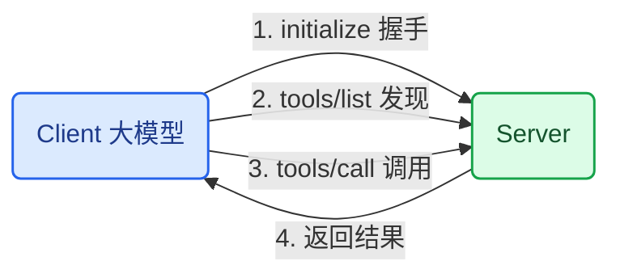

**代码**：客户端骨架：

```python
async def mcp_client_flow(server):
    await server.initialize()                     # 1. 握手
    tools = await server.list_tools()             # 2. 发现工具
    print([t.name for t in tools])
    result = await server.call_tool("move_arm_to",
                                    {"x": 0.1, "y": 0.2, "z": 0.3})
    print(result)                                 # 3/4. 调用与结果
```

**验收**：画出四步交互图；用一个现成 MCP server 跑通 list_tools。

### 97. 97_大模型识别工具并调用的原理分析

**原理**：工具调用原理：把工具清单（名称 + 描述 + 参数 schema）放进提示词 → 模型输出**结构化 JSON**（工具名 + 参数）而不是自然语言 → 程序解析 JSON 并执行 → 结果回传给模型。识别靠的是描述与用户意图的**语义匹配**——描述含糊，模型就选错工具。所以第 95 章的校验器必须在：模型"决定"用什么参数，安全层"批准"执行。

**代码**：

```python
import json

def llm_tool_call(reply: str, tools: dict):
    """解析 LLM 的工具调用意图并执行（含校验）。"""
    call = json.loads(reply)
    assert call["name"] in tools, f"未知工具 {call['name']}"
    args = validate_arm_command(call["args"])     # 第 95 章校验器
    return tools[call["name"]](**args)
```

**验收**：说清"描述 → 匹配 → 调用"的机制；演示一个描述含糊导致选错工具的案例。

### 98. 98_大语言模型聊天交互调用mcp服务器

**原理**：完整串联：用户聊天发指令 → LLM 判断需要哪个 MCP 工具 → 生成调用 → 执行 → 把结果翻译成自然语言回复。循环特性：LLM 可能连续调用多个工具（查文件 → 读内容 → 总结）。停止条件：LLM 不再请求工具，输出纯文本收尾。

**代码**：

```python
def chat_with_tools(llm, mcp_tools, user_msg, max_rounds=5):
    messages = [{"role": "user", "content": user_msg}]
    for _ in range(max_rounds):
        reply = llm(messages, tools=mcp_tools)        # 模型决定下一步
        if reply.tool_calls:
            for call in reply.tool_calls:
                result = mcp_tools.execute(call)
                messages.append({"role": "tool", "content": str(result)})
        else:
            return reply.content                        # 自然语言收尾
```

**验收**：跑通"查文件并总结"的多工具连续调用；打印每轮工具调用日志。

### 99. 99_mcp服务器集成本地文件搜索

**原理**：给 LLM 接文件能力：MCP server 暴露 search_files(pattern) / read_file(path) 两个工具。安全边界与软件工具不同：**根目录白名单**（只能搜指定目录）、路径穿越校验（拒绝 `..`）、只读权限。这章是第 100 章操作机械臂的预演：工具设计 = 能力 + 权限边界。

**代码**：

```python
import pathlib

def search_files(root, pattern, max_results=20):
    """根目录白名单内的文件搜索，只读。"""
    root = pathlib.Path(root).resolve()
    if ".." in str(pattern):
        raise ValueError("路径穿越被拒绝")           # 安全边界
    hits = [p for p in root.rglob(pattern) if p.is_file()]
    return [str(p) for p in hits[:max_results]]
```

**验收**：搜出指定目录下的目标文件；尝试 `../` 路径被拒绝。

### 100. 100_mcp操作真实机械臂

**原理**：MCP 工具的机械臂版：move_arm_to（坐标）/ gripper（开合）/ read_state（读状态）。与纯软件工具的安全差异：**参数校验**（工作空间/速度上限）、**单步确认**（危险动作人工确认）、**急停工具永远在线**、状态查询无限制。原则：LLM 可以"建议"，安全层"批准"，电机"执行"。

**代码**：

```python
ARM_TOOLS = {
    "move_arm_to": {"schema": {"x": float, "y": float, "z": float},
                    "validate": validate_arm_command,   # 第 95 章
                    "confirm": True},                   # 人工确认
    "gripper": {"schema": {"open": bool}, "validate": None, "confirm": False},
    "emergency_stop": {"schema": {}, "validate": None, "confirm": False},
}

def safe_tool_call(name, args):
    spec = ARM_TOOLS[name]
    if spec["validate"]:
        args = spec["validate"](args)
    if spec["confirm"] and not human_confirm(name, args):
        return "已取消"
    return execute(name, args)
```

**验收**：LLM 说"抓起方块" → 校验 + 确认 → 机械臂执行；越界坐标被拦截，急停随时可用。

### 101. 101_mcp语音播报流程展示

**原理**：把 84/86/98/100 章串成语音闭环：语音指令（ASR）→ LLM + MCP 决策（98）→ 机械臂执行（100）→ 状态语音播报（TTS，86）。播报三时机：任务开始（确认理解）、执行完成（结果）、异常（原因）。播报文本由 LLM 生成，但**状态事实必须来自工具返回值**——防止幻觉播报。

**代码**：

```python
def voice_pipeline(asr, llm, tools, tts):
    text = asr("cmd.wav")
    tts("收到：" + text)                        # 1. 确认理解
    reply = chat_with_tools(llm, tools, text)   # 2. 决策与执行
    tts(reply)                                  # 3. 播报结果
    return reply
```

**验收**：语音"把方块放到盒子里"全链路跑通；播报内容与机械臂实际状态一致。

### 102. 102_conda环境的安装

**原理**：conda = 环境管理器：每个项目独立 Python 版本 + 依赖，避免包冲突。Miniconda（最小安装）够用。常用命令：create（建环境）/ activate（激活）/ install（装包）/ export（导出环境文件）。机器人项目建议分环境：一个跑机械臂 SDK，一个跑训练，互不污染。

**代码**：

```bash
# 安装 miniconda 后
conda create -n arm python=3.10 -y
conda activate arm
conda install numpy opencv pyserial -y
conda env export > environment.yml    # 环境可复现
```

**验收**：建出两个独立环境并验证互不影响；导出 environment.yml 可复现。

### 103. 103_自制python解析器（扩展）

**原理**：扩展章：解析器 = 词法分析（切词）+ 语法分析（组合成结构）。自制一个极简"机械臂指令语言"：`MOV x y z` / `GRIP open` / `WAIT s`。意义：理解第 97 章"模型输出结构化 JSON"的底层原理——解析器就是把文本变成可执行结构；也呼应第 87 章规则匹配：规则语言需要解析器支撑。

**代码**：

```python
def parse_arm_script(line):
    """极简指令语言: MOV 0.1 0.2 0.3 | GRIP open | WAIT 2"""
    parts = line.strip().split()
    op = parts[0].upper()
    if op == "MOV" and len(parts) == 4:
        return ("move", float(parts[1]), float(parts[2]), float(parts[3]))
    if op == "GRIP" and len(parts) == 2:
        return ("gripper", parts[1] == "open")
    if op == "WAIT" and len(parts) == 2:
        return ("wait", float(parts[1]))
    raise SyntaxError(f"无法解析: {line}")

print(parse_arm_script("MOV 0.1 0.2 0.3"))   # ('move', 0.1, 0.2, 0.3)
```

**验收**：5 条指令全部解析；写出一条会被拒绝的非法指令。

## 阶段十 行为克隆与强化学习（104–115）

**阶段目标**：把前面所有阶段串成最终闭环——用阶段四的遥操作采集示教数据，用 LeRobot 训练行为克隆策略，部署回学生端自主抓取。强化学习延伸见 [DQN 训练篇](./机器人强化学习入门：DQN训练两关节机械臂.md)。

**阶段闭环**：固定场景抓取成功率 ≥ 90%，并在 3 个新位置评估泛化。

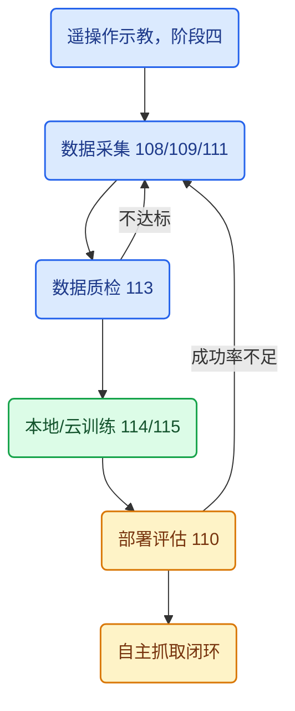

### 104. 104_强化学习最终效果展示

**原理**：RL 与行为克隆的区别：RL 自己探索、靠**奖励信号**学习；BC 模仿示教、靠**监督信号**学习。课程主路线是 BC（数据来自阶段四遥操作），RL 是延伸展示。看任何效果展示时问三件事：训练环境（仿真还是真机）、成功率指标怎么测的、泛化边界（换位置/换物体还灵吗）——演示视频只展示成功片段是常态。

**代码**：策略评估——成功率必须用统一协议测：

```python
def evaluate_policy(policy, env, n_episodes=20):
    ok = 0
    for _ in range(n_episodes):
        obs = env.reset()
        while not env.done():
            obs = env.step(policy(obs))
        ok += env.success()
    return ok / n_episodes
```

**验收**：说清 RL 与 BC 学习信号的差异；说出评估策略效果必问的三个问题。

### 105. 105_端到端神经网络概念介绍

**原理**：行为克隆（BC）= 监督学习：输入观测（图像 + 关节角），标签 = 示教动作，损失 = 动作 MSE（第 65 章端到端在这里落地）。为什么能工作：示教数据覆盖了任务的状态分布，网络学会"老师在这个状态下会怎么做"。失败模式：**分布外状态**（训练没见过的位姿）误差累积 → 越走越偏 → 卡死或碰撞。对策：更多样数据（113 章）、回放纠偏、残差策略。

**代码**：BC 策略网络（视觉编码 + 关节头）：

```python
import torch
import torch.nn as nn

class BCPolicy(nn.Module):
    """行为克隆策略: 图像+关节角 -> 关节目标。"""
    def __init__(self, n_joints=6):
        super().__init__()
        self.vis = nn.Sequential(nn.Conv2d(3, 16, 3, 2), nn.ReLU(),
                                 nn.AdaptiveAvgPool2d(1), nn.Flatten())
        self.head = nn.Sequential(nn.Linear(16 + n_joints, 64), nn.ReLU(),
                                  nn.Linear(64, n_joints))

    def forward(self, img, q):
        return self.head(torch.cat([self.vis(img), q], dim=1))
```

**验收**：说清 BC 的输入/标签/损失；解释分布外误差累积的机制。

### 106. 106_lerobot项目和环境搭建

**原理**：LeRobot = HuggingFace 的开源机器人学习框架：统一数据格式（LeRobotDataset）、多种算法实现（ACT/DP）、真机 + 仿真支持。课程采用它经典的"同构双臂"方案：教师端（follower 同款）采集 → 训练 → 学生端部署。搭建：conda 环境 + pip install lerobot + 硬件依赖（串口/相机）。

**代码**：

```bash
conda create -n lerobot python=3.10 -y && conda activate lerobot
pip install lerobot
lerobot --help          # 验证安装
```

**验收**：lerobot 安装成功，官方示例脚本可运行；说清 LeRobotDataset 统一数据格式的作用。

### 107. 107_教师端和学生端的标定

**原理**：LeRobot 的标定 = 让两端关节角**语义对齐**：学生端（follower）标定零点——每个关节摆到机械零位，把当前读数写入校准文件；教师端（leader）标定限位——把关节拖到上下限位，用限位值反推。标定后两端同一姿势读数一致，遥操作才能 1:1 映射。误差来源：舵机安装公差、限位不一致、零位漂移。

**代码**：标定数据格式：

```python
import json

def save_calibration(follower_zero, leader_range, path="calibration_so100.json"):
    """标定文件: 学生端零点 + 教师端限位（单位: 度）。"""
    data = {"follower_zero_deg": follower_zero,
            "leader_lower_deg": leader_range[0],
            "leader_upper_deg": leader_range[1]}
    json.dump(data, open(path, "w"))
```

**验收**：标定后两端同一姿势读数一致（±0.5°）；标定文件随项目版本保存。

### 108. 108_准备行为克隆的摄像头

**原理**：BC 的观测包含图像，摄像头配置决定策略的视觉输入：**位置**（腕部相机看夹爪近景 / 全局相机看场景）、**分辨率**（640×480 常用，太高训练变慢）、**帧率**与采集频率一致、**镜头畸变校正**。铁律：固定相机后**不再移动**——相机动了数据分布就变了，模型必须重训。时间戳要与关节数据对齐。

**代码**：

```python
import cv2

def setup_cameras(ids=(0, 1)):
    cams = []
    for i in ids:
        cap = cv2.VideoCapture(i)
        cap.set(cv2.CAP_PROP_FRAME_WIDTH, 640)
        cap.set(cv2.CAP_PROP_FRAME_HEIGHT, 480)
        cams.append(cap)
    return cams
```

**验收**：两路相机 30fps 稳定采集；固定支架后拍一段视频确认视野覆盖任务区。

### 109. 109_数据采集展示

**原理**：采集 = 阶段四遥操作 + 记录：每帧保存（图像, 关节角, 时间戳）。LeRobot 用 record 脚本：操作教师端 → 学生端跟随 → 数据落盘。采集演示要展示三个数字：数据量（每任务 20–50 条示范）、采集耗时、数据文件大小——它们决定了训练可行性和成本。

**代码**：

```bash
lerobot record \
  --robot-path lerobot/so100 \
  --fps 30 \
  --episode-time-s 60 \
  --out data/so100_grasp
```

**验收**：采集 20 条示范，总时长与数据量符合预期；数据能被第 111 章加载查看。

### 110. 110_最终训练好效果展示

**原理**：训练好的策略部署到学生端：模型推理输出关节目标 → 写入舵机。评估指标：**成功率**（10 次抓取成功几次）、**泛化**（物体换位置/角度）、**平均耗时**。展示注意：演示位置与训练分布一致才好看——所以评估要**特意做分布外测试**，才能暴露真实能力。

**代码**：

```python
def deploy_and_eval(policy, robot, n_trials=10):
    ok = 0
    for i in range(n_trials):
        reset_scene(i % 3)               # 3 个不同初始位置
        obs = robot.observe()
        for _ in range(200):
            obs = robot.step(policy(obs))
        ok += robot.check_success()
    return ok / n_trials
```

**验收**：固定场景成功率 ≥ 90%；特意换 3 个新位置评估并记录泛化表现。

### 111. 111_数据集的录制和查看

**原理**：LeRobotDataset = 按 episode 组织的 hf_dataset：每帧包含 observation（图像/关节角/状态）和 action。查看 = 可视化验证：图像清晰、关节角连续、时间戳单调、episode 边界正确。**训练前必做数据检查**——脏数据进模型，后面调什么参都救不回来。

**代码**：

```python
from lerobot.common.datasets.lerobot_dataset import LeRobotDataset

ds = LeRobotDataset("data/so100_grasp")
print(f"{ds.num_episodes} 条示范, {ds.num_frames} 帧")
for i in range(0, len(ds), len(ds) // 5):
    frame = ds[i]
    print(f"帧 {i}: 关节角 {frame['observation.state'].numpy()}")
```

**验收**：能加载并逐帧查看数据；抽查 20 帧：图像清晰、角度连续、无错帧。

### 112. 112_录制动作的回放

**原理**：回放 = 把录制的动作序列重放给学生端：依次读 action 帧 → 写入舵机 → 按采集帧率节拍。三个用途：① **验证数据**（动作是否可执行、有无危险帧）；② **评估基线**（回放成功率 ≈ 数据质量上限，训练策略很难超过它太多）；③ 效果展示。

**代码**：

```python
import time

def replay(dataset, robot, fps=30):
    for frame in dataset:
        action = frame["action"].numpy()
        robot.set_joint_targets(action)
        time.sleep(1.0 / fps)
```

**验收**：回放一条示范，学生端完整复现；说出回放的三个用途。

### 113. 113_数据采集注意事项

**原理**：采集质量 = 策略上限。五条注意事项：① **多样性**：物体初始位置/角度/光照全覆盖；② **慢且稳**：示教动作放慢约 2 倍、平滑无停顿，模型更容易学；③ **一致性**：每次任务开始/结束姿势固定，减少分布碎片；④ **失败示范**：要么删除要么标注，不能让模型学错误动作；⑤ **数据管理**：episode 命名、版本、环境参数全部记录，保证可复现。

**代码**：示范质检：

```python
def check_episode(frames, min_len=30):
    """示范质检: 长度、角度连续性。"""
    assert len(frames) >= min_len, "示范太短"
    q = frames[0]["q"]
    for f in frames[1:]:
        dq = max(abs(a - b) for a, b in zip(q, f["q"]))
        assert dq < 5.0, f"关节角跳变 {dq}°, 疑似掉帧"
        q = f["q"]
    return True
```

**验收**：列出 5 条注意事项并逐条对照自己的采集流程；质检脚本对全部示范通过。

### 114. 114_本地电脑训练流程

**原理**：本地训练 = 自己的 GPU 跑：数据（111）→ 算法（ACT 或 DP）→ 训练配置（batch/epochs/lr）→ 输出权重。**ACT**（Action Chunking Transformer）用 Transformer 编码观测并输出动作分块，是 LeRobot 默认算法之一。本地适合数据小（< 50 条示范）、GPU 6GB+，时长数小时到一天。损失本质 = 预测动作与示教动作的差距。

**代码**：

```bash
lerobot train \
  policy=act \
  dataset=data/so100_grasp \
  output_dir=outputs/act_grasp
```

```python
# 训练目标的本质：关节回归 + 夹爪分类
import torch.nn.functional as F

def imitation_loss(pred_joint, true_joint, pred_gripper, true_gripper):
    joint_loss = F.smooth_l1_loss(pred_joint, true_joint)
    gripper_loss = F.binary_cross_entropy_with_logits(pred_gripper, true_gripper)
    return joint_loss + 0.2 * gripper_loss
```

**验收**：本地跑通一次完整训练；能解释损失函数每一项对应什么。

### 115. 115_云服务器训练的流程

**原理**：本地 GPU 不够时上云（AutoDL/Colab 等）：租 GPU（4090/A100）→ 上传数据 → 环境复用（environment.yml 或镜像）→ 训练 → 下载权重。要点：数据打包上传；训练脚本化（nohup/tmux 防断线）；权重和指标回传；**及时释放实例**（按小时计费）。云训练适合数据大、模型大（DP 级）的场景。

**代码**：

```bash
# 本地打包上传
tar czf data.tar.gz data/
scp data.tar.gz user@cloud:/root/lerobot/
ssh user@cloud

# 云端训练
pip install -e lerobot
nohup lerobot train policy=act dataset=data/so100_grasp \
  output_dir=outputs/act_grasp > train.log 2>&1 &
tail -f train.log        # 看训练曲线

# 回传权重
scp user@cloud:/root/lerobot/outputs/act_grasp/checkpoint.pt .
```

**验收**：完成一次云端训练闭环（上传 → 训练 → 下载权重）；本地加载云权重推理成功。

## 全链路闭环：看见 → 抓取 → 放置

把十个阶段串起来，最终闭环不依赖大模型也能工作：视觉模型回答"物体在哪里"，标定和运动学回答"机械臂怎么到达"，控制器回答"以安全速度执行"。语言模型只把"把红色方块放到盒子里"转换为结构化任务（第 5、89 章），不直接输出电机 PWM。

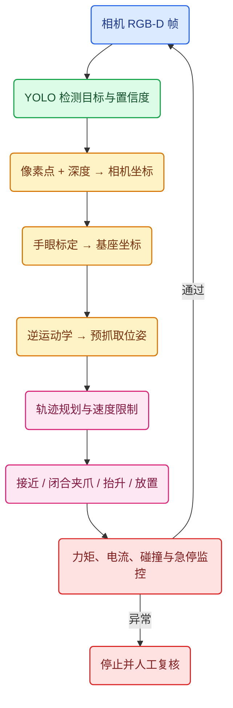

### 为什么要先到预抓取位姿

不能让末端从任意方向直冲物体：规划器先到物体上方 z + 0.08m 的预抓取点，再沿工具 Z 轴慢速下降；夹爪闭合后通过电流/力矩或夹爪行程判断是否真的夹住，最后抬升并移动到放置点。这样把高速移动和接触动作分离，能显著降低碰撞风险。

```python
import numpy as np

def make_pick_place_waypoints(target_xyz, drop_xyz, clearance=0.08):
    """抓取放置的路点序列：预抓取 -> 下降 -> 抬升 -> 搬运 -> 放置 -> 退出。"""
    tx, ty, tz = target_xyz
    dx, dy, dz = drop_xyz
    return [
        np.array([tx, ty, tz + clearance]),  # 预抓取
        np.array([tx, ty, tz]),              # 垂直接近
        np.array([tx, ty, tz + clearance]),  # 抬升
        np.array([dx, dy, dz + clearance]),  # 搬运
        np.array([dx, dy, dz]),              # 放置
        np.array([dx, dy, dz + clearance]),  # 退出
    ]
```

### 每阶段的回归指标

每增加一层，都保留一个可回归的测试：目标点误差、末端位姿误差、抓取成功率、碰撞次数、平均耗时、急停响应时间。训练前必须按"任务/场景/日期"划分训练集和验证集，不能把同一段动作的相邻帧随机拆到两边；记录相机内参、外参、机器人固件、关节顺序和数据单位，才能复现实验。

## 路线总结

| 阶段 | 一句话收获 | 与最终闭环的关系 |
| --- | --- | --- |
| 一 基础 | 感知-决策-行动闭环 | 全局心智模型 |
| 二 硬件 | 电机/减速/编码器选型 | 执行能力边界 |
| 三 URDF | link+joint 建模 | 模型的几何事实 |
| 四 遥操作 | 教师端示教数据源 | 数据从哪来 |
| 五 运动学 | FK/IK 数学桥 | 坐标到关节角 |
| 六 部署 | 标定+PID 稳定控制 | 动作不抖不超调 |
| 七 视觉 | 像素到机器人坐标 | 目标在哪 |
| 八 机器学习 | 数据驱动的检测 | 看见物体 |
| 九 LLM/MCP | 语言到结构化任务 | 听懂指令 |
| 十 BC/RL | 示教到自主策略 | 自主抓取 |

按顺序推进，每一阶段的验收标准都通过后再进入下一阶段；任何一个阶段返工，先回滚到上一个通过的验收点。

[[toc]]
