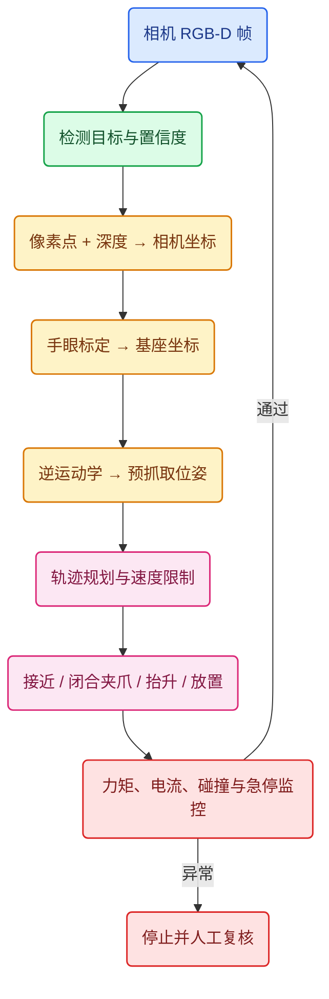

# 具身智能机械臂从零训练完整路线

本文依据视频《具身智能课程》的章节顺序整理，**章节标题、编号和顺序与视频列表保持一致**。每一节补充一个可落地的目标，最终把“看见物体 → 判断位姿 → 机械臂靠近 → 抓取 → 移动 → 放置”串成一个可测试的系统。

::: danger 安全边界
以下代码先在仿真或断电测试台运行。真机必须增加急停、软硬限位、速度/力矩上限、碰撞检测、看门狗和人工确认；视觉模型的预测不能直接绕过独立的安全控制器。
:::

## 视频章节原始列表（115 节）

1. 01_具身智能课程介绍
2. 02_什么是具身智能
3. 03_具身智能的技术架构
4. 04_具身智能的挑战
5. 05_大语言模型与具身智能
6. 06_具身智能的执行单元
7. 07_具身智能案例分析
8. 08_步进电机介绍
9. 09_无刷电机介绍
10. 10_电机选型指南
11. 11_四两拨千斤的秘密
12. 12_ 减速箱的阿喀琉斯之踵
13. 13_位置采集的原理
14. 14_位置编码器的实物和选型方法
15. 15_Sim2Real的高薪密码
16. 16_urdf入门
17. 17_urdf环境搭建
18. 18_构建机械臂的基座模型
19. 19_构建机械臂的第一个大臂
20. 20_构建机械臂的其他关节
21. 21_遥操作
22. 22_教师端结构的搭建
23. 23_搭建自己的编码器舵机
24. 24_验证官方的sdk
25. 25_聊聊vibe coding
26. 26_vibe coding初体验
27. 27_读取教师端6个编码器舵机的角度
28. 28_增加前端机械臂角度控制的代码
29. 29_随机更新角度信息发给前端展示
30. 30_同构遥操作案例的完成
31. 31_机械臂运动学数学速成
32. 32_机械臂运动学正解
33. 33_旋转平移的矩阵表达
34. 34_机械臂正解的代码实现
35. 35_运动学逆解介绍
36. 36_运动学逆解求解思路
37. 37_机械臂末端坐标的计算与展示
38. 38_机械臂示教器的完成
39. 39_学生端机械臂的安装
40. 40_学生端机械臂的配置与标定
41. 41_为什么机械臂会出现帕金森
42. 42_机械臂PID的配置
43. 43_机械臂同步遥操作的实现
44. 44_机械臂同步优化的策略
45. 45_计算机视觉介绍
46. 46_计算机存储图像的原理
47. 47_摄像头画面抖动的原因
48. 48_opencv入门
49. 49_opencv的ROI选取
50. 50_opencv颜色识别
51. 51_opencv超参数调整技巧
52. 52_高级案例白色瓶盖计数
53. 53_眼在手上眼在手外
54. 54_机器视觉物体宽高测量
55. 55_手眼标定和差值计算
56. 56_opencv形状识别和优化
57. 57_opencv目标追踪
58. 58_opencv仿射变换上帝视角
59. 59_opencv旋转角和中心点识别案例分析
60. 60_中心点和旋转角代码实现
61. 61_opencv二维码识别
62. 62_opencv人脸识别
63. 63_opencv的局限性
64. 64_机器学习概念入门
65. 65_端到端学习的概念
66. 66_ai推理机器学习三要素
67. 67_机器学习流程总结
68. 68_误差函数和sklearn框架安装
69. 69_梯度下降和神经元结构原理
70. 70_图像数据收集和特征工程
71. 71_模型训练
72. 72_模型文件的解析和推理
73. 73_混淆矩阵和交叉熵
74. 74_yolo快速入门
75. 75_数据标注
76. 76_标注数据的格式转化
77. 77_训练和结果展示
78. 78_卷积神经网络
79. 79_卷积核与特征提取器
80. 80_卷积神经网络与应用
81. 81_图像合成与标注原理分析
82. 82_合成带有标注信息的图片
83. 83_数据合成训练效果展示
84. 84_离线语音识别
85. 85_在线语音模型和模型的获取方法
86. 86_音频合成
87. 87_传统模式匹配代码的解析
88. 88_基于规则的传统语音聊天机器人的实现
89. 89_接入deepseek实现智能对话
90. 90_ai智能体的开发
91. 91_大模型的本地化部署
92. 92_本地大模型的python调用
93. 93_使用streamlit搭建一个本地的大模型聊天软件
94. 94_mcp协议概念入门
95. 95_大语言模型的幻觉问题
96. 96_mcp客户端和服务器端交互流程
97. 97_大模型识别工具并调用的原理分析
98. 98_大语言模型聊天交互调用mcp服务器
99. 99_mcp服务器集成本地文件搜索
100. 100_mcp操作真实机械臂
101. 101_mcp语音播报流程展示
102. 102_conda环境的安装
103. 103_自制python解析器（扩展）
104. 104_强化学习最终效果展示
105. 105_端到端神经网络概念介绍
106. 106_lerobot项目和环境搭建
107. 107_教师端和学生端的标定
108. 108_准备行为克隆的摄像头
109. 109_数据采集展示
110. 110_最终训练好效果展示
111. 111_数据集的录制和查看
112. 112_录制动作的回放
113. 113_数据采集注意事项
114. 114_本地电脑训练流程
115. 115_云服务器训练的流程

## 端到端抓取放置案例

下面的最小闭环不依赖大语言模型：视觉模型负责“物体在哪里”，标定和运动学负责“机械臂如何到达”，控制器负责“以安全速度执行”。语言模型只把“把红色方块放到盒子里”转换为结构化任务，不直接输出电机 PWM。



### 1. 从图像到三维目标点

检测器给出像素中心 `(u, v)` 和类别，深度相机给出 `Z`（米）。针孔模型把它还原到相机坐标：

$$X=(u-c_x)Z/f_x,\quad Y=(v-c_y)Z/f_y,\quad P_C=[X,Y,Z,1]^T$$

手眼标定得到 $T_{BC}$，于是 $P_B=T_{BC}P_C$。标定矩阵不是“魔法常数”：相机移动、支架松动或深度单位从毫米变成米，都会让抓取点整体偏移。

```python
import numpy as np

def pixel_to_base(u, v, depth_m, K, T_base_camera):
    """把像素中心和深度转换成机器人基座坐标，输入单位统一为米。"""
    fx, fy = K[0, 0], K[1, 1]
    cx, cy = K[0, 2], K[1, 2]
    if not np.isfinite(depth_m) or not 0.05 < depth_m < 3.0:
        raise ValueError("深度无效或超出安全范围")
    p_camera = np.array([(u - cx) * depth_m / fx,
                         (v - cy) * depth_m / fy,
                         depth_m, 1.0])
    return T_base_camera @ p_camera
```

### 2. 为什么要先到预抓取位姿

不能让末端从任意方向直冲物体。规划器先到物体上方 `z + 0.08 m` 的预抓取点，再沿工具 Z 轴慢速下降；夹爪闭合后通过电流/力矩或夹爪行程判断是否真的夹住，最后抬升并移动到放置点。这样把高速移动和接触动作分离，能显著降低碰撞风险。

```python
def make_pick_place_waypoints(target_xyz, drop_xyz, clearance=0.08):
    tx, ty, tz = target_xyz
    dx, dy, dz = drop_xyz
    return [
        np.array([tx, ty, tz + clearance]),  # 预抓取
        np.array([tx, ty, tz]),              # 垂直接近
        np.array([tx, ty, tz + clearance]),  # 抬升
        np.array([dx, dy, dz + clearance]),  # 搬运
        np.array([dx, dy, dz]),              # 放置
        np.array([dx, dy, dz + clearance]),  # 退出
    ]
```

### 3. 训练到底学什么

行为克隆训练的是 `观测 → 动作`：输入图像、关节角和夹爪状态，标签是示教器在同一时刻的关节目标。损失可以是关节位置的均方误差和夹爪二分类交叉熵。它擅长复现示教分布，但遇到训练中没有出现的位姿会累积误差；强化学习则用“抓到奖励、碰撞惩罚、距离 shaping”继续优化，但必须先在仿真中训练并做 Sim2Real 校准。

```python
import torch
import torch.nn.functional as F

def imitation_loss(pred_joint, true_joint, pred_gripper, true_gripper):
    # 关节回归保持连续动作；夹爪使用二分类交叉熵
    joint_loss = F.smooth_l1_loss(pred_joint, true_joint)
    gripper_loss = F.binary_cross_entropy_with_logits(pred_gripper, true_gripper)
    return joint_loss + 0.2 * gripper_loss
```

训练前必须按“任务/场景/日期”划分训练集和验证集，不能把同一段动作的相邻帧随机拆到两边；记录相机内参、外参、机器人固件、关节顺序和数据单位，才能复现实验。

## 推荐落地顺序

先完成 URDF 和正运动学，再完成相机标定与颜色/形状识别，随后用固定物体做脚本化抓取，最后才加入 YOLO、行为克隆、强化学习和语言模型。每增加一层都保留一个可回归的仿真测试：目标点误差、末端位姿误差、抓取成功率、碰撞次数、平均耗时和急停响应时间。

[[toc]]
