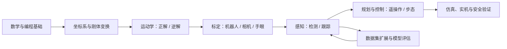

# 从坐标变换到机器狗：机器人学习路线与视觉数据集扩展

最近看了几组机器人视频，笔记里留下了“机器人的标定、同构遥操作、运动学正解、机器狗步态、坐标变换、`ikpy`、手眼标定、OpenCV tracker、HTML 模拟器”等关键词。这里的学习对象可以先理解为具身智能机器人：它通过传感器感知环境，经过计算和决策，再驱动身体完成动作。这些主题看起来分散，其实都在回答同一个问题：**如何让机器人知道自己在哪里、看见了什么，并把想要的动作可靠地执行出来？**

这篇文章把这些面包屑整理成一条适合初学者的路线，也记录我准备实践的第一个视觉任务：为物品 A 构造复杂场景数据集。

## 1. 先建立一张总地图

可以把一个机器人系统看成六层。每层都有自己的输入、输出和验证方法：



这不是必须一次学完的课程表，而是一张“遇到问题时知道该查哪一层”的地图。比如：

- 末端位置偏了，先查坐标系和标定，不要直接改 PID。
- 物体检测框抖动，先检查数据和跟踪器，再考虑控制器。
- 机器狗迈步不稳，先验证足端轨迹、支撑相位和时间同步，再调步态参数。

## 2. 阶段一：补齐最小基础

### 2.1 数学只学机器人用得上的部分

先掌握向量、矩阵、三角函数、微积分的基本概念，以及概率和误差的直觉。最重要的不是手算复杂公式，而是能读懂下面三种对象：

1. **位置向量**：描述点在某个坐标系中的位置。
2. **旋转矩阵**：描述一个坐标系相对另一个坐标系的朝向。
3. **齐次变换矩阵**：把旋转和平移放进同一个 4×4 矩阵。

### 2.2 编程与工具

建议以 Python 为主线，配合 NumPy、Matplotlib、OpenCV 和 Jupyter。之后再根据硬件补充 C++、ROS 2、Linux、串口/CAN 和 Git。每一个概念都做一个可运行的小实验，例如画出坐标轴、让一个点绕原点旋转、记录关节角并回放。

## 3. 阶段二：坐标变换、矢量叠加与正运动学

### 3.1 坐标系是机器人世界的“语言”

至少要区分：世界坐标系、机器人基座坐标系、关节坐标系、末端坐标系、相机坐标系和目标物体坐标系。记号可以统一成 `T_A_B`，表示“把 B 坐标系中的量变换到 A 坐标系”。

如果一条变换链是 `T_world_base`、`T_base_tool`、`T_tool_camera`，那么相机在世界中的位姿为：

```text
T_world_camera = T_world_base · T_base_tool · T_tool_camera
```

矩阵乘法顺序不能随意交换。排查问题时，给每个坐标系画出右手坐标轴，并在代码里明确变量名，不要只写 `T1`、`T2`。

### 3.2 矢量叠加是最早的“运动学”

机械臂末端的位置，本质上是各段连杆位移在同一坐标系下的叠加。二维例子可以写成：

```text
x = l1 · cos(q1) + l2 · cos(q1 + q2)
y = l1 · sin(q1) + l2 · sin(q1 + q2)
```

这就是二连杆的正运动学：输入关节角 `q1、q2` 和连杆长度 `l1、l2`，输出末端位置。三维机械臂再把它推广为齐次变换连乘。

### 3.3 “运动学正解”应写成可验证程序

给定关节角，通过 DH 参数或 URDF 计算末端位姿，这一步叫正运动学（Forward Kinematics, FK）。学习顺序建议是：

1. 手算二连杆平面模型。
2. 用 NumPy 实现矩阵连乘。
3. 从 URDF 读取真实关节和连杆参数。
4. 用 RViz 或仿真器把计算结果与模型姿态对比。

只有正解结果稳定，后面的逆解和遥操作才有可信的“几何基础”。

## 4. 阶段三：逆运动学与 `ikpy`

逆运动学（Inverse Kinematics, IK）是反过来根据目标位姿求关节角。它通常存在多组解、无解和奇异位形，不能把它当成简单的反函数。

`ikpy` 适合用来理解和验证机械臂 IK：读取 URDF、设置目标位置/姿态、求解关节链，再检查 FK 是否回到目标附近。一个最小实验应记录：

- 目标位姿和求得的关节角。
- FK 重新计算后的位姿误差。
- 是否触碰关节上下限。
- 不同初始值是否得到不同解。

工程上还要处理碰撞、速度/加速度限制和轨迹连续性。先用 `ikpy` 跑通几何闭环，再迁移到 ROS 2 控制器，会比一开始就接真机更容易定位问题。

## 5. 阶段四：标定，把“模型”对齐“现实”

标定解决的是参数不准确问题。可以按由易到难分成三类：

### 5.1 机器人的标定

校准零位、连杆长度、关节方向、编码器比例和工具中心点（TCP），再用多个已知姿态估计模型参数。验证指标是：让末端到达若干测量点，比较预测位置与真实位置的平均误差、最大误差和重复性。

### 5.2 相机标定

使用棋盘格或 Charuco 板估计内参、畸变参数和相机坐标系。内参标定完成后，还要用独立图片检查重投影误差，不能只看 OpenCV 函数是否返回成功。

### 5.3 手眼标定

手眼标定建立相机与机器人之间的变换：相机装在末端是 `eye-in-hand`，相机固定在工作台是 `eye-to-hand`。采集多个不同方向、不同位置的机器人姿态，求解变换后，再把视觉检测到的目标点转换到机器人基座坐标系。

常见失败原因包括姿态变化太单一、坐标系方向写反、单位混用（毫米/米）和标定板检测质量差。每次标定都应保存原始数据、参数文件、采集日期和验证误差，方便回滚和复现。

## 6. 阶段五：视觉，从检测到 OpenCV tracker

图形识别可以拆为“检测”和“跟踪”两件事：

- **检测**：在一帧图像中找出物品 A 的位置，输出框、类别和置信度。
- **跟踪**：利用上一帧结果预测下一帧位置，减少连续检测的计算量。

OpenCV 的传统 tracker（如 CSRT、KCF）适合先做交互验证：手动框选物品 A，观察遮挡、快速运动和光照变化时的表现。它不能替代一个鲁棒的检测模型，因为目标离开画面、尺度变化过大或发生遮挡后，tracker 可能会漂移。更稳妥的工程流程是“检测器周期性重检测 + tracker 帧间跟踪 + 置信度和越界检查”。

## 7. 物品 A 的复杂场景数据集，应该怎样扩展？

你描述的做法属于**数据增强和困难样本扩展**：把物品 A 放入不同复杂环境，作为新的训练样本。关键不是简单复制截图，而是让新增数据覆盖真实运行中会遇到的变化。

### 7.1 先定义变化维度

| 维度 | 可加入的情况 | 注意点 |
| --- | --- | --- |
| 光照 | 逆光、阴影、夜间、色温变化、反光 | 不要全部套同一种滤镜 |
| 背景 | 杂乱桌面、相似颜色、纹理、室外 | 背景要符合机器人实际工作区 |
| 姿态 | 旋转、倾斜、部分露出、不同距离 | 保留物品真实可见比例 |
| 遮挡 | 手、夹具、其他物品遮挡 | 标注可见区域和完整框的规则要统一 |
| 成像 | 模糊、噪声、压缩、不同焦距 | 模拟真实相机，不要过度破坏目标 |
| 负样本 | 没有 A、外观相似的 B、空场景 | 训练和评估都要包含负样本 |

### 7.2 推荐的数据生产流程

1. **采集原始素材**：用目标相机拍摄不同角度、距离和背景的真实图片；同时保存没有物品 A 的空场景。
2. **建立标注规范**：确定类别名、边界框是否包含被遮挡部分、小目标是否忽略，并固定训练/验证/测试划分。
3. **真实摆拍优先**：把物品 A 实际放在桌面、盒子、夹具和遮挡物中拍摄。真实阴影、反光和透视通常比纯滤镜更有价值。
4. **再做可控增强**：随机旋转、缩放、裁剪、颜色抖动、模糊、噪声和 Mosaic/MixUp；增强参数要记录，便于复现实验。
5. **检查标注质量**：增强后同步变换边界框，随机抽样可视化；重点检查框偏移、目标被裁掉却仍标为完整目标等问题。
6. **按场景拆分数据**：同一段视频的相邻帧不能同时出现在训练集和测试集，否则指标会虚高。建议按“场景/日期/相机”分组切分。
7. **用困难样本驱动下一轮**：收集模型漏检、误检、遮挡和模糊样本，单独建立 `hard_cases` 集合，训练后再次评估。

一个可维护的目录可以从下面开始：

```text
dataset/object_a/
├── images/
│   ├── train/
│   ├── val/
│   └── test/
├── labels/
│   ├── train/
│   ├── val/
│   └── test/
├── hard_cases/
├── data.yaml
└── README.md
```

### 7.3 不要只看一个准确率

至少记录 Precision、Recall、mAP、漏检率和误检率，并按场景分别统计：无遮挡、遮挡、弱光、相似背景和小目标。机器人任务更关心“漏检时会不会触发危险动作”，所以还要给控制层设置置信度阈值、超时停止和人工接管。

## 8. 同构遥操作：把人的动作映射给机器人

同构遥操作可以理解为“操作者和机器人拥有相似的运动结构”，例如用一只机械臂控制另一只机械臂，用动作捕捉设备控制机器狗。核心链路是：

```text
输入设备姿态 → 坐标系对齐 → 尺度/关节映射 → 限位与滤波 → 机器人控制器
```

它会同时用到坐标变换、正/逆运动学和标定。先做低速、低功率、可急停的仿真遥操作，再接入真机；任何映射都必须经过关节限位、速度限制、通信超时和急停测试。

## 9. 机器狗的步态算法放在哪里？

机器狗不是把机械臂 IK 直接复制过去。它需要在身体稳定的前提下安排四条腿的支撑相和摆动相。入门顺序可以是：

1. 单腿正/逆运动学与足端工作空间。
2. 静态站立：计算四个足端目标点和重心投影。
3. 周期步态：理解 trot、walk 等步态的相位差。
4. 足端轨迹：用抛物线或 Bézier 曲线规划抬脚和落脚。
5. 状态估计与反馈：融合 IMU、关节编码器和足端接触信息。
6. 仿真到实机：逐步增加速度、地面不平度和外力扰动。

步态调试时，把“身体姿态误差、足端位置误差、接触状态、关节电流”一起记录。只看视频，很难知道不稳定究竟来自坐标变换、轨迹规划还是控制参数。

## 10. 把博客里的 HTML 模拟器变成学习工具

可以在博客中加入一个不依赖后端的 HTML/Canvas 模拟器，按按钮切换以下场景：

- 二连杆正解：拖动 `q1、q2`，实时显示末端坐标。
- 坐标变换：切换世界系、基座系和相机系，观察同一个点的坐标变化。
- 手眼标定：显示相机、末端和标定板的变换链。
- OpenCV tracker 流程：用简单方框模拟“检测一次、连续跟踪、置信度下降后重检测”。
- 机器狗步态：用时间轴显示四条腿的支撑/摆动相位。

模拟器的价值是把公式变成可观察的因果关系。实现时保持页面自包含、无外部 CDN，并在文章中使用仓库已有的 `TeachingDemo` 组件嵌入，后续可以为每个主题单独拆成演示页。

## 11. 给小白的项目顺序

建议按“每个项目只引入一个新变量”的原则推进：

1. **坐标轴小实验**：画点、旋转、平移和齐次矩阵。
2. **二连杆机械臂**：实现 FK，再用 `ikpy` 做 IK，比较误差。
3. **相机标定**：拍棋盘格，计算内参并观察重投影误差。
4. **手眼标定**：把相机检测到的点转换到机器人基座系。
5. **物品 A 识别**：先做检测，再接入 OpenCV tracker，建立困难样本集。
6. **网页模拟器**：把前面三个数学实验做成可交互的 HTML 页面嵌入博客。
7. **同构遥操作**：先在仿真中完成映射、限位和急停，再接真机。
8. **机器狗步态**：从站立和单腿轨迹开始，最后再尝试周期步态。

每个项目都保留四份记录：输入数据、参数文件、可复现实验脚本、误差与失败案例。这样学到的不只是“看懂视频”，而是一套可以继续迭代的机器人系统。

## 结语

这些主题的共同主线是：**用坐标变换描述世界，用运动学计算动作，用标定消除现实误差，用视觉理解环境，用控制和安全约束把动作落地。** 物品 A 的数据集扩展则是感知层的实践入口，HTML 模拟器是把抽象知识变成可观察实验的入口。沿着这条主线逐个做小项目，机器人学习会从零散术语变成一张能走通的地图。
