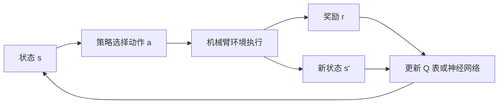

# 机器人强化学习入门：从 Q-learning 到 DQN 训练两关节机械臂

强化学习经常被描述成“机器人自己试错”，但只说这句话很难真正开始。本篇从一个具体任务出发：两关节机械臂初始角度随机，智能体每次选择让肩关节或肘关节正转、反转，目标是让末端到达二维目标点。

文章先用 Q-learning 表格把一次更新的每个数字讲清楚，再把 Q 表换成 PyTorch 神经网络得到 DQN。代码不依赖 ROS 或 Gym，可以先在 CPU 运行；理解训练闭环后，再连接本目录的 [URDF 两关节机械臂](./URDF从零到两关节机械臂实战.md) 和 Gazebo。

真实机械臂不适合从随机策略直接开始训练。随机动作可能造成碰撞、超限和设备损坏，必须先在仿真中学习，再经过限位、安全控制器和低速验证。

## 1. 强化学习究竟学什么

监督学习的数据通常已经带有正确答案：给图像和类别，模型学习预测类别。强化学习没有人逐步告诉机器人“这一刻应该把关节向左转”，只有动作后的奖励。

```text
监督学习：输入 x → 模型 → 预测 → 与标准答案比较
强化学习：状态 s → 策略选动作 a → 环境变化 → 奖励 r 与新状态 s'
```

机器人不断重复第二条链路，目标不是让单步奖励最大，而是让未来累计奖励最大。

### 1.1 五个必须先分清的概念

| 概念 | 两关节机械臂案例 | 含义 |
| --- | --- | --- |
| Agent | Q-learning/DQN 算法 | 做决定的学习者 |
| Environment | 机械臂运动学和目标点 | 接收动作并返回结果 |
| State $s$ | 两个关节角或它们的特征 | 决策时能观察到的信息 |
| Action $a$ | 肩/肘正转、反转或不动 | Agent 能执行的选择 |
| Reward $r$ | 靠近目标为正，耗时为负，到达大奖励 | 环境对动作结果的评分 |

一次完整交互为：



### 1.2 Episode、Step、终止和截断

- 一个 **Step** 是选择并执行一次动作。
- 一个 **Episode** 是从重置到结束的一整次尝试。
- 末端到达目标属于 `terminated=True`，任务自然完成。
- 达到最大步数属于 `truncated=True`，只是人为停止，目标并未完成。

初学代码常把二者都叫 `done`。概念上应区分，因为自然终止后没有未来回报，超时状态是否计算 bootstrap 要按任务和 API 约定处理。

## 2. 案例机械臂和正运动学

机械臂两段长度分别为 $L_1=0.6$ m、$L_2=0.4$ m，关节角为 $q_1,q_2$。末端位置：

$$
x=L_1\cos q_1+L_2\cos(q_1+q_2)
$$

$$
y=L_1\sin q_1+L_2\sin(q_1+q_2)
$$

目标设为 `(0.59, 0.64)`，它位于机械臂 1 m 最大工作半径内。距离为：

$$
d=\sqrt{(x-x_{target})^2+(y-y_{target})^2}
$$

为了先把算法讲清楚，把每个关节从 $[-\pi,\pi]$ 离散成 31 档。状态不是无限多的浮点角度，而是 `(q1_index, q2_index)`，总状态数为 `31 × 31 = 961`。

动作定义为：

| 编号 | 动作 | 状态变化 |
| ---: | --- | --- |
| 0 | 肩关节反转一步 | `q1_index -= 1` |
| 1 | 肩关节正转一步 | `q1_index += 1` |
| 2 | 肘关节反转一步 | `q2_index -= 1` |
| 3 | 肘关节正转一步 | `q2_index += 1` |
| 4 | 保持 | 两个角度不变 |

一次只动一个关节是为了减小动作空间。实际机器人可以组合动作或输出连续关节速度，后文会说明应该换什么算法。

## 3. 从零编写机械臂环境

下面的环境只依赖 NumPy。它相当于一个最小版 Gymnasium 环境：

```python
import math
import numpy as np


class TwoJointArmEnv:
    def __init__(self, n_bins=31, seed=7):
        self.n_bins = n_bins
        self.angles = np.linspace(-math.pi, math.pi, n_bins)
        self.lengths = np.array([0.6, 0.4], dtype=np.float64)
        self.target = np.array([0.59, 0.64], dtype=np.float64)
        self.action_size = 5
        self.rng = np.random.default_rng(seed)
        self.state = (0, 0)

    def forward_kinematics(self, state):
        q1, q2 = self.angles[list(state)]
        x = self.lengths[0] * np.cos(q1)
        x += self.lengths[1] * np.cos(q1 + q2)
        y = self.lengths[0] * np.sin(q1)
        y += self.lengths[1] * np.sin(q1 + q2)
        return np.array([x, y])

    def distance(self, state):
        end_effector = self.forward_kinematics(state)
        return np.linalg.norm(end_effector - self.target)

    def reset(self, start_state=None):
        if start_state is None:
            indices = self.rng.integers(0, self.n_bins, size=2)
            self.state = (int(indices[0]), int(indices[1]))
        else:
            self.state = tuple(start_state)
        return self.state

    def step(self, action):
        old_distance = self.distance(self.state)
        q1_index, q2_index = self.state

        if action == 0:
            q1_index = max(0, q1_index - 1)
        elif action == 1:
            q1_index = min(self.n_bins - 1, q1_index + 1)
        elif action == 2:
            q2_index = max(0, q2_index - 1)
        elif action == 3:
            q2_index = min(self.n_bins - 1, q2_index + 1)
        elif action != 4:
            raise ValueError(f"非法动作: {action}")

        self.state = (q1_index, q2_index)
        new_distance = self.distance(self.state)
        terminated = new_distance < 0.08

        # 到达目标给大奖励；否则奖励距离改善，并收取时间成本。
        if terminated:
            reward = 5.0
        else:
            reward = 2.0 * (old_distance - new_distance) - 0.01

        info = {
            "distance": new_distance,
            "end_effector": self.forward_kinematics(self.state),
        }
        return self.state, reward, terminated, info
```

### 3.1 环境代码的职责边界

环境只负责四件事：保存状态、执行动作、计算奖励、判断终止。环境不应该偷偷替 Agent 选择动作，也不应该在 `step()` 中训练神经网络。

先进行一次完全随机交互：

```python
env = TwoJointArmEnv(seed=7)
state = env.reset(start_state=(10, 10))
print("初始角度:", env.angles[list(state)])
print("初始末端:", env.forward_kinematics(state))
print("初始距离:", env.distance(state))

action = 1  # 肩关节正转一步
next_state, reward, terminated, info = env.step(action)
print("新状态:", next_state)
print("新末端:", info["end_effector"])
print("新距离:", info["distance"])
print("奖励:", reward, "是否到达:", terminated)
```

这一步不涉及学习，只是在确认环境因果关系：动作确实改变对应关节，正运动学得到新末端，奖励与距离变化方向一致。

## 4. 奖励函数为什么是训练成败的核心

本案例未到达时使用：

$$
r_t=2(d_t-d_{t+1})-0.01
$$

- `d_t - d_{t+1} > 0`：末端靠近目标，得到正反馈。
- `d_t - d_{t+1} < 0`：末端远离目标，得到负反馈。
- 每步 `-0.01`：鼓励更短路径，防止原地不动。
- 到达目标直接奖励 `+5`：让成功轨迹显著优于只在附近徘徊。

### 4.1 只在成功时给 1 可以吗

可以，但随机策略很可能很久都碰不到小目标，绝大多数轨迹奖励为零，这叫稀疏奖励。距离改善是一种稠密奖励，让每一步都有方向信息。

### 4.2 奖励不是越复杂越好

如果同时加入距离、速度、能耗、碰撞、姿态、平滑度和十几个权重，很难判断模型在钻哪个漏洞。建议按顺序增加：

1. 先确认能够到达。
2. 再增加关节限位和碰撞惩罚。
3. 再优化动作平滑、时间和能耗。
4. 每增加一项，观察策略是否出现新的投机行为。

例如只奖励“末端离目标近”，模型可能高速冲过目标；只惩罚动作大小，模型可能选择完全不动。奖励表达的是工程目标，写错后算法会非常认真地优化错误目标。

## 5. Q-learning：先用一张表理解学习

Q 值 $Q(s,a)$ 表示：在状态 $s$ 选择动作 $a$，之后继续按当前最优策略行动，预计能得到多少折扣累计奖励。

本案例 Q 表形状为：

```text
[31 个肩关节档位, 31 个肘关节档位, 5 个动作]
= [31, 31, 5]
```

初始化为零：

```python
q_table = np.zeros((31, 31, 5), dtype=np.float32)
```

Q-learning 更新公式：

$$
Q(s,a)\leftarrow Q(s,a)+\alpha
\left[r+\gamma\max_{a'}Q(s',a')-Q(s,a)\right]
$$

| 符号 | 含义 | 本案例初值 |
| --- | --- | ---: |
| $\alpha$ | 学习率，新经验改动旧值的幅度 | 0.2 |
| $\gamma$ | 折扣因子，对未来奖励的重视程度 | 0.97 |
| $r$ | 当前一步立即奖励 | 环境返回 |
| $\max Q(s',a')$ | 新状态可获得的最佳未来价值 | 查 Q 表 |

### 5.1 一次更新的具体数字

假设当前：

```text
state = (10, 10)
action = 1
reward = 0.12
Q(state, action) = 0.05
max Q(next_state, ·) = 0.20
alpha = 0.2
gamma = 0.97
```

目标值和 TD Error 为：

$$
y=0.12+0.97\times0.20=0.314
$$

$$
\delta=y-Q(s,a)=0.314-0.05=0.264
$$

更新后：

$$
Q_{new}=0.05+0.2\times0.264=0.1028
$$

代码只有一行：

```python
old_q = 0.05
reward = 0.12
best_next_q = 0.20
new_q = old_q + 0.2 * (reward + 0.97 * best_next_q - old_q)
print(new_q)  # 0.1028
```

它没有神经网络和 `backward()`，参数就是 Q 表单元格，更新方向直接由 TD Error 决定。

## 6. 探索与利用：为什么不能永远选最大 Q

训练刚开始时 Q 表全为零，Agent 不知道哪个动作好。使用 $\epsilon$-greedy：

```text
概率 epsilon：随机动作，探索没试过的选择
概率 1-epsilon：选择 argmax Q(s, ·)，利用当前经验
```

初期 `epsilon=1.0` 代表几乎全部随机探索，之后逐渐降到 0.05。测试时通常设为 0，只使用学到的策略。

如果训练时一开始就 `argmax`，NumPy 会在并列时总选第一个动作，机器人可能长期只尝试同一方向。若永远保持很大 epsilon，策略即使学会也会频繁随机犯错。

## 7. 可直接运行的完整 Q-learning 案例

把下面代码接在第 3 节的 `TwoJointArmEnv` 后运行：

```python
import numpy as np

env = TwoJointArmEnv(n_bins=31, seed=7)
rng = np.random.default_rng(7)
q_table = np.zeros(
    (env.n_bins, env.n_bins, env.action_size),
    dtype=np.float32,
)

learning_rate = 0.2
gamma = 0.97
epsilon = 1.0
epsilon_min = 0.05
epsilon_decay = 0.997
episode_count = 3000
max_steps = 80
episode_returns = []
episode_success = []

for episode in range(episode_count):
    state = env.reset()
    total_reward = 0.0
    success = False

    for step in range(max_steps):
        if rng.random() < epsilon:
            action = int(rng.integers(env.action_size))
        else:
            action = int(np.argmax(q_table[state]))

        next_state, reward, terminated, info = env.step(action)

        old_q = q_table[state + (action,)]
        if terminated:
            td_target = reward
        else:
            best_next_q = np.max(q_table[next_state])
            td_target = reward + gamma * best_next_q
        td_error = td_target - old_q
        q_table[state + (action,)] = old_q + learning_rate * td_error

        state = next_state
        total_reward += reward
        if terminated:
            success = True
            break

    epsilon = max(epsilon_min, epsilon * epsilon_decay)
    episode_returns.append(total_reward)
    episode_success.append(success)

    if (episode + 1) % 500 == 0:
        mean_return = np.mean(episode_returns[-100:])
        success_rate = np.mean(episode_success[-100:])
        print(
            f"episode={episode + 1:04d}, "
            f"mean_return={mean_return:.3f}, "
            f"success_rate={success_rate:.2%}, "
            f"epsilon={epsilon:.3f}"
        )

np.save("two_joint_q_table.npy", q_table)
```

在本文固定随机种子下，后期 100 个 Episode 的成功率会逐渐接近 100%。具体数值可能因 NumPy 版本变化，但应看到平均回报、成功率整体上升。

### 7.1 训练循环逐段解读

```text
reset
  → 随机得到一次任务的初始关节角
epsilon-greedy
  → 决定随机探索还是查表利用
env.step
  → 机械臂执行动作，返回 s'、reward、terminated
TD target
  → 当前奖励 + 新状态的折扣未来价值
Q update
  → 只修改当前 state/action 对应的一个表格单元
```

到达目标时，`td_target=reward`，因为这个 Episode 已自然结束，不再加新状态的未来 Q 值。

## 8. 测试训练后的机械臂路径

评估时关闭随机探索，从固定初始状态开始：

```python
def run_greedy_episode(env, q_table, start_state=(10, 10), max_steps=80):
    state = env.reset(start_state=start_state)
    state_path = [state]

    for step in range(max_steps):
        action = int(np.argmax(q_table[state]))
        state, reward, terminated, info = env.step(action)
        state_path.append(state)
        if terminated:
            return True, state_path, info

    return False, state_path, info


success, state_path, final_info = run_greedy_episode(env, q_table)
print("是否到达:", success)
print("使用步数:", len(state_path) - 1)
print("最终距离:", final_info["distance"])
print("关节状态路径:", state_path)
```

在固定种子的一次运行中，从 `(10,10)` 通常约 11 步即可进入目标范围，最终距离约 0.02 m。测试不能只用训练时最常见的起点，应从工作空间不同区域采样并统计成功率、平均步数、最大距离和越界次数。

### 8.1 把运动轨迹画出来

```python
import matplotlib.pyplot as plt


def joint_points(env, state):
    q1, q2 = env.angles[list(state)]
    elbow = np.array([
        env.lengths[0] * np.cos(q1),
        env.lengths[0] * np.sin(q1),
    ])
    end = env.forward_kinematics(state)
    return np.vstack([np.zeros(2), elbow, end])


plt.figure(figsize=(6, 6))
sample_interval = max(1, len(state_path) // 8)
for index, state in enumerate(state_path[::sample_interval]):
    points = joint_points(env, state)
    plt.plot(points[:, 0], points[:, 1], "o-", alpha=0.25 + 0.7 * index / 8)

plt.scatter(*env.target, marker="*", s=220, c="red", label="target")
plt.gca().set_aspect("equal")
plt.xlim(-1.1, 1.1)
plt.ylim(-1.1, 1.1)
plt.grid(True)
plt.legend()
plt.title("Q-learning two-joint arm trajectory")
plt.show()
```

如果损失或回报看起来正常但轨迹抖动，可以直接观察动作序列是否在两个相反动作间切换。平均回报不能代替实际行为检查。

## 9. 为什么还需要 DQN

Q 表适合 961 个离散状态。但真实机器人状态可能包含 6 个关节角、速度、末端姿态、相机特征和障碍物位置，表格会指数爆炸。

DQN 用神经网络近似：

$$
Q(s,a;\theta)\approx Q^*(s,a)
$$

输入一个状态向量，网络一次输出 5 个动作的 Q 值：

```text
state vector [6]
  → Linear(6,64) + ReLU
  → Linear(64,64) + ReLU
  → Linear(64,5)
  → [Q(s,a0), ..., Q(s,a4)]
```

连续角度不应直接使用角度值，因为 $-\pi$ 和 $+\pi$ 数值相距很远，物理方向却相同。本案例输入：

$$
[\sin q_1,\cos q_1,\sin q_2,\cos q_2,\Delta x,\Delta y]
$$

## 10. DQN 的损失怎样计算

对经验 $(s,a,r,s',done)$，目标网络计算：

$$
y=r+(1-done)\gamma\max_{a'}Q_{target}(s',a')
$$

在线网络只取实际执行动作的预测：

$$
q=Q_{online}(s,a)
$$

损失通常使用 Huber Loss：

$$
L=\operatorname{SmoothL1}(q,y)
$$

`loss.backward()` 将误差传回在线网络参数。目标 $y$ 放在 `torch.no_grad()` 中，不通过目标网络反向传播。

DQN 还需要两个稳定训练的关键设计：

- **Experience Replay**：把过去交互放进缓冲区，随机抽样，打破相邻时间步的强相关。
- **Target Network**：使用一份延迟更新的网络计算目标，避免预测值和目标值同时剧烈变化。

## 11. PyTorch DQN 完整源码

下面代码接在 `TwoJointArmEnv` 后运行。它先打印随机网络的 Q 值，然后训练并展示第一次反向传播造成的权重变化：

```python
import random
from collections import deque, namedtuple

import numpy as np
import torch
from torch import nn
import torch.nn.functional as F

random.seed(13)
np.random.seed(13)
torch.manual_seed(13)
torch.set_num_threads(1)


def state_to_vector(env, state):
    q1, q2 = env.angles[list(state)]
    delta = env.target - env.forward_kinematics(state)
    return np.array([
        np.sin(q1), np.cos(q1),
        np.sin(q2), np.cos(q2),
        delta[0], delta[1],
    ], dtype=np.float32)


class DQN(nn.Module):
    def __init__(self, state_size=6, action_size=5):
        super().__init__()
        self.net = nn.Sequential(
            nn.Linear(state_size, 64),
            nn.ReLU(),
            nn.Linear(64, 64),
            nn.ReLU(),
            nn.Linear(64, action_size),
        )

    def forward(self, state):
        return self.net(state)


Transition = namedtuple(
    "Transition", ["state", "action", "reward", "next_state", "done"]
)
replay_buffer = deque(maxlen=10000)
env = TwoJointArmEnv(seed=13)
online_net = DQN()
target_net = DQN()
target_net.load_state_dict(online_net.state_dict())
target_net.eval()
optimizer = torch.optim.Adam(online_net.parameters(), lr=1e-3)


def optimize_dqn(trace_update=False):
    batch = random.sample(replay_buffer, 64)
    states = torch.tensor(np.array([item.state for item in batch]))
    actions = torch.tensor([item.action for item in batch]).unsqueeze(1)
    rewards = torch.tensor([item.reward for item in batch], dtype=torch.float32)
    next_states = torch.tensor(np.array([item.next_state for item in batch]))
    dones = torch.tensor([item.done for item in batch], dtype=torch.float32)

    all_q_values = online_net(states)                # [64,5]
    predicted_q = all_q_values.gather(1, actions).squeeze(1)

    with torch.no_grad():
        best_next_q = target_net(next_states).max(dim=1).values
        target_q = rewards + 0.97 * (1.0 - dones) * best_next_q

    loss = F.smooth_l1_loss(predicted_q, target_q)
    first_layer = online_net.net[0].weight
    weight_before = first_layer.detach().clone()

    optimizer.zero_grad()
    loss.backward()
    nn.utils.clip_grad_norm_(online_net.parameters(), max_norm=5.0)

    if trace_update:
        print("sample predicted Q:", predicted_q[:5].detach())
        print("sample target Q:", target_q[:5])
        print("Huber loss:", loss.item())
        print("第一层 gradient 左上角:\n", first_layer.grad[:3, :3])
        print("backward 后 weight 未变:",
              torch.equal(weight_before, first_layer.detach()))

    optimizer.step()

    if trace_update:
        print("step 后 weight 变化左上角:\n",
              (first_layer.detach() - weight_before)[:3, :3])
    return loss.item()


# 训练前的网络是随机函数，同一状态的 5 个 Q 值没有任务含义。
initial_state = env.reset(start_state=(10, 10))
initial_vector = state_to_vector(env, initial_state)
with torch.no_grad():
    initial_q = online_net(torch.tensor(initial_vector).unsqueeze(0))
print("状态向量:", initial_vector)
print("随机网络初始 Q:", initial_q[0])
print("随机第一层权重左上角:\n", online_net.net[0].weight[:3, :3])

epsilon = 1.0
epsilon_min = 0.05
total_steps = 0
first_update = True
recent_success = deque(maxlen=100)

for episode in range(800):
    discrete_state = env.reset()
    state = state_to_vector(env, discrete_state)
    success = False
    last_loss = float("nan")

    for step in range(80):
        if random.random() < epsilon:
            action = random.randrange(env.action_size)
        else:
            with torch.no_grad():
                state_tensor = torch.tensor(state).unsqueeze(0)
                action = int(online_net(state_tensor).argmax(dim=1).item())

        next_discrete_state, reward, terminated, info = env.step(action)
        next_state = state_to_vector(env, next_discrete_state)
        replay_buffer.append(Transition(
            state, action, reward, next_state, terminated
        ))
        state = next_state
        total_steps += 1

        if len(replay_buffer) >= 256:
            last_loss = optimize_dqn(trace_update=first_update)
            first_update = False

        # 目标网络周期性复制在线网络，而不是每一步一起更新。
        if total_steps % 200 == 0:
            target_net.load_state_dict(online_net.state_dict())

        if terminated:
            success = True
            break

    epsilon = max(epsilon_min, epsilon * 0.995)
    recent_success.append(success)

    if (episode + 1) % 100 == 0:
        print(
            f"episode={episode + 1:03d}, "
            f"success_rate={np.mean(recent_success):.2%}, "
            f"epsilon={epsilon:.3f}, loss={last_loss:.4f}"
        )

torch.save(online_net.state_dict(), "two_joint_dqn.pt")
```

### 11.1 源码中第一次更新发生了什么

```text
64 条 Transition
  → online_net(states) 得到 [64,5]
  → gather 只取每条经验真正执行动作的 Q
  → target_net(next_states) 取下一状态最大 Q
  → reward + gamma×next_Q 得到监督目标
  → SmoothL1 得到标量 loss
  → backward 写入在线网络 parameter.grad
  → gradient clipping 限制总梯度范数
  → Adam step 修改在线网络参数
  → 每 200 环境步复制给 target_net
```

和监督学习相似，DQN 最终也构造了“预测值和目标值”的损失。区别是目标值不是人工标签，而是奖励加上网络对未来价值的估计，所以目标会随训练变化。

### 11.2 为什么 Loss 下降不等于策略一定变好

DQN 的训练数据分布由当前策略产生，Target 也在变化。Loss 很小可能只是拟合了缓冲区里的狭窄经验，必须同时监控：

- 最近 100 个 Episode 成功率。
- 平均回报和到达目标的平均步数。
- 从固定测试起点出发的成功率。
- 关节限位、动作抖动和碰撞次数。
- 不带随机探索时的评估结果。

## 12. Q 表和 DQN 的参数变化有何不同

| 项目 | Q-learning 表格 | DQN |
| --- | --- | --- |
| 参数 | `q_table[s,a]` | 多层神经网络权重 |
| 一条经验影响范围 | 一个表格单元 | 通过共享权重影响多个相似状态 |
| 更新方式 | 显式 TD 公式 | Loss + backward + optimizer |
| 连续/高维状态 | 不适合 | 可以近似，但仍需合理特征 |
| 稳定技巧 | 学习率、探索 | Replay、Target Network、裁剪等 |

DQN 并没有摆脱 Q-learning，它只是用网络替换无法存下的大 Q 表。

## 13. 常见训练失败及排查顺序

### 13.1 成功率一直为零

1. 手动调用 `env.step()`，确认动作、坐标和距离正确。
2. 放大成功半径，例如先从 0.08 改为 0.15。
3. 打印随机策略能否偶尔到达，确认任务可探索。
4. 检查奖励是否真的在靠近时增大。
5. 先固定目标和较小初始范围，形成课程学习，再逐渐增加难度。

### 13.2 回报上涨但机械臂原地抖动

奖励可能允许在两个状态之间反复获取“靠近奖励”。本案例用距离差而不是 `-distance` 累加，并加入每步成本，可减少这种漏洞。真实控制还可惩罚：

$$
r_{smooth}=-\lambda\lVert a_t-a_{t-1}\rVert^2
$$

### 13.3 DQN Loss 爆炸或出现 NaN

- 降低学习率。
- 对状态和奖励缩放。
- 使用 Huber Loss 和梯度裁剪。
- 降低 Target Network 更新频率。
- 检查终止状态是否仍错误加入未来 Q。
- 打印观测中是否有 NaN/Inf。

### 13.4 训练很好，换起点就失败

这通常是初始状态覆盖不足或过拟合。将训练和测试初始状态集合分开，扩大 reset 分布，并报告工作空间网格上的成功率热力图。

## 14. 超参数先改哪些

| 参数 | 太小 | 太大 | 建议起点 |
| --- | --- | --- | ---: |
| Q-learning `alpha` | 学习慢 | Q 值震荡 | 0.1～0.2 |
| `gamma` | 只顾眼前 | 目标估计更不稳定 | 0.95～0.99 |
| DQN learning rate | 收敛慢 | Loss 爆炸 | `1e-3` 或 `3e-4` |
| batch size | 梯度噪声大 | 更新慢、占内存 | 64～256 |
| replay size | 经验单一 | 占内存、旧数据过多 | 1 万起步 |
| target interval | 追随太快 | 目标过旧 | 200～2000 steps |
| epsilon decay | 过早停止探索 | 长期随机 | 看成功率调整 |

一次只改一个主要因素，至少运行多个随机种子。强化学习方差大，单次最好结果不能代表算法稳定。

## 15. 为什么真实机器人常用 PPO、SAC 而不是 DQN

DQN 原生适合离散动作。本案例把每次关节变化离散为 5 个选项，便于教学。若希望直接输出连续关节速度：

```text
action = [shoulder_velocity, elbow_velocity]
```

更常见的选择是：

| 算法 | 动作 | 特点 | 机器人中的典型使用 |
| --- | --- | --- | --- |
| Q-learning | 小型离散 | 最容易理解 | 教学、网格世界 |
| DQN | 离散 | 用网络近似 Q | 少量离散控制动作 |
| PPO | 离散/连续 | 稳定、并行采样常见 | 仿真机器人、行走和操作 |
| SAC | 连续 | Off-policy、探索能力强 | 连续关节/末端控制 |
| TD3 | 连续 | 减少价值高估 | 连续控制基线 |

算法名称不是第一决策。应先确定状态能否观测、动作接口、奖励、控制频率和安全约束。

## 16. 如何接入上一篇 URDF/Gazebo 机械臂

上一篇文章已经提供 `shoulder_joint`、`elbow_joint`、`tool0` 和 `arm_controller`。把本地数学环境换成 Gazebo 时，映射关系如下：

| 教学环境 | ROS2/Gazebo |
| --- | --- |
| `state=(q1_index,q2_index)` | `/joint_states` 中的位置/速度 |
| `forward_kinematics` | TF：`world → tool0` |
| `step(action)` | 向轨迹控制器发送小角度/速度命令 |
| `target` | 世界坐标系下的目标 Pose |
| `distance` | `tool0` 与目标的 TF 距离 |
| `terminated` | 距离和姿态误差小于阈值 |

建议固定控制周期，例如每 100 ms：

```text
读取 JointState/TF
  → 组成 observation
  → policy 推理得到 action
  → 安全层裁剪动作和关节目标
  → 发送 controller command
  → Gazebo 运行固定时间
  → 读取新状态并计算 reward
```

### 16.1 不要让 RL 直接绕过安全控制器

策略输出先经过：

1. 动作范围裁剪。
2. 关节位置、速度和加速度限位。
3. 碰撞预测或安全区域检查。
4. 超时和通信丢失处理。
5. 底层 `ros2_control` 控制器。

RL 决定“想往哪里动”，确定性安全层决定“这个命令是否允许执行”。

## 17. 从仿真到真实机器人的差距

仿真策略直接上真机常失败，原因包括质量、摩擦、间隙、传感器噪声、控制延迟和碰撞模型不一致，这叫 Sim-to-Real Gap。

常见缓解方法：

- **Domain Randomization**：训练时随机质量、摩擦、阻尼、目标、延迟和噪声。
- **System Identification**：用真实数据估计模型参数。
- **Observation Noise**：让策略习惯编码器和视觉噪声。
- **Action Delay**：仿真中加入通信和执行延迟。
- **Residual Learning**：传统控制器负责主行为，RL 只学习小修正。
- **Offline/Imitation Warm Start**：先用示教或安全控制数据初始化。

真机部署顺序应为：仿真大量评估 → 回放策略轨迹 → 断电/无负载检查 → 低速单步 → 小工作空间 → 安全员和急停就位 → 扩大范围。

## 18. 一个合格实验要记录什么

至少保存：

```text
环境版本、URDF/Xacro 和控制器配置
随机种子、算法和全部超参数
每个 Episode 的 return、长度、success、终止原因
碰撞、越界、NaN 和控制超时次数
训练、验证的初始状态和目标分布
模型 checkpoint 与归一化统计量
不探索策略的视频或轨迹
```

只保存最终模型而没有环境版本，之后几乎无法解释为何同一权重表现改变。

## 19. 初学者实践顺序

```text
1. 手算两关节正运动学
2. 随机动作验证环境
3. 打印距离和奖励
4. Q 表训练固定目标
5. 从多个固定起点做无探索评估
6. 画机械臂轨迹和成功率曲线
7. 换 DQN 并观察第一次 backward
8. 随机化目标和初始状态
9. 接 Gazebo，不接真机
10. 加碰撞、限位、延迟和噪声
11. 再学习 PPO/SAC 连续控制
12. 完成安全评审后考虑真机低速测试
```

## 20. 经典资料与论文脉络

- Sutton 与 Barto，《Reinforcement Learning: An Introduction》：强化学习基础教材。
- Watkins，1989，Q-learning：Off-policy 时序差分控制的经典来源。
- Mnih 等，2015，Human-level control through deep reinforcement learning：DQN、经验回放与目标网络的代表性工作。
- Schulman 等，2017，Proximal Policy Optimization Algorithms：PPO。
- Haarnoja 等，2018，Soft Actor-Critic：最大熵连续控制。

阅读论文时先把符号映射回本文案例：$s$ 是关节和目标，$a$ 是关节动作，$r$ 是距离改善，$Q$ 是动作的长期价值。能在一个小案例中看到每个变量的真实数值，再阅读复杂机器人论文会容易很多。

## 21. 最终自检

读完后应该能够回答：

- State、Action、Reward、Episode 在机械臂中分别是什么？
- 为什么到达终止状态后 TD Target 不再加下一状态 Q 值？
- `epsilon` 太快降为零会怎样？
- Replay Buffer 和 Target Network 分别解决什么问题？
- DQN 的 `backward()` 更新哪一个网络？
- 为什么训练 Loss 低不能证明机器人策略安全有效？
- 为什么连续关节速度通常更适合 PPO/SAC？
- 从 Gazebo 上真机前必须增加哪些安全层？

强化学习的第一步不是堆算法，而是建立一个因果正确、奖励可解释、行为可观察的环境。本案例足够小，所以每一次状态变化和 Q 值更新都能打印出来；这正是开始机器人强化学习最稳妥的方式。

[[toc]]
